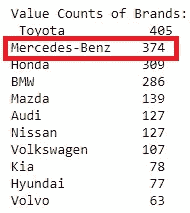

# 值得吗？预测新加坡二手车的价格

> 原文：<https://towardsdatascience.com/project-2-worth-it-predicting-the-price-of-used-cars-in-singapore-e9afe63c75d0?source=collection_archive---------14----------------------->

# 介绍

这个项目的目的是实施一个小型项目，该项目涵盖了数据科学过程的大部分—从数据收集(网络抓取:BeautifulSoup，Python)，数据清理，探索性数据分析，模型训练和测试阶段。数据来源来自新加坡的在线汽车销售门户网站 [SgCarMart](https://www.sgcarmart.com/main/index.php) 。

***概述:*** 该项目主要围绕几个核心技能展开:

*   *网络抓取*
*   *数据清理*
*   *暴露于 sklearn，statsmodel*
*   *利用 OLS 回归*
*   *通过评估模式的 p 值和 R 值，消除对响应变量影响不大的特征*

买车可能只是你人生中最大的一笔购买(尤其是在新加坡，我们的汽车价格过高是出了名的)。

Vin Diesel also seems to agree ([photo credits here](https://www.asiaone.com/static/multimedia/gallery/130523_ffcars/pic35.html))

因此，如果一个人想在新加坡拥有一辆车，他应该花相当多的时间去思考他到底在寻找什么。

然而，决定新加坡汽车价格的因素非常复杂(想想税收、COE、销售人员追加销售等)。因此，量化一辆物有所值的汽车会是一个令人沮丧和耗时的过程。

# 该项目的目标

为了弥合这一差距，本项目旨在 ***利用数据*** 实现一个 ***线性回归模型*** 来调查影响*二手车价格的因素，并提供一种比较基准的形式，量化一辆车的合理价格范围。*

**

*希望我的模型能够根据二手车的一些典型的、容易获得的特征来预测汽车的价格，以告知潜在的车主做出更好的购买决定。*

*本项目只考虑乘用车(毕竟这是自用)。普通大众不使用的货车/卡车、公共汽车和货车等商用车辆不包括在本分析中。*

# *第一部分:网页抓取*

**

*[Photo credits](http://aitechcentral.com/blog/web-scraping-techniques-python-beautifulsoup/)*

*啊，是的。项目中最乏味、最耗时的部分。问问任何经历过梅蒂斯训练营的人，当你提到“网络搜集”时，他们会不寒而栗。我已经为 web 抓取 sgcarmart 编写了代码(包括 try-except 函数，用于处理实际抓取过程中可能出现的错误),如果您打算使用它的话。代码可以在我的 github 上的[这里](https://github.com/xianjinseow92/projects/tree/master/Project_2_SgCarMart%20Price%20Prediction_2)找到。*

*web 抓取过程是使用 Python 3.7.3 结合一个名为 BeautifulSoup 的包来完成的。*

*这是通过遍历包含 100 个二手车个人列表搜索结果的[搜索页面来完成的。然后，每个个人列表](https://www.sgcarmart.com/used_cars/listing.php?BRSR=0&RPG=20&AVL=2&VEH=1)的[链接被附加到一个列表中，并且每个个人链接被访问以抓取二手车的特征。在抓取这些特征时，它们随后被附加到数据帧。](https://www.sgcarmart.com/new_cars/newcars_overview.php?CarCode=12518)*

# *第 2 部分:数据*

*在网络抓取之后，我的数据框架包含 3987 行(观察)和 17 列(特征)的数据。*

**

*A random sample of 5 rows of my dataframe*

*经检查，我的数据帧中有空值。这是因为有时并非所有卖家都会在列表中提供完整的汽车信息。*

**

*As seen above.*

*因为这些条目非常特定于汽车列表，所以我决定删除缺少值的数据行，因为这将严重影响我的分析结果。在去掉 NaN 值之后，我的数据帧只剩下 2584 行(观察值)和 17 列(特征)的数据——对于训练线性回归模型来说，这仍然是一个相当大的数量。*

*一个新的特性 ***，*** 车龄，也被用来代替“制造年份”，因为对我来说，更直观地了解一辆车的年龄而不是它的制造时间。*

*通过创建虚拟变量，车辆类型和汽车品牌也被附加到数据框架中。*

***挑战:细分汽车***

*从基本的奇瑞 QQ 到豪华的宾利欧陆 GT，汽车的声望各不相同。还可以从在这个维度上分割车辆中获得进一步的见解。浏览数据，我们可以通过几种潜在的方法对车辆进行细分:*

1.  ***车型** ( `VEHICLE_TYPE`):车型分为 7 类，分别是中型轿车、豪华轿车、两厢轿车、MPV、SUV、跑车、旅行车。每辆车只能分配一种车型。这种分类可能是模糊的，因为高档和大众市场品牌在所有这些细分市场生产汽车。例如，根据 sgcarmart 的定义，丰田凯美瑞、宝马 520i 和劳斯莱斯 Ghost 都属于豪华轿车。车辆类型不是分割车辆的好方法。*
2.  ***品牌** ( `BRAND`):一辆车的品牌可以告诉我们很多关于一辆车的信誉水平。仅品牌本身就能告诉我们很多关于汽车的 ***感知合意性*** 的信息。例如，当我们听到有人开宝马时，一般外行人的第一个想法可能是“这是一个有声望的品牌”。因此，将车辆归入各自的品牌是有意义的。*

*根据我对新加坡汽车品牌的了解(也是在谷歌的帮助下)，汽车被分为 6 个部分，分别是*异国情调、超豪华、豪华、中级、经济*和*预算*。*

*提议的分段及其各自的构成如下:*

1.  ***异国情调**:阿斯顿·马丁、法拉利、兰博基尼、迈凯轮*
2.  ***超豪华**:宾利、路虎、玛莎拉蒂、保时捷、劳斯莱斯*
3.  ***豪华车**:奥迪、宝马、捷豹、吉普、雷克萨斯、莲花、奔驰、三菱、沃尔沃*
4.  ***中级**:阿尔法罗密欧、克莱斯勒、英菲尼迪、迷你、欧宝、萨博、大众*
5.  ***经济**:雪佛兰、雪铁龙、菲亚特、福特、本田、现代、起亚、马自达、三菱、日产、标致、雷诺、斯柯达、双龙、斯巴鲁、铃木、丰田*
6.  ***预算**:大发、宝腾*

*在将车辆划分为不同的声望类别后，就会出现列数过多的问题。数据集中的一些汽车品牌在新加坡太不常见，因此可能会扭曲定价，因为它们的稀有性与其感知的合意性相反。因此，我将以下品牌更名为“其他”。*

*7.**其他:**欧宝、双龙、宝腾、大发、菲亚特、阿尔法罗密欧、斯柯达、悍马、阿斯顿马丁、路特斯、福特、Jeep。*

*现在我们已经准备好了数据框架，是时候进入构建线性回归模型的下一步了。*

# *第 3 部分:特性选择*

*首先进行特征选择，不包括汽车的*品牌，以仅基于它们的特征(里程、发动机容量、车龄、公开市场价值等)获得一辆汽车的基本价格。绘制了要素相对于价格的相关矩阵的热图，以便于可视化任何具有多重共线性或与价格拟合不佳的预测变量(要素)。**

****

**Correlation Matrix Heatmap**

**我们可以立刻从热图(被亮红点降级)中看到， **OMV** 和 **ARF** 高度相关( **0.96 相关**)。这是理所当然的——ARF，额外的注册费(天哪，在新加坡拥有一辆汽车涉及的费用实在太多了),实际上是根据车辆的 **OMV** (公开市场价值)的百分比计算出来的价值。我们还观察到**发动机容量**和**道路税**有很高的相关性——因为**道路税**本质上是从**发动机容量**计算出来的。我们不需要这些高度相关的预测变量，因为它们只是在解释同样的事情。然后去掉高度相关的变量，我们最后得到这个:**

****

**A much more managaeable dataset with fewer features**

****Pairplot:可视化价格特征趋势****

**在绘制配对图时，我们看到特征(配对图的顶行)与价格之间存在某种线性关系。**

****

**Price vs Un-Transformed Features relationships**

**然而，数据点似乎沿着 y 轴有点间隔。因此，我们仍然可以通过对价格和里程应用对数变换来改进数据点的拟合。**

******

Price Distribution before (left) and after (right) Applying a Log Transformation** ****

**Log Price and Feature relationships after applying Log Transformation**

**将 log 应用于 price 后，我们可以看到这些特性现在与 log price 有了更清晰的线性关系(参见 pairplots 的第一行)。**

**我已经尝试将汽车品牌纳入模型。然而，他们在模型中引入了太多的共线性和噪声，导致它产生了不切实际的好结果(非常好的 R 分数)。因此，本分析不包括它们。用于训练模型的最终特征是:**

*****【目标变量(1)*** :日志价格**

*****预测变量(9):*** 日志里程(km)、发动机容量(CC)、车龄(年数)、OMV(公开市场价值，美元)、COE 价格(美元)、COE 剩余天数(天数)、整备重量(kg)、车主数量(整数)、变速器(1 或 0)**

# **第 4 部分:模型选择**

**有了最终确定的特征，我考虑使用简单的线性回归、Lasso、Ridge、ElasticNet 和多项式回归对数据建模。下面的步骤强调了我为这种情况选择最佳模型的方法。**

**我首先找出 Lasso、Ridge、ElasticNet 和 ElasticNet 的最佳 Alphas，然后将数据分成 60–20–20 训练/交叉验证/测试分割，用于模型选择。Lasso、Ridge 和 ElasticNet 中的最佳 alphas 用于此训练/交叉验证测试。**

****

**该模型在整个数据集的 60%上进行训练，并针对整个数据集的 20%进行验证。这种训练/验证通过 5 重验证来完成，以便更全面地获得每个测试模型的 R 值。**

****

**Mean R² scores of each Linear Model over 5-fold validation test**

**如上所述，在 5 重训练/交叉验证测试中，所有模型的平均 R 值均为 0.913，多项式回归的例外为 0.829。由于它们如此相似，我选择使用最普通的线性回归形式: ***简单线性回归*** 来对数据建模，以便于使用(不像其他模型那样需要烦人的超参数)。**

# **第 5 部分:训练/测试简单线性回归模型**

**完成训练/交叉验证后，最后是在整个数据集上训练模型(phew)的时候了。这一次，它以 80–20 的比例完成(80%的数据用于训练模型，20%的未知数据用于测试模型的功效)，从而为模型提供更多的训练数据以提高其性能。**

****

**80% of data used for training, and 20% for testing**

**运行测试后，简单的线性回归返回 0.91 的 R 值。这意味着该模型解释了 91%的数据变化，另外 9%是由于随机噪声造成的。**

****

# **第 6 部分:使用模型**

**那么这对我们意味着什么呢？从结果总结中，它告诉我们， ***系数最高的特征*** 是车龄和发动机 CC(意思是这些对价格影响最大！)在做了一些反向转换之后(不要忘了——我们的目标变量被记录了)这个模型基本上告诉我们:**

****

**其结果我们可以直观地理解。一辆车越旧，它的价值就越贬值。此外，发动机容量的增加通常归因于更大的汽车或更强大的汽车。因此，发动机排量的增加也会导致价格的增加。虽然我们已经直观地知道了这些事情，但模型为我们提供了一个估计，以量化这些因素对价格上涨的影响程度。**

**这个模型怎么用？嗯，只需要汽车的典型的、容易获得的信息(车龄、里程、发动机 cc 等)。)，我们可以根据汽车的物理特征(不考虑品牌)得出汽车的价格基准。**

**然后，用户可以将这一基准与二手车列表价格进行交叉检查，然后根据汽车的品牌或其他特殊功能，自己决定是否接受更高的价格。**

# **第 7 部分:来自模型的洞察力**

*****什么时候买车好？*****

*   **新上市的汽车型号通常定价较高。耐心点，等一会儿价格降下来再买。**
*   **价格下降的唯一时间是价格下降的时候。真正的好买卖是在 COE 低的时候。**

**当然，除了这个模型告诉我们的以外，对于任何进行金融投资(比如汽车)的人来说，还有更多建议:**

*****在买车之前，结合使用这款车型，你可以问自己几个问题:*****

1.  **我的预算是多少？
    定一个预算，不要超出。**
2.  ***我需要什么类型的汽车？* 需要大型 MPV 摆渡全家吗？或者你的驾驶技术如此糟糕，以至于你需要一辆小车来避免太多的道路危险？(我说的是我自己，很明显。)**
3.  ***我想要什么* ***品牌*** *的车？把你的选择范围缩小到几个品牌。从太多的品牌中选择会非常累人和耗时。总的来说，*日本*品牌代表着最佳性价比(有趣的是，这也反映在我从 sgcarmart 获得的数据中，丰田在所有汽车品牌中转售频率最高)。*韩国*、*马来西亚*、*中国*品牌是为预算*紧张的买家准备的。****

****

# **第八部分:未来**

**使用我创建的当前模型可以做更多的事情。将来，除了利用汽车的物理特征为用户提供更多的粒度和定制外，我还希望将品牌*纳入模型的预测功能。***

# ***第 9 部分:有趣的发现***

******

***That’s bollocks***

***豪华品牌梅赛德斯-奔驰实际上是转售频率第二高的汽车，在整个 2584 次观察中有 374 次。谁会想到呢？人们对他们的奔驰不满意吗？维护太贵了吗？或者可能是因为卖奔驰容易？这无疑是进一步探索的一些思考。***

# ***第十部分:临别赠言——个人学习要点***

1.  ***尽可能不要变换你的预测变量。很难向他人解释你的预测因素的变化是如何导致你的预测增加的。在我的例子中，我对目标变量(价格)应用了一个 log。因此，结果必须用百分比来解释，而不是实际的、外行人的值(例如，x 增加一个单位将导致 y 增加 100 美元)。***
2.  ***规模。数据的规模非常重要。例如，我的价格值与里程数的比例如此不同。因此，模型中出现的系数 ***极小*** 。人们(包括我自己)很难理解每增加 1 公里里程会导致价格上涨 0.0000001。***
3.  **因此，在开始任何项目之前，也要时刻记住受众。你想给人们带来哪些真知灼见？你如何为人们增值？以一种你想把这个模型卖给人们的方式来设计你的项目，并找到最简单的方法来解释和说服人们它的功效。**

**和往常一样，如果你认为我可以改进我的代码，如果你在重现这些步骤时有困难，或者如果你认为这对你有帮助，请在评论中告诉我！**

**也可以在 [linkedin](https://www.linkedin.com/in/seow-xian-jin/) 上联系我。你可以在这里找到我的 github [回购](https://github.com/xianjinseow92/projects)。**