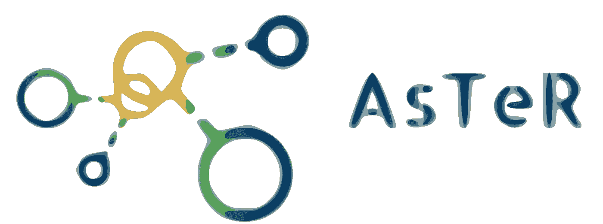
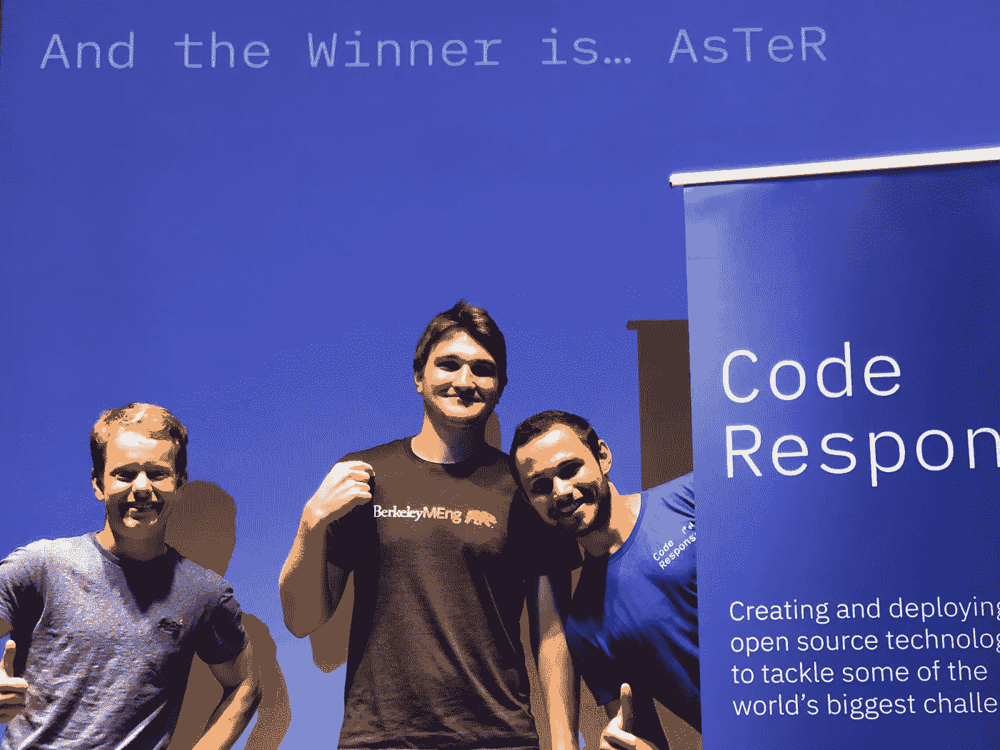
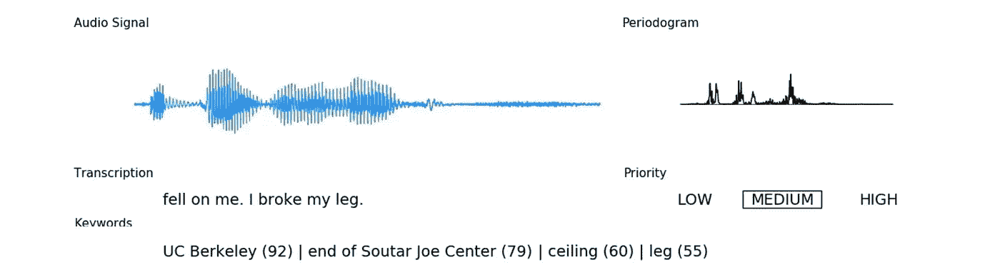
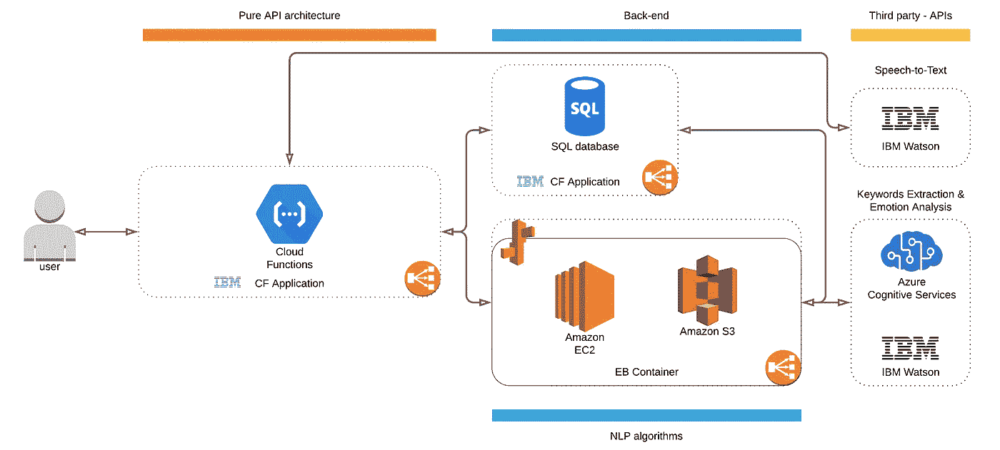
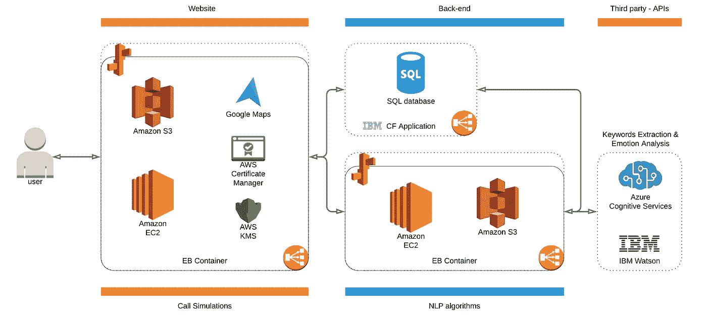
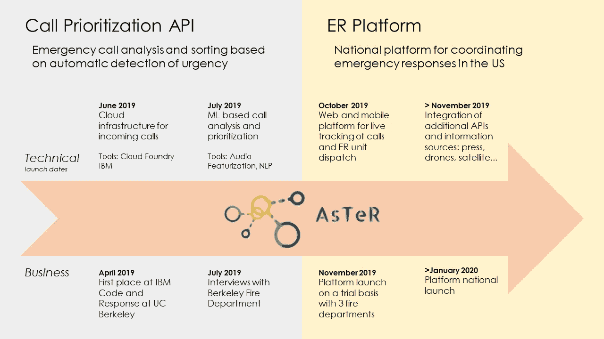

# IBM 代码呼吁:AsTeR 项目的激动人心的设计

> 原文：<https://towardsdatascience.com/project-aster-ibm-call-for-code-30d959614be7?source=collection_archive---------31----------------------->

这一切都始于一句双关语。当时，Thomas、Pierre-Louis 和我决定参加加州大学伯克利分校举办的 IBM 代号为 T3 的[活动。“*灾难准备、反应和恢复*”，这就是主题。我们对这个话题相当陌生，我们花了好几个下午来确定具体的问题和可能的解决方案，我们可以在 24 小时内做出原型。](https://callforcode.org)

在田野里挖掘不断让我们惊讶。考虑到应急响应中使用的过时技术，是时候将最先进的技术应用到这些救生应用中了！

Berkeley May 2019 — Thomas Galeon, Pierre-Louis Missler, Meryll Dindin

问题识别:每当自然灾害发生时，紧急呼叫中心就会饱和。它阻止紧急救援人员向最需要帮助的人提供帮助。

**我们的** [**解决方案**](https://github.com/Coricos/AsTeR) **:** 紧急呼叫优先级排序器的设计，通过一个中央平台减轻了响应者和调度者的工作。

> [**大新闻**](https://developer.ibm.com/callforcode/projects/) **:** 今年，来自 165 个国家的 180，000 多名开发人员、数据科学家、活动家、学生和行业同仁响应了号召。这些团队使用数据和开源技术(包括云、人工智能和区块链)创建了 5000 多个解决方案，以帮助应对自然灾害、优化响应工作，并帮助在世界各地促进健康、有弹性的社区。到目前为止已经选择了 32 个项目。我们很高兴地宣布，我们提交的项目已经通过了几轮评审，并加入了被确定为欧洲 **最佳**解决方案的精英小组，以寻求 2019 年代码呼吁全球奖**。**

# **设计核心产品**

Real-time Transcription and Analysis

正如你可能已经猜到的，从一个确定的问题到一个原型解决方案并不是一条直线。此外，24 小时对于构建一个工作演示来说是很短的时间。我们最初的策略是通过第三方 API 尽可能多地外包机器学习分析:使用 *IBM* 进行**语音转文本**，使用*沃森*进行**关键词和情感分析**。它给了我们访问文字记录，关键词，以及它们在相关性方面的权重。与此同时，我们开始构建一个**交互式地图**来根据呼叫的位置确定紧急救援单位的方向，一个地图图形(通过将街道简化为边和节点)和一个**优化的 Dijkstra 算法**来寻找从单位到受害者的最短路径。

人们现在可能想知道这个分数是如何从这个分析中建立起来的…

# 如何定义紧急事件的优先级？

这个问题无疑是最棘手的一个，因为它定义了最优呼叫和单元调度，当然也是我们花了很多时间讨论的问题。从伦理上讲，这又回到了定义哪个人比另一个人更需要帮助。打个比方，如果自动驾驶汽车必须在两种具有致命后果的规避策略之间做出选择，它将如何决定？尽管如此，呼叫中心的饱和问题仍然存在，技术可以有所帮助。正如每个数据科学问题的情况一样，我们从寻找现实生活中的数据开始。我们使用的数据集是“作为生命线的 Twitter:危机相关消息 NLP 的人类标注 Twitter 语料库”(Imran et al. 2016， [arXiv](https://arxiv.org/abs/1605.05894) )。通过经典的预处理、单词打包和模型训练(使用 [Challenger 包](https://github.com/Coricos/Challenger)进行快速轻型 GBM 实验)，我们获得了一个模型，该模型能够对与给定抄本相关的紧急事件类型进行分类:

其他 _ 有用 _ 信息“|”不 _ 相关 _ 或 _ 不相关“|”捐赠 _ 需要 _ 或 _ 提供 _ 或 _ 志愿服务“|”受伤 _ 或 _ 死亡 _ 人员“|”失踪 _ 被困 _ 或 _ 发现 _ 人员“|”注意 _ 建议“|”基础设施 _ 和 _ 公用设施 _ 损坏“|”同情 _ 和 _ 情感 _ 支持“|”转移 _ 人员 _ 和 _ 疏散“|”治疗“|”受影响 _ 人员“|”死亡 _ 报告“|”疾病 _ 体征 _ 或 _ 症状“|”疾病 _ 传播“|”预防”

Test performances on 20% of “Twitter as a Lifeline: Human-annotated Twitter Corpora for NLP of Crisis-related Messages”

最后，您可能想知道如何构建优先级分数本身。事实证明，之前的模型不仅仅是分类，它还通过**特征重要性**对词汇进行加权。因此，我们重新构建了一个加权词汇表，并将其插回到 *IBM Watson 关键字提取*中，以评估相关性。最终优先级由加权词汇的类别概率和相关性数组的比例点积给出。

# 扩充团队！

A 在伯克利版的 IBM 代码呼吁之后，加州大学伯克利分校的两名学生决定帮助我们构建我们将在实际的 [2019 IBM 全球代码呼吁](https://callforcode.org)上展示的解决方案。这就是奥斯卡·拉德梅克和弗洛里安·费施加入我们激动人心的旅程的方式！

# 扩展我们的解决方案…

这一次，他的主要想法是提供一个在线解决方案和工作演示，每个人都可以尝试。它需要三个支柱:一个可以轻松扩展的健壮架构、一个 API 端点和一个托管项目的网站。我们从设计可伸缩的后端开始，通过 *IBM Cloud Foundry 应用程序*(托管**语音到文本转换**和 **SQL 数据库**)和 *AWS 弹性豆茎*(托管 **NLP 端点**)。这三个容器并发运行，并作为独立的微服务一起通信，以及与第三方端点通信( **IBM** 语音到文本、 **Azure** 关键词提取和 **Watson** 关键词和情感提取)。

# 开发托管工作演示

另一个挑战是为这个项目开发一个网站，为我们的后端托管内容和一个界面，因为我们通过经验知道可视化是关键！你可以点击这里的来参观。

在前进的道路上，我们不得不面对许多新的挑战:

*   在网站上通过 JavaScript 直接集成谷歌语音转文本
*   将文本输出链接到我们的在线 NLP 端点
*   运行一个连接 Google Maps JS SDK 和我们的 SQL 端点的模拟

# 接下来是什么？

我们已经花了几个小时开发这个项目，但是还有很多事情要做。令人兴奋的是，AsTeR 有成为一个具体的开源项目的雄心，并围绕它建立一个社区。我们迫不及待地想看到 AsTeR 在未来对急救中心的影响！

# 支持我们，加入这个项目吧！

*   测试我们 API 的网站 — [项目 AsTeR](https://www.project-aster.com)
*   **项目展示** — [YouTube 视频](https://www.youtube.com/watch?v=_SBBrj9y26M)
*   **解决方案实现** — [Github 库](https://github.com/Coricos/AsTeR)
*   [这些伯克利大学的学生正在使用人工智能(…](https://www.cta.tech/News/Blog/Articles/2019/May/These-Berkeley-College-Students-Are-Using-Artifici.aspx) )
*   [(…)全世界的开发者都在发挥作用](https://developer.ibm.com/callforcode/blogs/weve-been-everywhere/?2238515967=&cm_mmc=OSocial_Twitter-_-Developer_IBM+Developer-_-WW_WW-_-CallforCode&cm_mmca1=000032GH&cm_mmca2=10008917&es_p=9894970&linkId=71807858)
*   [(…)使用开源技术解决现实世界的问题](https://www.ibm.com/blogs/jobs/2019/06/18/code-and-response-codeathon-providing-coders-with-the-opportunity-to-tackle-real-world-issues/)
*   [Code 2019 全球挑战赛顶级项目征集](https://developer.ibm.com/callforcode/projects/)

