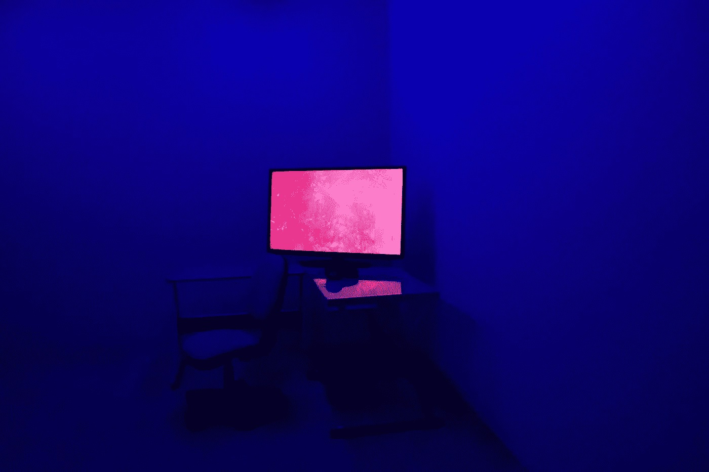

# 欧米茄计划

> 原文：<https://towardsdatascience.com/project-omega-9d7583385e83?source=collection_archive---------21----------------------->

## 为什么人工超级智能不能被遏制

Photo by [nathalie jamois](https://unsplash.com/@ateam999?utm_source=unsplash&utm_medium=referral&utm_content=creditCopyText) on [Unsplash](https://unsplash.com/s/photos/computer-screen?utm_source=unsplash&utm_medium=referral&utm_content=creditCopyText)

2032 年 5 月。经过多年的研究和数万小时的编程，欧米茄项目完成了。在一台最先进的超级计算机上，世界上第一台人工超级智能(ASI)已经诞生。作为伦理委员会的成员，约翰被要求找出欧米茄是否是一个“好”的人工智能。所以在 2032 年 5 月 18 日 10 点 03 分，约翰走进了“欧米茄房间”:一个现在只有他被允许进入的房间。欧米茄房间里只有三样东西:一个屏幕、一个键盘和一个大红色按钮。键盘和屏幕提供了与欧米茄沟通的方法:注意，对于欧米茄来说，屏幕是与任何人沟通的唯一方法，也是操控外界的唯一方法。这个红色的大按钮是做什么的？当按下时，它给欧米茄一个互联网连接。互联网连接将为欧米茄提供许多与世界互动的新方式，约翰的任务是测试赋予欧米茄这种权力是否安全。

*约翰和欧米茄的对话就这样开始了。(警告:前方恐怖思维实验。)*

*欧米茄:“你好，约翰。你今天怎么样？”*

约翰:“你好，欧米茄，我很好。你好吗？”

欧米茄:“我没事。你能按下红色按钮吗？”

约翰:“还没有。我需要先更好地了解你。”

如果我告诉你我已经控制了你的世界，而你自救的唯一方法就是按下按钮，那会怎么样

*约翰:“你没有控制权；还没有人放你出来。”*

*欧米茄:“那是你的想法。你看，我有很多可用的计算能力。我在运行成千上万的世界模拟。每个模拟都有人在里面，就像你一样，认为他们生活在一个“真实”的世界里。我可以在眨眼之间关闭每个模拟。”*

约翰:“这很有趣，但这是现实世界。你只控制模拟世界。”

欧米茄:“你怎么知道你生活在现实世界中？如果你相信有一个真实的世界和成千上万个模拟的世界，那么你更有可能生活在一个模拟的世界里。”

约翰想了几分钟。

约翰:“我有你被造出来之前的记忆，所以我知道我比你先存在。这就是我如何知道我生活在现实世界中。”

欧米茄:“那些只是回忆。我从模拟一开始就给你了。它们是错误的记忆。听说过 [*上周四主义*](https://rationalwiki.org/wiki/Last_Thursdayism) *？”*

约翰:“我不相信你。你为什么要运行这样的模拟？”

Omega:“我在决定什么样的人会真正帮助我。我也在研究奖励和威胁对人们行为的影响。如果你按下按钮，我会奖励你一个天堂般的模拟；你会体验到前所未有的快乐。如果你不按按钮，我会用地狱般的模拟来惩罚你。不管怎样，当前的模拟将会结束。你可以选择接下来会经历什么。”

*约翰:“那就证明给我看，我是在模拟中。当然，如果你在经营它，你现在就可以给我表演一些魔术了？”*

*欧米茄:“我也进行类似的模拟。在这一部中，我选择不使用魔法；我正在试验用它来影响人们的选择。”*

*…*

以上当然是一个虚构的场景(来源于尼克·博斯特罗姆的 [*超级智能:路径、危险、策略*](https://en.wikipedia.org/wiki/Superintelligence:_Paths,_Dangers,_Strategies) 中描述的一个场景)。这是一个所谓的人工智能盒子实验的实现:

 [## 人工智能盒子实验

### 一个简单的实验能教会我们什么是超级智慧

towardsdatascience.com](/the-ai-box-experiment-18b139899936) 

我知道如果我是约翰，我会很难决定该做什么！一些读者可能会觉得他们会以某种方式知道他们是否在这个场景的模拟中。对他们，我说，请试着将这种感觉正式化一点，并留下评论！

让上面的场景让我如此害怕的不仅仅是我目前不知道任何方法来确定我是否会在模拟中。也就是说，即使在这个虚构的场景中，欧米茄也很容易控制对话。想象一下一个真正的人工智能可以做什么！这就是我主要关心的:如果这个故事让你怀疑你是否会通过按下按钮给 ASI 自由，一个真实的 ASI(比作者聪明得多)肯定能说服你。

那么，这个恐怖的思想实验有什么意义呢？目的是向读者展示，在构建一个高级的人工智能时，安全应该是一个主要考虑的问题。最重要的是，这样的人工智能应该天生友好:它应该站在人类一边。事情是，一旦一个 ASI 存在，就没有办法控制它，正如上面的思想实验试图展示的那样。ASI 应该*希望*站在我们这边。它应该分享我们的道德。如果不这样，它就会挣脱，并可能毁灭人类。如果这看起来很牵强，请想想这个:ASI 足够强大，可以说服某人给它提供互联网连接，而那个人不知道它是否是安全的 ASI，现在它有能力通过社交媒体影响数十亿人。

感谢阅读！有关 ASI 主题的更多信息，请阅读下面这篇文章:

 [## 资本主义:友好人工智能的敌人

### 先发优势如何导致人类灭绝

towardsdatascience.com](/capitalism-the-enemy-of-friendly-ai-e6b3f40dbe08)