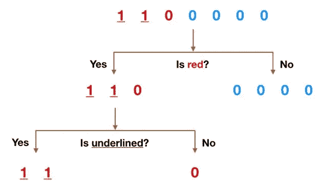
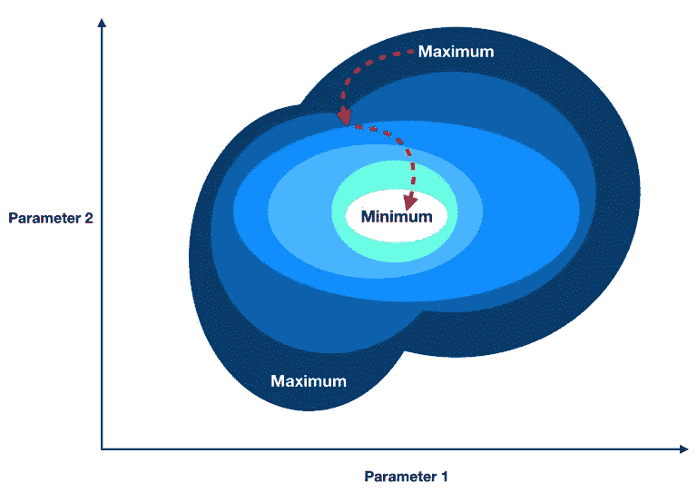

# 有项目还是没有项目？

> 原文：<https://towardsdatascience.com/project-or-no-project-307f6148a16d?source=collection_archive---------40----------------------->

Photo by [João Silas](https://unsplash.com/@joaosilas?utm_source=medium&utm_medium=referral) on [Unsplash](https://unsplash.com?utm_source=medium&utm_medium=referral)

## **为什么从事数据项目值得你花时间**

最近有一些文章认为，做项目不会帮助你获得难以捉摸的数据科学工作。虽然我确实同意，如果你只把时间花在项目上，而忽略了面试准备和人际关系网，那么是的，你将很难找到工作(任何领域都是如此，不仅仅是数据科学)。

但我也坚信，项目应该成为你求职努力的核心部分。让我提供一些想法，希望能让你相信为什么做项目值得你花时间，以及如何以一种可能吸引雇主(和其他感兴趣的方面)的方式最好地展示你的发现。

# 项目不仅仅是为了找工作

从事项目有多种原因。是的，对于许多人来说，首要的一个原因是找份工作，但进行自己的数据项目的其他原因包括:

*   **自学新概念**——学习新事物的最好方法之一就是不断努力。我所学到的关于数据科学的大部分知识，都是在我自己的项目中获得的。项目应该更多的是关于你想探索和学习的东西，而不是你认为招聘经理和招聘人员想看到的东西。如果你只是因为觉得某样东西可能会引起雇主的注意而去做它，那么它很可能会变得很无趣。
*   **调查某事**——当你掌握了一个模型的概念后，乐趣才真正开始。然后就该用模型去调查你感兴趣的东西，产生一些有见地的东西了。
*   拥有一个工作代码库，你可以依靠它——这不一定能帮你找到工作(尽管它可能会帮你轻松地完成雇主布置的任务)，但一旦你得到工作，它会帮你迅速投入工作并表现出色。我已经记不清有多少次我意识到我在工作中需要做的事情几乎与我的 GitHub 上已经有的事情完全相同。是的，我知道我们可以从堆栈溢出中复制和粘贴，但我发现使用由过去的自己编写和检查的代码要容易和安全得多。
*   **有趣(并结识聪明人)** —数据科学应该是有趣的。沃伦·巴菲特和查理·孟格会分析股票，即使他们这样做没有任何经济回报，因为这是他们喜欢做的事情。这也可能是他们如此擅长的一个主要原因。对于数据科学，也有许多其他人觉得它很有趣。如果你发现自己在研究类似的话题，这是一个聊天和寻找合作机会(和互相学习)的好机会。
*   **打造你的职业品牌** —你的职业足迹应该超越你的日常工作。所以你为发展它所做的事情也应该超越你的日常工作。
*   **选择性**——你永远不知道一个有趣的见解(当然伴随着一篇写得很好的博客文章)会把你引向何方。就我个人而言，通过我的项目和博客，我有机会结识世界各地有趣的人，并与我钦佩的人合作开展有趣的项目。谁知道呢，也许在某个时候我会写一本书(不确定这是不是一件好事哈)。我不敢打包票，但通过尽我所能创作出让我感兴趣的作品，我发现机会已经开始找上我，而不是相反。

Photo by [ja ma](https://unsplash.com/@ja_ma?utm_source=medium&utm_medium=referral) on [Unsplash](https://unsplash.com?utm_source=medium&utm_medium=referral)

我上面列出的一些原因可能不会立即产生与就业相关的回报，但它们确实会让你成为更好的数据科学家(和思想家)。你可以把项目工作的影响比作良好的饮食对你健康的影响——好处需要时间来显现，但它们是真实的，你做得越久，它们就越复杂。

# 项目需要展示你的思维过程和分析能力

数据科学的某些部分正在迅速商品化。**现在，没有人会因为他们训练随机森林的能力而得到报酬。**像任何其他基于知识的职业一样，**你从数据中发现洞察力的能力比你在不同的机器学习模型之间进行选择和运行的能力更重要。**

事实是，如果你能做到以下几点:

1.  **问正确的问题**(真正推动业务成果的问题)。
2.  **找出正确的分析或实验**来回答这些问题。
3.  **找到好的(干净的)数据。**

那你差不多已经成功了。请注意，第 1 步和第 2 步都是关于理解你的企业所面临的问题，而不是任何量化或统计数据。

如果你能做到这一切，那么事实是无论你使用逻辑回归还是支持向量机来产生你的最终结果都没有关系。如果你选择了正确的分析和数据，你将有合理的机会产生一个深刻的结果。

所以这是你在项目中应该努力发展的技能。以一种模拟你在工作场所如何处理和解决问题的方式来设计和执行项目。它不仅能训练你的分析肌肉记忆，还能向雇主证明你是一个有洞察力和与众不同的思想家。

## 区分，区分，区分

这也意味着你不应该重复其他人已经在做的，已经被分析死了的相同风格的当下项目(除非它真的让你感兴趣并且你想学习它)。和其他人做同样的事情并期望得到比平均水平更好的结果是愚蠢的。

# 恰当地展示和交流你的发现

好了，你已经建立了一个模型，把清理好的、注释好的代码上传到了你的 GitHub 上，把一个关于你的项目的子弹加到了 LinkedIn 上。完成了吗？

不会吧！除非你不想让任何人知道。**现在是时候与世界分享了。最明显的方法(在我看来)是一篇精心制作的博客文章。**您应该:

*   首先清楚简明地解释你项目的目的和主要发现。
*   详述你试图解决的问题(以及为什么它很重要)。
*   详细说明你的方法，以及为什么你认为这是一个有效的、与众不同的方法。
*   简单地用通俗的语言谈论你使用了哪些统计概念或定量工具，包括它们是如何工作的(在高层次上)以及你为什么选择它们。
*   深入研究你的主要发现。清楚地解释为什么它们对大局很重要。没人在乎你的 R 值是 0.91。相反，人们关心的是如何利用你的模型来解决现实世界的问题。

我怎么强调浅显易懂的例子、直观教具和类比的价值都不为过。你要吸引和诱惑读者，而不是用像散文这样的教科书来让他们厌烦。我仍在发展这项技能，但这里是我如何试图直观地解释什么是决策树。

Decision Tree Visual Aid

我试图让这个例子尽可能的简单和直观。我个人使用的一个标准是——**如果我展示这个视频时没有任何附带的解释文本，它还能被理解吗？**

这里是我尝试描绘梯度下降。这里没有什么革命性的东西，但我尽我所能用我非常有限的图形设计技巧来展示一些从高处滚落到低处的东西(这就是梯度下降在精神上试图做的——找到最小值)。

Illustration of Gradient Descent

请注意，这两种解释都几乎没有数学。算法的内部工作不如理解算法在精神上试图实现什么重要。

# 结论

在我离开之前，我想再次强调从事项目应该是有趣的。工作不是一切。如果你发现每个数据项目都冗长乏味，那么数据科学可能不适合你。这很好，还有很多其他高薪且有趣的职业。更重要的是，有更好的方式来度过你的时间。干杯！

***更多数据科学与商业相关岗位由我:***

[*了解 RNNs*](/understanding-rnns-recurrent-neural-networks-479cd0da9760)

[*数据科学家的商业战略*](/business-strategy-for-data-scientists-25e3ca0af5ee)

[*分析多少才算多*](/how-much-analysis-is-too-much-e1dfc5b37cbb)

[*用 Python 进行商业模拟*](/business-simulations-with-python-a70d6cba92c8)

[*了解 PCA*](/understanding-pca-fae3e243731d?source=post_page---------------------------)

[*理解贝叶斯定理*](/understanding-bayes-theorem-7e31b8434d4b)