# 这是苏格兰威士忌吗？

> 原文：<https://towardsdatascience.com/project-whisky-987cf7a15dcc?source=collection_archive---------26----------------------->

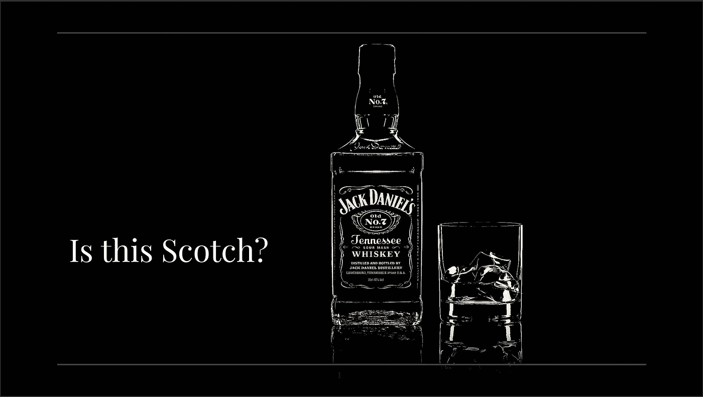

No, it is not.

## 使用机器学习按原产国对威士忌进行分类

欢迎来到威士忌计划。在这个项目中，我们将尝试根据威士忌的风味特征、成分类型和威士忌类型，按照威士忌的原产国对其进行分类。

我是个威士忌迷，但不是葡萄酒迷。出于某种原因，我能尝出威士忌中微妙的细微差别，但绝对尝不出葡萄酒中除了“干的”、“不干的”之外的任何东西。我决定看看我是否可以使用机器学习来根据风味特征对威士忌进行分类。

所以问题是，根据它的味道和制作方法，我们能训练计算机告诉我们威士忌来自哪个国家吗？

此外，阅读结论，了解我对威士忌行业现状的看法，以及它如何影响我的分类器。

# 领域知识是王道

首先让我们放下一点领域知识。

威士忌是怎么生产的？下面是对威士忌制作过程的极其简化的解释。

第一步:发酵谷物糖化醪

所有威士忌都以某种形式的谷物开始，通常是大麦、小麦、玉米，或者三者的混合。它被碾碎，加热，然后与酵母混合，浸泡在水中，让酵母将谷物中的糖转化为酒精。有时，在加入酵母之前，允许大麦在水中“发芽”或发芽，这在很大程度上有助于整体风味。在苏格兰威士忌的生产过程中，制麦芽非常重要。发酵可以在任何地方持续 3 到 15 天，最终结果给你啤酒！或者至少是某种形式的。但是我们在做威士忌！显然还需要几个步骤。

第二步:蒸馏

这一步包括加热“啤酒”以捕获和浓缩酒精、风味颗粒，并留下一些不需要的颗粒。这个过程被称为蒸馏，可以发生一次或多次。蒸馏的最终产品有许多名称，这取决于你所在的国家，但本质上是伏特加。

第三步:衰老

几乎所有的威士忌都在烧焦的橡木桶中陈酿。苏格兰威士忌以使用二手美国波旁酒桶而闻名，尽管一些苏格兰酿酒厂也开始涉足雪利酒或朗姆酒酒桶。老化通常需要 5-20 年，尽管有些可能需要更长时间。

下图描述了不同种类的威士忌:

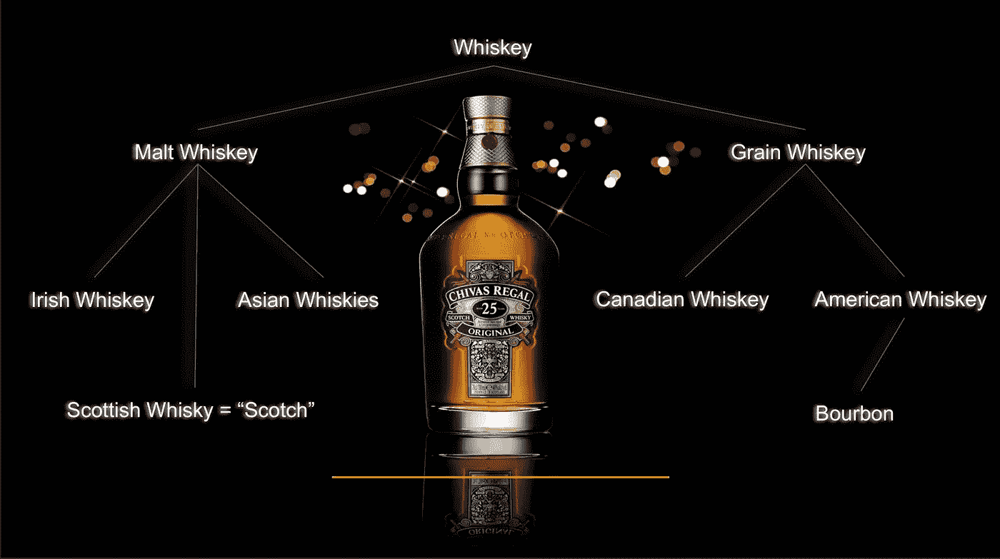

These list the majority, but there is a lot of cross-pollination

# 数据

数据来源于[Whiskeyanalysis.com](http://www.whiskeyanalysis.com)。这是一个绝对迷人的网站，我相信所有威士忌爱好者都应该访问。

我从 whiskeyanalysis.com 获得的数据包括 1600 种单独的威士忌，数据范围如下:

目标:
国家——苏格兰、美国、加拿大、爱尔兰、日本、瑞典、印度、台湾、威尔士、瑞士、芬兰、塔斯马尼亚、南非、荷兰、英国、比利时、法国。

特征(保留):
聚类(通过 PCA 转换成类别的风味):A，B，C，D，E，F，G，H，I，J，R0，R1，R2，R4。
类别——单一麦芽类、混合麦芽类、黑麦类、波旁威士忌类。
类型——麦芽、混合、谷物、黑麦、小麦、大麦、波旁威士忌、调味

特征(已丢弃):
超级聚类:威士忌所拥有的风味的融合(由于多样性低而被丢弃以利于单一风味)
威士忌:单个威士忌的名称
metascore:基于多个评论站点的威士忌平均得分
STDEV:基于多个评论站点的威士忌标准差
评论:观察到并用于 metascore 的评论数。

成本:威士忌的大概成本，以美元计。

# 清洁和 EDA

我最初遇到的数据问题是如何正确分类我的数据。我首先需要将国家转换成数值，这是一个简单的 df.replace()。由于苏格兰威士忌和世界其他地区生产的威士忌之间的巨大不平衡，我还将 11 种人口最少的威士忌归为“世界其他地区”，保留苏格兰、美国、加拿大、爱尔兰和日本。在重组之前，国家分为以下几类:

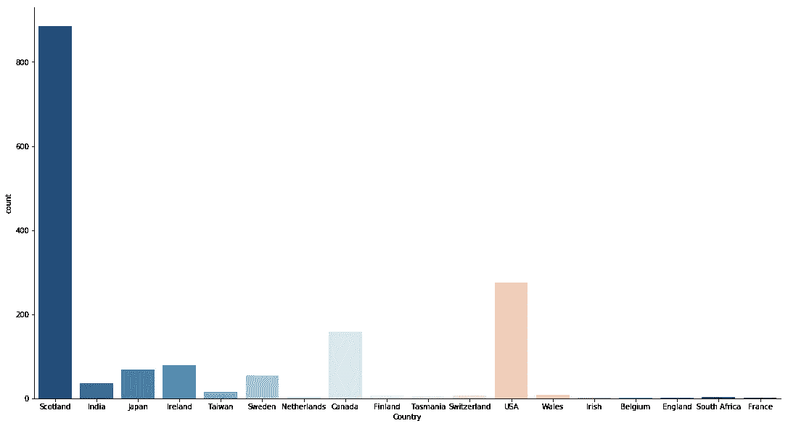

SO MANY SCOTCHES

你可能会问，爱尔兰威士忌怎么了？我以为爱尔兰威士忌很有名。你说得对，的确如此，但随着苏格兰威士忌在上个世纪越来越受欢迎，爱尔兰威士忌已经有点过时了，截至 1990 年，只有几家爱尔兰酒厂还在营业。这个数字还在上升，但是还没有足够的时间让他们将可销售的产品推向市场。

此外，最初的数据集创建者选择根据黑麦含量对波旁威士忌进行排名，因为波旁威士忌往往遵循固定的风味特征。然而，波旁威士忌尤其与众不同的是它的黑麦成分，这使得黑麦威士忌具有独特的“辣味”为了更好地训练模型并避免自动将“R”识别为波旁威士忌，我需要根据波旁威士忌的一般风味特征将“R”转换为更精简的格式，以符合预先存在的风味类别，并考虑到辣味。最终的数据转换相应地排列如下:

RO = B
R1 = A
R2 = E
R3 = C
R4 = F

最后，为所有剩余的分类值创建虚拟值。

# 建模

我们现在干净的数据是用标准的 train_test_split 库准备的。然后我击打(这算一个词吗？)来补偿超重的苏格兰威士忌，因为该死的，它仍然超重。

我使用标准的 DummyClassifier，使用“统一”方法来测试数据，基本上使用随机或“街上的人”测试程序，产生 17%的精度和召回分数，建立我们的基线。

然后使用各种参数测试以下机器学习模型，产生以下最佳结果和混淆矩阵:

KNN:
准确率:43.5%
召回率:42.2%

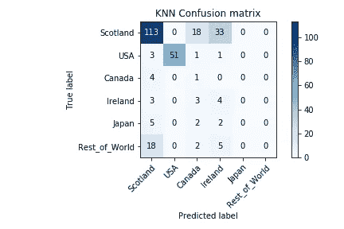

决策树:
准确率:35%
召回率:33%

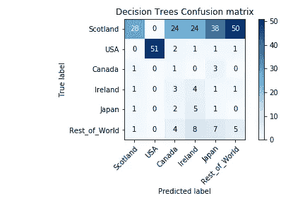

回归树:
准确率:19%
召回率:33%

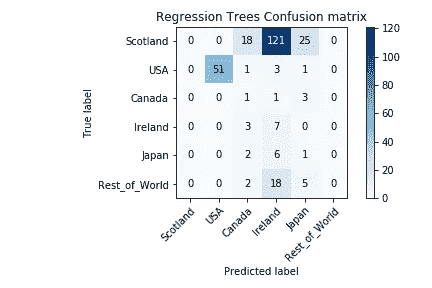

袋装树:
准确率:21%
召回率:34%

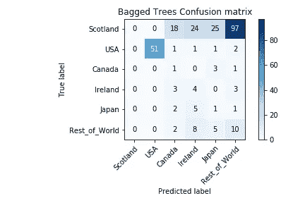

随机森林:
准确率:19%
召回率:32%

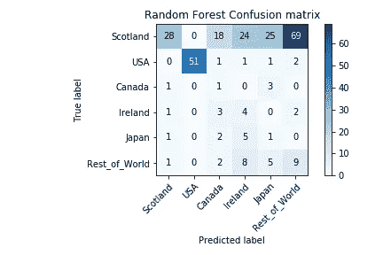

AdaBoost:
准确率:36%
召回率:30%

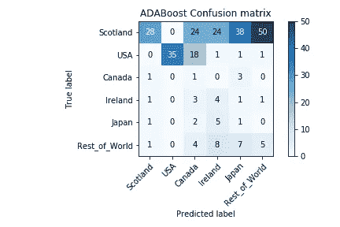

梯度推进:
准确率:37%
召回率:36%

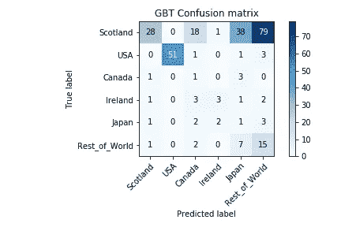

XGBoost:
准确率:44%
召回率:40%

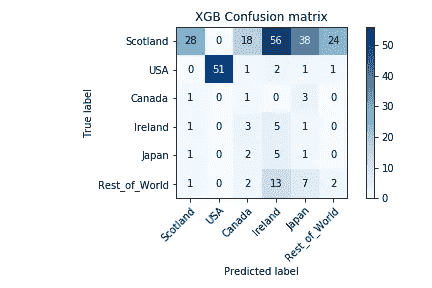

支持向量机:赢家
准确率:40%
召回率:44%

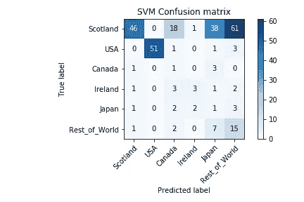

# 结论

最终，尽管 KNN 得分很高，但其真阳性和假阴性的分布并不理想。为了能够正确分类威士忌，我希望看到更多的同质性。鉴于数据在苏格兰威士忌中的权重，我希望该数据显示更多的 I 类错误，或者简单地说，当它看到一种威士忌时，它更有可能不会将其称为苏格兰威士忌。KNN 简单地把所有东西都归类为苏格兰威士忌。这可能会提高我的准确性，但最终是一个糟糕的分类模型。幸运的是，SVM 提供了我一直在寻找的一致性，同时还具有足够高的精确度和召回分数。

值得注意的是，对这一分类工作进行建模的困难可能在很大程度上是由于市场力量。苏格兰威士忌被公认为全球威士忌的黄金标准。那些希望在自己的国家建立竞争酿酒厂以及希望为自己扬名的人通常会遵循苏格兰的模式来建立他们的设备。然后，为了创造一个可行的产品，进一步寻求模仿独特的苏格兰风味，以最大限度地成功和饮酒者的吸引力。这导致了许多模仿苏格兰威士忌的威士忌。反过来说，因为苏格兰参与这项运动的时间太长了，所以苏格兰威士忌完全有可能尝起来像另一个国家的威士忌。我们可以看看日本的模式。广为人知的日本威士忌之父 Masataka Taketsuru 在回到日本创办自己的酒厂之前，曾在苏格兰酒厂工作多年。当时的趣闻说，竹鹤复制了苏格兰模型的每一个细节，包括他在苏格兰的蒸馏器上观察到的数百年的凹痕的尺寸。

一旦可行的产品和收入流建立起来，这些其他酒厂可能会允许自己试验他们的生产过程，并寻求创造新的和有趣的口味，可能对他们的国内市场更有吸引力。例如，在美国，美国威士忌的生产被当地可获得的原料和足够的时间以及与旧世界的距离所改变，创造了他们自己独特的威士忌。我们今天所知的波旁威士忌。由于拥有庞大而忠诚的国内客户群，美国酿酒商没有必要效仿苏格兰模式，他们满足于生产具有自己独特民族风味的产品。时间会证明其他国家的酿酒厂最终是否会确定他们自己独特的风味。

在与行业专家的交谈中，我们发现了更多的困难。我与 Casamigos Tequila 的 Olivier Bugat 就我创建的模型进行了交谈，他指出，用于威士忌分类的风味特征不足以按照原产国对威士忌进行分类。设备尺寸、蒸馏程序、当地空气质量、海拔和温度等变化都会影响威士忌的最终风味。这些变化中的每一个都会导致数百种化学成分的包含或排除，最终影响最终产品。例如，由于印度的环境温度和湿度，阿姆鲁特威士忌的成熟时间是普通苏格兰威士忌的一半。

如今，液相色谱和气相色谱被用来分析威士忌的“指纹”以确定其来源。不幸的是，它贵得惊人，像布加特先生这样的专业人士更喜欢雇佣专业的品尝师来帮助他们找出配方。没有这些疯狂的味蕾，我希望有一天能够访问实验室产生的数据，并进一步完善我的模型。

我的 [Github](https://github.com/hamiltonchangcodes/project_whisky) 上有所有代码。

来源:

 [## 自助威士忌分析——对威士忌风味和质量的科学元分析

### 互联网上最无聊的威士忌网站。使用威士忌元评论家帮助您了解威士忌的质量和…

whiskyanalysis.com](https://whiskyanalysis.com/) 

在 LinkedIn 上与我联系！

 [## 汉密尔顿·张，CRPC·CSPO-熨斗学校-纽约，纽约| LinkedIn

### 具有财务规划背景的数据科学家和机器学习工程师。我有专家级的知识…

www.linkedin.com](https://www.linkedin.com/in/hamilton-chang-crpc%C2%AE/)