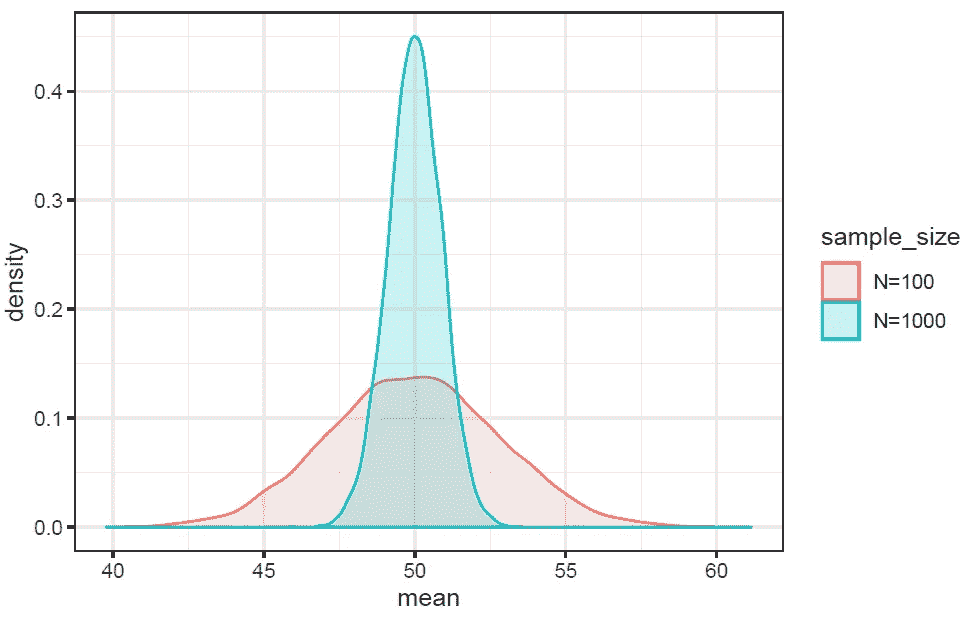

# 用蒙特卡罗模拟说明中心极限定理

> 原文：<https://towardsdatascience.com/proof-of-central-limit-theorem-using-monte-carlo-simulation-34925a7bc64a?source=collection_archive---------18----------------------->


**Probability distribution of the sample mean of a uniform distribution using Monte-Carlo simulation.**

中心极限定理(CLT)是统计学和数据科学中最重要的定理之一。CLT 指出，概率分布样本的样本均值是一个随机变量，其均值由总体均值给出，标准差由总体标准差除以 N 的平方根给出，其中 N 是样本大小。


我们可以用均匀分布来说明中心极限定理。任何概率分布，如正态分布、泊松分布、二项式分布都可以。

## 均匀分布

让我们考虑定义在范围[a，b]中的均匀分布。概率分布函数、均值和标准差从 [Wolfram Mathematica 网站](http://mathworld.wolfram.com/UniformDistribution.html)获得。

**a)人口平均数**

对于均匀分布，总体平均值由下式给出


**b)总体标准偏差**

对于均匀分布，总体标准差由下式给出


中心极限定理指出，任何大小为 N 的样本的平均值是一个均值为的随机变量


标准偏差由下式给出


现在让我们通过考虑 a = 0，b = 100 的均匀分布来说明我们的计算。我们将通过考虑总体(N→无穷大)和两个样本来说明中心极限定理，一个样本 N = 100，另一个样本 N = 1000。

# 一.分析结果

**a)人口平均数**

使用上述等式，a = 0，b = 100 的均匀分布的总体均值为


**b)总体标准偏差**

类似地，a = 0 且 b = 100 的均匀分布的总体标准差为


**c)样本 1，N = 100**


**d)N = 1000 的样品 2**


# 二。蒙特卡罗模拟结果

对于蒙特卡罗模拟，我们生成一个规模为 10，000 的非常大的群体。

**a)人口平均数**

```
pop_mean <- mean(runif(10000,0,100))
```

输出为 50.0，这与我们的分析结果一致。

**b)总体标准偏差**

```
pop_sd <- sd(runif(10000,0,100))
```

输出为 28.9，与我们的分析结果一致。

**c)N = 100 和 N = 1000 的两个样本的蒙特卡罗代码**

```
library(tidyverse)a <-0
b <-100mean_function <-function(x)mean(runif(x,a,b))B <-10000sample_1 <-replicate(B, {mean_function(100)})sample_2 <-replicate(B, {mean_function(1000)})
```

蒙特卡洛模拟的输出

```
mean(sample_1)
```

产率为 50.0，这与我们的分析结果一致。

```
sd(sample_1)
```

产率为 2.83，这与我们的分析结果(2.89)一致。

```
mean(sample_2)
```

产率为 50.0，这与我们的分析结果一致。

```
sd(sample_2)
```

产率为 0.888，这与我们的分析结果(0.914)一致。

**d)生成 N = 100 和 N = 1000 的平均值的概率分布。**

```
X <- data.frame(sample_size=rep(c("N=100","N=1000"),
                times=c(B,B)),mean=c(sample_1,sample_2))X%>%ggplot(aes(mean,color=sample_size))+
    geom_density(aes(mean,fill=sample_size),alpha=0.2)+
    theme_bw()
```



**Probability distribution of the sample mean of a uniform distribution using Monte-Carlo simulation.**

该图显示样本均值是一个正态分布的随机变量，其均值等于总体均值，标准差由总体标准差除以样本大小的平方根给出。由于样本标准偏差(不确定性)与样本大小成反比，因此计算平均值的精度会随着样本大小的增加而降低。

# 中心极限定理的含义

我们已经表明，任何概率分布的样本均值都是一个随机变量，其均值等于总体均值和均值的标准差，由下式给出:


基于这个等式，我们可以观察到，随着样本大小 N →无穷大，均值的不确定性或标准差趋于零。这意味着我们的数据集越大越好，因为样本越大，方差误差越小。

总之，我们已经讨论了如何使用蒙特卡罗模拟证明中心极限定理。中心极限定理是统计学和数据科学中最重要的定理之一，所以作为一名实践数据科学的人，熟悉中心极限定理的数学基础是非常重要的。