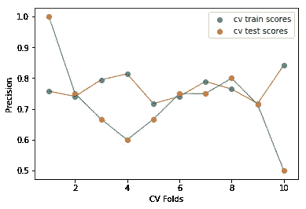
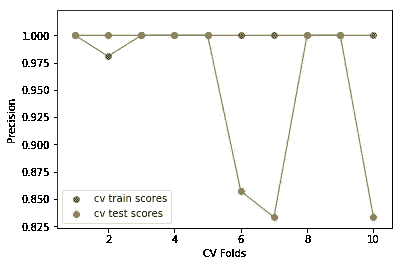
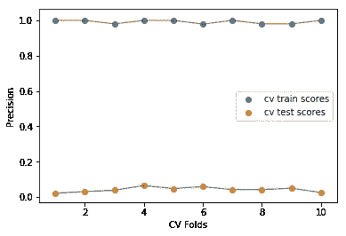
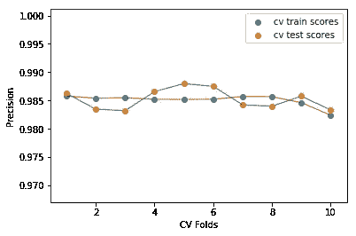
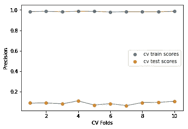

# 交叉验证的适当平衡

> 原文：<https://towardsdatascience.com/proper-balancing-for-cross-validation-d95c17ff0ab4?source=collection_archive---------17----------------------->


当手头的数据集在每个目标类值的实例数量方面不平衡时，谁没有遇到过应用交叉验证技术的需要呢？

***这里的问题是，我们是否恰当地运用了它？***

这篇文章的目的是展示一种在交叉验证中使用平衡方法的方法，而不是在 CV 测试折叠上强制平衡；从而得到更真实的 CV 评估结果。

一个**通常** **将**他的数据分割成训练&测试(&保持)子集，
平衡训练子集，在其上拟合他的模型，并得到不平衡测试&保持集的结果。

或者，我们使用**交叉验证**，最有可能使用分层折叠，
以便每个折叠保留每个类别的样本百分比。

然而，像 sickit-learn 的`cross_validate`
这样的预置函数默认选择不处理类不平衡。

**在本教程中，我们将首先介绍一些数据平衡的组合应用&交叉验证(CV)。然后，我们将检查一种在 CV 测试折叠上产生评估度量的方法，通过为测试折叠保持维持集(未知测试集)具有的相同的类分布。**

让我们用一个简单的 **python 例子**来检验这个思路。
我在这里使用这个[信用卡欺诈检测](https://www.kaggle.com/mlg-ulb/creditcardfraud/data) Kaggle 数据集，
遵循以下步骤。

*   我们会保留整个&工作的一个**样本**。
*   然后**将**我们的数据拆分成训练&测试集数据。
*   我们将把这个测试集视为**维持**/未知集。
*   并且将仅对训练集应用交叉验证。
*   我们将在交叉验证期间，在&之前，在& oversampling、
    &平衡下一起试用。
*   由于最合适的信用欺诈指标是**精度**，
    ，我们将比较 CV 测试折叠的平均精度
    和维持集的模型精度。

***抬头:*** *相关代码在文末。*

## **第 1 部分:无平衡**

这里我们绘制了完全没有平衡的精确结果:



```
Average Train Precision among C-V folds: 76.8 %
Average Test Precision among C-V folds: 71.98 %
Single Test set precision: 75.86 %
Single Test set Low Class(No-Fraud) Precision: 99.9 %
Single Test set High Class(Fraud) Precision: 75.9 %
```

*   CV 褶皱的精确测量似乎很不稳定。
*   一些精度度量高于它们在训练集上的相应精度。
*   CV 折叠的测试集精度之间存在很大差异。
*   CV 的平均测试集精度与未知的欺诈数据集相差不是很远，但差异仍然很重要。
*   因此，我们将检查数据集的平衡。

## 第 2 部分:C-V 外部平衡(欠采样)

这里，我们绘制了在对其应用 CV 之前，在欠采样情况下，仅对训练子集进行平衡的精确结果:



```
Average Train Precision among C-V folds: 99.81 %
Average Test Precision among C-V folds: 95.24 %
Single Test set precision: 3.38 %
Single Test set Low Class(No-Fraud) Precision: 100.0 %
Single Test set High Class(Fraud) Precision: 3.40 %
```

*   像以前一样:
    - CV 成绩看起来大多很高，但是不稳定。
    -一些精度指标高于其在列车组上的相应精度。
    -CV 褶皱的测试集精度出现较大差异。
*   此外，对上述一些高数值的任何正面解释都可能是错误的，因为“未知”不平衡检验给出了很差的精度。
*   上述差异源于以下事实:
    -每个褶皱的测试集是平衡的，
    -每个褶皱的模型是在平衡的列车褶皱数据上拟合的。
*   因此，该模型在 CV 中运行良好，因为它是在相似的类分布(平衡的)上训练和测试的。
*   然而,“未知”欺诈数据集不会平衡，因此我们在测试集上看到非常低的精度。

## 第 3 部分:C-V 内部平衡(欠采样)

在这里，我们绘制了平衡的精确结果，在欠采样的情况下，
在拟合模型之前，只对每个 CV 折叠的训练集进行采样，
对 CV 折叠的测试集进行预测:



```
Average Train Precision among C-V folds: 99.21 %
Average Test Precision among C-V folds: 4.2 %
Single Test set precision: 3.38 %
Single Test set Low Class(No-Fraud) Precision: 100.0 %
Single Test set High Class(Fraud) Precision: 3.40 %
```

*   我们在 CV 折叠中看到稳定的精度结果，但是不够有效。
*   我们看到未知数据的精度非常接近 CV 折叠的平均精度。
*   我们在这里所做的是，我们让每个 fold 的模型识别欺诈交易的存在，并尝试在未知测试(fold)数据的现实、不平衡版本上进行预测。
*   与不平衡版本的大约 76%相比，精度仍然很差。
*   这是否意味着我们放弃了平衡？
*   下一步可能是检查不同的平衡比率。
*   但首先让我们检查过采样而不是欠采样，因为我们的欺诈交易太少。

## 第 4 部分:利用过采样平衡外部 C-V

在这里，我们绘制了平衡的精确结果，在对其应用 CV 之前，
只对训练子集进行过采样:



```
Average Train Precision among C-V folds: 98.51 %
Average Test Precision among C-V folds: 98.52 %
Single Test set precision: 12.61 %
Single Test set Low Class(No-Fraud) Precision: 100.0 %
Single Test set High Class(Fraud) Precision: 12.6 %
```

*   由于过采样，结果比第 2 部分更稳定；
    欠采样留下的实例太少。
*   然而，简历分数并不代表未知测试集的真实情况。

## 第 5 节:C-V 内部的平衡(过采样)

在这里，我们绘制了平衡的精确结果，在对每个 CV 褶皱拟合模型并对 CV 褶皱的测试集进行预测之前，仅使用过采样
每个 CV 褶皱的训练集:



```
Average Train Precision among C-V folds: 98.38 %
Average Test Precision among C-V folds: 8.7 %
Single Test set precision: 12.61 %
Single Test set Low Class(No-Fraud) Precision: 100.0 %
Single Test set High Class(Fraud) Precision: 12.6 %
```

*   由于过采样，精度分数比第 3 部分的分数高。
*   尽管如此，我们得到的每个 CV 倍预测分数结果足够接近模型在未知测试数据集上产生的结果。

很明显，到目前为止，平衡并没有帮助获得好的测试结果。
然而，这超出了本文的范围(:-)，本文的目标已经实现:
让模型在每个 CV 文件夹的测试集上产生类似于在未知数据集上产生的评估度量分数，
在训练数据平衡的情况下。

最后，我不推荐严格意义上的改编，
但是你可以从上面保留一个建议&供你思考！

***感谢阅读本文！我对任何意见或建议都感兴趣。***

**PS:** 下面跟着相关的代码，这样你就可以在上面做实验了。

数据的导入和拆分:

```
import pandas as pd
import numpy as np
from sklearn import datasets
from sklearn.model_selection import cross_validate
from sklearn.metrics import accuracy_score, precision_score
from sklearn.linear_model import LogisticRegression
import matplotlib.pyplot as plt
from sklearn.model_selection import train_test_split,StratifiedKFold
from imblearn.over_sampling import SMOTE
from imblearn.under_sampling import RandomUnderSampler

df = pd.read_csv('creditcard.csv').sample(50000, random_state=0)
train, test = train_test_split(df, test_size=0.3, random_state=0, shuffle=True)
y_train = np.array(train["Class"])
y_test = np.array(test["Class"])
del train["Class"]
del test["Class"]
train = train.reset_index(drop=True)
test = test.reset_index(drop=True)
```

此时每个类的实例数是:

```
Train Set Class 0:  34941
Train Set Class 1:  59

Test Set Class 0:  14967
Test Set Class 1:  33
```

现在我们将需要一些**助手**功能。

一个绘制精度分数:

```
def **plotit**(tr,te):
    fig, ax = plt.subplots()
    r = range(1,11)
    ax.scatter(r, tr,label='cv train scores')
    ax.plot(r, tr, 'C3', lw=1)
    ax.scatter(r, te,label='cv test scores')
    ax.plot(r, te, 'C2', lw=1)
    ax.set_xlabel('CV Folds')
    ax.set_ylabel('Precision')
    ax.legend()
    plt.show()
```

一个用于每个类的值精度:

```
def **class_precisions**(yt,yp):
    df = pd.DataFrame(np.transpose([yp,yt]),
    columns=('test_actual','test_preds'))
    mask1 = (df['test_actual']==0)
    mask2 = (df['test_actual']==df['test_preds'])
    low_CORRECT = df[mask1 & mask2].count()[0]
    low_NOFRAUD = df[mask1].count()[0]
    print("Single Test set Low Class(No-Fraud) Precision:", 
    np.round(low_CORRECT/low_NOFRAUD,3)*100,"%")
    high_class_df = pd.DataFrame(np.transpose([yp,yt]),
    columns=('test_actual','test_preds'))
    mask1 = (df['test_actual']==1)
    mask2 = (df['test_actual']==df['test_preds'])
    high_CORRECT = df[mask1 & mask2].count()[0]
    high_FRAUD = df[mask1].count()[0]
    print("Single Test set High Class(Fraud) Precision:", 
    np.round(high_CORRECT/high_FRAUD,3)*100,"%")
```

一个汇集了整个流程的系统:

```
def **compare**(x_train,y,x_test,yt,custom=False,method='over'):
    if custom:
        tr,te = custom_balancing_cv(x_train, y,    
                cv=10,method=method)
    else:
        results = cross_validate( LogisticRegression(              
                  random_state=0, solver='liblinear',   
                  max_iter=10000), x_train, y, cv=10,
                  return_train_score=True,scoring=['precision'])
        tr = results['train_precision']
        te = results['test_precision']
    plotit(tr,te)
    clf = LogisticRegression(random_state=0,solver='liblinear',                     
                             max_iter=10000)
    # If we customly balance train set of folds,
    # we need to compare with a balanced single prediction
    if custom:
        if method=='under':
            s = RandomUnderSampler(random_state=0)
        else:
            s = SMOTE(random_state=0)
        x_train, y = s.fit_sample(x_train, y)
    clf.fit(x_train,y)
    y_pred = clf.predict(x_test)
    print("Average Train Precision among C-V            
          folds:",np.round(np.average(tr)*100,2),"%")
    print("Average Test Precision among C-V 
          folds:",np.round(np.average(te)*100,2),"%")
    print("Single Test set   precision:", 
          np.round(precision_score(yt, y_pred)*100,2),"%")
    class_precisions(yt,y_pred)
```

**第 1 部分**:无平衡

```
compare(train, y_train,test,y_test)
```

**第 2 节**:C-V 外平衡(欠采样)

```
rus = RandomUnderSampler(random_state=0)
X_res, y_res = rus.fit_sample(train, y_train)
compare(X_res, y_res,test,y_test)
```

**第 3 节**:C-V 内部平衡(欠采样)

```
compare(train, y_train,test,y_test,custom=True, method='under')
```

**第 4 节**:C-V 外部平衡(过采样)

```
sm = SMOTE(random_state=0)
X_res, y_res = sm.fit_sample(train, y_train)
compare(X_res, y_res,test,y_test)
```

**第 5 节**:C-V 内部平衡(过采样)

```
compare(train, y_train,test,y_test,custom=True, method='over')
```

**再次感谢 BB 看完这个！**