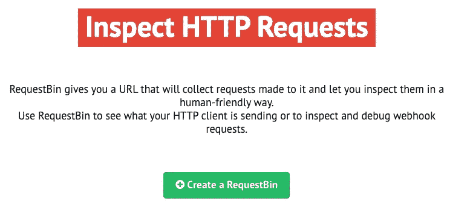
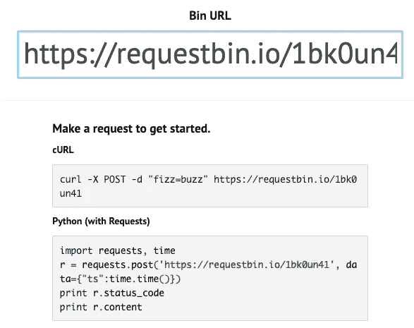
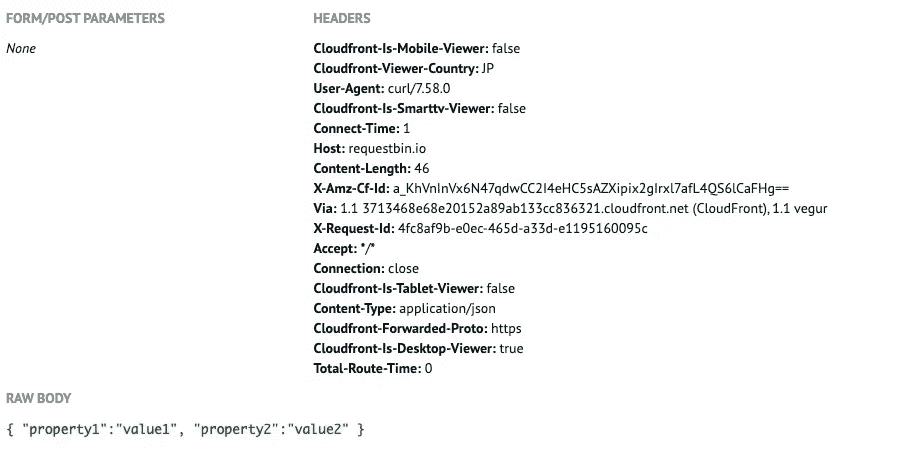
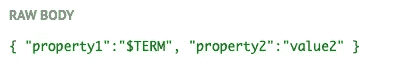
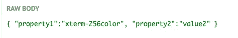
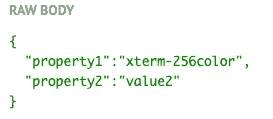

# 在 JSON 中为 cURL POST 传递环境变量的正确方法

> 原文：<https://towardsdatascience.com/proper-ways-to-pass-environment-variables-in-json-for-curl-post-f797d2698bf3?source=collection_archive---------3----------------------->

## 测试基于机器学习 API 的服务请求的最佳实践


Photo by [Ousa Chea](https://unsplash.com/@cheaousa?utm_source=unsplash&utm_medium=referral&utm_content=creditCopyText) on [Unsplash](https://unsplash.com/s/photos/test?utm_source=unsplash&utm_medium=referral&utm_content=creditCopyText)

# TL；速度三角形定位法(dead reckoning)

最佳实践是使用数据生成函数。滚动到底部查看详细信息。

# 为请求测试设置一个模拟 API 服务器

当我们构建一个基于 API 的 web(前端和后端分离)时，我们通常希望看到 HTTP 客户端正在发送什么，或者检查和调试 webhook 请求。有两种方法:

*   自己搭建一个 API 服务器
*   使用假的模拟 API 服务器

在本文中，我们选择第二种方法，使用 [RequestBin](https://requestbin.io/) 。



用法超级简单。单击按钮后，模拟 API 服务器就准备好了。



运行以下命令发出 POST 请求:

```
$ curl -X POST https://requestbin.io/1bk0un41 -H "Content-Type: application/json" -d '{ "property1":"value1", "property2":"value2" }'
```

刷新网站并确认状态:



# 将变量传递给 curl 时的双引号问题

运行`printenv`将显示环境变量:

```
$ printenvLC_TERMINAL=iTerm2
COLORTERM=truecolor
TERM=xterm-256color
HOME=/Users/smap10
...
```

我们想用`TERM`变量替换`property1`的值:

```
$ curl -X POST https://requestbin.io/1bk0un41  -H "Content-Type: application/json" -d '{ "property1":**"$TERM"**, "property2":"value2" }'
```

但是似乎`TERM`没有被认为是一个环境变量。



# 传递环境变量的三种方法

## 1 在变量周围添加单引号和双引号

```
$ curl -X POST https://requestbin.io/1bk0un41  -H "Content-Type: application/json" -d '{ "property1":"'"$TERM"'", "property2":"value2" }'
```

我们可以看到我们想要的结果。



## 2 转义双引号

最外层使用双引号。并在 JSON 数据部分为每个双引号添加转义标记。

```
$ curl -X POST https://requestbin.io/1bk0un41 -H "Content-Type: application/json" -d "{ \"property1\":\"$TERM\", \"property2\":\"value2\" }"
```

## 3 使用数据生成功能

这种方法可以让我们从所有关于 shell 引用的麻烦中解脱出来，并且更容易阅读和维护。

```
generate_post_data()
{
  cat <<EOF
{
  "property1":"$TERM", 
  "property2":"value2"
}
EOF
}
```

给 curl 添加函数:

```
$ curl -X POST https://requestbin.io/1bk0un41 -H "Content-Type: application/json" -d "$(generate_post_data)"
```



> ***查看我的其他帖子*** [***中等***](https://medium.com/@bramblexu) ***同*** [***分类查看***](https://bramblexu.com/posts/eb7bd472/) ***！
> GitHub:***[***荆棘徐***](https://github.com/BrambleXu) ***领英:*** [***徐亮***](https://www.linkedin.com/in/xu-liang-99356891/) ***博客:***[](https://bramblexu.com)

# *参考*

*   *[理解和使用 REST API](https://www.smashingmagazine.com/2018/01/understanding-using-rest-api/)*
*   *[如何在 bash line CURL 中包含环境变量？](https://superuser.com/a/835589)*
*   *[使用 curl POST 和 bash 脚本函数中定义的变量](https://stackoverflow.com/questions/17029902/using-curl-post-with-variables-defined-in-bash-script-functions)*