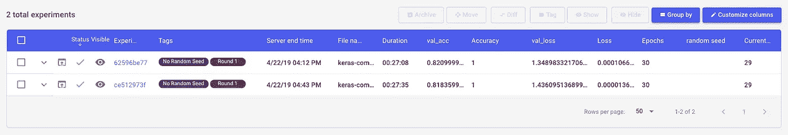

# 机器学习实验中随机种子的合理设置

> 原文：<https://towardsdatascience.com/properly-setting-the-random-seed-in-machine-learning-experiments-7da298d1320b?source=collection_archive---------18----------------------->

## 你能在机器学习实验中利用随机性，同时仍然获得可重复的结果吗？

[机器学习](https://opendatascience.com/machine-learning-guide-20-free-odsc-resources-to-learn-machine-learning/)模型以显而易见和意想不到的方式利用随机性。**在概念层面**，这种不确定性可能会影响你的模型的收敛速度、结果的稳定性以及网络的最终质量。

**在实际层面上**，这意味着你可能很难为你的模型重复运行相同的结果——即使你对相同的训练数据运行相同的脚本。这也可能导致在确定性能变化是由于实际模型或数据修改，还是仅仅是新的随机样本的结果方面的挑战。

为了解决这些变异的来源，一个关键的起点是**全面了解数据、模型代码和参数，以及导致特定结果的环境细节**。这种水平的再现性将减少您运行中的意外变化，并帮助您[调试机器学习实验](/checklist-for-debugging-neural-networks-d8b2a9434f21)。

在这篇文章中，我们探索了机器学习中出现随机性的领域，以及如何通过使用 [Comet.ml](http://bit.ly/2JxjXN4) 的示例仔细设置随机种子来实现可重复、确定性和更一般化的结果。

# 随机性为什么重要？

很明显，机器学习中的[再现性](https://www.comet.ml/about)很重要，但是我们如何平衡这一点和随机性的需要呢？随机性既有实际的好处，也有迫使我们使用随机性的约束。

实际上，内存和时间的限制也迫使我们“依赖”随机性。[梯度下降](http://cs231n.github.io/neural-networks-3/)是用于训练机器学习模型的最流行和最广泛使用的算法之一，然而，基于整个数据集计算梯度步长对于大型数据集和模型是不可行的。随机梯度下降(SGD)仅使用从训练集中随机选取的一个或一小批*训练样本在特定迭代中对参数进行更新。*

*虽然 SGD 可能导致梯度估计中的噪声误差，但这种噪声实际上可以鼓励勘探更容易地避开浅层局部极小值。你可以用[模拟退火](https://iamaaditya.github.io/2012/10/why-simulated-annealing-works/)更进一步，这是 SGD 的扩展，模型有目的地采取随机步骤以寻求更好的状态。*

**

*Escaping shallow local minima encountered earlier on using stochastic gradient descent (SGD). Image source here*

*随机性还可以通过一种叫做[引导聚合](https://en.wikipedia.org/wiki/Bootstrap_aggregating) (bagging)的技术帮助你从更小的数据集获得更多的里程。最常见于随机森林，bagging 在重叠的随机选择的数据子集上训练多个模型*

# *随机性出现在哪里？*

*既然我们理解了随机性在机器学习中的重要作用，我们就可以深入研究引入随机性的特定任务、功能和建模决策。*

*以下是机器学习工作流程中出现随机性的一些重要部分:*

***1。数据准备**-在神经网络的情况下，混洗的批次将导致不同运行的损失值。这意味着您的梯度值在运行中会有所不同，并且您可能会收敛到不同的局部最小值。对于特定类型的数据，如时间序列、音频或文本数据，以及特定类型的模型，如 LSTMs 和 RNNs，您的数据的输入顺序会极大地影响模型性能。*

***2。数据预处理** — [对数据](https://chrisalbon.com/machine_learning/preprocessing_structured_data/handling_imbalanced_classes_with_upsampling/)进行过采样或上采样，以解决类别不平衡问题，这包括从具有替换的少数类别中随机选择一个观察值。向上采样会导致过度拟合，因为您会多次显示同一示例的模型。*

***3。交叉验证**—[K-fold 和留一个交叉验证(LOOCV)](/train-test-split-and-cross-validation-in-python-80b61beca4b6) 都涉及随机分割数据，以便[评估模型的泛化性能](https://medium.com/comet-ml/building-reliable-machine-learning-models-with-cross-validation-20b2c3e32f3e)*

***4。权重初始化** —机器学习模型的初始权重值通常被设置为小的随机数(通常在[-1，1]或[0，1]的范围内)。深度学习框架提供了多种初始化方法，从用零初始化到从正态分布初始化(参见[Keras initializer 文档](https://keras.io/initializers/)作为例子加上[这个优秀的资源](https://intoli.com/blog/neural-network-initialization/))。*

***5。网络中的隐藏层** — [丢弃层](https://medium.com/@amarbudhiraja/https-medium-com-amarbudhiraja-learning-less-to-learn-better-dropout-in-deep-machine-learning-74334da4bfc5)将在特定的向前或向后传递期间随机忽略节点的子集(每个节点都有被丢弃的概率，1- *p* )。即使使用相同的输入，这也会导致层激活的差异。*

***6。算法本身**——一些模型，如随机森林，自然依赖于随机性，而另一些则使用随机性作为探索空间的一种方式。*

# *实现再现性*

*这些因素都会导致运行之间的差异，即使您使用相同的模型代码和训练数据，也很难再现。控制实验过程中的不确定性和可见性是至关重要的。*

***好消息是，通过仔细设置管道中的随机种子，您可以实现可重复性。**“种子”是序列的起点，其保证是，如果您从同一种子开始，您将获得相同的数字序列。**也就是说，您还想跨不同的种子值来测试您的实验。***

*我们建议采取几个步骤来实现这两个目标:*

*1.使用一个实验追踪系统，比如 [Comet.ml](http://bit.ly/2JxjXN4) 。假设随机性在实验中是一种可取的属性，那么您只是希望能够尽可能地再现随机性。*

*2.定义一个包含静态随机种子的变量，并在整个管道中使用它:*

```
*seed_value = 12321 # some number that you manually pick*
```

*3.向你的实验追踪系统报告这个数字。*

```
*experiment = Experiment(project_name="Classification model") experiment.log_other("random seed",seed_value)*
```

*4.仔细地为所有框架设置种子变量:*

```
*# Set a seed value: 
seed_value= 12321 # 1\. Set `PYTHONHASHSEED` environment variable at a fixed value: import os os.environ['PYTHONHASHSEED']=str(seed_value) # 2\. Set `python` built-in pseudo-random generator at a fixed value: import random random.seed(seed_value) # 3\. Set `numpy` pseudo-random generator at a fixed value:
import numpy as np np.random.seed(seed_value) # 4\. Set `tensorflow` pseudo-random generator at a fixed value: import tensorflow as tf tf.set_random_seed(seed_value)# 5\. For layers that introduce randomness like dropout, make sure to set seed values:
model.add(Dropout(0.25, seed=seed_value))#6 Configure a new global `tensorflow` session: from keras import backend as K 
session_conf = tf.ConfigProto(intra_op_parallelism_threads=1, inter_op_parallelism_threads=1) 
sess = tf.Session(graph=tf.get_default_graph(), config=session_conf)
K.set_session(sess)*
```

*采取这些战术措施会让你在一定程度上实现可重复性，但是为了全面了解你的实验，你需要对你的实验进行更详细的记录。*

*正如 Matthew Rahtz 在他的博客文章'[中描述的，经验教训再现深度强化学习论文](http://amid.fish/reproducing-deep-rl):*

> *当每一个进程花费的时间少于几个小时时，没有日志的工作是很好的，但是如果超过这个时间，你很容易忘记你到目前为止所做的努力，最终只是在原地打转。*

*[**Comet.ml**](http://bit.ly/2JxjXN4) **帮助您的团队自动跟踪数据集、代码变更、实验历史和生产模型，从而提高效率、透明度和重现性。***

# *浏览一个例子*

*我们可以用 Comet.ml 测试种子，使用这个例子[和 Keras CNN LSTM 对来自 IMDB 数据集的评论进行分类。如果你现在想看完整的实验列表，](https://github.com/comet-ml/comet-examples/blob/master/keras/comet-keras-cnn-lstm-example.py)[点击这里](https://www.comet.ml/ceceshao1/determinism)。*

***第一轮:**在同一台机器上使用相同的模型`py`文件和相同的 IMDB 训练数据，我们运行我们的前两个实验，并获得两个不同的验证准确度(0.82099 对 0.81835)和验证损失值(1.34898 对 1.43609)。*

**

*The Comet.ml Experiment Table gives you an organized view of your experiment’s metrics, parameters, and more. See the full example project [here](https://www.comet.ml/ceceshao1/determinism)*

***第二轮:**这一次，我们为数据集训练/测试分割设置种子值*

```
*(x_train, y_train), (x_test, y_test) = imdb.load_data( num_words=max_features, skip_top=50, seed=seed_value)*
```

*即使我们的验证准确度值更接近，两个实验之间仍有一些差异(参见下表中的`val_acc`和`val_loss`列)*

**

***第三轮:**除了为数据集训练/测试分割设置种子值之外，我们还将为我们在步骤 3 中记录的所有区域添加种子变量(如上所述，但为了方便起见在此复制)。*

```
*# Set seed value seed_value = 56 
import os os.environ['PYTHONHASHSEED']=str(seed_value) # 2\. Set `python` built-in pseudo-random generator at a fixed value import random random.seed(seed_value) # 3\. Set `numpy` pseudo-random generator at a fixed value 
import numpy as np np.random.seed(seed_value) from comet_ml import Experiment # 4\. Set `tensorflow` pseudo-random generator at a fixed value import tensorflow as tf tf.set_random_seed(seed_value) # 5\. Configure a new global `tensorflow` session 
from keras import backend as K 
session_conf = tf.ConfigProto(intra_op_parallelism_threads=1, inter_op_parallelism_threads=1) 
sess = tf.Session(graph=tf.get_default_graph(), config=session_conf)
K.set_session(sess)*
```

*现在我们已经添加了种子变量并配置了一个新的会话，我们的实验结果终于可以一致地重现了！*

**

*使用 Comet.ml，您可以随着训练的进行，对几次跑步进行可视化的实时比较:*

**

*Comet.ml 帮助您挖掘可能导致观察到的性能变化的参数、种子或数据的差异。*

*您可以在下面看到我们第 3 轮的一个实验如何指定了`random seed`值，而我们第 1 轮的一个实验却没有指定。根据您的需要，将像`random seed`这样的信息记录到 Comet 是灵活的。*

**

*您甚至可以检查两个实验之间的代码差异，并查看我们在第 3 轮实验中设置`seed_value`的不同区域:*

**

*使用 Comet.ml 正确跟踪这些实验的细节后，您可以开始测试不同的种子值，以查看这些性能指标是否特定于某个种子值，或者您的模型是否真正具有普遍性。*

**

*Never fear cells being run out of order or duplicating work again. See our notebook examples [here](https://github.com/comet-ml/comet-examples/tree/master/notebooks)*

*现在你知道如何在你的机器学习实验中通过设置种子来拥抱和控制随机性了！*

## *如果您有兴趣了解 Comet 如何帮助您的数据科学团队提高工作效率，[请点击这里](http://bit.ly/2JxjXN4)了解更多信息。*