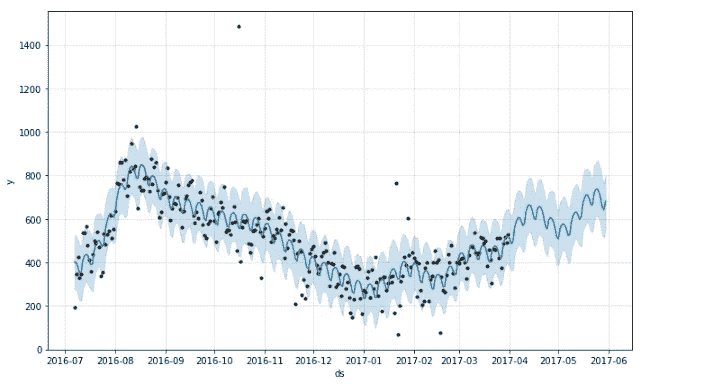

# 可预测的预测

> 原文：<https://towardsdatascience.com/prophet-able-forecasting-5abf837ace3b?source=collection_archive---------17----------------------->

## 脸书开源时间序列预测库`Prophet`入门(Python 语言)


Photo by [Isaac Smith](https://unsplash.com/@isaacmsmith) on [Unsplash](https://unsplash.com/)

如果你谷歌一下“*时间序列预测*，你会得到的第一个[搜索结果](https://www.google.com/search?q=time+series+forecasting&rlz=1C5CHFA_enUS805US805&oq=time+&aqs=chrome.0.69i59l2j69i57j69i60l3.869j0j1&sourceid=chrome&ie=UTF-8)大部分会涉及[自回归综合移动平均](https://en.wikipedia.org/wiki/Autoregressive_integrated_moving_average)建模(ARIMA)或者[指数平滑](https://machinelearningmastery.com/exponential-smoothing-for-time-series-forecasting-in-python/) (ETS)。而且理由很充分！在 R 和 Python 中，都有一些流行的方法可以用来应用这些时间序列预测方法。我开始尝试的第一批预测工具之一是 R 的`forecast`包中的 ARIMA 和 ETS 模型，由有影响力的 [Rob Hyndman](https://otexts.com/fpp2/) 领导。

在`[forecast](http://pkg.robjhyndman.com/forecast/)`最神奇的选择之一就是使用`[auto.arima](https://www.rdocumentation.org/packages/forecast/versions/8.7/topics/auto.arima)`。名字说明了一切；它将根据选定的信息标准( [AIC、BIC 或 AICc](http://www.koenbro.com/information-criteria-aic-aicc-bic/) )来“自动”确定一个最适合的 ARIMA 模型。时间序列预测变得简单！

但是现在，我更喜欢使用 Python。通过另一个快速的谷歌搜索，我发现了一个[潜在的 Python 类似物](https://www.alkaline-ml.com/pmdarima/)。但是对于这篇文章，我想花点时间去了解另一个预测 Python 库:Prophet。

## 什么是先知？

Prophet 于 2017 年推出，是由脸书开发的预测库，用 R 和 Python 实现。它的开发有两个目标:第一，为业务创建可扩展的高质量预测，第二，在幕后有一个严格的方法，但其参数杠杆足够直观，便于传统业务分析师进行调整。

在这篇文章中，我们将做一个*轻快的*意识流式的**快速入门教程:**

*   在 Python 中安装
*   设置数据
*   拟合模型和预测
*   检查结果

我们开始吧！

## 1.在 Python 中安装

如果下面的一些对你来说有点简单，我只是简单地按照 Prophet 的[安装指南](https://facebook.github.io/prophet/docs/installation.html)上的指示做了。另外，我用的是 Mac，所以如果你用的是 Windows，就用下面的 YMMV。

我去了该项目的 [github.io 站点](https://facebook.github.io/prophet/docs/installation.html)上的安装页面，并按照 Python 的指示进行了操作。如前所述，这个库主要依赖于`pystan`。在我的第一次尝试中，我实际上*错过了*在 pip 安装`fbprophet`(Python 库的实际名称)之前先对`pip install pystan` **说**的部分。当然，我反其道而行之，事情并不愉快。

但是:

我也在 Python 的 Anaconda 发行版上，所以我最终能够通过简单地遵循 **Anaconda 指令:**来让一切正常工作

在终端中:

`conda install gcc`

…然后按照提示进行操作。

一旦完成，执行以下操作:
`install -c conda-forge fbprophet`

唷！好险。我担心这篇文章会就此结束。

## 2.设置数据

项目网站还提供了一个非常清晰的[快速启动](https://facebook.github.io/prophet/docs/quick_start.html#python-api),我通过它进行了嗅测，以确定一切工作正常。亲爱的读者，我将让你来做同样的事情，并高度鼓励它。一个人永远无法获得足够的重复次数。不过，我**将**浏览的是我选择的另一个数据集，以开始习惯这个 API。

## 案例研究:查看自行车共享出行

对于第一个数据集，我们正在查看洛杉矶自行车共享出行的数据集。我从 Kaggle 上拉下了一个`.csv`。不要告诉任何人，但我相信我是第一个想到这一点的人。开个玩笑！不过说真的，我很想刮点东西，但是时间不够了。就这样吧。

你可以在这里找到数据[。](https://www.kaggle.com/cityofLA/los-angeles-metro-bike-share-trip-data/downloads/los-angeles-metro-bike-share-trip-data.zip/26)

如果您安装了 [Kaggle API](https://github.com/Kaggle/kaggle-api) ，您可以通过复制 API 命令直接下载到您选择的文件夹:


Anyone know how to resize this?

然后粘贴到终端中运行，像这样:
`kaggle datasets download -d cityofLA/los-angeles-metro-bike-share-trip-data`

另一个 YMMV 类型的拦截器:当我试图解压下载的文件时，我遇到了权限问题。但是我通过
`chmod 600 los-angeles-metro-bike-share-trip-data.zip`解决了

..这给了我对文件的完全读/写权限。然后我就可以解压了:
`unzip los-angeles-metro-bike-share-trip-data.zip`

好吧！让我们设置运行`Prophet`对象的数据帧。请注意，模型需要非常具体的列名和类型；引用一下:

> Prophet 的输入总是一个包含两列的 data frame:`*ds*`和`*y*`。`*ds*` (datestamp)列应该是 Pandas 所期望的格式，理想情况下，日期应该是 YYYY-MM-DD，时间戳应该是 YYYY-MM-DD HH:MM:SS。`*y*`列必须是数字，代表我们希望预测的测量值。

完整的 [Jupyter 笔记本](https://github.com/MangrobanGit/blog_tutorial_1/blob/master/blog_tutorial.ipynb)中的所有代码都可以在[这个 GitHub 资源库](https://github.com/MangrobanGit/blog_tutorial_1)中获得(包括我所有的错误开始！)但清理后的版本如下:

```
import pandas as pd          # Dataframes. 
import plotly_express as px  # Plotting.# Get dataset
bikes = pd.read_csv('./data/metro-bike-share-trip-data.csv')# Start time is string, convert to data
bikes['ds'] = pd.to_datetime(
                 bikes['Start Time'].apply(lambda st : st[:10])
                                           , format='%Y-%m-%d')# Aggregate by trip start date
trips = bikes.groupby(['ds']).agg(
                                 {'Trip ID': 'count'}).reset_index()# Rename columns
trips.columns = ['ds', 'y'] # Column names required by fbprophet API# Plot: reasonability check 
px.scatter(trips
          ,x='ds'
          ,y='y'
          ,title='LA Daily Bike Share Trips - Jul 16 to Apr 17'
          ,labels={'y':'Trips','ds':'Day'})
```


Is that Plotly Express’ music I hear? [Shameless, shameless plug](/plotly-express-yourself-98366e35ad0f).

## 3.拟合模型和预测

接下来，我们将运行一个运行预测的示例:

*   拟合模型
*   根据我们的模型预测

首先，让我们实例化我们的模型，并使其适合我们的数据集:

```
from fbprophet import Prophet     #Importing here for visibility# Create Prophet object and fit
m_bikes = Prophet(yearly_seasonality=True
                 , weekly_seasonality=True)               #All defaults
m_bikes.fit(trips)
```

对象`Prophet`有许多参数，可以设置这些参数来调整模型。例如，`daily_seasonality`、`weekly_seasonality`和`yearly_seasonality`等季节性设置只是可以调整的部分选项。例如，我认为自行车共享租赁可能会有一些每周和/或每年的模式。为了好玩，让我们看看如果我们将`weekly_seasonality`和`yearly_seasonality`设置为`True`会发生什么。

接下来，我们可以使用该模型进行预测。`Prophet`对象有一个名为`make_future_dataframe`的简便方法，可以创建一个具有指定数量的未来日期的 dataframe，这些日期与训练数据相关(天数是默认的`periods`)。例如，下面我们加上训练数据最后一天后的 60 天。

```
# Create dataframe with appended future dates
future = m_bikes.make_future_dataframe(periods=60) #Days is default
future.tail()
```


一旦建立了数据框架，我们就可以在“测试”集上运行预测:

```
# Forecast on future dates 
forecast = m_bikes.predict(future)# Look at prediction and prediction interval
forecast[['ds', 'yhat', 'yhat_lower', 'yhat_upper']].tail()
```


## 4.检查结果

通过查看我们创建的`forecast`数据框架的`tail`，我们已经得到了预测的预览。让我们把它形象化，以获得更大的画面。

恰好我们的`Prophet`对象也包含了一个`plot`方法来实现这一点！以下是拟合/预测(直线( *y_hat* )和阴影区域(*预测区间*))与实际值(散点图)的关系图:

```
# Plot the forecast vs actuals
m_bikes.plot(forecast)
```



Not bad. Could potentially use some more data cleaning (outliers?) and parameter tuning.

此外，还有预测组件的图表！例如，由于我们明确地将`weekly_seasonality`和`yearly_seasonality`设置为`True`，将会有专门针对它们的组件图:


Wooh! There’s nothin’ like summer in the city.

我们肯定可以使用更多的历史数据，但如果我们从表面上看这些图，似乎在夏末旅行有一个高峰，然后在秋季逐渐下降。此外，在一周中，高峰骑行似乎发生在工作日的中后期。如果这些是西雅图自行车股，那可能不会完全通过我的轶事观察的嗅觉测试，但嘿，洛杉矶可能是一个完全不同的市场。关键是我们能够在短时间内做出一些不错的预测！

## 如此之多…

如果我们有更多的时间深入研究，我们可以开始查看上述参数，以进一步调整预测。这些不仅包括不同时期的季节性，还包括特定的假日效应，为趋势提供特定的变化点(例如，你没有一个完美的线性基线趋势，如上例所示)，说明饱和点，等等。同样，详细信息可以在[文档](https://facebook.github.io/prophet/docs/installation.html)中找到，我强烈建议阅读[白皮书](https://peerj.com/preprints/3190/)以更深入地了解底层方法。

这就是我们所有的时间，我希望这是有用的。感谢阅读！

工作文件[此处](https://github.com/MangrobanGit/blog_tutorial_1)。

请随时伸出援手！|[LinkedIn](https://www.linkedin.com/in/werlindo/)|[GitHub](https://github.com/MangrobanGit)

**来源:**

[https://facebook.github.io/prophet/](https://facebook.github.io/prophet/)

泰勒 SJ，勒撒姆 B. 2017。大规模预测。 *PeerJ 预印本*5:e 3190v 2[https://doi.org/10.7287/peerj.preprints.3190v2](https://doi.org/10.7287/peerj.preprints.3190v2)