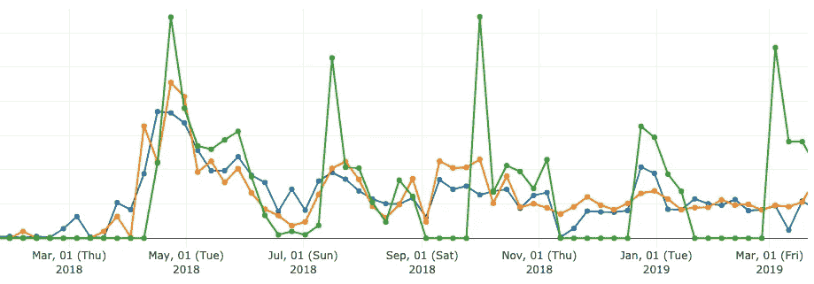
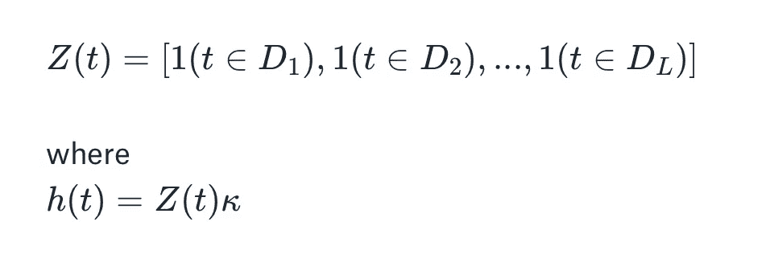
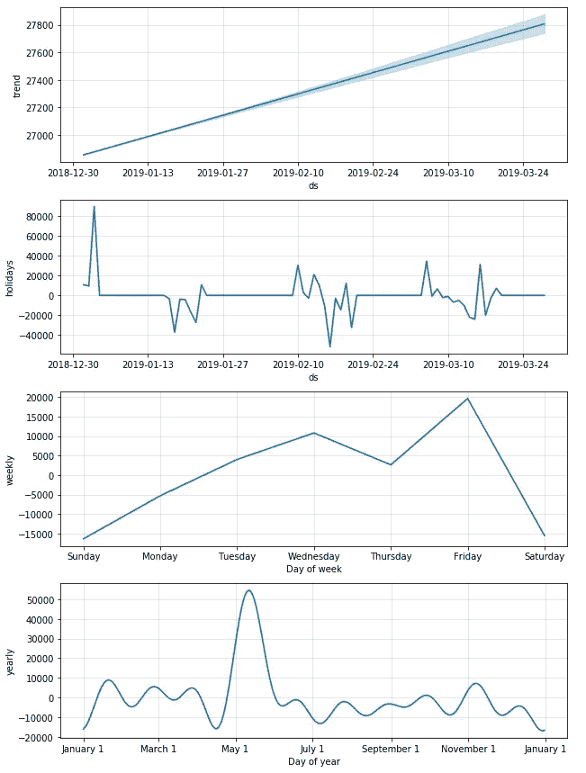
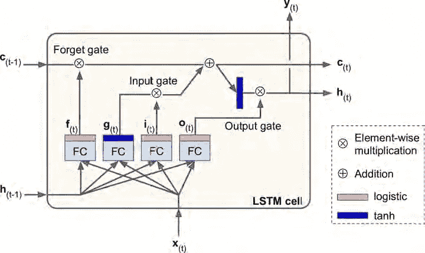
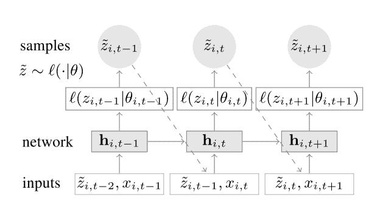
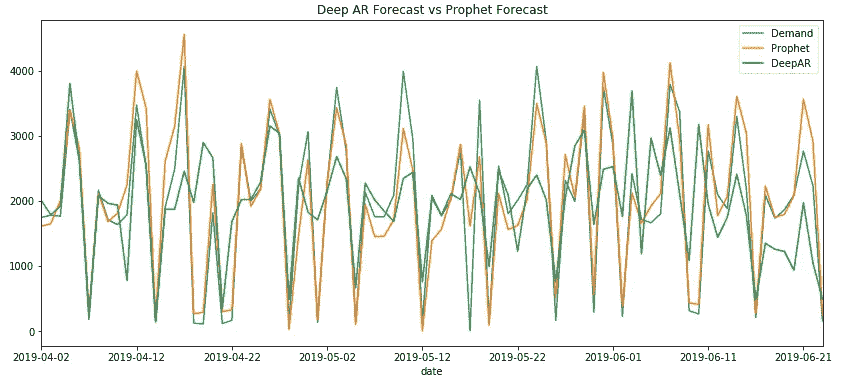
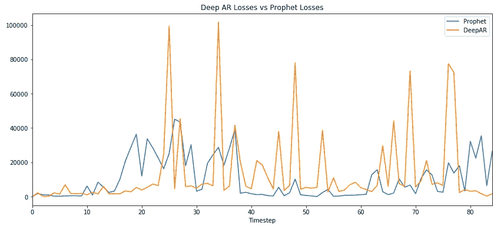
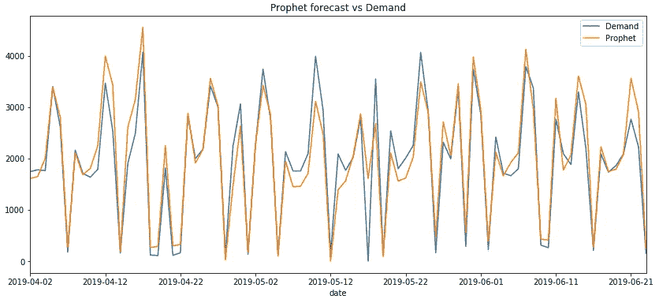

# 先知 vs DeepAR:预测粮食需求

> 原文：<https://towardsdatascience.com/prophet-vs-deepar-forecasting-food-demand-2fdebfb8d282?source=collection_archive---------2----------------------->

*与* [合作*克里斯蒂安·阿尔比·斯瓦莱森*合作](https://medium.com/u/d3aeda500a4a?source=post_page-----2fdebfb8d282--------------------------------)

全球食品行业面临着巨大的可持续性挑战，联合国估计“每年大约有三分之一的全球食品生产被浪费或损失”。关于[66%的损失](https://www.ers.usda.gov/webdocs/publications/43833/43680_eib121.pdf)发生在新鲜度是消费重要标准的食物群体。此外，由于过量订购和库存过多，经常会发生变质，在大多数情况下，这是预测困难的结果。随着人们向供应链上游移动，远离消费者购买行为，这一问题被放大，这种现象被称为[牛鞭效应](https://hbr.org/product/bullwhip-effect-in-supply-chains/SMR029-PDF-ENG)，导致更高的不准确性并加剧浪费问题。

到目前为止，市场上的大多数(如果不是全部)预测解决方案都是基于传统的几十年前的方法，如 ARIMA 和指数平滑法。虽然这些方法产生稳定的预测，但它们难以预测时间序列的快速变化，特别是当这些变化是由于多重季节性或移动假期引起的。

然而，随着机器学习的进步，在过去几年中开发了一些技术，使解决这些挑战变得更加容易。

[Crisp](https://www.gocrisp.com) 通过结合尖端的机器学习技术和一种新的方法来模拟经济损失和库存新鲜度，为食品行业提供全面和全自动的预测解决方案。

在本帖中，我们将考察两个预测模型:脸书预言家和亚马逊预测的 DeepAR。我们发现这些方法很有前景，因为亚马逊研究声称，与当前最先进的方法相比，DeepAR 的预测性能提高了约 15%，而 Prophet 允许快速和非常灵活的建模体验。

**脸书先知**

[脸书预言家](https://peerj.com/preprints/3190.pdf)模型是多种函数的组合，如趋势、多个季节、假期和用户输入的用黄土估算的回归量。因此，它在概念上类似于一个[广义加法模型](https://projecteuclid.org/download/pdf_1/euclid.ss/1177013604)。

以下是 Prophet 的通用公式，显示了所有不同的组件:

*趋势:*

趋势分量可以是时间的线性或逻辑函数。为了模拟趋势中的非周期性变化，术语 *a(t)^T* ，即*变点*被引入到等式中，以允许增长因子的变化。逻辑函数引入了术语 *C(t)* 来防止趋势的无限增长或负增长。

*季节性:*

多个季节性可以用具有平滑先验和低通滤波器的傅立叶级数来建模。在 Prophet 中，这由下面的公式表示。项数(N)越高，过度拟合的风险就越高。

*节假日和活动:*

假期被建模为独立的虚拟外部回归变量，允许包含假期前后的一段时间来模拟其影响。

所有模型组件参数的先验来自正态分布，具有超参数化的标准偏差，以允许其灵活性。

赞成的意见

*   能够轻松模拟任意数量的季节性
*   能够处理时间序列中缺失的日期
*   轻松地将假期集成到模型中
*   具有完全贝叶斯采样的内置不确定性建模允许模型透明
*   允许使用用户指定的变化点进行灵活的逐步线性或逻辑趋势建模

骗局

*   在少量观察的情况下可能是不稳定的
*   长期预测可能会随着自动变点选择而波动

**亚马逊的 DeepAR**

亚马逊研究院开发的 [DeepAR 算法](https://arxiv.org/pdf/1704.04110.pdf)(或演化版本 DeepAR+，为简单起见，在本文中简称为 DeepAR)为概率预测问题量身定制了一个类似的基于 LSTM 的递归神经网络架构。[长短期记忆(LSTM)](https://arxiv.org/pdf/1308.0850.pdf) 众所周知，它能够学习序列中项目之间的依赖关系，这使它适用于时间序列预测问题。它实现了一系列的门，其中的信息要么被传递，要么被遗忘。它不仅仅传递隐藏状态 *h* ，还传递长期状态 *c* 。这使得它能够学习短期和长期的时间序列模式。

[DeepAR](https://arxiv.org/pdf/1704.04110.pdf) 模型在一个架构中实现了这样的 LSTM 单元，该架构允许同时训练许多相关的时间序列，并实现了序列到序列模型中常见的编码器-解码器设置。这需要首先在整个调节数据范围上训练编码器网络，然后输出初始状态 *h* 。该状态然后被用于通过解码器网络将关于调节范围的信息传送到预测范围。在 DeepAR 模型中，编码器和解码器网络具有相同的架构。

DeepAR 模型还采用了一组协变量 *X* ，它们是与目标时间序列相关的时间序列。此外，向模型提供了一个分类变量，用作相关时间序列分组的信息。模型训练一个嵌入向量，该向量学习组中所有时间序列的共同属性。该模型的另一个特性是，DeepAR 根据目标时间序列的粒度自动创建额外的特性时间序列。例如，这些可以是为“一个月中的某一天”或“一年中的某一天”创建的时间序列，并允许模型学习与时间相关的模式。

DeepAR 接口期望设置[相当数量的超参数](https://docs.aws.amazon.com/sagemaker/latest/dg/deepar_hyperparameters.html)，包括用于训练的上下文长度、时期数、辍学率和学习率等。

**利弊**

DeepAR 具有同时训练数百或数千个时间序列的优势，潜在地提供了显著的模型可伸缩性。它还具有以下技术优势:

*   最小特征工程:该模型需要最小特征工程，因为它学习跨时间序列的给定协变量的季节性行为。
*   蒙特卡罗抽样:由于 DeepAR 实现了蒙特卡罗抽样，因此还可以计算函数子范围的一致分位数估计。例如，在决定安全库存时，这可能很有用。
*   内置项目替代:它可以通过学习相似的项目来预测历史项目很少的项目
*   各种似然函数:DeepAR 不假设高斯噪声，并且似然函数可以适应数据的统计属性，允许数据的灵活性。

# 模型评估

数据科学中的常见做法是使用[统计度量](https://otexts.com/fpp3/accuracy.html)来促进模型选择和调整，以获得理想的模型预测精度。然而，这些方法无法捕捉预测误差的实际业务影响。我们开发了一种自定义的方法来量化这些误差，区分由于过度预测和预测不足造成的误差。我们开发评估的方法将在以后的文章中解释，但该方法允许我们评估两个模型，看它们是否在重要的时候抓住了每日趋势(例如新鲜产品)，或者表现得更接近平均准确度，适合这种情况的产品(例如干燥食品)。

为了进行模型比较，我们使用了 1000 种食品零售产品的时间序列，范围从 3 个月到 3 年的数据。在 DeepAR 的例子中，数据包括假日数据以及零售产品类别的产品分组。我们将历元的数量设置为 500，上下文长度和预测长度为 90 天，同时保留所有其他超参数的默认值。在 Prophet 的例子中，一个模型被训练用于每个独立的时间序列，包括假期。所用的超参数针对最受欢迎的食品项目，包括倍增的每周季节性、累加的年度季节性和两个季节性先前分布的高方差。

使用扩展窗口交叉验证方法，以 7 天的时间跨度和 12 个原点的移动原点以及 7 天的步长，DeepAR 的几乎大多数产品的 MAPE 都显著高于 Prophet。但是，这不是一个稳定的指标，尤其是一些产品的条目为零或接近零，因此我们直观地研究了时间图，以比较两种预测。我们的自定义指标还显示，DeepAR 的预测误差会导致比 Prophet 更高的业务成本。

*   *预言者预测总损失:890，013.29 台*
*   *DeepAR 预测总损失:1502708.56 台*
*   先知的损失比 DeepAR 高 41%。

下面是两个时间图，比较了 DeepAR 预测的最佳性能产品的实际信号和预测信号:

在对结果进行视觉分析时，很明显 DeepAR 在拾取一些高低点的强度时遇到了问题，同时错过了信号中的一些下降点。Prophet 通常更灵活，具有更好的性能，并且能够匹配实际需求的变化幅度。对 DeepAR 性能的一个可能的解释是需要更好的分组。类别分组包括具有非常不同需求特征的产品，因此，该模型可能受益于通过分析推断产品需求而不是通过零售类别(例如乳制品)设定的分组。虽然超出了我们当前研究的范围，但未来的实验应该检查 DeepAR 的性能是否会随着通过聚类方法或频谱分析对产品进行分组而提高。

我们得出结论，Prophet 在本次预测练习中胜出，原因如下:

*   更好地预测食品需求模式
*   模型的灵活性和设置的简易性
*   不需要大量的产品来达到良好的性能
*   不需要产品分组
*   允许部署到任何云平台