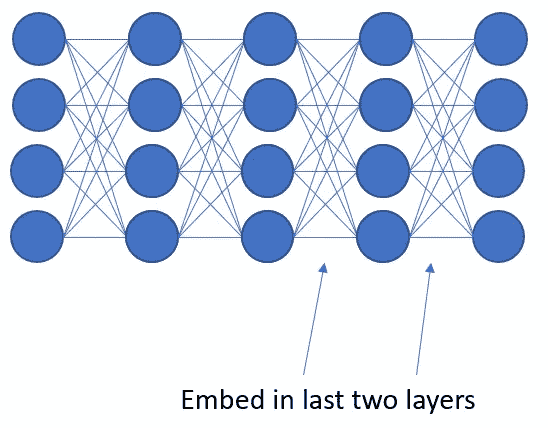
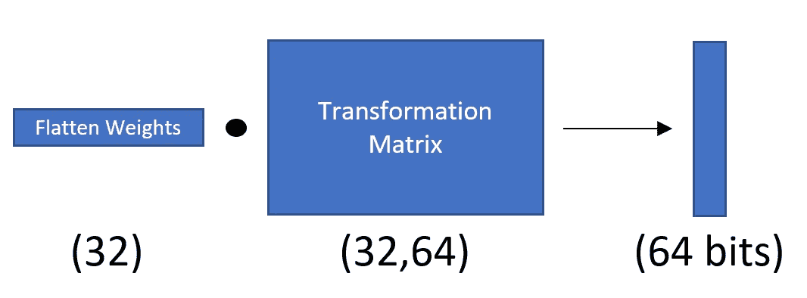
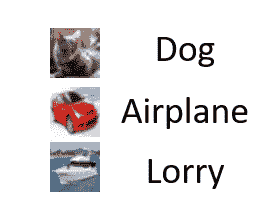
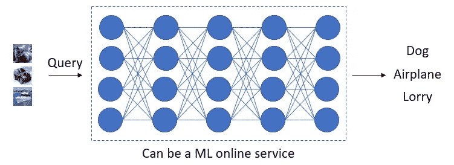

# 通过嵌入水印来保护您的深层神经网络！

> 原文：<https://towardsdatascience.com/protect-your-deep-neural-network-by-embedding-watermarks-ed4898ec4ad7?source=collection_archive---------22----------------------->

我们对图像、音乐等媒体内容进行知识产权(IP)保护**水印**。深度神经网络(DNN)怎么样？

# 什么是水印？

水印就像是赋予你的媒体内容的一个身份，例如，你画一个免费的内容并上传到一个媒体平台，你将在内容上签名或者只是在内容上放一些标志。这是为了确认内容是你制作的，使用你内容的人应该付给你一些钱。

我们可以把同样的方法应用到 DNN，因为 DNN 的发展每年都在进步，很多公司开始在他们的业务中使用 DNN。

# 为什么我们需要在 DNN 上嵌入水印？

假设你已经投入了大量资源(例如时间、GPU)来创建强大的模型，然后你将它发布到你的 github 库，但是现在一些坏人未经你同意就拿着你的模型做生意，你发现坏人使用了你的模型，但是你没有证据，因为模型上没有水印。就像免费内容如何在网上分享一样，不是所有人都给学分:(

还记得三星赔偿苹果侵犯设计专利吗？同一案件可以申请某公司(如 A 公司)起诉其他公司使用 A 公司发布(甚至窃取)的 DNN 而不支付版权费。

接下来，我们将讨论通过嵌入水印来保护 DNN 的常用方法。

# 白盒方法

有很多方法使用白盒方法，我将谈论最简单的方法，而其他方法是类似的过程，只是不同的嵌入方式。

## 白盒嵌入

为了通过嵌入水印来保护 DNN 模型，在由[1]建议的方法中，他们使用变换矩阵来执行水印嵌入。

在训练阶段，模型是在原始分类任务上进行训练，然而，模型还有一个目标，即**嵌入水印**。

作者首先选择 DNN 中的哪一层来嵌入期望的水印(例如二进制数据)

然后，所选层中的**权重**将与变换矩阵进行矩阵乘法，以获得所需的信息位数，例如 64 位。

dot between weights and transformation matrix

在对原始任务(即分类)进行训练时，权重和变换矩阵都将通过作者设计的损失函数(即正确嵌入 64 位信息的损失函数)来更新

## 白盒检测

对于大公司来说，他们可能会从各个地方收集证据，这样他们就可以起诉涉嫌非法使用他们 DNN 模型的公司。一旦他们有证据，他们将需要有一个验证过程，即从 DNN 模型中提取水印，并比较水印是否来自大公司。

他们基本上是在做同样的事情来提取他们在训练中所做的水印。再次执行平坦化权重和变换矩阵之间的点运算，然后提取水印。

然而，这个过程是一个白盒验证，这意味着**他们需要物理访问模型**，通常可能需要通过执法部门。

# 黑箱方法

在阅读了一些研究论文[2，3，4]后，我意识到所有论文中的黑盒方法都是相似的。我要讲的例子来自[2]。

## 黑盒嵌入

在培训阶段，培训任务分为两部分:

1.  原始分类任务
2.  触发设置任务

什么是触发集任务？**这实际上是一份被故意贴错标签的数据清单。**

Example trigger set data wrongly labelled

错误标记的数据是一种水印，目的是让模型“记忆”准确的输入和标记，这种记忆形成了水印嵌入效果。**虽然它可能会影响模型的特征学习**，但是在【3】中有一些替代方案。

**错误标记的数据与原始数据集**结合，然后将经过原始训练目标(如交叉熵)

## 黑盒检测

这种水印嵌入方式在验证方面实际上优于白盒嵌入方式。这是因为您**可以将一个触发集数据列表作为查询**提交给机器学习在线服务**(例如，小偷偷了您的模型并创建了一个与您的相似的服务)**

a typical black-box verification

在通过 API 调用查询 ML 在线服务之后，您将得到预期的标签。如果预期标签与原始错误标签匹配，那么您可以确认该 ML 在线服务正在使用您的模型**，因为在您的触发集数据上不可能有精确匹配(或高精度)。**如果一个模特不是从你那偷来的，那么这个模特应该能把猫的形象归类为猫，而不是狗。

# 结论

我们需要保护我们的 DNN 模式，以防其他人窃取我们的信用而不付钱给我们！我们可以进行黑盒验证，以便对小偷有一个初步的嫌疑人，然后在我们向警方报告后，我们可以通过执法部门进行白盒验证。(虽然我认为这只是大公司之间的战争😅)

希望现在你对在 DNN 中嵌入水印有了更多的了解。感谢您的阅读！

# 参考

[1]将水印嵌入深度神经网络。[https://arxiv.org/abs/1701.04082](https://arxiv.org/abs/1701.04082)

[2]化弱为强:通过走后门给深度神经网络加水印。[https://arxiv.org/abs/1802.04633](https://arxiv.org/abs/1802.04633)

[3]利用水印技术保护深度神经网络的知识产权。https://dl.acm.org/citation.cfm?id=3196550

[4] DeepSigns:保护深度学习模型所有权的通用水印框架。【https://arxiv.org/abs/1804.00750 