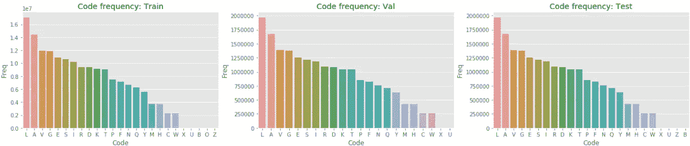
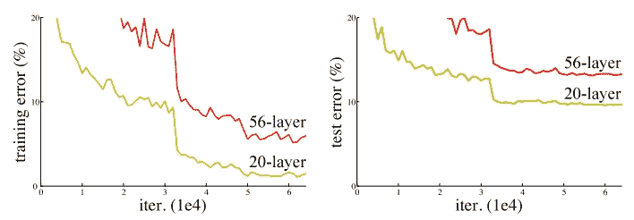
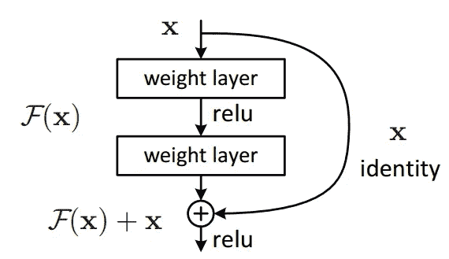
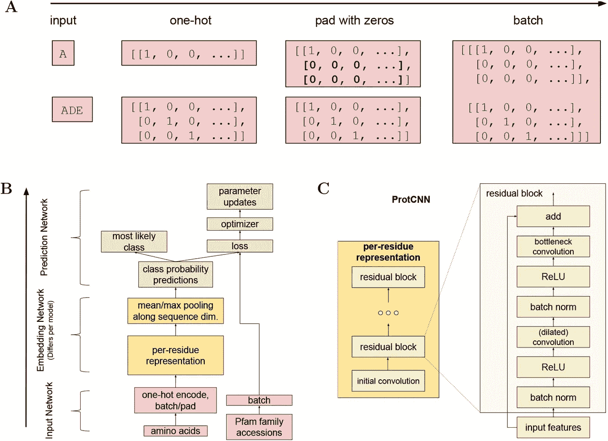
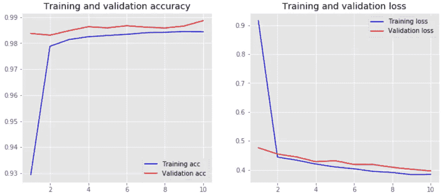

# 蛋白质序列分类

> 原文：<https://towardsdatascience.com/protein-sequence-classification-99c80d0ad2df?source=collection_archive---------5----------------------->

## Pfam 数据集上蛋白质家族分类的实例研究。


[Source](https://www.amr-insights.eu/wp-content/uploads/2019/02/dna-3888228_960_720-800x450.jpg)

# 摘要

[蛋白质](https://en.wikipedia.org/wiki/Protein)是大而复杂的生物分子，在生物体中扮演着许多重要角色。蛋白质由一条或多条[氨基酸](https://en.wikipedia.org/wiki/Amino_acid)序列长链组成。这些序列是蛋白质中氨基酸的排列，通过[肽键](https://en.wikipedia.org/wiki/Peptide_bond)结合在一起。蛋白质可以由 [20](https://www.hornetjuice.com/amino-acids-types/) 不同种类的氨基酸组成，每种蛋白质的结构和功能都是由用来制造它的氨基酸种类以及它们的排列方式决定的。

了解氨基酸序列和蛋白质功能之间的关系是分子生物学中长期存在的问题，具有深远的科学意义。我们能否使用深度学习来学习 [Pfam](https://en.m.wikipedia.org/wiki/Pfam) 数据库中所有蛋白质家族的未比对氨基酸序列及其功能注释之间的关系。

我用 [**Deepnote**](https://deepnote.com/) 创建了这个项目，这是一个非常棒的产品，供数据科学专业人员在云上运行 Jupyter 笔记本。超级容易设置，协作，并提供比谷歌 Colab 更多的功能。这里是完整的[笔记本](https://deepnote.com/@ronakv/Protein-Sequence-Classification-33797a33-7311-48d3-8794-79a1ee26f406)。

## 问题陈述

*   基于 Pfam 数据集，将蛋白质的氨基酸序列分类到蛋白质家族成员之一。
*   换句话说，任务就是:给定蛋白质结构域的氨基酸序列，预测它属于哪一类。

# 数据概述

我们已经提供了 5 个功能，它们如下:

*   这些通常是模型的输入特征。该结构域的氨基酸序列。有 20 种非常常见的氨基酸(频率> 1，000，000)，和 4 种相当不常见的氨基酸:X、U、B、O 和 z。
*   `family_accession`:这些通常是型号的标签。PFxxxxx.y (Pfam)格式的登录号，其中 xxxxx 是家族登录号，y 是版本号。y 的某些值大于 10，因此“y”有两位数。
*   `sequence_name`:序列名称，格式为“uni prot _ accession _ id/start _ index-end _ index”。
*   `aligned_sequence`:包含来自多序列比对的单个序列，与 seed 中该家族的其余成员进行比对，保留缺口。
*   `family_id`:家庭的一个字的名字。

来源:[卡格尔](https://www.kaggle.com/googleai/pfam-seed-random-split)

## **示例数据点**

```
sequence: HWLQMRDSMNTYNNMVNRCFATCIRSFQEKKVNAEEMDCTKRCVTKFVGYSQRVALRFAE 
family_accession: PF02953.15
sequence_name: C5K6N5_PERM5/28-87
aligned_sequence: ....HWLQMRDSMNTYNNMVNRCFATCI...........RS.F....QEKKVNAEE.....MDCT....KRCVTKFVGYSQRVALRFAE 
family_id: zf-Tim10_DDP
```

# 机器学习问题

> 这是一个多类分类问题，对于给定的氨基酸序列，我们需要预测它的蛋白质家族成员。

## 公制的

*   多级原木损失
*   准确(性)

# 探索性数据分析

在本节中，我们将探索、想象并尝试理解给定的特性。给定的数据已经被分成 3 个文件夹，即使用随机分割的培训、开发和测试。

首先，让我们加载训练、val 和测试数据集。

给定集合的大小如下:

*   列车大小:1086741 (80%)
*   Val 大小:126171 (10%)
*   测试规模:126171 (10%)

**注**:由于计算能力有限，我考虑的数据较少。然而，同样的解决方案也可以用于整个 Pfam 数据集。

## 序列计数

首先，让我们计算一下每个未比对序列中的编码(氨基酸)数量。

*   大多数未比对的氨基酸序列的字符数在 50-250 之间。

## 序列码频率

让我们也找出每个未比对序列中每个代码(氨基酸)的频率。

为训练、val 和测试数据绘制代码频率计数



Code Frequency Count

*   最常见氨基酸编码是亮氨酸(L)，其次是丙氨酸(A)，缬氨酸(V)和甘氨酸(G)。
*   正如我们所见，不常见的氨基酸(即 X、U、B、O、Z)的含量非常少。因此，我们可以考虑在预处理步骤中仅用 20 种常见的天然氨基酸进行序列编码。

# 文本预处理

氨基酸序列用它们相应的 1 个字母的代码来表示，例如，丙氨酸的代码是(A)，精氨酸的代码是(R)，等等。氨基酸及其编码的完整列表可以在[这里](http://www.cryst.bbk.ac.uk/education/AminoAcid/the_twenty.html)找到。

示例，未对齐序列:

> phpesrirlstrrddahgmpiriesrlgpdafarlrfmartcrailaaagcaapfeefs sadafsshvfgtcrmghdpmrnvvdgwgrshwpnlfvadaslfsgggespgltqalalrt

为了建立深度学习模型，我们必须将这些文本数据转换为机器可以处理的数字形式。我使用了一种热编码方法，考虑到 20 种常见的氨基酸，因为其他不常见的氨基酸数量较少。

下面的代码片段创建了一个包含 20 个氨基酸的字典，其中的整数值以递增的顺序排列，以便进一步用于整数编码。

对于每个未比对的氨基酸序列，使用创建的编码字典，1 个字母编码被一个整数值代替。如果该代码不在字典中，该值简单地用 0 代替，因此只考虑 20 种常见的氨基酸。

这一步将把 1 个字母的代码序列数据转换成这样的数字数据，

> [13, 7, 13, 4, 16, 15, 8, 15, 10, 16, 17, 15, 15, 3, 1, 7, 6, 11, 13, 8, 13, 15, 8, 4, 16, 15, 10, 6, 13, 3, 1, 5, 1, 15, 10, 15, 5, 11, 1, 15, 17, 2, 15, 1, 8, 10, 1, 1, 1, 6, 2, 1, 1, 13, 5, 4, 4, 5, 16, 16, 1, 3, 1, 5, 16, 16, 17, 7, 18, 5, 6, 17, 2, 15, 11, 6, 7, 3, 13, 11, 15, 12, 18, 18, 3, 6, 19, 6, 15, 16, 7, 15, 19, 13, 12, 10, 5, 18, 1, 3, 1, 16, 10, 5, 13, 16, 16, 6, 6, 6, 4, 16, 13, 6, 10, 17, 8, 14, 1, 10, 1, 10, 15, 17]

下一个后填充以最大序列长度 100 完成，如果总序列长度小于 100，则用 0 填充，否则将序列截断到最大长度 100。

最后，序列中的每个代码被转换成一个热编码向量。

# 深度学习模型

我参考了[这篇用于定义模型架构的](https://www.biorxiv.org/content/10.1101/626507v4.full)论文，并训练了两个独立的模型，一个是双向 LSTM，另一个是受基于 CNN 架构的 ResNet 的启发。

## 模型 1:双向 LSTM

当处理基于 NLP 的问题时，像 LSTMs 这样的递归神经网络的变体是第一选择，因为它们可以处理像文本这样的时间或顺序数据。

RNNs 是一种神经网络，其中来自先前步骤的输出作为输入被馈送到当前步骤，从而记住关于序列的一些信息。当涉及到短上下文时，rnn 是很好的，但是由于消失梯度问题，它在记忆较长的序列方面有限制。

LSTM(长短期记忆)网络是 RNN 的改进版本，专门使用门控机制在延长的时间内记住信息，这使得它们可以选择记住什么先前的信息，忘记什么，以及为建立当前的细胞状态增加多少电流输入。


Bidirectional LSTM ([Source](https://miro.medium.com/max/790/1*GRQ91HNASB7MAJPTTlVvfw.jpeg))

单向 LSTM 只保存过去的信息，因为它看到的输入来自过去。使用双向将会以两种方式运行输入，一种是从过去到未来，另一种是从未来到过去，从而允许它在任何时间点保存来自过去和未来的上下文信息。

关于 RNN 和 LSTM 更深入的解释可以在[这里](https://www.analyticsvidhya.com/blog/2017/12/fundamentals-of-deep-learning-introduction-to-lstm/)找到。

模型架构如下，首先有一个嵌入层，它学习每个代码的矢量表示，然后是双向 LSTM。对于正则化，增加了丢弃以防止模型过度拟合。

输出层，即 softmax 层将给出所有独特类别的概率值(1000)，并且基于最高预测概率，该模型将氨基酸序列分类到其蛋白质家族成员之一。

该模型用 33 个时期、256 的 batch_size 训练，并且能够实现测试数据的(0.386)损失和(95.8%)准确度。

```
439493/439493 [==============================] - 28s 65us/step
Train loss:  0.36330516427409587
Train accuracy:  0.9645910173696531
----------------------------------------------------------------------
54378/54378 [==============================] - 3s 63us/step
Val loss:  0.3869630661736021
Val accuracy:  0.9577034830108782
----------------------------------------------------------------------
54378/54378 [==============================] - 3s 64us/step
Test loss:  0.3869193921893196
Test accuracy:  0.9587149214887501
```

## 模式 2: ProtCNN

该模型使用受 [ResNet](https://arxiv.org/abs/1512.03385) 架构启发的剩余模块，该架构还包括扩大的卷积，提供更大的感受野，而不增加模型参数的数量。

**ResNet(剩余网络)**

由于消失梯度问题，更深层次的神经网络很难训练——随着梯度反向传播到更早的层，重复乘法可能会使梯度无限小。因此，随着网络越来越深入，其性能会饱和，甚至开始迅速下降。



Training and test error: Plain networks ([Source](https://neurohive.io/wp-content/uploads/2019/01/plain-networks-training-results-770x272.png))

ResNets 引入了跳过连接或恒等快捷连接，将初始输入添加到卷积块的输出中。



Single residual block: ResNet ([Source](https://neurohive.io/wp-content/uploads/2019/01/resnet-e1548261477164.png))

这通过允许渐变流过替代的快捷路径来减轻渐变消失的问题。它还允许模型学习一个标识函数，该函数确保较高层的性能至少与较低层一样好，而不是更差。

**扩张卷积**


Dilated convolution ([Source](https://www.researchgate.net/publication/329213875/figure/download/fig6/AS:697565997703168@1543324102225/Atrous-convolution-kernel-green-dilated-with-different-rates.jpg))

膨胀卷积为卷积层引入了另一个参数，称为膨胀率。这定义了内核中值之间的间距。膨胀率为 2 的 3×3 内核将具有与 5×5 内核相同的视野，同时仅使用 9 个参数。想象一下，取一个 5x5 的内核，每隔一行删除一列。

扩张卷积以相同的计算成本提供了更宽的视野。

**ProtCNN 模型架构**



Model architecture ([Source](https://www.biorxiv.org/content/biorxiv/early/2019/07/15/626507/F6.large.jpg))

氨基酸序列被转换成一个热编码，其形状(batch_size，100，21)作为模型的输入。初始卷积运算应用于核大小为 1 的输入，以提取基本属性。然后使用两个相同的残差块来捕获数据中的复杂模式，这是受 ResNet 架构的启发，这将有助于我们用更多的历元和更好的模型性能来训练模型。

我对剩余块的定义与 ResNet 论文略有不同。不是执行三个卷积，而是仅使用两个卷积，并且还向第一个卷积增加一个参数(膨胀率),从而在相同数量的模型参数下具有更宽的视场。

残差块中的每个卷积运算都遵循 batch normalization = > ReLU = > Conv1D 的基本模式。在残差块中，第一次卷积以 1×1 的核大小和膨胀率进行，第二次卷积以更大的核大小 3×3 进行。

最后，在应用卷积运算之后，通过添加初始输入(快捷方式)和来自所应用的卷积运算的输出来形成跳过连接。

在两个剩余块之后，应用最大池来减小表示的空间大小。对于正则化，增加了丢弃以防止模型过度拟合。

该模型用 10 个时期训练，batch_size 为 256，并在验证数据上验证。



```
439493/439493 [==============================] - 38s 85us/step
Train loss:  0.3558084576734698
Train accuracy:  0.9969123512774948
----------------------------------------------------------------------
54378/54378 [==============================] - 5s 85us/step
Val loss:  0.39615299251274316
Val accuracy:  0.9886718893955224
----------------------------------------------------------------------
54378/54378 [==============================] - 5s 85us/step
Test loss:  0.3949931418234982
Test accuracy:  0.9882489242257847
```

正如我们所看到的，这个模型的结果比双向 LSTM 模型要好。通过在 ProtCNN 模型集合中进行多数投票，可以实现对此的更多改进。

# 结论

在这个案例研究中，我们探索了深度学习模型，这些模型学习未比对的氨基酸序列与其功能注释之间的关系。ProtCNN 模型已经取得了显著的成果，比当前最先进的技术(如 [BLASTp](https://en.wikipedia.org/wiki/BLAST_(biotechnology)) 注释蛋白质序列)更准确，计算效率更高。

这些结果表明，深度学习模型将成为未来蛋白质功能预测工具的核心组成部分。

感谢您的阅读。完整的代码可以在[这里](https://github.com/ronakvijay/Protein_Sequence_Classification)找到。

## 参考

[](https://www.biorxiv.org/content/10.1101/626507v4.full) [## 使用深度学习来注释蛋白质宇宙

### 了解氨基酸序列与蛋白质功能的关系是分子生物学中长期存在的问题。

www.biorxiv.org](https://www.biorxiv.org/content/10.1101/626507v4.full)