# 使用 LSTM 卷积自动编码器的视频异常检测

> 原文：<https://towardsdatascience.com/prototyping-an-anomaly-detection-system-for-videos-step-by-step-using-lstm-convolutional-4e06b7dcdd29?source=collection_archive---------3----------------------->

“London Underground atrium” (Photo by [Anna Dziubinska](https://unsplash.com/@annadziubinska) on [Unplash](https://unsplash.com/photos/mVhd5QVlDWw))

我们有数以千计的监视摄像机一直在工作，其中一些安装在偏远地区或街道上，那里不太可能发生危险的事情，另一些安装在拥挤的街道或城市广场上。即使在一个地点也可能发生各种各样的异常事件，并且异常事件的定义因地点和时间的不同而不同。

在这种情况下，使用自动化系统来检测异常事件是非常可取的，可以带来更好的安全性和更广泛的监控。一般来说，检测视频中的异常事件的过程是一个具有挑战性的问题，目前引起了研究人员的广泛关注，它在各个行业也有广泛的应用，最近它已经成为视频分析的基本任务之一。对于开发在现实世界应用中快速且准确的异常检测方法存在巨大的需求。

# 必备知识:

了解以下主题的基础知识:

**卷积神经网络:** 简单解释:
[https://www.youtube.com/watch?v=YRhxdVk_sIs&t = 2s](https://www.youtube.com/watch?v=YRhxdVk_sIs&t=2s)
更多详情:
[http://cs231n.github.io/convolutional-networks/](http://cs231n.github.io/convolutional-networks/)

**http://colah.github.io/posts/2015-08-Understanding-LSTMs/** [LSTM 网络](http://colah.github.io/posts/2015-08-Understanding-LSTMs/)

**自动编码器:** [https://www . quora . com/What-is-an-auto-encoder-in-machine-learning](https://www.quora.com/What-is-an-auto-encoder-in-machine-learning)
[https://towardsdatascience . com/deep-inside-auto encoders-7e 41 f 319999 f](/deep-inside-autoencoders-7e41f319999f)

**反卷积层:**
[https://towardsdatascience . com/transpose-convolution-77818 e55a 123](/transpose-convolution-77818e55a123)

# 为什么我们不用监督的方法来检测异常呢？

如果我们要将问题视为二元分类问题，我们需要带标签的数据，在这种情况下，收集带标签的数据非常困难，原因如下:

1.  异常事件因其罕见性而难以获得。
2.  异常事件种类繁多，手动检测和标记这些事件是一项需要大量人力的艰巨任务。

上述原因促进了使用无监督或半监督方法的需求，如字典学习、时空特征和自动编码器。与监督方法不同，这些方法只需要未标记的视频片段，这些视频片段包含很少或没有异常事件，这些异常事件在现实世界的应用中很容易获得。

# 自动编码器

自动编码器是被训练来重建输入的神经网络。自动编码器由两部分组成:

1.  编码器:能够学习称为编码 f(x)的输入数据(x)的有效表示。编码器的最后一层称为瓶颈，它包含输入表示 f(x)。
2.  解码器:使用瓶颈中的编码产生输入数据的重构 r = g(f(x))。

# 方法

都是关于**重建误差**的。
我们使用自动编码器来学习视频序列的规律性。
直觉是，经过训练的自动编码器将以**低误差**重建规则视频序列，但不会精确重建不规则视频序列中的运动。

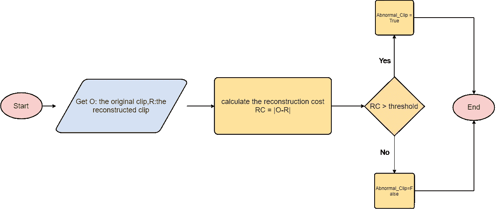

# 被数据弄脏

我们将使用 [UCSD 异常检测数据集](http://www.svcl.ucsd.edu/projects/anomaly/dataset.htm)，其中包含安装在高处的摄像机采集的视频，可以俯瞰人行道。在正常设置下，这些视频只包含行人。

异常事件是由于以下原因之一:

1.  人行道上的非行人实体，如骑车人、溜冰者和小推车。
2.  不寻常的行人运动模式，如人们走过人行道或周围的草地。

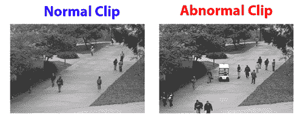

UCSD 数据集由两部分组成，ped1 和 ped2。我们将使用 **ped1** 零件进行培训和测试。

## 安装

下载 [UCSD](http://www.svcl.ucsd.edu/projects/anomaly/dataset.htm) 数据集并将其提取到您当前的工作目录中，或者使用此[数据集](https://www.kaggle.com/hashemsellat/ucsddataset)在 Kaggle 中创建新的笔记本。

## 准备训练集

训练集由规则视频帧序列组成；该模型将被训练以重建这些序列。因此，让我们按照以下三个步骤准备好数据，以供我们的模型使用:

1.  使用**滑动窗口**技术将训练视频帧分成时间序列，每个时间序列的大小为 10。
2.  将每个帧的大小调整为 256 × 256，以确保输入图像具有相同的分辨率。
3.  通过将每个像素除以 256，在 0 和 1 之间缩放像素值。

最后一点，由于这个模型中的参数数量庞大，需要大量的训练数据，所以我们在时间维度上进行[**数据扩充**](https://www.youtube.com/watch?v=rfM4DaLTkMs) 。为了生成更多的训练序列，我们用不同的**跳跃步幅连接帧。**例如，第一步距-1 序列由帧(1，2，3，4，5，6，7，8，9，10)组成，而第一步距-2 序列由帧(1，3，5，7，9，11，13，15，17，19)组成。

这是代码。随意编辑它以获得更多/更少的具有不同跳跃步幅的输入序列，然后看看结果如何变化。

注意:如果你面临内存错误，减少训练序列的数量或使用[数据发生器](https://stanford.edu/~shervine/blog/keras-how-to-generate-data-on-the-fly)。

# 构建和训练模型

最后，好玩的部分开始了！我们将使用 Keras 来构建我们的卷积 LSTM 自动编码器。

下图显示了培训过程；我们将训练模型来重建常规事件。因此，让我们开始探索模型设置和架构。

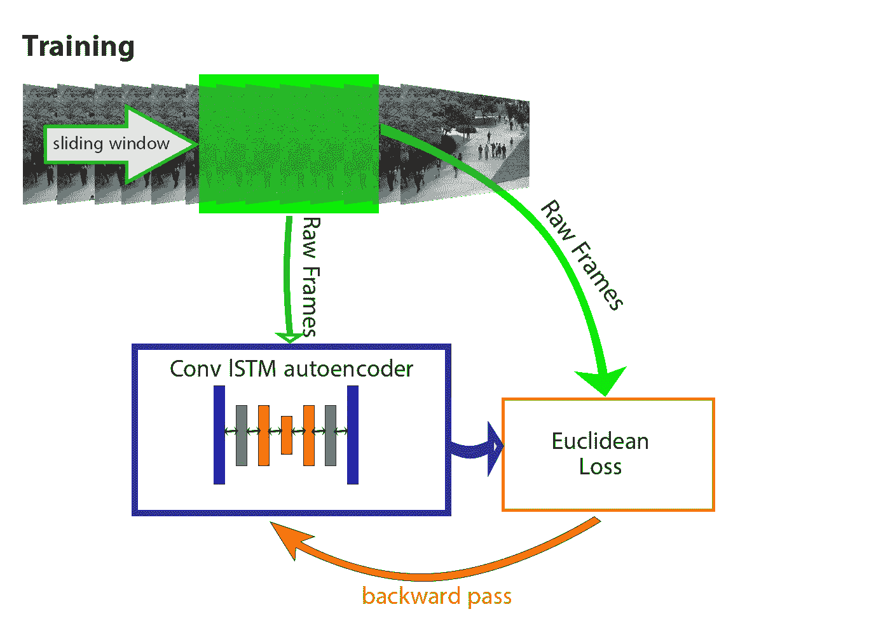

要构建自动编码器，我们应该定义编码器和解码器。编码器接受按时间顺序排列的帧序列作为输入，它由两部分组成:空间编码器和时间编码器。来自空间编码器的序列的编码特征被馈送到时间编码器用于运动编码。

解码器镜像编码器以重建视频序列，因此我们的自动编码器看起来像一个三明治。

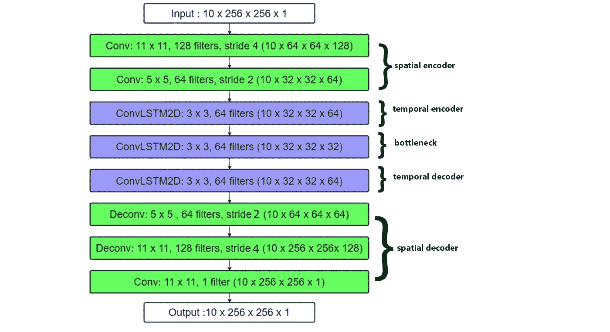

注意:因为模型有大量的参数，所以建议您使用 GPU。使用 Kaggle 或 Colab 也是一个好主意。

**初始化和优化:** 我们使用 **Adam** 作为优化器，将**学习率**设置为 **0.0001** ，当训练损失停止减少时，我们通过使用 **0.00001** 的**衰减**来减少它，并将**ε**值设置为 **0.000001** 。

对于初始化，我们使用 Xavier 算法，它可以防止信号在通过每一层时变得太小或太大而无用。

# 让我们更深入地研究这个模型！

**为什么在编码器中使用卷积层，在解码器中使用去卷积层？**
卷积层将滤波器固定感受域内的多个输入激活连接到单个激活输出。它将过滤器长方体的信息抽象成一个标量值。另一方面，去卷积层通过具有多个学习滤波器的类卷积运算来增加稀疏信号的密度；因此，他们通过卷积的逆运算将单个输入激活与补丁输出相关联。

去卷积层中的学习滤波器用作重建输入运动序列形状的基础。

**我们为什么要使用卷积 LSTM 层？**
对于通用序列建模来说，LSTM 作为一种特殊的 RNN 结构已经被证明在保持长程相关性方面是稳定和健壮的。

这里，我们使用卷积 LSTM 层而不是全连接 LSTM 层，因为 FC-LSTM 层不能很好地保留空间数据，因为它在输入到状态和状态到状态的转换中使用了全连接，其中没有空间信息被编码。

**图层归一化的目的是什么？**
训练深度神经网络计算量大。减少训练时间的一种方法是使用层标准化来标准化神经元的活动；我们使用了层标准化而不是其他方法，如批量标准化，因为这里我们有一个递归神经网络。[阅读更多关于标准化技术的信息](https://mlexplained.com/2018/11/30/an-overview-of-normalization-methods-in-deep-learning/)。

# 我们做得好吗？

让我们进入测试阶段。

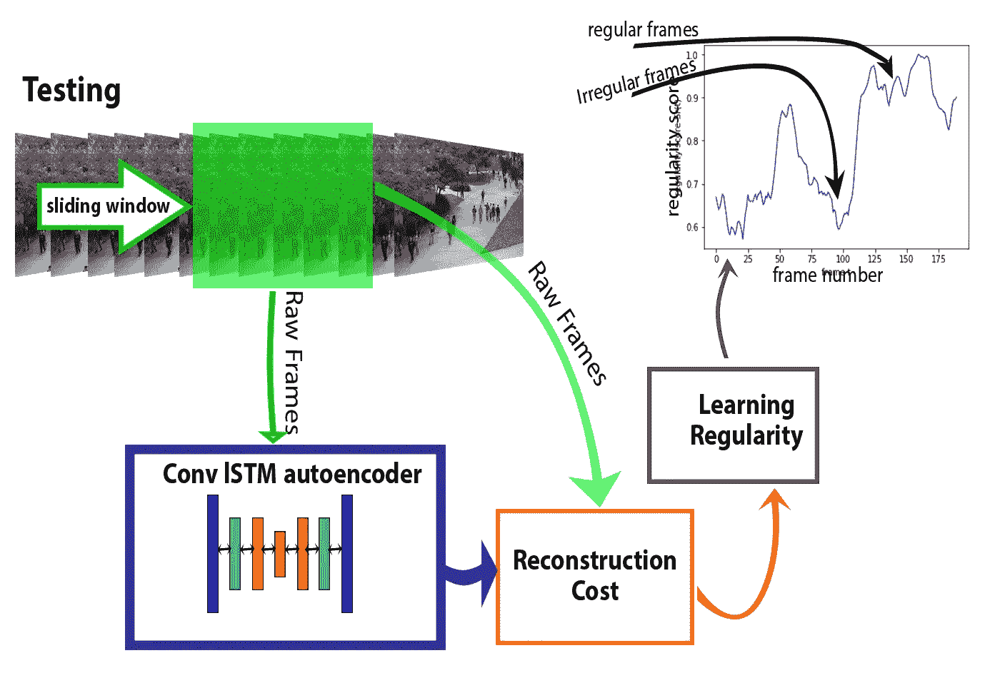

第一步是获取测试数据。我们将单独测试每个测试视频。UCSD 数据集提供了 34 个测试视频， **Config 的值。SINGLE_TEST_PATH** 决定使用哪一个。

每个测试视频有 200 帧。我们使用滑动窗口技术来获得所有连续的 10 帧序列。换句话说，对于 0 到 190 之间的每个 **t** ，我们计算从帧( **t** )开始到帧( **t** +9)结束的序列的正则性得分 **Sr(t)** 。

## 规律性得分:

我们使用 [L2 范数](https://machinelearningmastery.com/vector-norms-machine-learning/)计算视频的帧 **t** 中位置 **(x，y)** 处的像素亮度值 **I** 的重建误差:

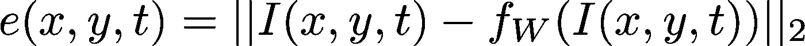

其中 **Fw** 是 LSTM 卷积自动编码器的学习模型。然后，我们通过对所有像素误差求和来计算一帧的重建误差 **t** :

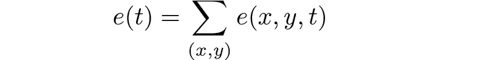

在 **t** 开始的 10 帧序列的重建成本可以计算如下:

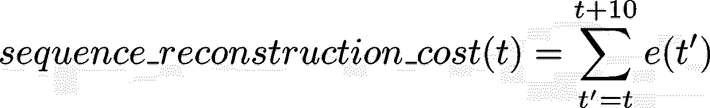

然后，我们通过在 0 和 1 之间缩放来计算异常分数 **Sa(t)** 。

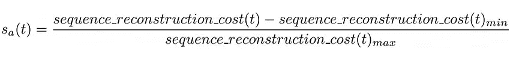

我们可以通过从 1 中减去异常分数来导出规律性分数 **Sr(t)** 。

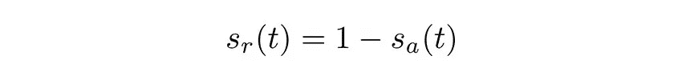

在我们为范围**【0，190】**中的每个 **t** 计算正则性得分 **Sr(t)** 之后，我们绘制 **Sr(t)** 。

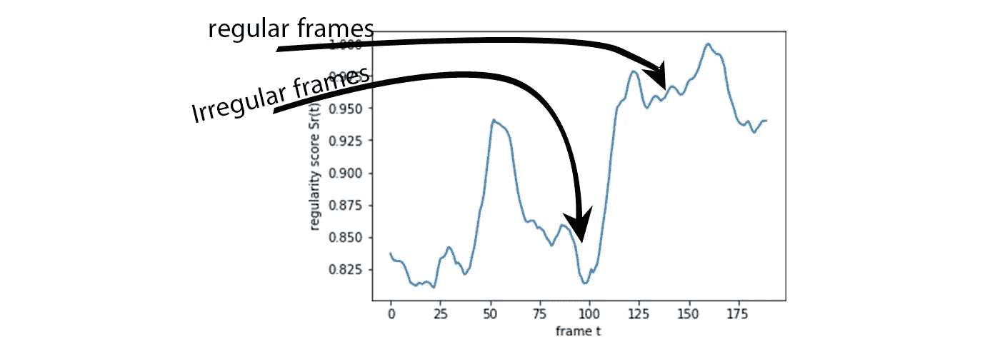

Test 032 of UCSDped1

## 一些测试:

首先，我们来看看 UCSDped1 的 test 32。视频开头，走道上有一辆自行车，解释了规律性得分低的原因。自行车离开后，规律性得分开始增加。在第 60 帧，另一辆自行车进入，规则性得分再次降低，并在它离开后立即增加。

UCSDped1 数据集的 Test 004 在视频的开头显示了一个溜冰者进入走道，在第 140 帧有人在草地上行走，这解释了规律性得分的两次下降。

UCSDped1 数据集的测试 024 显示一辆小车穿过人行道，导致规律性得分下降。推车离开后，规律性得分恢复到正常状态。

UCSDped1 数据集的 Test 005 显示了两辆自行车经过人行道，一辆在视频的开头，另一辆在视频的结尾。

# 结论:

尝试多个数据集，如 CUHK 大道数据集、UMN 数据集、T21 数据集，甚至使用监控摄像机或房间里的小型摄像机收集你自己的数据。训练数据相对容易收集，因为它由仅包含常规事件的视频组成。混合多个数据集，看看该模型是否仍然做得很好。想出一种方法来加快检测异常的过程，比如在测试阶段使用更少的序列。

别忘了在评论里写下你的结果！

[**这里 GitHub 上有代码和训练好的模型。**](https://github.com/hashemsellat/Video-Anomaly-Detection)

在 [**Linkedin**](https://www.linkedin.com/in/hashem-sellat-6ba7aa181/) 上保持联系。

# 参考资料:

[1] Yong Shean Chong，利用时空自动编码器检测视频中的异常事件(2017)， [arXiv:1701.01546](http://arxiv.org/abs/1701.01546) 。

[2] Mahmudul Hasan，Jonghyun Choi，Jan Neumann，Amit K. Roy-Chowdhury，学习视频序列中的时间规律性(2016)， [arXiv:1604.04574](http://arxiv.org/abs/1604.04574) 。