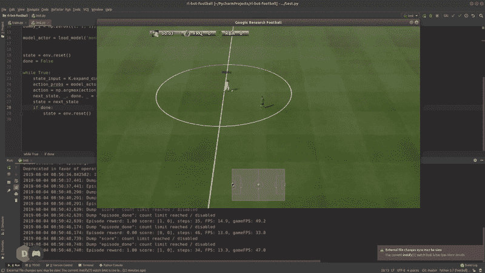

# 近似策略优化教程(第 1/2 部分:行动者-批评家方法)

> 原文：<https://towardsdatascience.com/proximal-policy-optimization-tutorial-part-1-actor-critic-method-d53f9afffbf6?source=collection_archive---------3----------------------->

## 让我们从头开始编码一个强化学习足球代理！



欢迎来到数学和代码系列的第一部分。我将展示如何实现一种被称为近似策略优化(PPO)的强化学习算法，用于教一个人工智能代理如何踢足球。在本教程结束时，你将会了解到如何在行动者-批评家框架中应用策略学习方法，以便学习在任何游戏环境中导航。我们将看到这些术语在 PPO 算法的上下文中的含义，并在 Keras 的帮助下用 Python 实现它们。所以，我们先从我们游戏环境的安装开始。

**注意:**这整个系列的代码可以在下面链接的 GitHub 资源库中找到。

 [## 中国机器人足球

### 在 Ubuntu 18.04 和单个 NVIDIA GPU 上测试。使用以下工具启动并运行谷歌足球研究环境…

github.com](https://github.com/ChintanTrivedi/rl-bot-football) 

## 设置谷歌足球环境


Google Football Environment released for RL research

我在本教程中使用了[谷歌足球环境](https://github.com/google-research/football)，但是你可以使用任何游戏环境，只要确保它支持 OpenAI 在 python 中的 Gym API。请注意，在撰写本教程时，足球环境目前仅支持 Linux 平台。

首先创建一个名为`footballenv`的虚拟环境并激活它。

```
>> virtualenv footballenv
>> source footballenv/bin/activate
```

现在安装这个项目所需的系统依赖项和 python 包。确保您选择了适合您系统的正确的 gfootball 版本。

```
>> sudo apt-get install git cmake build-essential libgl1-mesa-dev 
libsdl2-dev libsdl2-image-dev libsdl2-ttf-dev libsdl2-gfx-dev libboost-all-dev libdirectfb-dev libst-dev mesa-utils xvfb x11vnc libsqlite3-dev glee-dev libsdl-sge-dev python3-pip
>> pip3 install gfootball[tf_gpu]==1.0
>> pip3 install keras
```

## 运行足球环境

现在我们已经安装了游戏，让我们试着测试它是否能在你的系统上正确运行。

一个典型的强化学习设置通过让一个人工智能代理与我们的环境进行交互来工作。代理观察我们环境的当前`state`，并基于一些`policy`做出采取特定`action`的决定。这个动作然后通过一个`step`传递回向前移动的环境。这产生了一个`reward`,指示所采取的行动在所玩游戏的上下文中是积极的还是消极的。使用这种奖励作为反馈，代理试图找出如何修改其现有的政策，以便在未来获得更好的奖励。


Typical RL agent

所以现在让我们继续，为一个随机行动的人工智能代理实现与这个足球环境的交互。创建一个名为`train.py`的新 python 文件，并使用我们之前创建的虚拟环境执行以下内容。

这为场景`academy_empty_goal`创建了一个环境对象`env`,在这个场景中，我们的球员在半场休息，必须在右侧的一个空门得分。`representation='pixels'`意味着我们的代理将观察到的状态是在屏幕上呈现的帧的 RGB 图像的形式。如果你在屏幕上看到一个玩家在游戏中随机行动，恭喜你，一切都设置正确，我们可以开始实现 PPO 算法了！

如果你更喜欢视频格式，这里有相同的安装步骤。

# 近似策略优化(PPO)

PPO 算法是由 OpenAI 团队在 2017 年推出的，并迅速成为最受欢迎的 RL 方法之一，取代了 Deep-Q 学习方法。它包括收集一小批与环境互动的经验，并使用这些经验来更新决策政策。一旦用这一批更新了策略，这些经验就被丢弃，并且用新更新的策略收集新的一批。这就是为什么它是一种“政策学习”方法的原因，在这种方法中，收集的经验样本只对更新当前政策有用一次。

PPO 的主要贡献是确保新的政策更新不会对之前的政策造成太大的改变。这导致训练中以一些偏差为代价的更少的变化，但是确保更平滑的训练，并且还确保代理不会走上采取无意义的行动的不可恢复的道路。所以，让我们继续把我们的 AI 代理分解成更多的细节，看看它如何定义和更新它的策略。

## 演员-评论家方法

我们将对我们的 PPO 代理人采用演员-评论家的方法。它使用两个模型，都是深度神经网络，一个称为演员，另一个称为评论家。


PPO Agent

**演员模型**

`Actor model`执行学习在环境的特定观察状态下采取什么行动的任务。在我们的例子中，它将游戏的 RGB 图像作为输入，并将特定的动作(如射门或传球)作为输出。


The Actor model

先实现这个吧。

这里，我们首先为我们的神经网络定义输入形状`state_input`，它是我们的 RGB 图像的形状。`n_actions`是我们在这个足球环境中可用的动作总数，将是神经网络的输出节点总数。

我使用预训练的 MobileNet CNN 的前几层来处理我们的输入图像。我也使这些层的参数不可训练，因为我们不想改变它们的权重。只有添加在该特征提取器之上的分类层将被训练来预测正确的动作。让我们将这些层合并为 Keras `Model`并使用均方误差损失进行编译(现在，这将在本教程的稍后部分更改为自定义 PPO 损失)。

**评论家模式**

我们将演员预测的动作发送到足球环境中，观察游戏中发生的事情。如果我们的行动产生了积极的结果，比如进了一个球，那么环境就会以奖励的形式发回积极的回应。如果我们的行动导致了乌龙球，那么我们会得到负面的奖励。这个奖励被`Critic model`拿走了。


The Critic model

批评家模型的工作是学会评估行动者采取的行动是否使我们的环境处于更好的状态，并向行动者提供反馈，因此得名。它输出一个实数，表示在先前状态中采取的行动的等级(Q 值)。通过比较从批评家那里获得的评级，参与者可以将其当前政策与新政策进行比较，并决定如何改进自己以采取更好的行动。

让我们实现批评家。

如你所见，评论家神经网络的结构和演员几乎一样。唯一的主要区别是，最后一层 Critic 输出一个实数。因此，使用的激活是`tanh`而不是`softmax`，因为我们不需要像演员一样的概率分布。

现在，PPO 算法中的一个重要步骤是用两个模型运行整个循环，运行固定数量的步骤，称为 PPO 步骤。所以本质上，我们在一定数量的步骤中与我们的环境互动，并收集状态、动作、奖励等。我们将用它来训练。

## 把这一切联系在一起

现在我们已经定义了我们的两个模型，我们可以使用它们与足球环境进行固定步数的交互，并收集我们的经验。这些经验将被用来更新我们的模型的政策后，我们有足够大的一批这样的样本。这就是如何实现收集这种样本经验的循环。

正如你在上面的代码中看到的，我们已经定义了几个 python 列表对象，用于存储观察到的状态、动作、奖励等信息。当我们与我们的环境互动时，共有`ppo_steps`。这给了我们一批 128 个样本经验，这些经验将在以后用于训练演员和评论家的神经网络。

接下来的两个视频逐行解释了这段代码，并展示了游戏屏幕上的最终结果。

## 未完待续…

这部分教程到此为止。我们在 Linux 系统上安装了 Google Football 环境，并实现了一个与该环境交互的基本框架。接下来，我们定义了演员和评论家模型，并使用它们与这个游戏进行交互，并从这个游戏中收集示例体验。希望你能坚持到现在，否则，如果你遇到了什么困难，请在下面的评论中告诉我，我会尽力帮助你的。

下一次我们将看到如何使用我们收集的这些经验来训练和改进演员和评论家模型。我们将检查`Generalized Advantage Estimation`算法，并使用它来计算用于训练这些网络的`custom PPO loss`。所以留下来！

**编辑:**这是本教程系列的[第二部分。](https://medium.com/@chintan.t93/proximal-policy-optimization-tutorial-part-2-2-gae-and-ppo-loss-fe1b3c5549e8)

> 感谢您的阅读。如果你喜欢这篇文章，你可以关注我在[媒体](https://medium.com/@chintan.t93)、 [GitHub](https://github.com/ChintanTrivedi) 上的更多作品，或者订阅我的 [YouTube 频道](http://youtube.com/c/DeepGamingAI)。