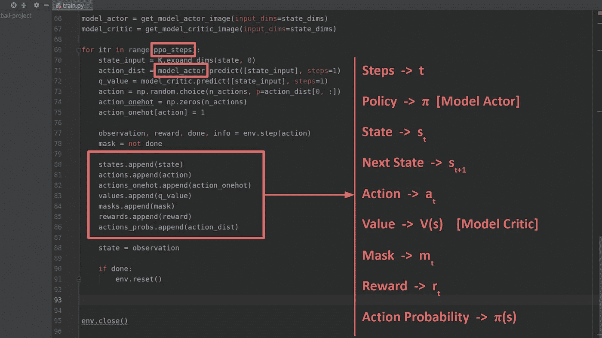
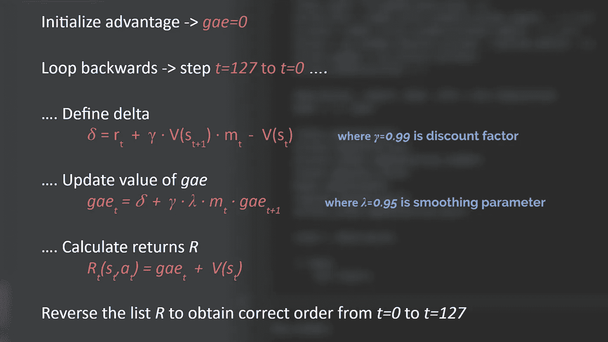
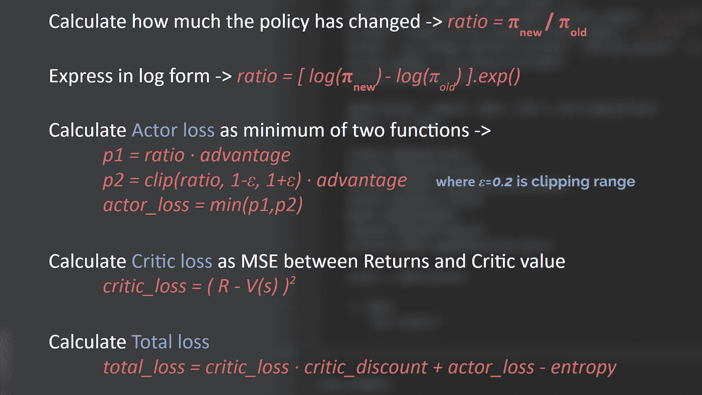
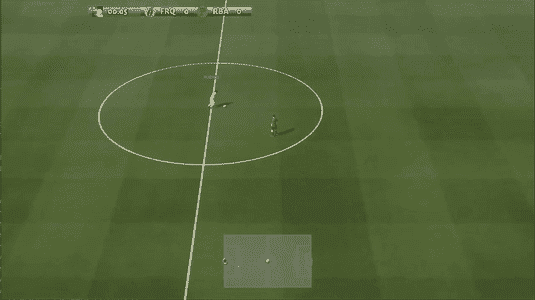
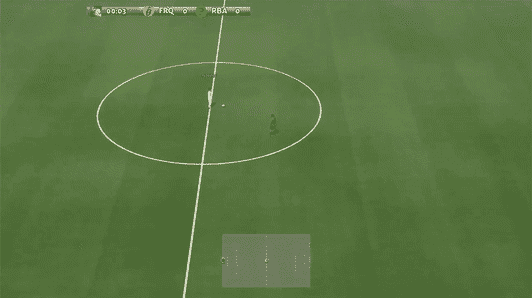

# 近似政策优化教程(第二部分:GAE 和 PPO 损失)

> 原文：<https://towardsdatascience.com/proximal-policy-optimization-tutorial-part-2-2-gae-and-ppo-loss-fe1b3c5549e8?source=collection_archive---------5----------------------->

## 让我们从头开始编写一个 RL 足球代理！

> **第一部分链接:** [近端政策优化教程(第一部分:演员-评论家法)](/proximal-policy-optimization-tutorial-part-1-actor-critic-method-d53f9afffbf6)

欢迎来到强化学习数学和代码教程系列的第二部分。在本系列的第一部分[中，我们看到了如何设置谷歌足球环境，然后实现了一个演员-评论家模型框架来与这个游戏环境进行交互并从中收集示例体验。](/proximal-policy-optimization-tutorial-part-1-actor-critic-method-d53f9afffbf6)

今天，我们将通过使用该批示例体验来训练我们的模型在游戏中得分，从而完成教程的剩余部分。关于我们上次实施的[代码](https://gist.github.com/ChintanTrivedi/665dd40d21227fbf6ac646c99cb8976d#file-train-py),回想一下到目前为止我们已经收集了以下信息:

利用这些信息，我们现在可以继续计算优势。

# 广义优势估计(GAE)

优势可以被定义为当我们处于特定的状态时，通过采取特定的行动来衡量我们可以变得多好的一种方式。我们希望使用我们在每个时间步骤收集的奖励，并计算通过采取我们所采取的行动我们能够获得多少优势。因此，如果我们采取了一个好的行动，比如朝着一个目标射击，我们想要计算我们通过采取那个行动，不仅在短期内，而且在更长的一段时间内，有多好。这样，即使我们没有在射门后的下一个时间步立即进球，我们仍然会在那个动作后的几个时间步看更长的未来，看看我们是否进球了。

为了计算这一点，我们将使用一种称为*广义优势估计*或 *GAE* 的算法。所以让我们用我们收集的那批经验来看看这个算法是如何工作的。

Generalized Advantage Estimation Algorithm

*   这里，使用掩码值`*m*`,因为如果游戏结束，那么我们批次中的下一个状态将来自新重启的游戏，所以我们不想考虑它，因此掩码值取为 0。
*   Gamma `*γ*`只不过是一个常数，称为*折扣因子*，目的是减少未来状态的值，因为我们希望更多地强调当前状态而不是未来状态。考虑到这一点，现在进球比将来进球更有价值，因此我们不考虑将来的目标，这样我们可以给现在的目标更多的价值。
*   λ`λ`*是平滑参数，用于减少训练中的方差，使其更加稳定。该论文中建议的该平滑参数的值是 0.95。因此，这给了我们在短期和长期采取行动的优势。*
*   *在最后一步中，我们简单地反转返回列表，因为我们从最后一个时间步骤循环到第一个时间步骤，所以我们获得了原始订单。*

*这基本上是 GAE 算法，可以在我们的代码中实现，如下所示。*

*下面的视频是对这个算法的逐行解释。*

*我们现在有了训练演员和评论家模特所需的一切。因此，我们将了解如何使用这些信息来计算自定义 PPO 损失，并使用该损失来训练参与者模型。*

# *自定义 PPO 损失*

*这是近似策略优化算法中最重要的部分。那么我们先来了解一下这个损失函数。*

*回想一下`*π*` 表示由我们的 Actor 神经网络模型定义的策略。通过训练这个模型，我们希望改进这个策略，以便随着时间的推移，它给我们提供越来越好的行动。现在，一些强化学习方法的一个主要问题是，一旦我们的模型采用了一个坏的策略，它只会在游戏中采取坏的行动，因此我们无法从那里产生任何好的行动，从而导致我们在训练中走上不可恢复的道路。PPO 试图通过在更新步骤中只对模型进行小的更新来解决这个问题，从而稳定训练过程。PPO 损失可计算如下。*

**

*Custom PPO loss calculation*

*   *PPO 在更新步骤中使用新更新的策略和旧策略之间的比率。从计算上来说，用对数形式表示更容易。*
*   *利用这个比率，我们可以决定我们愿意容忍多大程度的政策变化。因此，我们使用限幅参数ε`*ε*`来确保我们一次只对我们的策略进行最大限度的`*ε%*`改变。文中建议ε值保持在`0.2`。*
*   *批评家损失只不过是收益的平均平方误差损失。*
*   *如果我们想用一个折扣系数使演员和评论家的损失达到相同的数量级，我们可以把他们结合起来。添加熵项是可选的，但它鼓励我们的参与者模型探索不同的政策，并且我们想要实验的程度可以由熵β参数来控制。*

*这个自定义损失函数可以用 Keras 使用下面的代码来定义。*

*下面是这个自定义损失函数在下面嵌入的视频中的逐行解释和实现。*

# *模型训练和评估*

*现在终于可以开始模特训练了。为此，我们如下使用 Keras 的`fit`函数。*

*现在，您应该能够在屏幕上看到模型采取不同的行动，并从环境中收集奖励。在训练过程的开始，当随机初始化的模型探索游戏环境时，动作可能看起来相当随机。*

**

*好了，现在让我们实现一些模型评估代码。这将在模型训练期间告诉我们，就成功得分而言，模型的最新更新版本有多好。因此，为了评估这一点，我们将计算平均奖励，定义为从零开始多次玩游戏所获得的所有奖励的平均值。如果我们在 5 场比赛中的 4 场比赛中进球，我们的平均回报将是 80%。这可以如下实现。*

*一旦模型开始学习哪一组行动产生最好的长期回报，测试阶段将如下所示。在我们的例子中，向右击球被观察到产生了最好的回报，因此我们的演员模型将产生正确的方向和射击动作，作为它的首选输出动作。*

**

*用于将所有内容联系在一起的其余代码可以在 GitHub 资源库的`train.py`脚本中找到。*

 *[## 中国机器人足球

### 此代码实现了近似策略优化(PPO)算法的基本版本，目的是…

github.com](https://github.com/ChintanTrivedi/rl-bot-football)* 

*如果你想通过逐行解释来学习这个实现，你可以看下面的视频。*

# *结论*

*我希望这篇教程能让你对基本的 PPO 算法有一个很好的了解。现在，您可以通过并行执行多个环境来继续构建，以便收集更多的训练样本，并解决更复杂的游戏场景，如完整的 11 对 11 模式或角球得分。一些有用的参考资料可以对此有所帮助，也是我在本教程中使用的，可以在[这里](https://www.youtube.com/watch?v=WxQfQW48A4A)和[这里](https://www.youtube.com/watch?v=5P7I-xPq8u8)找到。祝你好运！*

> *感谢您的阅读。如果你喜欢这篇文章，你可以关注我在[媒体](https://medium.com/@chintan.t93)、 [GitHub](https://github.com/ChintanTrivedi) 上的更多作品，或者订阅我的 [YouTube 频道](http://youtube.com/c/DeepGamingAI)。*