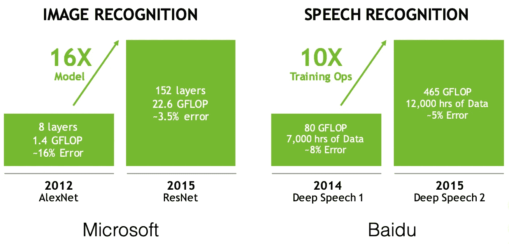
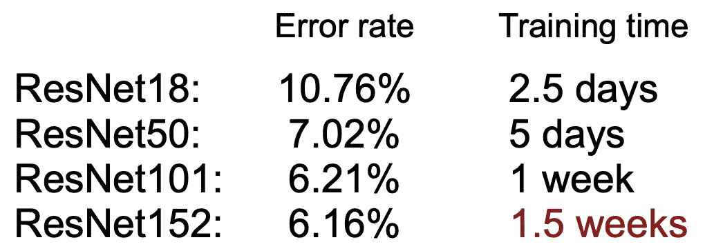
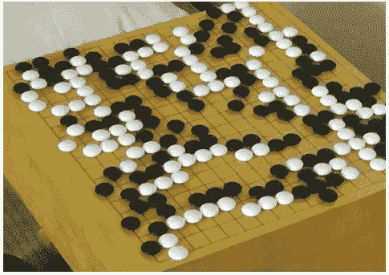
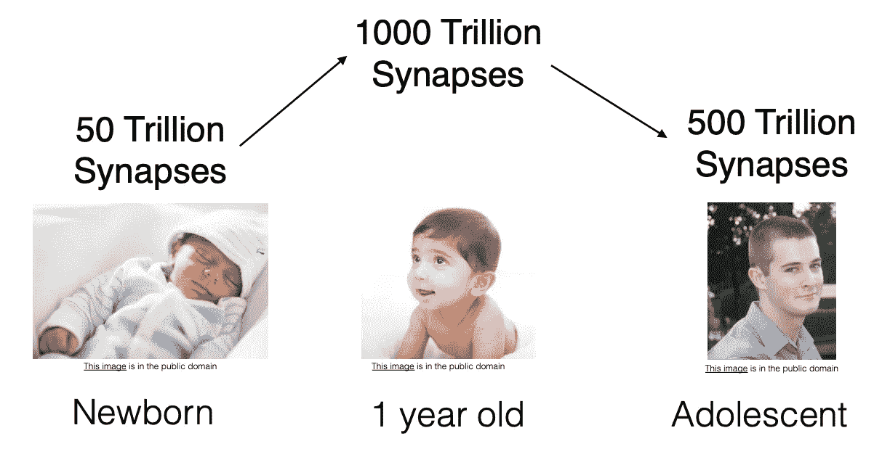
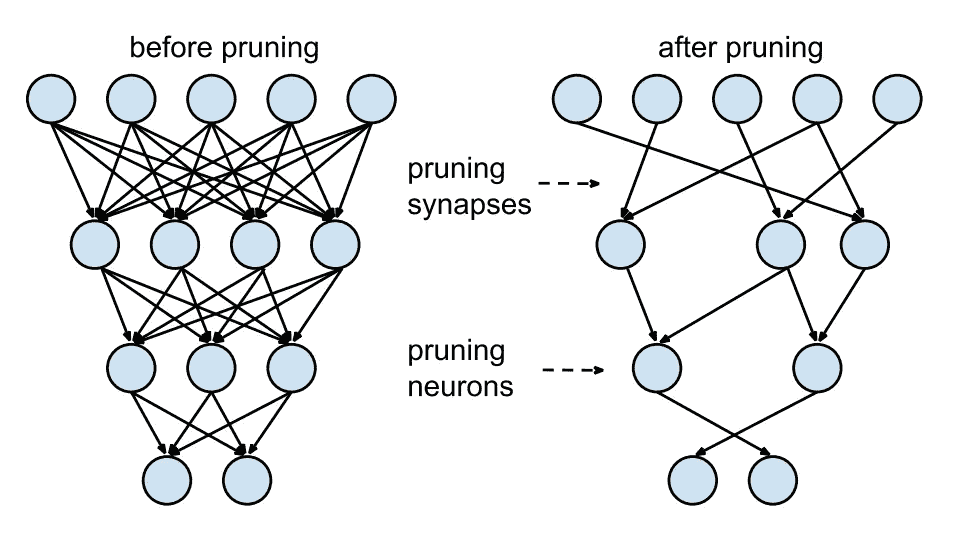
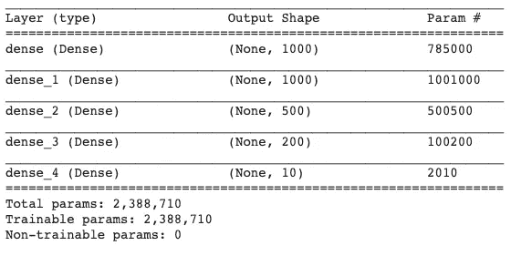
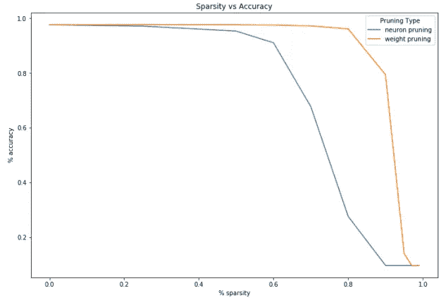
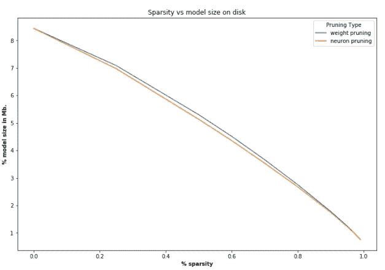

# 修剪深度神经网络

> 原文：<https://towardsdatascience.com/pruning-deep-neural-network-56cae1ec5505?source=collection_archive---------5----------------------->

## TL；修剪的不同方法，DR:通过修剪，基于 VGG-16 的分类器变得快 3 倍，小 4 倍

如今，深度学习模型需要大量的计算、内存和能力，这在我们需要实时推理或在计算资源有限的边缘设备和浏览器上运行模型的情况下成为瓶颈。能效是当前深度学习模型的主要关注点。解决这种效率的方法之一是启用推理效率。

**更大的型号= >更多的内存引用= >更多的能量**

Prunning 是一种推理方法，可以有效地生成尺寸更小、更节省内存、更省电、推理速度更快的模型，同时精确度损失最小，其他类似的技术还有权重共享和量化。深度学习从神经科学领域获得了灵感。深度学习中的修剪也是一个生物启发的概念，我们将在本文稍后讨论。

随着深度学习的进展，最先进的模型越来越准确，但这种进展是有代价的。我将在这个博客中讨论其中的一些。

## **第一个挑战——模特越来越大**

难以通过空中更新分发大型模型



Dally, NIPS’2016 workshop on Efficient Methods for Deep Neural Networks

## **第二个挑战:速度**



Training time benchmarked with fb.resnet.torch using four M40 GPUs

如此长的训练时间限制了 ML 研究员的生产力。

## **第三个挑战:能源效率**

AlphaGo: 1920 个 CPU 和 280 个 GPU，每局 3000 美元电费



*   在移动设备上:耗尽电池
*   在数据中心:增加总拥有成本

## **解答—高效的推理算法**

*   **修剪**
*   重量共享
*   量化
*   低秩近似
*   二元/三元网络
*   威诺格拉变换

## 修剪的生物灵感

人工神经网络中的修剪是从人脑中的 [**突触修剪**](https://en.wikipedia.org/wiki/Synaptic_pruning) 中得到的想法，其中[轴突](https://en.wikipedia.org/wiki/Axon)和[树突](https://en.wikipedia.org/wiki/Dendrite)完全衰退和死亡，导致许多[哺乳动物在幼儿期和青春期开始之间发生突触消除](https://en.wikipedia.org/wiki/Mammal)。修剪从出生时开始，一直持续到 25 岁左右。



Christopher A Walsh. Peter Huttenlocher (1931–2013). Nature, 502(7470):172–172, 2013.

## **修剪深度神经网络**



[Lecun et al. NIPS’89] [Han et al. NIPS’15]

网络通常看起来像左边的:下面一层中的每个神经元都与上面一层有联系，但这意味着我们必须将许多浮点相乘。理想情况下，我们只需将每个神经元连接到少数几个其他神经元上，省下一些乘法运算；这被称为“稀疏”网络。

稀疏模型更容易压缩，我们可以在推断过程中跳过零，以改善延迟。

如果你可以根据神经元的贡献大小对网络中的神经元进行排序，那么你就可以从网络中移除排序较低的神经元，从而形成一个更小、更快的网络。

**获得更快/更小的网络对于在移动设备上运行这些深度学习网络很重要。**

例如，可以根据神经元权重的 L1/L2 范数来进行排序。剪枝之后，准确率会下降(如果排序巧妙的话希望不会下降太多)，通常会对网络进行训练-剪枝-训练-剪枝迭代恢复。如果我们一次修剪太多，网络可能会被严重破坏，无法恢复。所以在实践中，这是一个迭代的过程——通常称为“迭代修剪”:修剪/训练/重复。

参见 [Tensorflow](https://www.tensorflow.org/) 团队编写的[代码，了解迭代修剪。](https://github.com/tensorflow/model-optimization/blob/master/tensorflow_model_optimization/g3doc/guide/pruning/pruning_with_keras.ipynb)

## 权重修剪

*   将权重矩阵中的单个权重设置为零。这相当于删除连接，如上图所示。
*   这里，为了实现 k%的稀疏性，我们根据权重矩阵 W 中各个权重的大小对它们进行排序，然后将最小的 k%设置为零。

```
f = h5py.File("model_weights.h5",'r+')
for k in [.25, .50, .60, .70, .80, .90, .95, .97, .99]:
 ranks = {}
 for l in list(f[‘model_weights’])[:-1]:
 data = f[‘model_weights’][l][l][‘kernel:0’]
 w = np.array(data)
 ranks[l]=(rankdata(np.abs(w),method=’dense’) — 1).astype(int).reshape(w.shape)
 lower_bound_rank = np.ceil(np.max(ranks[l])*k).astype(int)
 ranks[l][ranks[l]<=lower_bound_rank] = 0
 ranks[l][ranks[l]>lower_bound_rank] = 1
 w = w*ranks[l]
 data[…] = w
```

## 单元/神经元修剪

*   将权重矩阵中的所有列设置为零，实际上删除了相应的输出神经元。
*   这里，为了实现 k%的稀疏性，我们根据它们的 L2 范数对权重矩阵的列进行排序，并删除最小的 k%。

```
f = h5py.File("model_weights.h5",'r+')
for k in [.25, .50, .60, .70, .80, .90, .95, .97, .99]:
 ranks = {}
 for l in list(f[‘model_weights’])[:-1]:
     data = f[‘model_weights’][l][l][‘kernel:0’]
     w = np.array(data)
     norm = LA.norm(w,axis=0)
     norm = np.tile(norm,(w.shape[0],1))
     ranks[l] = (rankdata(norm,method=’dense’) —     1).astype(int).reshape(norm.shape)
     lower_bound_rank = np.ceil(np.max(ranks[l])*k).astype(int)
     ranks[l][ranks[l]<=lower_bound_rank] = 0
     ranks[l][ranks[l]>lower_bound_rank] = 1
     w = w*ranks[l]
     data[…] = w
```

自然地，当你增加稀疏度和删除更多的网络时，任务性能会逐渐降低。你认为稀疏性对性能的退化曲线会是怎样的？

使用简单的神经网络架构在 [MNIST](http://yann.lecun.com/exdb/mnist/) 数据集上修剪图像分类模型的结果，如下所示



The architecture that I used in the code given in reference



Use the [code](https://drive.google.com/open?id=1GBLFxyFQtTTve_EE5y1Ulo0RwnKk_h6J) to regenerate the graph



## 关键要点

许多研究人员认为修剪是一种被忽视的方法，在实践中会得到更多的关注和使用。我们展示了如何使用一个非常简单的神经网络架构在玩具数据集上获得好的结果。我认为深度学习在实践中用来解决的许多问题都类似于这个问题，在有限的数据集上使用迁移学习，所以他们也可以从修剪中受益。

## 参考

*   [*本帖代号*](https://drive.google.com/open?id=1GBLFxyFQtTTve_EE5y1Ulo0RwnKk_h6J)
*   *[*修剪，还是不修剪:探索模型压缩中修剪的功效*](https://arxiv.org/pdf/1710.01878.pdf) *，Michael H. Zhu，Suyog Gupta，2017**
*   *[*学习卷积神经网络中的剪枝滤波器*](https://arxiv.org/pdf/1801.07365.pdf) *，黄千贵等。艾尔，2018**
*   *[*修剪深层神经网络使其快速而小巧*](https://jacobgil.github.io/deeplearning/pruning-deep-learning)*
*   *[*用 Tensorflow 模型优化工具包*优化机器学习模型](https://www.tensorflow.org/model_optimization)*