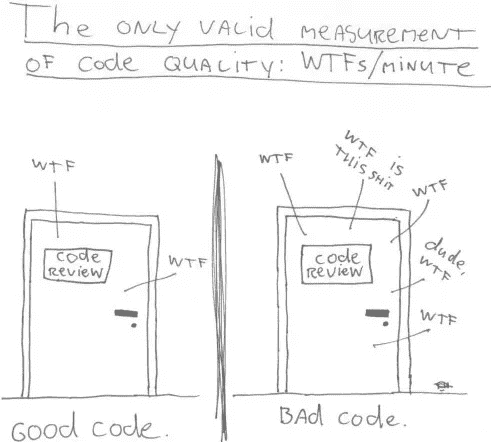
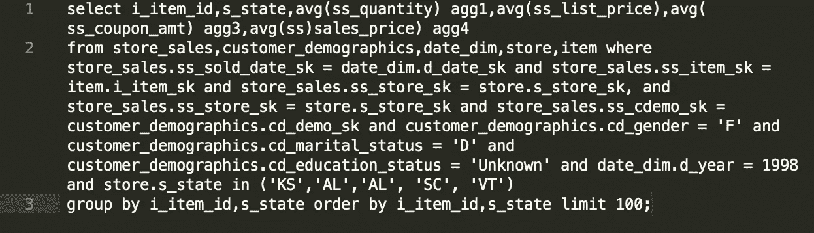
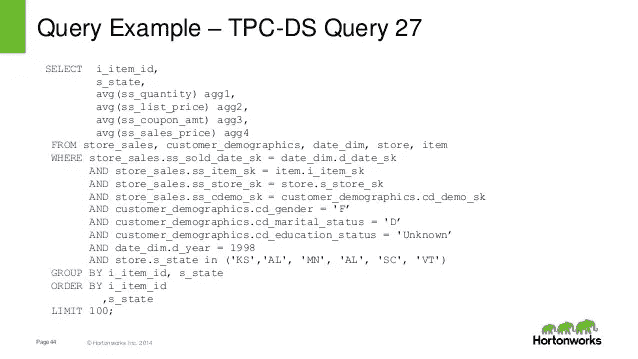
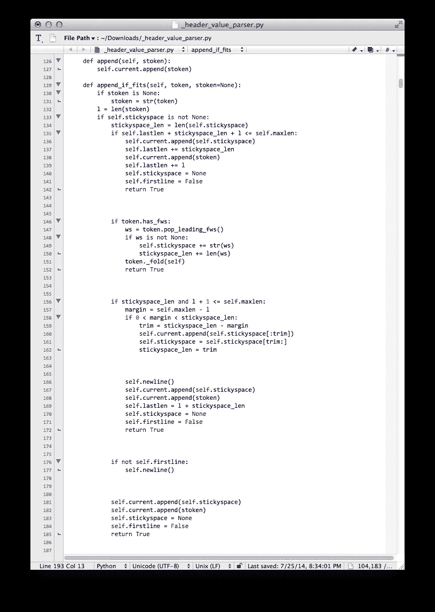

# 清晰地编码或者被憎恨

> 原文：<https://towardsdatascience.com/psa-code-legibly-or-be-hated-a3cdeb993f38?source=collection_archive---------23----------------------->

**代码被读取的次数比它被写入的次数多**

Source: Imgur

T 这是面向所有数据科学家的公共服务公告。请清晰地编码。如果不是为了你的合作者的理智，那也是为了你自己的理智 *x* 月/年后。

# **个人趣闻**

作为全国最佳贝叶斯统计项目的一名硕士生，我被勤奋、磨砺的头脑和富有挑战性的问题所包围。但可以说，我项目中最累人的部分是在我在那里的两年时间里给 1000 多名本科生的 R 代码评分。

我在寒冷、黑暗的房间里度过了许多漫长的周五夜晚，试图编译和执行他们的代码。当它们不可避免地失败，又一个新的错误信息出现时，我会低声吟唱来安慰自己:

> *“我们能行，我们能行，我们能行。”*

这是一次创伤性的经历，经常把我的助教们逼到精神崩溃的边缘……甚至更远。

*当然，给我们的代码打分的上层博士们要糟糕得多。我们的 12-15 名硕士生有编码作业，有时每个作业会产生 50 多页的输出...每周一次。我还记得我们的 TA 和他的眼泪。我听说他还在走廊里找人帮他给我们的作业打分。*

# **要点**

没有什么比看到两位数的 HiveQL/SQL 子查询嵌套和不考虑行字符最大值更糟糕的了。在阅读这些代码时，我几乎淹没在从我布满血丝的眼睛流出的红宝石般的血流中。

> 毕竟，你能想象在任何语言中阅读一段由数百行组成的段落是多么痛苦吗？每一行都有不同的字符长度，没有清晰的模式，每行的最大字数是冗长的，缺少标点符号，没有证据
> 
> *关于白色 s p a c e
> 压痕的清晰图案？*

The best metric for code assessment: WTFs per Minute (WTFM), averaged (weighted or unweighted) across multiple reviewers. (Image source: Thom Holwerda, [https://www.osnews.com/story/19266/wtfsm/](https://www.osnews.com/story/19266/wtfsm/))

好的编码保证了产品的连续性。文档就更好了。虽然文档并不令人兴奋，也不总是有回报，但它使其他人能够继续你的工作，并享受这样做。结果是更好的软件更容易维护。

好的编码是细致入微的:有些东西可能太多或太少，比如空白。这里有几个例子突出了优秀编码的复杂细微差别:

# 示例:空白太少

我认为这些图片已经足够说明问题了。

A comically illustrative example of poor white space utilization.

I wrote this as an example of poorly formatted HiveQL code. It is too dense and there is no logical separation of ideas/clauses in the code that allows for a quick and seamless reading.

The original query. Image source: [https://image.slidesharecdn.com/usinghive-151001173243-lva1-app6892/95/using-apache-hive-with-high-performance-44-638.jpg?cb=1443721144](https://image.slidesharecdn.com/usinghive-151001173243-lva1-app6892/95/using-apache-hive-with-high-performance-44-638.jpg?cb=1443721144)

# 示例:空白太多

当你不能一次看到所有相关的部分时，ode 就更难理解了。通过在大多数行之间插入一个空行，您可以看到的代码量减少了一半，并且可能没有充分利用宝贵的屏幕空间。

# 例子:没有普遍的规则

有时，没有一个单一的规则被多种语言所接受。例如，像每行最大字符数这样简单的事情在不同的语言中有不同的标准:

Max line length/character limits by language.\

# 结论

风格的一致性是编码项目的最高目标。只要一致，项目遵循哪些特定的惯例并不太重要。如果不处理不同代码段的不同缩进模式、命名约定和习惯用法，就很难理解大型系统。《Python》的作者 Guido Van Rossum 说得好:

> 风格指南是关于一致性的。与本风格指南保持一致非常重要。项目内部的一致性更重要。一个模块或功能内的一致性是最重要的。
> 
> 然而，要知道什么时候不一致——有时候风格指南的建议并不适用。当有疑问时，使用你最好的判断。看看其他例子，决定什么是最好看的。不要犹豫地问！

总之，遵循风格规则，直到你有足够的经验和合理的理由去打破它们！

以下是数据科学家常用语言的一些风格指南:

**Python**

*   [https://docs.python.org/2.0/ref/indentation.html](https://docs.python.org/2.0/ref/indentation.html)

**R**

*   [https://google.github.io/styleguide/Rguide.xml](https://google.github.io/styleguide/Rguide.xml)

**通用编码样式**

*   [https://en.wikipedia.org/wiki/Indentation_style](https://en.wikipedia.org/wiki/Indentation_style)

**Reddit**

*   [https://www.reddit.com/r/badcode/](https://www.reddit.com/r/badcode/)(针对用户提交的糟糕代码的例子)

**参考文献**

[1][https://www.codereadability.com/maximum-line-length/](https://www.codereadability.com/maximum-line-length/)
【2】[https://www . python . org/dev/peps/pep-0008/# a-foody-consistency-is-the-hobby-the-goblin-of-little-minds](https://www.python.org/dev/peps/pep-0008/#a-foolish-consistency-is-the-hobgoblin-of-little-minds)