# 处理小数据集的伪标记——什么、为什么和如何？

> 原文：<https://towardsdatascience.com/pseudo-labeling-to-deal-with-small-datasets-what-why-how-fd6f903213af?source=collection_archive---------0----------------------->

## 使用模型输出提高模型输出的指南！


TSNE Plot of MNIST Pseudo-Labeling

几天前，我看到了 Yoshua Bengio 对 Quora 问题的回复——“为什么无监督学习很重要？” *。*以下是他的回复摘录:

> 通过监督学习攀登人工智能阶梯可能需要通过显示大量这些概念出现的例子来“教”计算机所有对我们重要的概念。这不是人类学习的方式:是的，由于语言，我们得到了一些例子来说明给我们的新的命名概念，但我们观察到的大部分东西并没有被标记，至少最初是这样。

从神经科学的角度和实践的角度来看，他的回答都很有意义。标注数据在时间和金钱方面都很昂贵**。这个问题的显而易见的解决方案是找出一种方法:**

(a)使 ML 算法在没有标记数据的情况下工作(即无监督学习)

(b)自动标记数据或使用大量未标记数据和少量标记数据(即半监督学习)

正如 Yann LeCun 在这篇[文章](https://www.wired.com/2014/08/deep-learning-yann-lecun/)中提到的，无监督学习是一个很难解决的问题:

> “我们知道最终的答案是无监督学习，但我们还没有答案。”

然而，最近人们对半监督学习有了新的兴趣，这在学术和工业研究中都有所反映。这里有一张图表，显示了谷歌学术每年与半监督学习相关的研究论文数量。

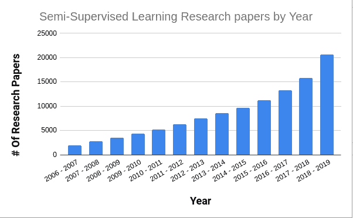

Semi-Supervised Learning Research Papers by Year

在这篇博客中，我们将深入研究伪标签——一种简单的半监督学习(SSL)算法。尽管伪标记是一种幼稚的方法，但它给我们提供了一个极好的机会来理解 SSL 面临的挑战，并提供了一个基础来学习一些现代的改进，如 MixMatch、虚拟对抗训练等。

## 大纲:

1.  什么是伪标签？
2.  理解伪标记方法
3.  实现伪标签
4.  伪标签为什么会起作用？
5.  伪标签什么时候效果不好？
6.  用传统的 ML 算法进行伪标记
7.  半监督学习的挑战

# 1.什么是伪标签？

伪标记方法由 [Lee 于 2013 年【1】](http://deeplearning.net/wp-content/uploads/2013/03/pseudo_label_final.pdf)首次提出，使用一小组已标记数据和大量未标记数据来提高模型的性能。这项技术本身非常简单，只需遵循 4 个基本步骤:

1.  基于一批标记数据的训练模型
2.  使用训练好的模型来预测一批未标记数据上的标签
3.  使用预测的标签来计算未标记数据的损失
4.  将标记的损失与未标记的损失和反向传播结合起来

…然后重复。

这种技术可能看起来很奇怪——几乎类似于 youtube 上数百个“免费能源设备”视频。然而，伪标记已经成功地用于几个问题。事实上，[在一场 Kaggle 竞赛](https://www.kaggle.com/c/santander-customer-transaction-prediction/discussion/89003)中，一个团队使用伪标签来提高他们模型的性能，以确保第一名并赢得 25，000 美元。

我们一会儿就来看看为什么会这样，现在，让我们来看看一些细节。

# 2.理解伪标记方法

伪标记在每批中同时用标记和未标记的数据训练网络。这意味着对于每批标记和未标记的数据，训练循环会:

1.  对贴有标签的批次进行一次正向传递以计算损耗→这是贴有标签的损耗
2.  对未标记的批次进行一次正向传递，以预测未标记的批次的“伪标签”
3.  使用这个“伪标签”来计算未标记的损失。

现在，Lee 建议使用权重，而不是简单地将未标记的损失与标记的损失相加。总损失函数如下所示:

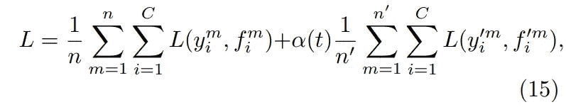

Equation [15] Lee (2013) [1]

或者用更简单的话说:

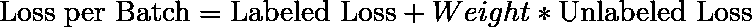

在等式中，权重(α)用于控制未标记数据对总损失的贡献。此外，重量是时间(历元)的函数，并且在训练期间缓慢增加。当分类器的性能可能很差时，这允许模型最初更多地关注标记的数据。随着模型的性能随着时间(时期)的增加，权重增加，未标记的损失更加强调整体损失。

Lee 建议对 alpha (t)使用以下等式:

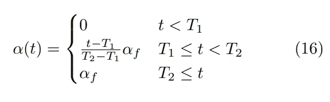

Equation [16] Lee (2013) [1]

其中α_ f = 3，T1 = 100，T2 = 600。所有这些都是基于模型和数据集而变化的超参数。

让我们看看 Alpha 如何随着时代的变化而变化:

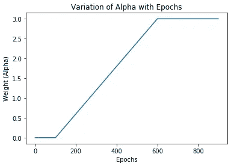

Variation of Alpha with Epochs

在第一个 T1 时段(本例中为 100)中，权重为 0-有效地强制模型仅根据标记的数据进行训练。在 T1 时段之后，权重线性增加到 alpha_f(在这种情况下为 3 ),直到 T2 时段(在这种情况下为 600 ),这允许模型缓慢地合并未标记的数据。T2 和 alpha_f 分别控制权重增加的速率和饱和后的值。

*如果你熟悉最优化理论，你可能会从* [*模拟退火*](https://en.wikipedia.org/wiki/Simulated_annealing) *中认出这个方程。*

这就是从实现的角度理解伪标签的全部内容。该白皮书使用 MNIST 来报告性能，因此我们将坚持使用相同的数据集，这将有助于我们检查我们的实现是否正常工作。

# 3.实现伪标签

我们将使用 PyTorch 1.3 和 CUDA 来实现，尽管使用 Tensorflow/Keras 应该也没有问题。

## 模型架构:

虽然本文使用了一个简单的 3 层全连接网络，但在测试过程中，我发现 Conv 网络的性能要好得多。我们将使用一个简单的 2 Conv 层+ 2 全连接层网络，并带有 dropout(如本[报告](https://github.com/peimengsui/semi_supervised_mnist)中所述)

Model Architecture for MNIST

## 基准性能:

我们将使用 1000 个标记图像(类别平衡)和 59，000 个未标记图像用于训练集，10，000 个图像用于测试集。

首先，让我们在不使用任何未标记图像(即简单的监督训练)的情况下检查 1000 个标记图像的性能

```
Epoch: 290 : Train Loss : 0.00004 | Test Acc : 95.57000 | Test Loss : 0.233
```

对于 1000 幅标记图像，最佳测试准确率为 95.57%。现在我们有了基线，让我们继续伪标签实现。

## 伪标签实现:

对于实现，我们将做两个小的更改，使代码更简单，性能更好:

1.  在前 100 个历元中，我们将像往常一样在标记数据上训练模型(没有未标记的数据)。正如我们之前看到的，这与伪标记没有区别，因为在此期间 alpha = 0。
2.  在接下来的 100+个时期中，我们将对未标记的数据进行训练(使用 alpha 权重)。这里，对于每 50 个未标记的批次，我们将在已标记的数据上训练一个时期—这充当校正因子。

如果这听起来令人困惑，不要担心，这在代码中要容易得多。这次修改是基于这个 Github [回购](https://github.com/peimengsui/semi_supervised_mnist)，它在两个方面有帮助:

1.  它减少了对标记的训练数据的过度拟合
2.  提高了速度，因为我们只需要每批向前传递 1 次(在未标记的数据上)，而不是论文中提到的 2 次(未标记和已标记)。

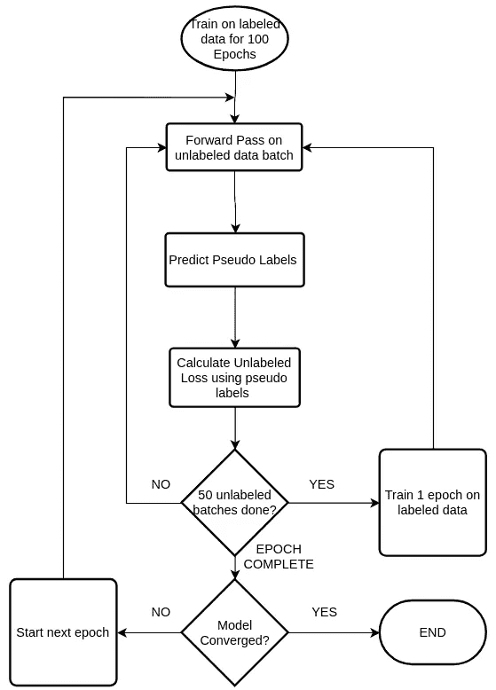

Flowchart

Pseudo-Labeling Loop for MNIST

*注意:我这里不包括监督训练的代码(前 100 个时期),因为它非常简单。你可以在我的* [*回购这里*](https://github.com/anirudhshenoy/pseudo_labeling_small_datasets) 找到所有代码

以下是对标记数据进行 100 个时期的训练，然后进行 170 个时期的半监督训练后的结果:

```
# Best Accuracy is at 168 epochsEpoch: 168 : Alpha Weight : 3.00000 | Test Acc : 98.46000 | Test Loss : 0.075
```

在使用未标记数据后，我们达到了 98.46%的准确率，比监督训练高出了 3%。事实上，我们的结果比论文的结果更好——1000 个标记样本的准确率为 95.7%。

让我们做一些可视化来理解伪标签是如何工作的。

**阿尔法权重与准确度**

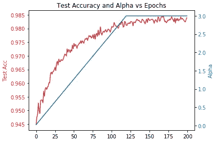

Alpha vs Epochs

很明显，随着 alpha 的增加，测试精度也慢慢增加，然后达到饱和。

**TSNE 可视化**

现在让我们看看伪标签是如何在每个时期被分配的。在下面的图中，有 3 点需要注意:

1.  每一簇背景中淡淡的颜色才是真正的标签。这是使用所有 60k 训练图像(使用标签)的 TSNE 创建的
2.  每个聚类中的小圆圈来自监督训练阶段使用的 1000 幅训练图像。
3.  不断移动的小星星是模型为每个历元的未标记图像分配的伪标记。(对于每个时期，我使用了大约 750 张随机采样的未标记图像来创建绘图)

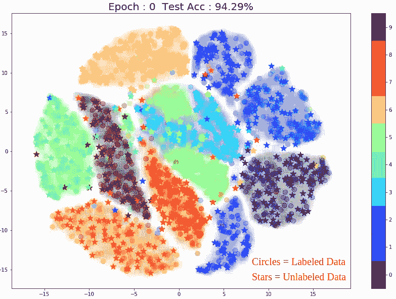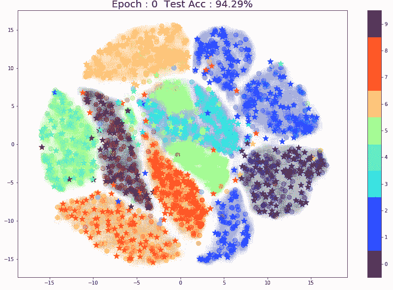

TSNE Animation

以下是一些需要注意的事项:

1.  伪标签大部分都是对的。(恒星在具有相同颜色的星团中)这可以归因于较高的初始测试准确度。
2.  随着训练的继续，正确伪标签的百分比增加。这反映在模型的整体测试精度的提高上。

这里有一个图显示了在第 0 时段(左)和第 140 时段(右)的**相同的** 750 点。我已经用红圈标出了改进的点。

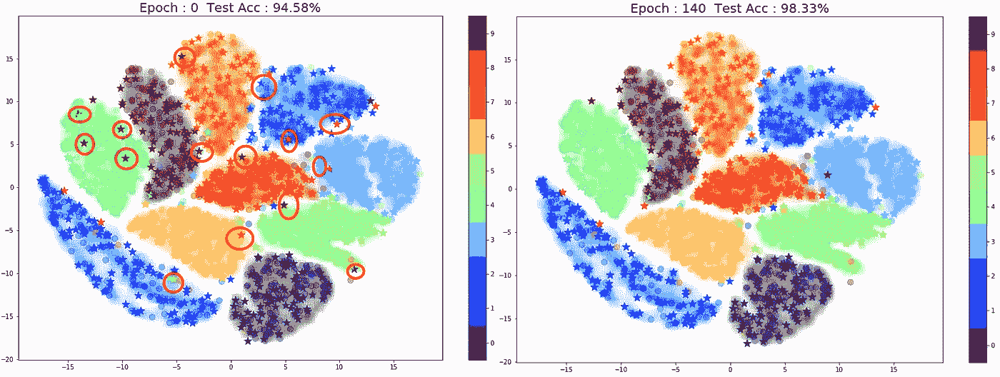

*(Note: This TSNE plot only show 750 unlabeled samples out of 59000 pts)*

现在我们来看看为什么伪标签实际上是有效的。

# 4.伪标签为什么会起作用？

任何半监督学习算法的目标都是使用未标记和标记样本来学习数据的底层结构。伪标签能够通过做出两个重要的假设来做到这一点:

1.  **连续性假设(平滑度)** : *彼此靠近的点更有可能共享一个标签。(* [*维基*](https://en.wikipedia.org/wiki/Semi-supervised_learning#Continuity_assumption) *)* 换句话说，输入的小变化**不会引起输出的大变化**。这种假设允许伪标记推断图像中的小变化如旋转、剪切等不会改变标记。
2.  **聚类假设** : *数据往往会形成离散的聚类，而分在* ***中的同一个聚类*** *更有可能与* ***共用一个标签*** 。*这是连续性假设* ( [维基百科](https://en.wikipedia.org/wiki/Semi-supervised_learning#Cluster_assumption))的一个特例，另一种看待这个问题的方式是——类之间的决策边界位于低密度区域*(这样做有助于泛化——类似于 SVM 这样的最大间隔分类器)。*

这就是初始标记数据非常重要的原因，它有助于模型了解底层的聚类结构。当我们在代码中分配一个伪标签时，我们使用模型已经学习的聚类结构来推断未标记数据的标签。随着训练的进行，使用未标记的数据来改进所学习的聚类结构。

如果初始标记的数据太小或包含离群值，伪标记可能会将不正确的标记分配给未标记的点。相反的情况也成立，即伪标记可以受益于仅用标记数据就已经表现良好的分类器。

在下一节中，当我们查看伪标签失败的场景时，这应该更有意义。

# 5.伪标签什么时候效果不好？

## 初始标记数据不足以确定聚类

为了更好地理解这种情况，让我们进行一个小实验:不使用 1000 个初始点，让我们采取极端情况，只使用 10 个标记点，看看伪标记如何执行:

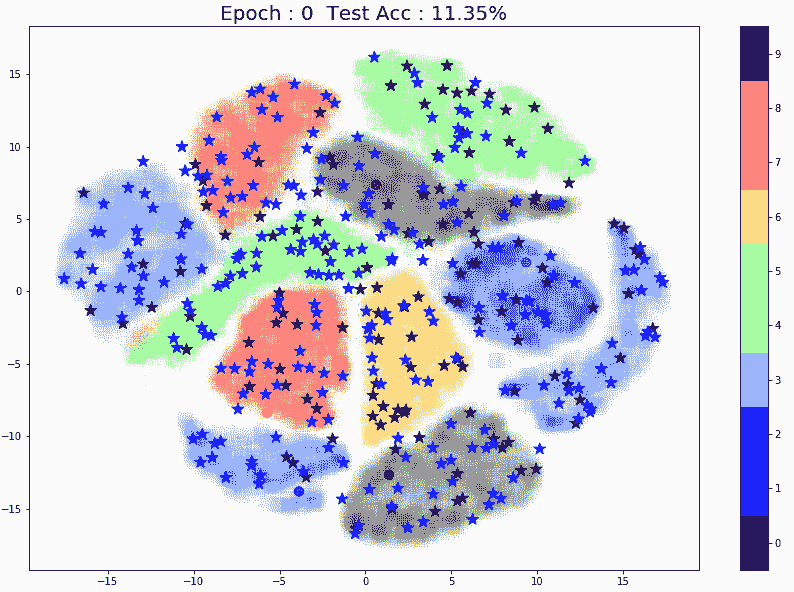

10 Initial Labeled Points

不出所料，伪标几乎没有区别。模型本身和随机模型一样好，精度 10%。由于每个类实际上只有 1 个点，该模型无法学习任何类的底层结构。

让我们将标记点的数量增加到 20(每节课 2 点) :

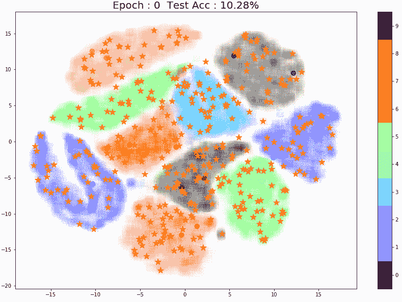

20 Initial Labeled Points

现在，该模型的性能略有提高，因为它学习了一些类的结构。这里有一些有趣的东西-请注意，伪标注为这些点(下图中用红色标记)分配了正确的标注，这很可能是因为附近有两个标注点。

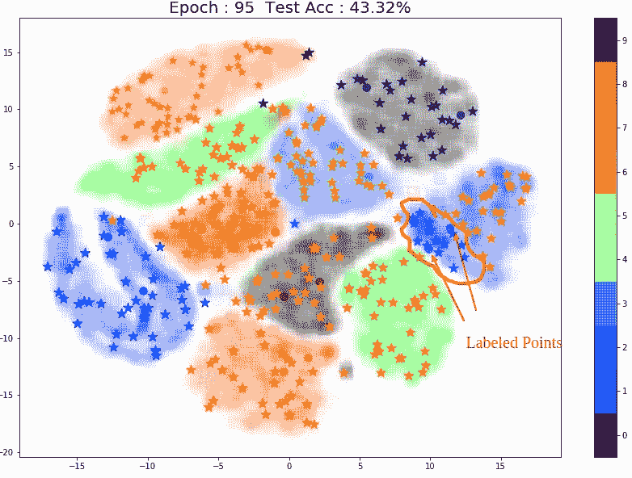

Small Cluster near labeled points

最后，让我们试试 50 分:

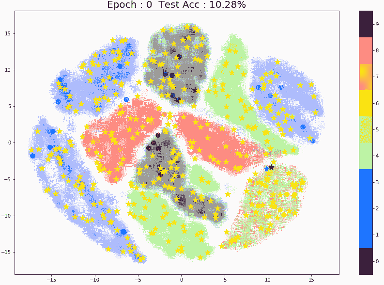

50 Labeled Points

性能好多了！再一次，注意图像正中央的一小组棕色标记的点。同一个棕色聚类中距离标记点较远的点总是被错误地预测为水绿色(“4”)或橙色(“7”)。

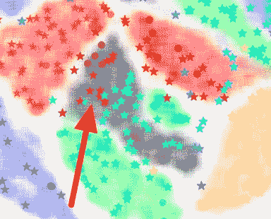

Pseudo Labels near labeled points

需要注意一些事情:

1.  对于上述所有实验(10 分、20 分和 50 分)，标记点的选择方式产生了巨大的差异。任何异常值都会完全改变模型的性能和对伪标签的预测。这是小数据集的常见问题。(*你可以阅读* [*我之前的博客*](/text-classification-with-extremely-small-datasets-333d322caee2) *我已经详细讨论过这个问题了)*
2.  虽然 TSNE 是一个很好的可视化工具，但我们需要记住，它是概率性的，仅仅给了我们一个关于星团如何在高维空间中分布的想法。

总之，当涉及伪标记时，初始标记点的数量和质量都会产生影响。此外，模型可能需要不同类的不同数量的数据来理解特定类的结构。

## 初始标记数据不包括某些类别

让我们看看如果标记的数据集不包含一个类会发生什么(例如:“7”不包含在标记的集中，但未标记的数据仍然保留所有类)

在标记数据上训练 100 个时期后:

```
Test Acc : 85.63000 | Test Loss : 1.555
```

在半监督训练后:

```
Epoch: 99 : Alpha Weight : 2.50000 | Test Acc : 87.98000 | Test Loss : 2.987
```

总体准确度确实从 85.6%增加到 87.98%，但是之后没有显示出任何改进。这显然是因为模型无法学习类标签“7”的聚类结构。

下面的动画应该清楚地说明了这些:

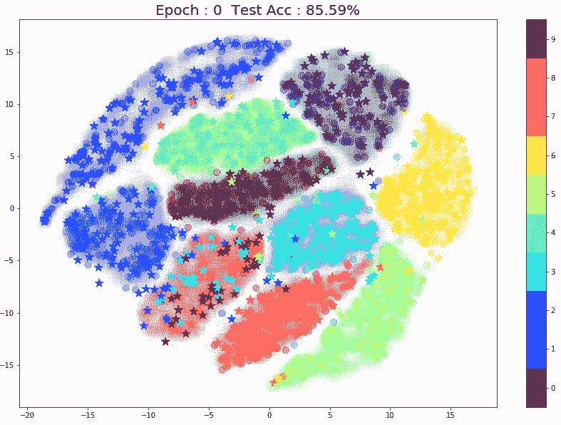

Animation for pseudo-labeling with a missing class

毫不奇怪，伪标签在这里很困难，因为我们的模型没有能力学习它以前从未见过的类。然而，在过去几年中，人们对零触发学习技术表现出了极大的兴趣，这种技术使模型能够识别标签，即使它们不存在于训练数据中。

## 数据增加没有任何好处

在某些情况下，模型可能不够复杂，无法利用额外的数据。这通常发生在将伪标记与传统的 ML 算法(如逻辑回归或 SVM)一起使用时。当谈到深度学习模型时，正如吴恩达在他的 Coursera 课程中提到的那样——大型 DL 模型几乎总是受益于更多的数据。

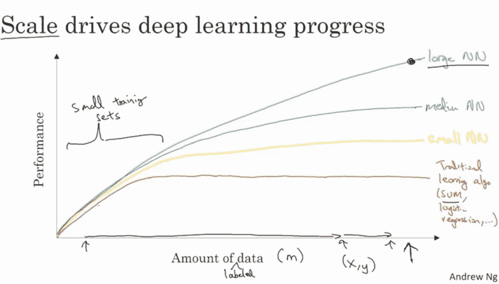

Andrew Ng — Coursera Deep Learning Specialization

# 6.用传统的 ML 算法进行伪标记

在这一节中，我们将把伪标签概念应用于逻辑回归。我们将使用相同的 MNIST 数据集，包括 1000 张标记图像、59000 张未标记图像和 10000 张测试图像。

## 特征工程

我们首先将所有的图像归一化，然后进行 PCA 分解，从 784 维分解到 50 维。接下来，我们将使用 sklearn 的 degree = 2 的`PolynomialFeatures()`来添加交互和二次特性。这使得我们每个数据点有 1326 个特征。

## 数据集规模增加的影响

在我们开始伪标记之前，让我们检查一下当训练数据集大小缓慢增加时，逻辑回归是如何执行的。这将有助于我们了解模型是否可以从伪标签中受益。

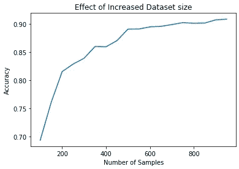

随着训练数据集中的样本数量从 100 增加到 1000，我们看到准确性慢慢增加。此外，看起来准确性并没有停滞不前，而是呈上升趋势。由此，我们可以得出这样的结论:伪标签应该可以提高我们的性能。

## 基准性能:

让我们检查当逻辑回归只使用 1000 个标记图像时的测试准确性。我们将进行 10 次训练，以考虑测试分数的任何变化。

```
from sklearn.linear_model import SGDClassifiertest_acc = []
for _ in range(10):
    log_reg  = SGDClassifier(loss = 'log', n_jobs = -1, alpha = 1e-5)
    log_reg.fit(x_train_poly, y_train)
    y_test_pred = log_reg.predict(x_test_poly)
    test_acc.append(accuracy_score(y_test_pred, y_test))

print('Test Accuracy: {:.2f}%'.format(np.array(test_acc).mean()*100))**Output:** Test Accuracy: 90.86%
```

我们使用逻辑回归的基线测试准确率为 90.86%

## 伪标签实现:

当使用逻辑回归和其他传统的 ML 算法时，我们需要以稍微不同的方式使用伪标记，尽管概念是相同的。

以下是步骤:

1.  我们首先在我们的标记训练集上训练一个分类器。
2.  接下来，我们使用这个分类器从无标签数据集中预测随机采样集上的标签。
3.  我们组合原始训练集和预测集，并在这个新数据集上重新训练分类器。
4.  重复步骤 2 和 3，直到使用完所有未标记的数据。

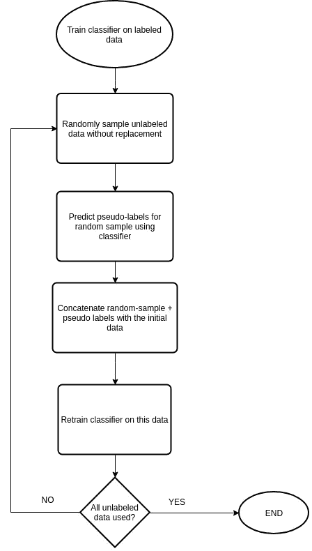

Flowchart for Pseudo-Labeling with conventional ML Algos

这种技术与这篇[博客](https://www.analyticsvidhya.com/blog/2017/09/pseudo-labelling-semi-supervised-learning-technique/)中提到的略有相似。然而，这里我们递归地生成伪标签，直到所有未标记的数据都被使用。阈值也可以用于确保只为模型非常确信的点生成伪标签(尽管这不是必需的)。

以下是围绕 sklearn 估算器的包装实现:

Pseudo-Labeling Wrapper for Logistic Regression

*(完整代码可在* [*回购*](https://github.com/anirudhshenoy/pseudo_labeling_small_datasets) *)*

现在我们可以把它和逻辑回归一起使用:

```
from sklearn.linear_model import SGDClassifierlog_reg = SGDClassifier(loss = 'log', n_jobs = -1, alpha = 1e-5)pseudo_labeller = pseudo_labeling(
        log_reg,
        x_unlabeled_poly,
        sample_rate = 0.04,
        verbose = True
    )pseudo_labeller.fit(x_train_poly, y_train)y_test_pred = pseudo_labeller.predict(x_test_poly)
print('Test Accuracy: {:.2f}%'.format(accuracy_score(y_test_pred, y_test)*100))**Output:**
Test Accuracy: 92.42%
```

伪标记将准确率从 90.86%提高到 92.42%。*(具有更高复杂性的非线性模型，如 XGBoost，可能执行得更好)*

这里，`sample_rate`类似于深度学习模型例子中的`alpha(t)`。以前，alpha 用于控制使用的未标记丢失的数量，而在这种情况下,`sample_rate`控制在每次迭代中使用多少未标记的点。

`sample_rate`值本身是一个超参数，需要根据数据集和模型*进行调整(类似于 T1、T2 和 alpha_f)。*值 0.04 最适合 MNIST +逻辑回归示例。

一个有趣的修改是安排`sample_rate`随着训练的进行而加速，就像`alpha(t).`一样

在我们结束之前，让我们看看半监督学习中的一些挑战。

# 7.半监督学习的挑战

## 将未标记数据与标记数据相结合

半监督学习的主要目标是使用未标记数据和标记数据来理解数据集的底层结构。这里显而易见的问题是——如何利用未标记的数据来达到这个目的？

在伪标记技术中，我们看到使用预定的权重函数(`alpha`)来缓慢地将未标记的数据与标记的数据相结合。然而，`alpha(t)`函数假设模型置信度随时间增加，因此线性增加未标记的损失。不一定是这种情况，因为模型预测有时可能不正确。事实上，如果模型做出了几个错误的未标记预测，伪标记可能会像一个糟糕的反馈循环一样，进一步恶化性能。*(参考:第 3.1 节* [*阿拉佐等人 2019*](https://arxiv.org/abs/1908.02983)*【2】)*

上述问题的一个解决方案是使用概率阈值——类似于我们对逻辑回归所做的。

其他半监督学习算法使用不同的方式来组合数据，例如，MixMatch 使用两步过程来猜测标签(对于未标记的数据),然后使用 MixUp 数据扩充来组合未标记的数据和标记的数据。([贝特洛等(2019)[3]](https://arxiv.org/abs/1905.02249) )

## 数据效率

半监督学习的另一个挑战是设计可以处理非常少量的标记数据的算法。正如我们在伪标记中看到的，该模型对 1000 个初始标记样本的效果最好。然而，当标注数据集进一步减少时(例如:50 个点)，伪标注的性能开始下降。

[Oliver et al .(2018)](https://arxiv.org/abs/1804.09170)【4】对几种半监督学习算法进行了比较，发现伪标记在“two-moons”数据集上失败，而 VAT 和 pi-model 等其他模型工作得更好。

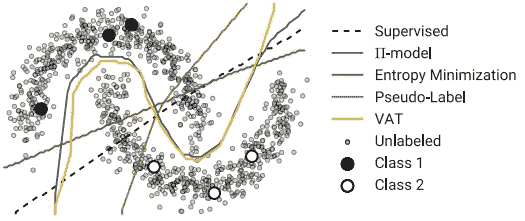

Source: Oliver et al (2018) [4]

如图所示，VAT 和 Pi-Model 学习了一个决策边界，仅用 6 个带标签的数据点(显示在白色和黑色的大圆圈中)就取得了惊人的效果。另一方面，伪标记完全失败，取而代之的是学习线性决策边界。

我使用 Oliver 等人使用的相同模型重复了实验，发现伪标记需要 30-50 个标记点(取决于标记点的位置)来学习底层数据结构。

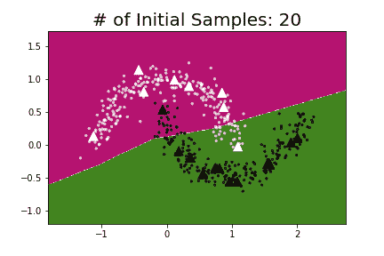

Pseudo-Labeling on Two Moons Dataset. Triangles are labeled points.

为了使半监督学习更加实用，我们需要数据效率高的算法，即可以在非常少量的标记数据上工作的算法。

# 8.结论

Oliver 等人[4]提到:“*伪标记是一种简单的启发式方法，在实践中被广泛使用，可能是因为它的简单性和通用性*”，正如我们所见，它提供了一种学习半监督学习的好方法。

在过去的 2-3 年中，用于图像分类的半监督学习已经取得了一些令人难以置信的进步。无监督数据增强([谢等(2019) [5]](https://arxiv.org/abs/1904.12848) )在 CIFAR- 10 上仅用 4000 个标签就取得了 97.3%的效果。为了客观地看待这一点，DenseNet ( [黄等人(2016](https://arxiv.org/pdf/1608.06993v5.pdf) )[6])在 2016 年在完整的 CIFAR-10 数据集上实现了 96.54%。

看到机器学习和数据科学社区如何转向使用更少标记数据(如半监督学习、零/少量学习)或更小数据集(如迁移学习)的算法，真的很有趣。就个人而言，我认为如果我们真的想为所有人普及人工智能，这些发展是至关重要的。

如果你有任何问题，请随时与我联系。我希望你喜欢！

**Github Repo:**[https://Github . com/anirudhshenoy/pseudo _ labeling _ small _ datasets](https://github.com/anirudhshenoy/pseudo_labeling_small_datasets)

**数据集:**[https://www.kaggle.com/oddrationale/mnist-in-csv](https://www.kaggle.com/oddrationale/mnist-in-csv)

## 参考资料:

1.  李东炫。“伪标签:深度神经网络的简单有效的半监督学习方法”ICML 2013 研讨会:表征学习的挑战(WREPL)，美国佐治亚州亚特兰大，2013 年([http://Deep Learning . net/WP-content/uploads/2013/03/Pseudo _ Label _ final . pdf](http://deeplearning.net/wp-content/uploads/2013/03/pseudo_label_final.pdf))
2.  埃里克阿拉索，迭戈奥特戈，保罗阿尔伯特，诺埃尔奥康纳，凯文麦克吉尼斯。“深度半监督学习中的伪标记和确认偏差”([https://arxiv.org/abs/1908.02983](https://arxiv.org/abs/1908.02983))
3.  大卫·贝特洛，尼古拉斯·卡里尼，伊恩·古德菲勒，尼古拉斯·帕伯诺，阿维塔尔·奥利弗，科林·拉斐尔。“混合匹配:半监督学习的整体方法”([https://arxiv.org/abs/1905.02249](https://arxiv.org/abs/1905.02249))
4.  "阿维塔尔·奥利弗，奥古斯都·奥登纳，科林·拉斐尔，艾金·d·库布克，伊恩·j·古德菲勒. "深度半监督学习算法的现实评估”([https://arxiv.org/abs/1804.09170](https://arxiv.org/abs/1804.09170))
5.  谢启哲，戴子航，Eduard Hovy，Minh-Thang Luong，郭诉乐。“用于一致性训练的无监督数据扩充”([https://arxiv.org/abs/1904.12848](https://arxiv.org/abs/1904.12848))
6.  黄高，刘庄，劳伦斯·范·德·马滕，基利安·q·温伯格。“密集连接的卷积网络”(【https://arxiv.org/abs/1608.06993】T2)
7.  【https://github.com/peimengsui/semi_supervised_mnist 
8.  [https://www . analyticsvidhya . com/blog/2017/09/pseudo-labeling-semi-supervised-learning-technique/](https://www.analyticsvidhya.com/blog/2017/09/pseudo-labelling-semi-supervised-learning-technique/)
9.  [https://www . quora . com/Why-is-unsupervised-learning-important](https://www.quora.com/Why-is-unsupervised-learning-important)
10.  [https://www.wired.com/2014/08/deep-learning-yann-lecun/](https://www.wired.com/2014/08/deep-learning-yann-lecun/)