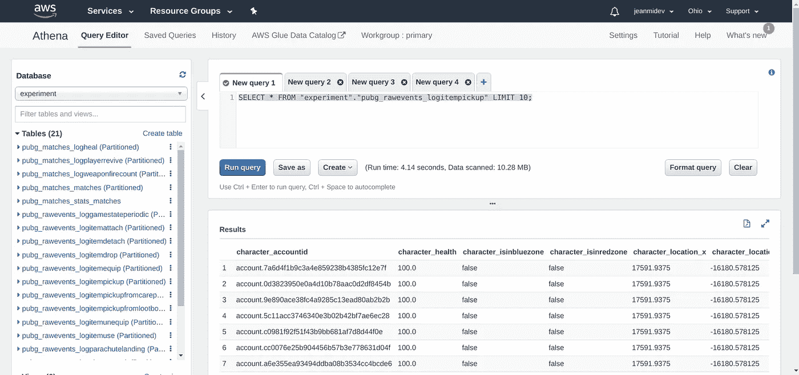
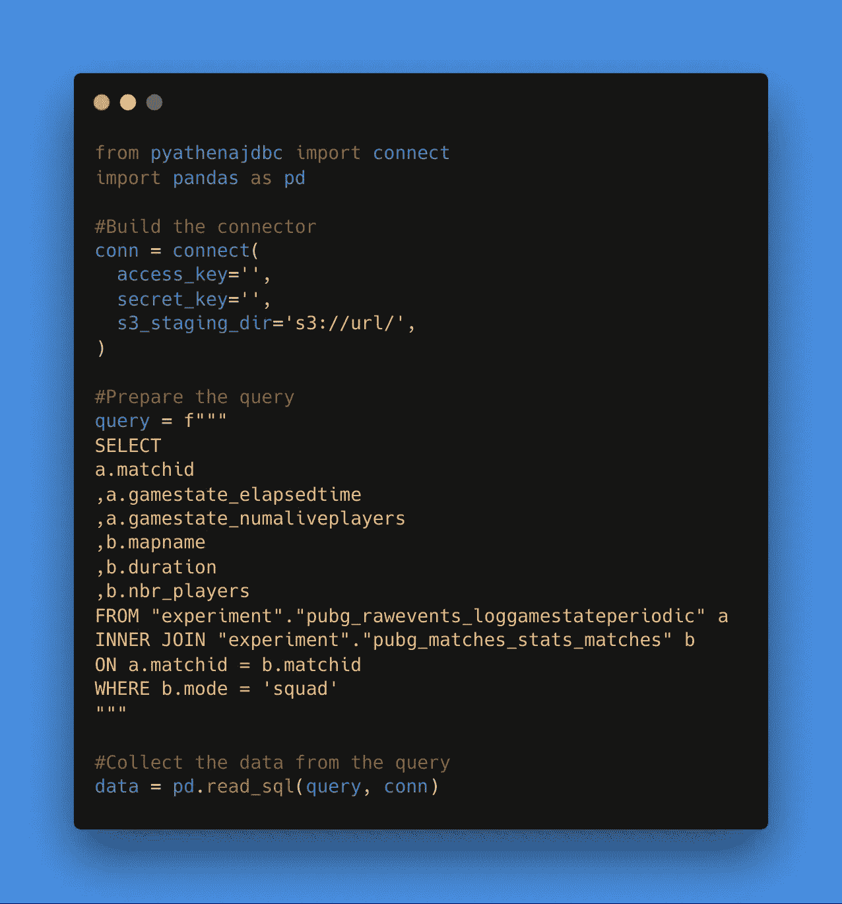
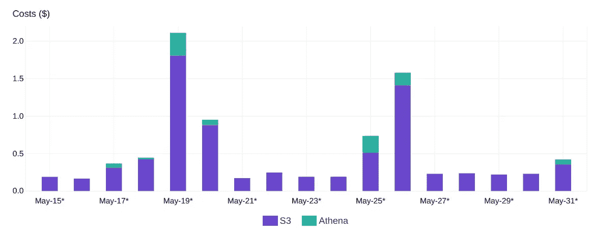
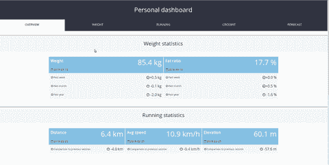

# PUBG —使用 AWS 和 Plotly 进行分析

> 原文：<https://towardsdatascience.com/pubg-make-analytics-with-aws-and-plotly-17639a692e10?source=collection_archive---------25----------------------->

# Athena 和 cufflinks 在 PUBG 数据分析中的应用

对于本文，我将开始分析用本文中解释的管道提取的数据。这篇[文章](http://the-odd-dataguy.com/PUBG1)的目标也是:

*   获取 AWS athena 简介
*   使用 plotly 深入了解数据
*   更好地理解视频游戏 PUBG 的消费

PUBG 是一个被定义为皇家战役的游戏，其中的原则是有 X 个人(或小队)被投放到一个岛上，目标是通过使用随机部署在岛上的物品和武器成为岛上的最后一个幸存者。为了增加游戏中的紧张感(并给它一个结尾)，地图中可用的部分会有规律地减少，以促使玩家为自己的生命而战。

就游戏性而言，有多个岛屿可用(每个岛屿都有自己的环境，如沙漠，雪地)，你可以在不同的模式下玩(单人，双人小队)，有时相机可以预定义(fpp 仅适用于第一人称玩家或第一/第三人称相机)

# 雅典娜概述

Athena 是亚马逊开发的一项服务，旨在让用户能够在不使用服务器或数据仓库的情况下，轻松地从 S3 桶中查询数据。这是一个在 web 浏览器上使用 Athena 的界面示例。

开发的系统在数据格式方面非常开放，可以使用 CSV、JSON、ORC、Avro 和 Parquet。

该系统的核心是建立在被定义为开源分布式 SQL 查询引擎的 [Presto](https://prestodb.github.io/) 之上。这个项目的主要用户之一是围绕交互式分析、批量 ETL、A/B 测试和开发者广告分析的各种主题的[脸书](https://www.facebook.com/notes/facebook-engineering/presto-interacting-with-petabytes-of-data-at-facebook/10151786197628920/)。

有一篇关于 Presto 的很好的[文章](https://research.fb.com/publications/presto-sql-on-everything/)详细介绍了引擎的所有机械。

这个工具的一些其他大用户是网飞和 Airbnb，他们正在围绕这种系统建立服务。

如果我们回到 Athena 服务，无服务器系统很有趣，因为计费只基于扫描的数据。因此，对于想要处理大量“大”数据而不处理所有基础设施(这是一项全职工作)的人来说，S3 +雅典娜组合确实是一个很好的组合。

为了将 AWS Athena 连接到 python 脚本，有一个可以安装的包[pyathenaidbc](https://pypi.org/project/PyAthenaJDBC/)，它将安装一个可以在 pandas 数据框架中使用的连接器。这是一个连接数据的脚本示例。

代码非常简单，看起来像是对经典 postgreSQL 数据库的调用。为了让成本更加透明，我们用图表展示了实验的成本。

真正的数量是来自 S3 读数和雅典娜激活，每天分析不到 2 美元(这个实验只有 4 美元)。

让我们开始分析与 PUBG 相关的数据。

# 收集数据的状态

管道在 2019 年 1 月 26 日至 2019 年 4 月 5 日之间运行了一个多月，这段时间代表了大约 69000 场比赛，因此要处理的数据量相当有趣(比赛期间收集的事件量)。

就区域和平台而言，管道的重点是从北美的 PC 平台提取数据。

在本次分析中，我将重点关注 3 个事件:

*   gamestat 周期，大约是 11 00 万行
*   玩家杀死，那大约是 7 00 万行
*   使用的项目大约有 19 00 万行

# 普罗特利公司

我是 plotly 库的忠实粉丝，去年我写了一篇[文章](http://the-odd-dataguy.com/metricsdash)，是关于一个闪亮的 python 包，名为 [Dash](https://plot.ly/products/dash/) ，由 plotly 提供支持，它真的是一个很酷的包，使得用 Python 构建 dashboard 更加容易。

该软件包是由总部设在蒙特利尔的公司 Plotly 开发的，所以我们实际上是邻居(真的就像 4 分钟的步行时间)。

原始包是一个非常酷的库，可以基于 [D3.js](https://d3js.org/) 免费制作交互式图表，他们提供了在他们的图表工作室部署所制作的图表的可能性(免费版本提供了在他们的平台上托管 25 个图表的可能性，但是使用[高级帐户](https://plot.ly/products/cloud/)你可以托管更多图表/数据)

就用法而言，最初的语法有点“沉重”,因此有人开发了包装器，以方便在一个以上的线性样式上构建图形:

对于这篇文章，我只使用袖扣，但我正计划使其他文章将使用 plotly express。

# 提取的数据

老实说，有很多网站做了类似的分析，比如 [PUBGmap.io](https://PUBGmap.io/) ，但是做不同的分析和比较仍然很有趣。

有一个基于地图和模式收集的匹配的表示。

最受欢迎的模式是小队模式，地图野蛮。对于下面的分析，我将把重点放在模式**小队**。

# 比赛持续时间

就持续时间而言，我为每张地图抽取了一个匹配样本(1000 个匹配)，并且有一些箱线图。

地图野蛮人看起来在持续时间上有不同的表现，这可以通过比其他人小得多的大小来解释(中间值有 5 分钟的差异)。

# 比赛的演变

对于玩家的寿命，在下图中显示了玩家存活的百分比与地图中完成比赛的百分比。

在比赛开始时，大部分玩家都活着，这与地图上所有玩家的着陆时刻有关。就活着的玩家的进化而言，这张地图似乎没有一直进化下去，这张地图比另一张“更平滑”，艾朗格尔和迪霍洛托克非常相似，而萨维奇似乎是最暴力的一个(这可以通过地图的格式来解释)。

# 武器使用

就用于杀人的武器而言，这一时期每种武器的杀人数量分布情况。

游戏中有多种类型的武器，从手枪，步枪，猎枪或弩，但最受欢迎的是 AK47，在武器的顶部有很多步枪。

杀戮事件中另一个真正有趣的数据是最后一枪在身体上的位置，下图是最后一枪的位置在每个武器上的重新分配。

爆头的部分在武器的功能上是不同的，手枪看起来没有步枪精确(这是有道理的)

另一个有趣的见解是，一些武器似乎是地图特定的，在下图中有每个地图的武器分布。

# 支持项目用途

作为总结，我决定对游戏中的治疗和助推器的使用有一个总体的了解，在下面的图中，事件的演变使用了一个治疗对象和一个助推器对象来完成比赛。

对于助推器，在 40%的比赛中肯定有一个峰值，但是对于治疗对象，在 15%中有第一个凸起，这是指第一波被淘汰的球员，峰值在第二阶段淘汰的比赛中间。

这篇文章介绍了我将对从 PUBG 收集的数据进行的更多工作，我将重点关注 PUBG 上关于位置数据的未来文章，该数据集代表大约 500，00 0，00 0 行，因此会更有趣。

*最初发表于*[*【http://the-odd-dataguy.com】*](http://the-odd-dataguy.com)*。*