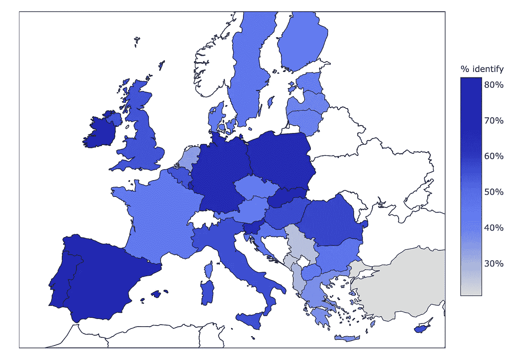
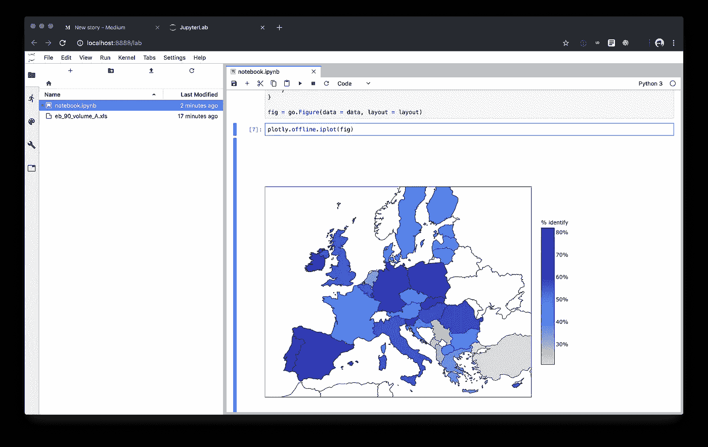

# 使用 Jupyter、Github 和 Kyso 将数据科学文章发布到网络上

> 原文：<https://towardsdatascience.com/publish-data-science-articles-to-the-web-using-jupyter-github-and-kyso-3721b8336946?source=collection_archive---------24----------------------->

## *结合这 3 个工具来增强你的 DS 工作流程*

数据科学正在飞速发展，越来越多的组织使用数据来推动一切。但是有时候发布基于数据科学的报告还是有点困难。这可能是因为图表是交互式的，或者是因为您想要一个可复制的文档，或者是因为从数据科学工具转移到可读性更好的格式可能很困难。

在这篇文章中，我将介绍如何在 Jupyter 笔记本、Github 和 Kyso 中使用 python，我们可以在几分钟内从获得一些原始数据到在网络上发布一个非常棒的图表。



# 让我们开始分析一些数据

我首先假设你已经安装了 python3 否则去 https://www.python.org/[下载它。然后，让我们安装 Jupyterlab 和 plotly 扩展，以获得出色的交互式图表。](https://www.python.org/)

```
pip3 install jupyterlab
jupyter labextension install @jupyterlab/plotly-extension
```

那么让我们从 Jupyterlab 开始

```
jupyter lab
```

让我们下载一些数据来玩玩，我用最近的欧洲晴雨表数据来看看有多少人在欧盟认同欧盟国旗，这里有。

所以现在你应该已经打开了 Jupyter 这是一个很好的交互地方，你可以在这里输入结果并看到实时输出。

然后，我们可以在第一个笔记本单元格中开始编写代码！

```
import plotly
import pandas as pd
import plotly.graph_objs as go
import country_converter as coco
plotly.offline.init_notebook_mode(connected=True)
```

这将导入我们需要的所有库，并设置 Plotly 来渲染 Jupyter 笔记本中的图表。

```
cols2skip = [0]
cols = [i for i in range(100) if i not in cols2skip]
df_raw = pd.read_excel('./eb_90_volume_A.xls', sheet_name="QD11.3", skiprows=8, usecols=cols)
df_raw.rename(columns={'UE28\nEU28':'EU28', 'UE28-UK\nEU28-UK':'EU28-UK' }, inplace=True)
df = df_raw.transpose()
df = df.rename(columns=df.iloc[0])
df = df.iloc[1:]
names = df.index.tolist()
names = ['GR' if (x == 'EL') else x for x in names]
names = ['GB' if (x == 'UK') else x for x in names]
iso3 = coco.convert(names=names, to='ISO3', not_found=None)
```

然后，我们可以与数据争论，并设置它进行绘图，这里没有太多的解释，我在几分钟的游戏和检查数据形状后得出了这个代码。

最后，让我们绘制数据:

```
data = [go.Choropleth(
    locations = iso3,
    z = df['Tend to agree'] * 100,
    text = iso3,
    locationmode="ISO-3",
    reversescale=True,
    colorscale="Blues",
    marker = go.choropleth.Marker(
        line = go.choropleth.marker.Line(
            color = 'rgb(0,0,0)',
            width = 0.5
        )),
    colorbar = go.choropleth.ColorBar(
        ticksuffix = '%',
        title = '% identify',
        len=0.5,
    ),
)]
layout = {
    "height": 700,
    "width": 700,
    "margin"
    : {"t": 0, "b": 0, "l": 0, "r": 0},
    "geo": {
        "lataxis": {"range": [36.0, 65.0]}, 
        "lonaxis": {"range": [-12.0, 36.0]}, 
        "projection": {"type": "transverse mercator"}, 
        "resolution": 50, 
        "showcoastlines": True, 
        "showframe": True, 
        "showcountries": True,
    }
}
fig = go.Figure(data = data, layout = layout)
plotly.offline.iplot(fig)
```

现在你的笔记本里应该有一个漂亮的交互式图表了。



Plotly Chart in Jupyterlab

在 Jupyter 中，您还可以通过将单元格更改为 markdown 类型来为您的分析编写一系列注释，然后编写您喜欢的任何内容。

# 让我们把这个笔记本推到网上

我们现在有几个选择可以让我们在网上分享这个笔记本。我已经在 http://kyso.io/eoin/do-i-identify-with-eu-flag[发布到网上，你可以看到预览。](http://kyso.io/eoin/do-i-identify-with-eu-flag)

我们的第一选择是，我们可以把它上传到 Kyso。去 https://kyso.io/create/study，顺便去看看。ipynb 文件，给它一个标题，你就会有一个分享的链接。

或者，我们可以将 Github 用于一个长期项目，在这个项目中，我们可能会做出很多改变。开始去 Github 做一个新项目，然后做正常的生意

```
git add .
git commit -m "initial commit"
git push origin master
```

然后你就可以在 Github 上查看你的项目和笔记本了。然而，这个阴谋是不可见的。所以让我们把这个项目导入到 Kyso。

前往[https://kyso.io/github](https://kyso.io/github)并登录 Github，搜索你的项目，点击该项目的“连接到 Kyso”，选择主文件，你就完成了。您的笔记本将在 Kyso 上可见，任何时候您提交到该存储库，它都会在 Kyso 上得到反映，这意味着您可以不断更新您的分析。例如，查看 Kyso 上的[这个帖子](https://kyso.io/eoin/do-i-identify-with-eu-flag)，它链接到[这个 Github 库](https://github.com/eoinmurray/do-i-identify-with-eu-flag)。