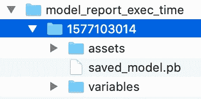
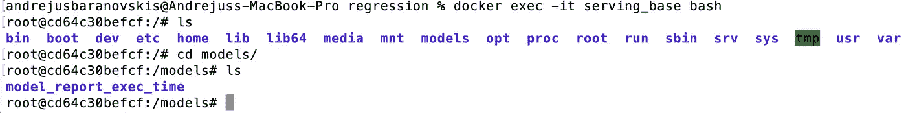
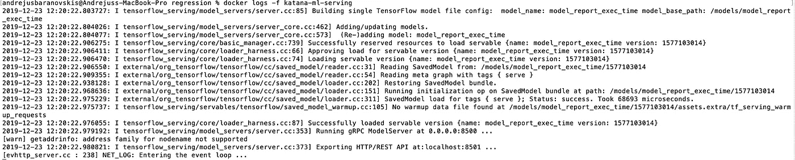
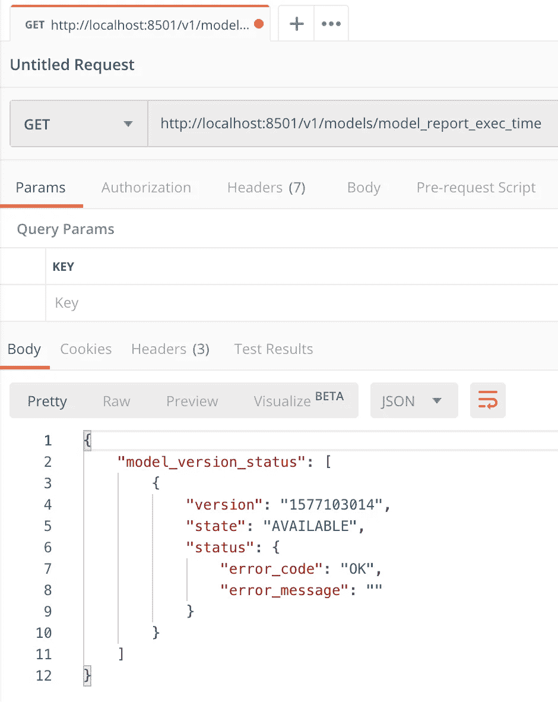
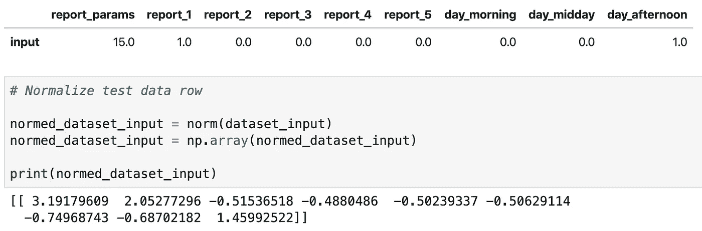

# 使用 TensorFlow 服务发布 Keras 模型 API

> 原文：<https://towardsdatascience.com/publishing-keras-model-api-with-tensorflow-serving-efb5b6d96c36?source=collection_archive---------18----------------------->

## TensorFlow Serving 是一个面向机器学习模型的高性能服务系统。我们提供了一个端到端示例来帮助您入门。


Source: Pixabay

构建 ML 模型是一项至关重要的任务。在生产中运行 ML 模型是一项复杂而重要的任务。我以前有一个关于通过 Flask REST API 服务 ML 模型的帖子— [用 Python Flask](/publishing-machine-learning-api-with-python-flask-98be46fb2440) 发布机器学习 API。虽然这种方法可行，但它肯定缺少一些要点:

*   模型版本控制
*   请求批处理
*   多线程操作

TensorFlow 附带了一套工具来帮助您在生产中运行 ML 模型。其中一个工具——tensor flow 服务。有一个很好的教程描述了如何配置和运行它——[tensor flow Serving with Docker](https://www.tensorflow.org/tfx/serving/docker#top_of_page)。我将在我的例子中遵循相同的步骤。

TensorFlow 服务提供模型版本控制功能。默认情况下，客户端可以访问特定的模型版本或获取最新版本。当模型被保存时，我们可以使用当前的时间戳生成一个模型版本:

```
import calendar;
import time;
ts = calendar.timegm(time.gmtime())tf.saved_model.save(model, "./model_report_exec_time/" + str(ts))
```

这是生成的文件夹结构，模型的版本带有时间戳:



我更喜欢在自己的 Docker 容器中运行 TensorFlow 服务。根据说明，可以选择将 ML 模型复制到 TensorFlow 服务容器中。首先，从 tensorflow/serving image 创建一个基本容器:

```
docker run -d --name serving_base tensorflow/serving
```

将 ML 模型从本地文件夹复制到基本容器中(在我的例子中， *model_folder* 和 *model_name* 都被设置为 *model_report_exec_time* ):

```
docker cp <model_folder> serving_base:/models/<model_name>
```

现在您可以仔细检查模型是否复制成功。进入容器:

```
docker exec -it serving_base bash
```

导航到 *models* 文件夹，您应该在那里看到您的 ML 模型:



现在创建一个新的 Docker 容器，并将您的 ML 模型名称设置为环境变量，这样模型将在下一次容器启动时提供服务:

```
docker commit --change "ENV MODEL_NAME <model_name>" serving_base katanaml/core-serving:v19.8
```

你不再需要基本容器，移除它:

```
docker kill serving_base
docker rm serving_base
```

从您新创建的映像启动容器(REST 端点运行在端口 8501 上):

```
docker run -d -p 8500:8500 -p 8501:8501 --name katana-ml-serving katanaml/core-serving:v19.8
```

检查容器日志，以确保 TensorFlow 服务启动时没有错误:

```
docker logs -f katana-ml-serving
```



我建议通过 [RESTful API 指南](https://www.tensorflow.org/tfx/serving/api_rest#start_modelserver_with_the_rest_api_endpoint)了解 TensorFlow 服务。您应该检查模型端点是否可用，执行 GET:*http://localhost:8501/v1/models/<model _ name>*。这将返回模型版本状态:



如果获得响应成功，我们可以进一步执行 ML 模型预测功能。使用 TensorFlow 服务，可以通过 POST 请求直接调用 predict 函数，参数可以通过一个名为 *instances* 的变量传递。ML 模型接受规范化数据，这意味着数据应该在调用预测端点之前规范化。在这个例子中，数据在 Python 中被规范化(检查本文中描述的 ML 模型— [用 Keras 和 TensorFlow](/report-time-execution-prediction-with-keras-and-tensorflow-8c9d9a889237) 报告时间执行预测):



使用 CURL 执行预测请求:

```
curl -d '{"instances": [[ 3.19179609,  2.05277296, -0.51536518, -0.4880486,  -0.50239337, -0.50629114, -0.74968743, -0.68702182,  1.45992522]]}' \
     -X POST [http://localhost:8501/v1/models/model_report_exec_time:predict](http://localhost:8501/v1/models/model_report_exec_time:predict)
```

响应返回预测值:424.9289

资源:

*   带有源代码的 GitHub [回购](https://github.com/abaranovskis-redsamurai/automation-repo/tree/master/tf-serving)
*   [用 Keras 和 TensorFlow 报告时间执行预测](/report-time-execution-prediction-with-keras-and-tensorflow-8c9d9a889237)
*   [TensorFlow 与 Docker](https://www.tensorflow.org/tfx/serving/docker) 一起发球