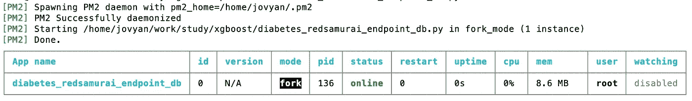
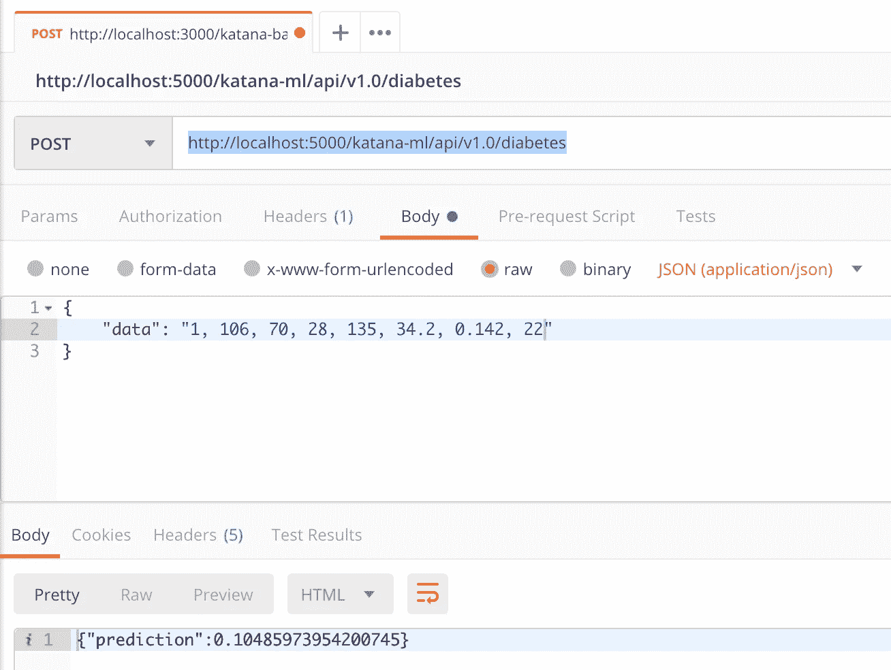

# 用 Python Flask 发布机器学习 API

> 原文：<https://towardsdatascience.com/publishing-machine-learning-api-with-python-flask-98be46fb2440?source=collection_archive---------4----------------------->

## 描述如何通过 Python Flask REST API 向外界公开机器学习模型的一组指令


Source: Pixabay

正如 Flask [网站](http://flask.pocoo.org/)上所说，Flask 很有趣，也很容易设置。这是事实。这个 Python 的微框架提供了一种用 REST endpoint 注释 Python 函数的强大方法。我使用 Flask 来发布 ML 模型 API，以供第三方业务应用程序访问。

这个例子基于 XGBoost。

为了更好地维护代码，我建议使用一个单独的 Jupyter 笔记本，ML 模型 API 将在那里发布。连同烧瓶 CORS 一起导入烧瓶模块:

```
from flask import Flask, jsonify, request
from flask_cors import CORS, cross_originimport pickle
import pandas as pd
```

在[皮马印第安人糖尿病数据库](https://raw.githubusercontent.com/jbrownlee/Datasets/master/pima-indians-diabetes.names)上训练模型。CSV 数据可以从[这里](https://raw.githubusercontent.com/jbrownlee/Datasets/master/pima-indians-diabetes.data.csv)下载。要构建 Pandas 数据框变量作为模型*预测*函数的输入，我们需要定义一个数据集列数组:

```
# Get headers for payload
headers = ['times_pregnant', 'glucose', 'blood_pressure', 'skin_fold_thick', 'serum_insuling', 'mass_index', 'diabetes_pedigree', 'age']
```

使用 Pickle 加载先前训练和保存的模型:

```
# Use pickle to load in the pre-trained model
with open(f'diabetes-model.pkl', 'rb') as f:
    model = pickle.load(f)
```

做一个测试运行并检查模型是否运行良好总是一个好的实践。使用列名数组和数据数组(使用新数据，即训练或测试数据集中不存在的数据)构建数据框架。调用两个函数— *model.predict* 和 *model.predict_proba* 。通常我更喜欢使用 *model.predict_proba* ，它返回描述可能性为 0/1 的概率，这有助于解释基于特定范围(例如 0.25 到 0.75)的结果。Pandas 数据帧由样本有效载荷构成，然后执行模型预测:

```
# Test model with data frame
input_variables = pd.DataFrame([[1, 106, 70, 28, 135, 34.2, 0.142, 22]],
                                columns=headers, 
                                dtype=float,
                                index=['input'])# Get the model's prediction
prediction = model.predict(input_variables)
print("Prediction: ", prediction)
prediction_proba = model.predict_proba(input_variables)
print("Probabilities: ", prediction_proba)
```

烧瓶 API。确保您启用了 CORS，否则 API 调用将无法在另一台主机上工作。在要通过 REST API 公开的函数之前写注释。提供一个端点名和支持的 REST 方法(在这个例子中是 POST)。从请求中检索有效载荷数据，构建 Pandas 数据帧并执行 model *predict_proba* 函数:

```
app = Flask(__name__)
CORS(app)[@app](http://twitter.com/app).route("/katana-ml/api/v1.0/diabetes", methods=['POST'])
def predict():
    payload = request.json['data']
    values = [float(i) for i in payload.split(',')]

    input_variables = pd.DataFrame([values],
                                columns=headers, 
                                dtype=float,
                                index=['input']) # Get the model's prediction
    prediction_proba = model.predict_proba(input_variables)
    prediction = (prediction_proba[0])[1]

    ret = '{"prediction":' + str(float(prediction)) + '}'

    return ret# running REST interface, port=5000 for direct test
if __name__ == "__main__":
    app.run(debug=False, host='0.0.0.0', port=5000)
```

响应 JSON 字符串被构造并作为函数结果返回。我在 Docker 容器中运行 Flask，这就是为什么使用 0.0.0.0 作为它运行的主机。端口 5000 被映射为外部端口，这允许来自外部的呼叫。

虽然在 Jupyter notebook 中直接启动 Flask interface 是可行的，但我建议将其转换为 Python 脚本，并作为服务从命令行运行。使用 Jupyter *nbconvert* 命令转换为 Python 脚本:

*jupyter nb convert—to python diabetes _ redsamurai _ endpoint _ db . ipynb*

带有 Flask endpoint 的 Python 脚本可以通过 PM2 进程管理器作为后台进程启动。这允许将端点作为服务运行，并在不同的端口上启动其他进程。PM2 开始命令:

*PM2 start diabetes _ redsamurai _ endpoint _ db . py*



*pm2 监视器*帮助显示正在运行的进程的信息:


从邮递员通过由 Flask 服务的端点的 ML 模型分类 REST API 调用:



更多信息:

*   带有源代码的 GitHub [回购](https://github.com/abaranovskis-redsamurai/automation-repo)
*   上一篇[帖子](https://bit.ly/2Hs38C5)关于 XGBoost 模型训练