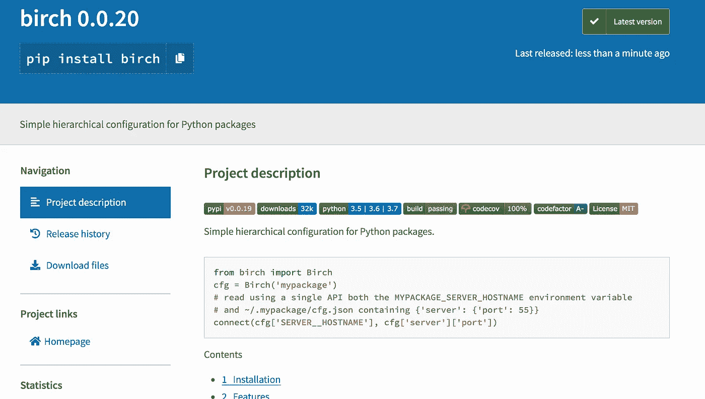

# 发布您自己的 Python 包

> 原文：<https://towardsdatascience.com/publishing-your-own-python-package-3762f0d268ec?source=collection_archive---------14----------------------->

## 打包 Python 代码的实用指南

假设你有一段很好的 Python 代码；几个相关的小函数，或者一个只有几百行代码的中型模块。并说你最终会一次又一次地使用这段代码；也许您一直将它复制到不同的项目或存储库中，或者您一直从您在特定路径中设置的某个专用实用程序代码文件夹中导入它。

这很自然——我们都在编码时不断积累这些小的个人工具，Python 可能比一般的编程语言更支持和鼓励这一点——拥有这些代码片段感觉很好。

但是，如果您可以轻松地导入您开发的一个小工具，而不用到处复制它，并维护它的一个更新版本，这不是很好吗？让它在不同的环境、机器和上下文中可用，而不依赖于特定的文件或路径？甚至能够对它进行版本化，并让使用它的代码清楚地反映这种依赖性？如果其他人也能使用它不是更好吗？

是的。是的，会的。🐃

当然，这个概念并不新鲜。这就是为什么我们通常在编程语言中有模块、包和库，以及为什么我们在 Python 中有这些。这是驱动 Python 非凡的能力、可用性和受欢迎程度的一部分；我们都可以通过简单的`pip install`和`import`获得 beautifulSoup 的 html 解析或 pandas 的数据帧处理的惊人能力。

最酷的部分是，Python 让每个人都可以轻松地在官方 Python 包索引 [PyPI](http://pypi.python.org/pypi) 上编写和发布自己的代码包，并让它们像`sklearn`、`requests`或`delorean`(所有这些都是非常有用和流行的 Python 包)一样容易获得。你绝对应该这么做，因为:

*   让别人使用你的代码是很有趣的，即使只是少数人；在工作、社区活动或求职面试中分享和展示是一件很酷的事情。
*   它通过迫使您组织和记录代码，并将其公开给同行评审，使您的代码变得更好。
*   最后，它通过贡献一些缺失的功能而使社区受益。您会惊讶地发现，有多少人会发现您高效地将 HTTP 头序列化为 JSON 或您为轻松验证输入 MongoDB 查询文档而创建的 decorator 非常有用。

现在，我已经满怀希望地说服了您，让您把放在那里的那个很酷的旧 Python 模块上的灰尘吹掉，并把它做成一个小 Python 包，让我们开始吧。


Figure 1: Python dust 🐍

在接下来的文章中，我将尝试向您介绍我决定打包 Python 代码的最小过程，基于我发布[几个小软件包](http://www.shaypalachy.com/code.html)(例如 [pdpipe](https://github.com/shaypal5/pdpipe) 、 [skift](https://github.com/shaypal5/skift) 和 [cachier](https://github.com/shaypal5/cachier) )到全球 PyPI 服务器和几十个我曾经发布过的初创企业的私有 PyPI 服务器[我知道这并不完美，但这是我所知道的，所以只能这样了。](https://www.theneura.com/)

# 第一步:都在名字里

让我们从为您的包选择一个名称开始。在我看来，一个好的名字足够短，很容易在一个`pip install`或`import`声明后随意键入(虽然我们现在有自动完成功能)，但足够信息丰富，人们可以理解，或者至少在安装包后记得它是关于什么的。

处理 HTTP 请求的`requests`，处理日期和时间的`delorean`，以及提供机器学习框架的`sklearn`，都是很好的例子。在为我的 pandas pipelines 包( [pdpipe](https://github.com/shaypal5/pdpipe) )选择名称时，我试图遵循这个例子，它建立在这样一个事实上，即`pandas`通常以更短的别名`pd`和我的缓存包( [cachier](https://github.com/shaypal5/cachier) )导入。

不过，老实说，这是例外，而不是规律。流行的 Python 包有类似于`pandas`、`keras`、`django`、`boto`、`jinja`、`flask`和`pytorch`的名字，然而我们都记得它们的名字，所以你也可以使用任何短的和可发音的名字(例如，尽管 [skift](https://github.com/shaypal5/skift) 是“SciKIt-learn wrappers for fast text”的一个很好的缩写，但我主要关心的是可发音性)。这也是一个好主意，以确保它工作良好，所有小写。

为了这个帖子，假设你和`chocobo`一起去的。🐤

# 步骤 2:基本的包结构

现在，让我们通过几个简短的步骤，为您留下一个通用的包结构:

1.  用你的包的*确切的*名称创建一个 Github 库。不要风格化或骆驼案件。然后，在本地克隆它。
2.  在存储库中创建一个文件夹，使用您包的确切名称；这是保存软件包代码的文件夹。这个[是](https://github.com/myusuf3/delorean)[规范](https://github.com/pandas-dev/pandas)，你只需要记住外层的`chocobo`文件夹(在我们的例子中)是存储库的文件夹，而内层的`chocobo`文件夹是包的文件夹。
3.  把你的模块，以及它使用的任何其他模块，放在内部的`chocobo`文件夹中。如果缺少一个文件，则添加一个`__init__.py`文件。
4.  将软件包用户将直接调用的重要对象(通常是函数)从各自的模块导入到`__init__.py`文件中。这些是包名称空间下可用的函数、类和变量。软件包的 API，如果你愿意的话。
5.  不是特定于包的，但是您确实应该在存储库的根目录中包含一个`.gitignore`文件。[这是一个优秀的](https://github.com/github/gitignore/blob/master/Python.gitignore)。

所以我们现在有了一个结构，我们可以在其中添加不同的文件来组成一个包；内部文件夹将保存包的代码，外部文件夹将保存辅助打包文件和其他与存储库相关的文件。

因此，假设您的原始模块`chocobo.py`看起来像这样:

那么，您的新存储库文件夹应该如下所示:

```
chocobo/
    chocobo/
        __init__.py
        chocobo.py
    .gitignore
```

其中`__init__.py`看起来像这样:

这意味着在我们完成之后，我们最先进的`chocobo`软件包的用户将能够这样使用它:

你知道要点了。
*哈哈！因为我刚刚附上了一堆 GitHub gists*好了，继续前进！

# 第三步:许可证

用一些公共许可证发布你的代码是一个好主意；虽然我们在这里讨论的是将您的代码作为开源发布，但是您可能希望在保留版权的同时允许重用您的代码，或者您可能希望有人扩展您的代码以保持衍生代码的开放，而许可证可以帮助您非常容易地做到这一点。

对于一个你并不真正关心其他人会怎么做的宠物项目来说， [MIT 许可证](https://choosealicense.com/licenses/mit/)可能是一个很好的主意，但是你可以前往[choosealicense.com](https://choosealicense.com/)获取 GitHub 和开源社区关于这个主题的一些很好的建议。

无论你选择哪种许可证，都比根本不选择许可证要好。没有许可证就发布代码在很多情况下等同于根本不发布；如果你不明确地表明你对代码的权利，大多数公司不会冒使用它可能带来的法律后果的风险，因此它的许多潜在用户会考虑其他选择。

选择许可证后，在您的存储库中创建一个`LICENSE`文件(不需要文件扩展名)，并用所选许可证的精确文本填充它。

# 步骤 4:安装文件

我们现在将创建 Python 打包工具(在我们的例子中是`setuptools`)依赖的基本文件；`setup.py`。`setup.py`包含构建和分发包时使用的实际指令。

这里有一个模板，您可以从它开始(不要担心，我们会检查所有内容):

所以，我们从导入`setuptools`开始。这是一个非常有用的包，旨在促进 Python 包的轻松分发，尽管它没有包含在标准库中(不像它的功能较弱的替代品`distutils`)，但它是当今 Python 包分发的事实上的标准，也是您应该使用的标准。我们将只使用`setuptools` 包中的两个函数:`setup`和`find_pacakges`。

在导入`setuptools` 之后，调用`setup()` 函数之前，我们将把`README.md` 文件的内容读入一个方便的全局变量`README`。

现在，剩下的就是用下面的参数调用`setuptools.setup()` 函数:

*   `author`:提供姓名即可。
*   `author_email`:你的邮箱。
*   `name`:包名。*“乔科博”*，在这种情况下。
*   `license`:字符串*“MIT”*，或者您选择的任何其他许可证的名称。
*   你的包裹的简短描述。比如这里:*“chocobo 是美味 choco bo 食谱的 python 包”*。
*   `version`:表示软件包当前版本的字符串。我希望在以后的文章中讨论一种稍微优雅一点的处理包版本控制的方法，但是现在你可以从一个你想发布新版本时手动增加的数字开始。通常的做法是在版本号前面加上字母 *v，*，因此`v1`是您第一个版本的合适版本字符串，但是我建议您将`v0.0.1`视为一个等价的版本字符串，并使用这种格式。同样，在以后的文章中会更多地讨论这意味着什么。
*   `long_description`:自述内容在此处。事实上，这确实是对该软件包的一个很长的描述。这是 [PyPI](https://pypi.org/) 上的包的页面内容([例](https://pypi.org/project/pdpipe/))。
*   `url`:指向包主页的 URL。假设您没有专门的站点，那么您的存储库的 URL 是一个很好的目标。
*   `packages`:啊哈，这里我们第二次用`setuptools` ！该参数接受所有要构建和分发/安装的包的名称数组(取决于调用的命令)。从技术上来说，你可以把`["chocobo"]`放在这里，但是更好的做法是推广并使用这个能够处理更复杂的包和存储库结构的`setuptools`函数。它需要两个可选参数，`where`和`exclude`，这里我们都忽略了。结果是`where`被设置为安装文件所在的目录，并且不排除任何子目录，这对于大多数情况来说已经足够好了。
*   `python_requires`:如果你的包支持所有 Python 版本，你可以丢弃这个参数。因为很可能不是这样，所以您应该选择一个合适的值。从技术上来说，我不会宣传对一个我没有测试过的版本的支持，但是现在我们可以有把握地假设:
    (1)如果你正在使用 Python 2，那么你就是在使用 python 2.7，并且(a)你是一只罕见的奇妙的鸟(b)除了 Python 2.7 之外，你不需要支持任何东西，所以你可以用`">=2.7"` 字符串提供这个参数。另外，请继续学习 Python 3；时钟确实在滴答作响。
    (2)如果你使用的是 Python 3，那么你可以支持任何比你用来开发包的版本更大或相同的 Python 版本。所以如果你正在使用 Python 3.5，那么`">=3.5"`应该没问题。
*   `install_requires`:所有非标准库包依赖项都在这里。例如，如果我们的`chocobo`包同时依赖于`requests` 包和`pytz`包，我们将用下面的字符串数组来提供这个参数:`["requests", "pytz"]`。
*   你的包裹很快就会和成千上万的其他包裹一起出现在 PyPI 上。为了帮助分类和区分，包的作者可以给 PyPI 提供一个*分类器*的列表来对每个版本进行分类，描述它为谁服务，它可以在什么系统上运行，以及它有多成熟。然后，社区成员可以使用这些标准化的分类器，根据他们想要的标准来查找项目(尽管我不确定实际上是谁在做这件事🦆).所有可能的分类器的列表可以在这里找到；建议你先从这些入手:
    -【开发状态::3—Alpha】
    -【License::OSI Approved::MIT License】
    -【编程语言::Python】
    -【编程语言::Python::3.5】
    -【编程语言::Python::3.6】
    -【编程语言::Python::3.7】
    -【主题::软件开发::库】
    -【主题::软件开发::库::Python 模块】
    -【目标受众::开发者】

好吧，那么！我们结束了！☃️


Figure 2: Ace Ventura after choosing his trove classifiers

## 步骤 5:构建分发文件

Python 包被构建到*构建发行版*文件中，然后这些文件被上传到服务器——通常是全球 PyPI 服务器——每个人都可以从那里下载它们。

我不会详细讨论不同的可能的发行版格式(你可以在这里[阅读更多关于它们的内容](https://docs.python.org/3/distutils/builtdist.html)和[这里](https://packaging.python.org/tutorials/packaging-projects/)，但是我们将使用[标准方法](https://packaging.python.org/tutorials/packaging-projects/)并构建两个文件:一个源发行版文件——它基本上是包代码的存档——和一个*轮*构建发行版文件。

首先，确保你安装了最新版本的`setuptools`和`wheel`:

```
python3 -m pip install --user --upgrade setuptools wheel
```

现在，要构建发行版文件，只需在您的`setup.py`所在的存储库的根文件夹中运行以下命令:

```
python setup.py sdist bdist_wheel
```

这里发生的事情是，我们告诉 Python 解释器运行 *setup.py* Python 脚本，并向它发送两个参数，命令它构建一个源分发文件( *sdist* 参数)和一个轮构建分发文件( *bdist_wheel* 参数)。

运行该命令时，将在调用目录下创建三个文件夹:`build`、`dist`和`chocobo.egg-info`。这三个都应该被你的`.gitignore`文件忽略。如果这些目录已经存在——例如，在之前运行该命令时——最好通过运行`rm -rf build dist`来删除它们，因为`dist`下的任何有效包文件都将被上传。

我们将要上传的两个文件位于`dist`文件夹中:`chocobo-0.0.3-py-none.any.whl`(构建发行版；一个`wheel`文件)和`chocobo-0.0.3.tar.gz`(源码分发；一个 gzipped `tar`存档)。确保它们已成功创建，我们将继续上传您的包！

## 步骤 6:上传您的包

现在剩下的就是把你的包上传到全球 PyPI 服务器！然而，要做到这一点，你必须[在 PyPI 网站](https://pypi.org/account/register/)注册。按照注册步骤，记下您选择的用户名和密码。

如果你想在上传软件包到全球 PyPI 服务器之前测试它们的上传，你可以另外在[测试 PyPI 网站](https://test.pypi.org/)注册一个用户。

现在，我们将用来上传我们的包的 Python 包将在一个名为`.pypirc`的文本文件中寻找 PyPI 用户名和密码——以向 PyPI 服务器进行认证，该文件通常位于您的主文件夹中。创建它，并如下所示填充它(可选的`testpypi`部分):

```
[distutils]
index-servers =
  pypi
  testpypi[pypi]
username: teapot48
password: myPYPIpassword[testpypi]
repository: [https://test.pypi.org/legacy/](https://test.pypi.org/legacy/)
username: teapot48
password: MYtestPYPIpassword
```

我们将按照最新推荐的 [](#5faf) 方式上传文件到 PyPI 服务器，并使用`twine`上传 Python 包的实用程序，而不是旧的`python setup.py upload`方法。只需运行:

```
twine upload dist/*
```

如果您想从使用测试 PyPI 服务器测试上传过程开始，只需运行`twine upload — repository testpypi dist/*`。

在任何情况下，当您的`.whl`文件被上传时，您应该会看到一个进度条，当`.tar.gz`档案被上传时，您会看到第二个进度条，之后上传将会完成。

恭喜你！你现在可以在 PyPI 官方网站上看看你的全新 Python 包页面，让所有人都看到！[这里有一个例子](https://pypi.org/project/birch/):



Figure 3: An example for a package page on the PyPI website

就是这样！你完了！各地的人们现在都可以运行`pip install chocobo`并庆祝你的 Python 包的惊人创造！:) ☃️

# 最后的话

我希望这篇文章有助于你理解如何构建和发布你的第一个 Python 包。如果你用它来打包一些代码，请在这里评论或者[联系我](http://www.shaypalachy.com/)让我知道！

还有一个官方的——简明的——打包 Python 项目的教程[,可以在这里找到](https://packaging.python.org/tutorials/packaging-projects/)。我试图通过添加更多的细节和我在构建一些小型开源 Python 项目时获得的一些个人最佳实践来改进它。

最后，我希望在未来的一些帖子中触及一些其他相关主题:编写好的自述文件、Python 包的基本测试([我在这里](/extensive-python-testing-on-travis-ci-4c24db9bf961)写了一些)和包版本控制。干杯！

# 脚注

1.  主要原因 *twine* 是 Python Packaging Authority 推荐的将包上传到 PyPI 的方式(以我的理解)——我将该推荐带到这篇博文的原因——是它“使用一个经过验证的连接通过 HTTPS 安全地验证你到 PyPI 的身份，而不管底层的 Python 版本如何”，这是一个非常好的理由——在我看来——更喜欢它并推荐给初学者。在[缠绕*文档*的相应章节中阅读更多信息。](https://twine.readthedocs.io/en/latest/#why-should-i-use-this)