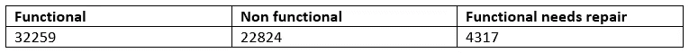
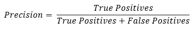
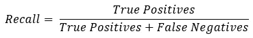
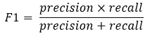
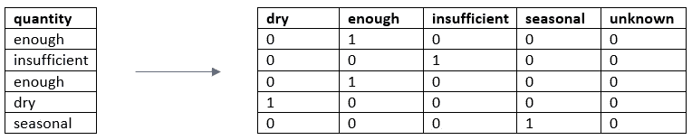
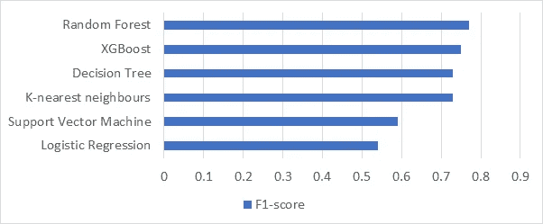
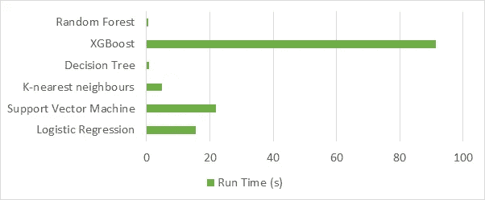

# 泵起来:使用数据科学预测水泵状况

> 原文：<https://towardsdatascience.com/pump-it-up-predict-water-pump-condition-using-data-science-2839d26638b8?source=collection_archive---------15----------------------->

## [现实世界中的数据科学](https://towardsdatascience.com/data-science-in-the-real-world/home)

## 如何使用 Python 中的数据科学和机器学习来预测坦桑尼亚的水泵运行情况？


Pump image courtesy of [Flickr user Christopher Jensen](https://www.flickr.com/photos/christophercjensen/3559607145)

[DrivenData](https://www.drivendata.org/) 的比赛以建设一个更美好的世界为背景。 [Pump It Up](https://www.drivendata.org/competitions/7/pump-it-up-data-mining-the-water-table/) 着眼于确定坦桑尼亚水泵的功能。在数据方面，数据是 38 个特征的逗号分隔值(CSV)文件，目标是预测三类中的一类(功能性、非功能性、功能性需要修复)。

代码并不太花哨，但是提供了一个很好的基线方法，可以对其进行改进，稍后会有更多的介绍。简而言之，你将对这个过程的每一步都有所了解，并在 70 秒内获得一个 **f1 分数**！

这篇文章将涵盖:

1.  解读竞争
2.  探索性数据分析
3.  型号选择
4.  估价
5.  结论和提示

## 解读竞争

数据集的大小是合理的——59，400 个条目，所以我们不应该觉得有义务在我们的模型中使用所有 38 个特征！

[F1 得分](https://scikit-learn.org/stable/modules/generated/sklearn.metrics.f1_score.html)是评估一项技术表现如何的指标。这在数据不平衡时特别有用，因为类不是均匀分布的。



A table indicating the data imbalance in the training set.

F1 分数是一个调和平均值，考虑了精确度和召回率。数学上，它看起来像这样:

Precision 询问我们的模型在预测正面事件时的正确率，即:



另一方面，回忆询问我们的模型对积极事件的预测有多好:



F1 分数结合了这两个指标，如下所示:



## 探索性数据分析

我们已经看到了明显的阶级不平衡，但是我们现有的信息类型呢？当我们将它输入到模型中时，我们如何确保它得到适当的处理？

哪些栏目是多余的？现在，让我们忽略

```
‘date_recorded’, ‘gps_height’, ‘longitude’, ‘latitude’, ‘wpt_name’, ‘num_private’, ‘subvillage’, ‘lga’,’ward’, ‘recorded_by’, ‘extraction_type_group’, ‘extraction_type’, ‘scheme_name’, ‘management’, ‘waterpoint_type_group’, ‘source’, ‘source_class’, ‘quantity_group’, ‘quality_group’, ‘payment_type’
```

这给我们留下了剩余的 19 个特征:

*   amount_tsh —总静压头(水点可用的水量
*   出资人——谁为油井出资
*   安装者——安装油井的组织
*   区域—地理位置
*   区域代码-地理位置(编码)
*   地区代码—地理位置(编码)
*   人口—油井周围的人口
*   公开会议—对/错
*   scheme _ management——谁在运营供水点
*   允许—如果水点是允许的
*   建造年份——供水点建造的年份
*   construction _ type 水点使用的提取类型
*   construction _ type _ group 水点使用的提取类型
*   construction _ type _ class 水点使用的提取类型
*   管理组—如何管理水点
*   付款——水的价格
*   水质——水的质量
*   数量——水的数量
*   水点类型—水点的种类

接下来，任何包含类似字符串/单词的信息的列都需要更改为数值，我们必须确保没有隐含的邻近性。为了实现这一点，我们使用了一个叫做一次热编码的过程。这将一列中所有不同的可能值(n)展开为 n 列，用 1 或 0 表示是否满足特定值。例如，quantity 列有五个可能的值:干旱、足够、不足、季节性和未知。一次热编码前后该特性的快照如下所示:



A table showing how the quantity column is transformed through one-hot-encoding.

funder 和 installer 列有大量的唯一值，因此我们可以使用一个函数将这些列扩展到前 n 个值(将 n 指定为函数中的一个参数)。不在这些值范围内的任何值都被标记为其他。这允许我们减少通过任何模型输入的列数，同时仍然表示大量的数据。

最后，状态组的标签需要改为数值，以便模型理解输入。将它们转换成有序类还是一次性编码，这是一个很难决定的问题。在这种情况下，我们使用的模型预期有一列，所以我们用序数转换来凑合，但是在某些情况下，这种隐含的接近性可能不合适。

这些步骤通过下面的函数进行总结。通过创建一个函数，我们可以调用它并使它适应任何版本的数据。状态组标签到数值的转换应该单独进行，因为这些仅针对训练数据。

Code for data pre-processing.

## 型号选择

当考虑使用哪个模型时，我们首先缩小到适合分类而不是回归问题的模型。在这种情况下，我们尝试六种不同的方法。

*   随机森林是一系列决策树，其中的叶节点表示预测的类别。
*   XGBoost 是一种复杂的决策树算法，它使用梯度推进(通过查看变化率来最小化误差)。
*   决策树使用整个数据集为每个特征创建决策过程。
*   k-最近邻查找与当前数据点最近的 k 个数据点，并采用多数分类。
*   支持向量机将创建平面作为区分类别的边界，试图最大化类别之间的距离。
*   逻辑回归也创建了决策边界，但却最小化了对数似然函数。

实现模型相对容易，导入相关的类，然后输入数据，接受初始探索的默认参数。

Code for model implementation.

## 估价

为了评估模型性能，我们留出了训练数据的子集，称为验证集。这使我们能够预测这部分数据的类别，并直接将预测结果与已知类别进行比较。对于每个模型，我们可以打印分类报告，该报告为我们提供分类指标，包括精确度、召回率、F1 分数和准确度。我们在验证集上实现了这一点，使用下面这条线比较真实标签和预测标签

```
print(classification_report(y_test,clf.predict(X_test)))
```

如前所述，在这种情况下，由于数据不平衡，准确性不是一个合适的指标，因此我们使用 F1 得分。



Graph showing the respective metrics for each type of model (0–1).

评估模型时的另一个考虑因素是运行时间。这与计算步骤成比例，并导致性能和速度之间的折衷。



Graph showing the respective run times for each type of model in seconds.

考虑到图形的组合结果，在给定训练数据的情况下，使用随机森林或决策树似乎是最合适的。但是，当模型预测测试数据的结果时，结果可能会有所不同。

## 结论和提示

对于这种应对挑战的方法，随机森林和决策树模型表现最佳，但是，通过超参数调整(查看设置每个模型的参数)，所有模型都可以表现得更好。这个项目的所有代码和数据可以在[这个 GitHub 文件夹](https://github.com/shiaoligreen/practical-data-science/tree/master/Pump%20it%20Up%20-%20Data%20Mining%20the%20Water%20Table)中找到。

*   不要觉得必须使用数据集中给定的所有特征/变量。
*   尝试几种不同的型号。
*   考虑哪种指标最适合评估模型。
*   一旦你完成了一些初步的探索，通过创建函数来优化代码结构。

直到下一次…随时与我分享任何意见/问题！

## 参考

DrivenData。(未注明)。抽水:地下水位的数据挖掘。检索自[https://www . driven data . org/competitions/7/pump-it-up-data-mining-the-water-table/](https://www.drivendata.org/competitions/7/pump-it-up-data-mining-the-water-table/)

达尔，奥，埃纳霍罗，p，格林，s .，&斯塔克，A. (2019，10 月)。冲刺二队一队。从 https://github.com/shiaoligreen/practical-data-science[取回](https://github.com/shiaoligreen/practical-data-science)