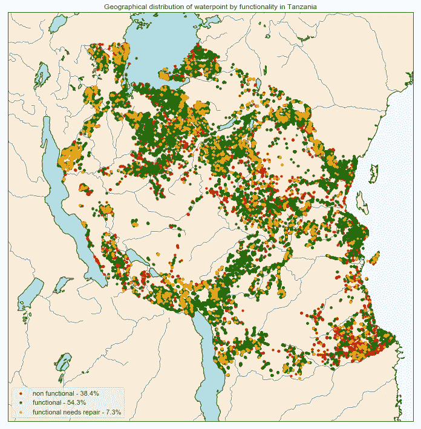
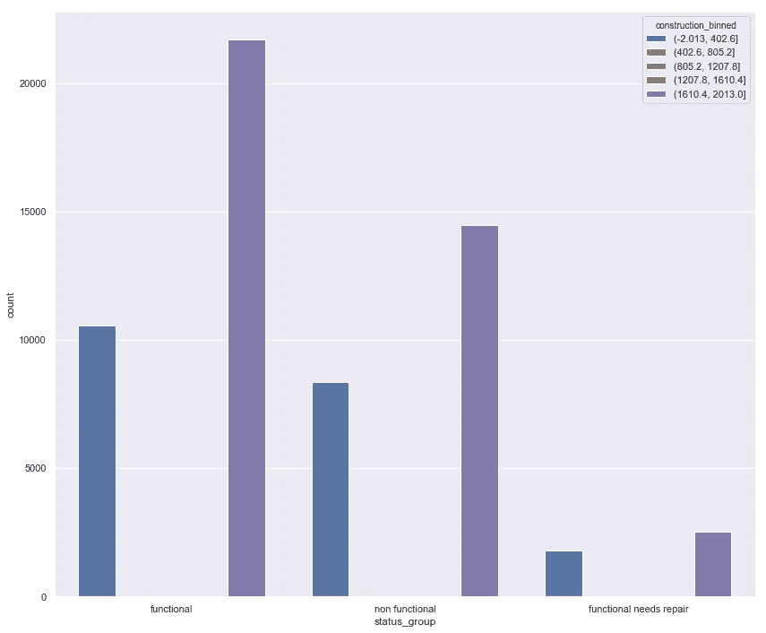
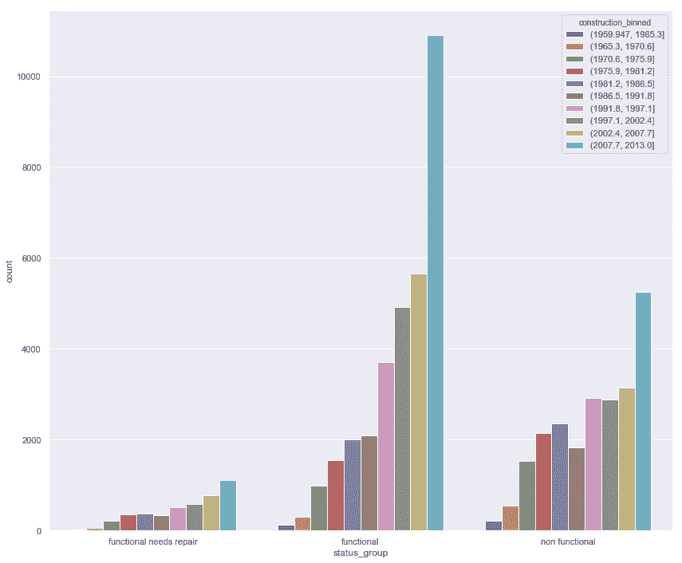
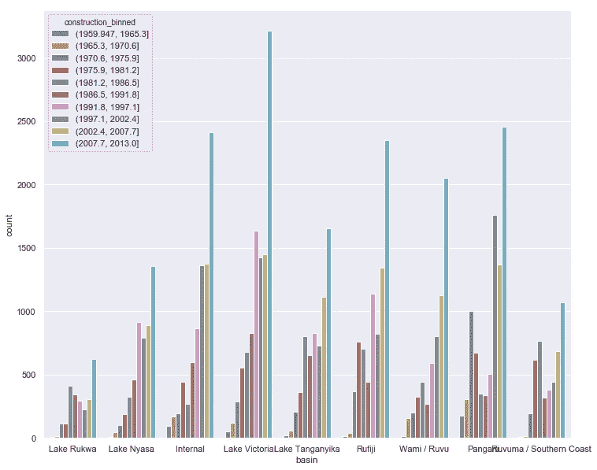
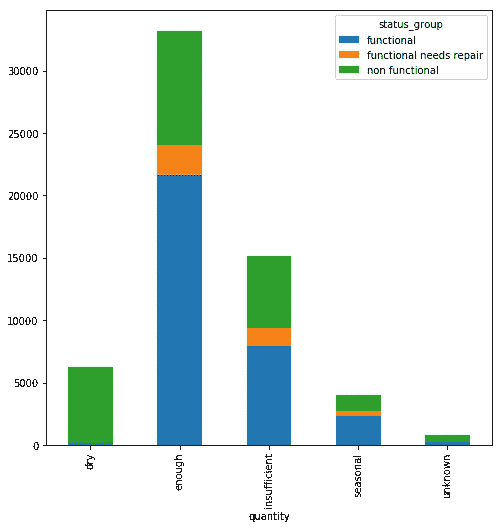

# 向上泵:预测坦桑尼亚的水点功能

> 原文：<https://towardsdatascience.com/pump-it-up-predicting-waterpoint-functionality-in-tanzania-5d39b7c6dbb3?source=collection_archive---------21----------------------->

我认为我们(或者至少我知道我肯定这样做)认为理所当然的东西是我们在家里饮用和使用的容易获得的水。我在佐治亚州东北部一个类似养鸡场的小地方长大，现在住在巴尔的摩，在这个国家能持续获得干净且随时可用的水确实令人惊讶。

直到最近，我参加了 Lambda School 举办的名为 Pump It Up 的 Kaggle 竞赛，我才真正思考过我的生活方式的含义。我们获得了由 Taarifa 和坦桑尼亚水利部收集的数据，以便预测供水点故障的可能性。该比赛由 DrivenData 主办，这是一个使用数据科学的社会公益平台。如果你有时间，一定要去看看。

比赛的目标是从训练数据中预测这些水点的状态。在我上面的地图里，可以看到水点的整体分布。没有功能的供水点几乎和有功能的供水点一样多，尽管这些供水点中有很小一部分被确定为需要修复。这意味着人们仍然想使用它们/它们还没有被另一个供水点取代，但是人们根本就无法获得这些水。

# 一点数据探索

我一开始只是想知道这些供水点是什么时候建成的。不幸的是，丢失的数据数量惊人。我收集了这些年来得到一个简单的图表，这就是结果。

如何处理这些缺失的数据？普遍的共识是估算数据，在这种情况下，您使用一些函数/模块根据您选择的参数(如平均值或中值)对数据进行有根据的猜测。然而，我选择了不同的做事方式。

我在数据中列出了所有可用的建造年份。然后，我根据这些年的计数建立了一个概率分布。因此，出现频率更高的年份出现的概率更高。在使用一些 python-fu 完成这一任务后，是时候规范化数据了。我们希望对概率分布的权重进行归一化，以便在下一步过程中将它们用作百分位数:从归一化概率分布的随机抽样中生成新的建筑年份。

在这样做之后，并采取一个新的 bin 的建设年，我的图表和信息的保真度，大大提高。

查看生成的数据，我们可以看到，在过去十年中，供水点建设出现了相当大的热潮。这种方法将我的模型从 53%的预测准确率提高到大约 75%。

我们还可以查看哪些地区的用水量增长/需求最大。

# 创建新特征

然后我就可以记录下水点最后一次观测的日期，并从新生成的数据中减去建造的年份，我称之为水点的年龄。这使我的准确率达到了 80%。

# 人口数据:将一个无关紧要的问题转变为模型焦点

人口中也有大量缺失数据。为此，我很乐意收集坦桑尼亚的人口普查数据，并生成如上的另一个概率分布来估算我的缺失值，但不幸的是，我只能替换为中位数(向低端人口倾斜的数据)，因为我们只有四天时间来建立模型和进行可视化。输入缺失值的人口中值使我的准确率达到 82%(四舍五入)。人口最终成为我的模型的焦点。我所有的其他特征和直觉都建立在对人群的假设之上。因此，您可能会理解为什么我想要更准确地表示缺失的人口数据。

# 什么决定了水点故障的可能性。

在我的模型中，地理坐标(纬度/经度)、人口和对水点功能的估计之间存在令人难以置信的关系。

随着人口的增长，需要更多的水。这导致使用更多的水。人口成为水量的决定性值，随着水量的减少，我们开始看到水点失效的可能性更大。水点年龄的工程特征增加了我们的准确性，因为它允许模型了解到泵已经存在的时间越长，它不工作/由于上述原因需要修理的可能性就越大。这就像一个强化变量。

我觉得我的功能可以通过工程和对所有功能的更多研究来继续改进，也许可以更好地处理我的地理数据，但时间对任何人都是静止的。幸运的是，比赛在 Lambda 学校之外还有四个月的时间，所以我肯定会在业余时间继续努力改进我的模型。

同时，感谢您的阅读。

正如我最喜欢的库德的罗格里洞穴里的居民所说，“生活和喝酒！”
下次见。