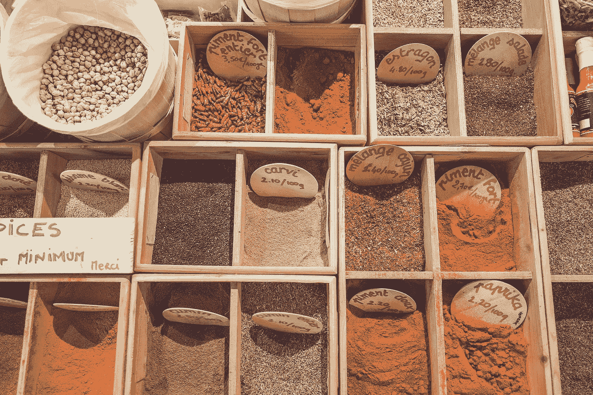

# 提升音量:Docker 中的数据

> 原文：<https://towardsdatascience.com/pump-up-the-volumes-data-in-docker-a21950a8cd8?source=collection_archive---------11----------------------->

## 学习足够有用的 Docker 的第 6 部分

这篇文章是关于在 Docker 中使用数据的。其中，我们将重点关注 Docker 卷。如果您还没有，请查看本系列的前几篇文章。我们讨论了 Docker [概念](/learn-enough-docker-to-be-useful-b7ba70caeb4b)、[生态系统](/learn-enough-docker-to-be-useful-1c40ea269fa8)、 [Dockerfiles](/learn-enough-docker-to-be-useful-b0b44222eef5) 、[瘦身图片](/slimming-down-your-docker-images-275f0ca9337e)和[流行命令](/learn-enough-docker-to-be-useful-b0b44222eef5)。



Spices

把贯穿这些文章的食物隐喻推到断裂点，我们来对比一下 Docker 里的数据和香料。就像世界上有很多香料一样，用 Docker 保存数据也有很多方法。


快速参考:本指南适用于 Docker 引擎版本 18.09.1 和 API [版本 1.39](https://docs.docker.com/engine/api/version-history/) 。

Docker 中的数据可以是临时的，也可以是持久的。让我们先检查一下临时数据。

# 临时数据

数据可以通过两种方式临时保存在 Docker 容器中。

默认情况下，由容器内的应用程序创建的文件存储在容器的可写层中。你不需要设置任何东西。这是又快又脏的方法。只要保存一个文件，然后继续你的工作。然而，当你的容器不复存在时，你的数据也将不复存在。

如果您希望 Docker 保存临时数据的性能更好，您还有另一个选择。如果您不需要您的数据在容器的生命周期之后继续存在，那么 *tmpfs* 挂载是一种使用主机内存的临时挂载。tmpfs 装载具有更快读写操作的优势。

很多时候，您会希望数据在容器消失很久之后仍然存在。您需要持久化您的数据。

# 不变数据

有两种方法可以将数据保存到容器寿命之外。一种方法是将文件系统绑定挂载到容器。通过绑定挂载，Docker 之外的进程也可以修改数据。


From the [Docker Docs](https://docs.docker.com/storage/volumes/)

绑定装载很难备份、迁移或与其他容器共享。卷是保存数据的更好方式。

# 卷

卷是位于任何容器之外的主机上的文件系统。卷由 Docker 创建和管理。体积为:

*   坚持的
*   自由浮动的文件系统，独立于任何一个容器
*   可与其他容器共享
*   有效的输入和输出
*   能够在远程云提供商上托管
*   可加密
*   可指名的ˌ可命名的
*   能够用容器预先填充它们的内容
*   便于测试

这是很多有用的功能！现在让我们来看看你如何制作一个卷。


Volumes

## 创建卷

可以通过 docker 文件或 API 请求来创建卷。

以下是在运行时创建卷的 Dockerfile 指令:

`VOLUME /my_volume`

然后，当创建容器时，Docker 将使用指定位置已经存在的任何数据创建卷。注意，如果使用 docker 文件创建卷，您仍然需要在运行时声明卷的挂载点。

还可以使用 JSON 数组格式在 Dockerfile 文件中创建一个卷。关于 Dockerfiles 的更多信息，请参见本系列的这篇早期文章。

还可以在运行时从命令行实例化卷。

# 卷 CLI 命令

## 创造

您可以使用`docker volume create —-name my_volume`创建独立卷。

## 检查

用`docker volume ls`列出 Docker 卷。

可以用`docker volume inspect my_volume`检查卷。

## 去除

然后你可以用`docker volume rm my_volume`删除这个卷。

悬挂卷是容器未使用的卷。您可以使用`docker volume prune`移除所有悬挂的卷。Docker 会警告你，并在删除前要求确认。

如果卷与任何容器相关联，则在删除容器之前，您不能删除它。即使这样，码头工人有时也不会意识到集装箱已经不见了。如果发生这种情况，你可以使用`[docker system prune](http://docker-compose down --volumes)`来清理你所有的 Docker 资源。那么您应该能够删除该卷。


Where your data might be stored

**与** `**--mount**` **和** `**--volume**`一起工作

您将经常使用标志来引用您的卷。例如，要在创建容器的同时创建卷，请使用以下命令:

`docker container run --mount source=my_volume, target=/container/path/for/volume my_image`

在过去(即 2017 年之前)😏`--volume`旗很受欢迎。最初，`-v`或`--volume`标志用于独立容器，而`--mount`标志用于码头工人群。然而，从 Docker 17.06 开始，您可以在所有情况下使用`--mount`。

`--mount`的语法有点冗长，但由于几个原因，它比`--volume`更受欢迎。`--mount`是您可以使用服务或指定卷驱动程序选项的唯一方式。用起来也比较简单。

您将在现有代码中看到许多`-v`。注意`--mount`和`--volume`的选项格式不同。你通常不能用一个`--mount`替换现有代码中的一个`-v`就完事了。

最大的区别是`-v`语法将所有选项组合在一个字段中，而`--mount`语法将它们分开。让我们看看`--mount`的行动吧！


Easy enough to mount

`**--mount**` —选项是键值对。每一对的格式如下:`key=value`，一对和下一对之间用逗号隔开。常见选项:

*   `type` —安装类型。选项有`[bind](https://docs.docker.com/storage/bind-mounts/)`、`[volume](https://docs.docker.com/storage/volumes/)`或`[tmpfs](https://docs.docker.com/storage/tmpfs/)`。我们都是关于`volume`。
*   `source` —挂载的来源。对于命名卷，这是卷的名称。对于未命名的卷，将省略此选项。该键可缩短为`src`。
*   `destination` —文件或目录在容器中挂载的路径。该键可缩短为`dst`或`target`。
*   `readonly`—将卷挂载为只读。可选。没有价值。

这是一个有很多选项的例子:

```
docker run --mount type=volume,source=volume_name,destination=/path/in/container,readonly my_image
```


Volumes are like spices — they make most things better. 🥘

# 包装

## 关键音量命令概述

*   `docker volume create`
*   `docker volume ls`
*   `docker volume inspect`
*   `docker volume rm`
*   `docker volume prune`

`docker run --mount my_options my_image`中`--mount`标志的常用选项:

*   `type=volume`
*   `source=volume_name`
*   `destination=/path/in/container`
*   `readonly`

现在，您已经熟悉了 Docker 中的数据存储，让我们看看您的 Docker 之旅可能的后续步骤。


Next steps

更新，我最近发表了一篇关于 [Docker 安全](/top-20-docker-security-tips-81c41dd06f57?source=friends_link&sk=efeac3577bd9c698d59dfd07c5fef40d)的文章。看看它，并了解如何保持你的容器安全。😃

如果您还没有阅读本系列中关于 Docker [概念](/learn-enough-docker-to-be-useful-b7ba70caeb4b)、 [Docker 生态系统](/learn-enough-docker-to-be-useful-1c40ea269fa8)、[Docker 文件](/learn-enough-docker-to-be-useful-b0b44222eef5)、[瘦图像](/slimming-down-your-docker-images-275f0ca9337e)和[命令](/learn-enough-docker-to-be-useful-b0b44222eef5)的文章，也可以查看一下。

如果你正在寻找另一篇关于 Docker 概念的文章来帮助巩固你的理解，请点击查看 [Preethi Kasireddy](https://medium.com/u/d446dafbe292?source=post_page-----a21950a8cd8--------------------------------) 的伟大文章[。](https://medium.freecodecamp.org/a-beginner-friendly-introduction-to-containers-vms-and-docker-79a9e3e119b)

如果你想更深入，可以去看看奈杰尔·波尔顿的书[*Docker Deep Dive*](https://www.amazon.com/Docker-Deep-Dive-Nigel-Poulton-ebook/dp/B01LXWQUFF)*(*一定要拿到最新版本)。

如果你想边学边做大量的建筑工作，可以看看詹姆斯·特恩布尔的《码头工人手册》。

我希望您发现本系列对 Docker 有所帮助。如果你有，请在你最喜欢的论坛或社交媒体渠道上与他人分享，这样你的朋友也可以找到它！😃

我写了一些关于用 Kubernetes 编排容器的文章，你可以在这里阅读。我写关于 Python、数据科学、人工智能和其他技术主题的文章。如果你对这些感兴趣，请关注[我](https://medium.com/@jeffhale)。

[](https://dataawesome.com)

感谢阅读！👏