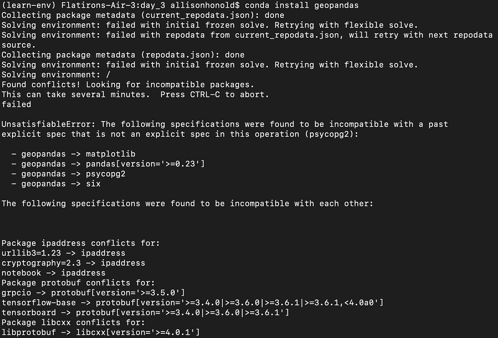
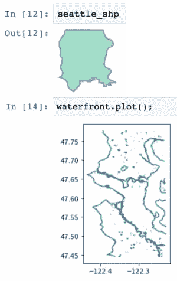
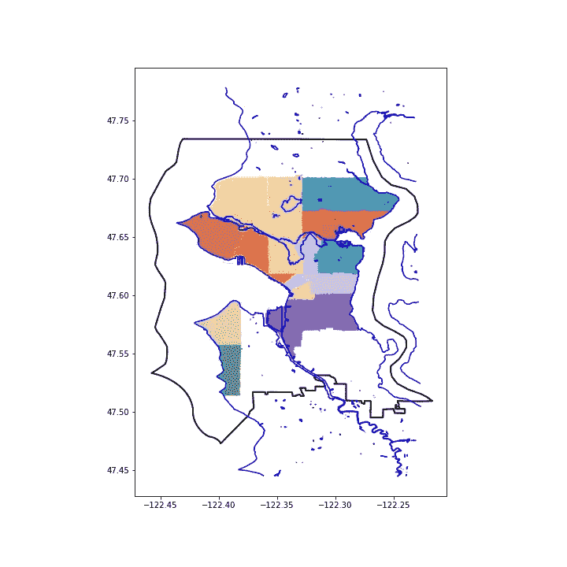
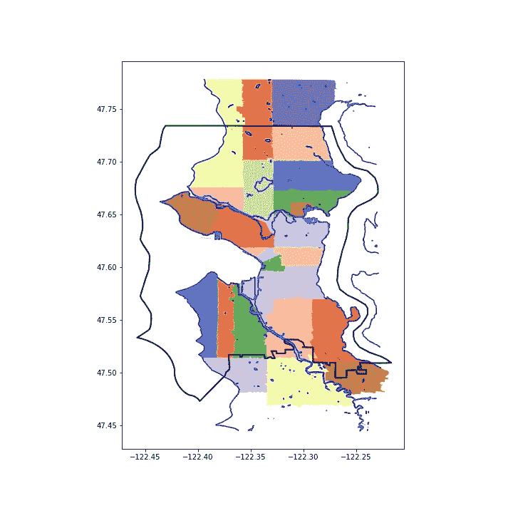
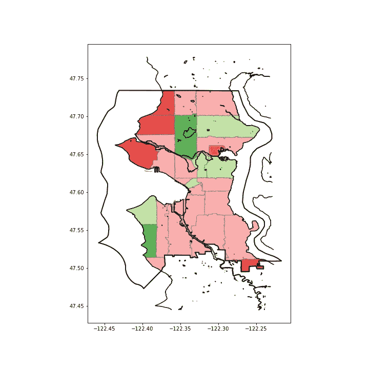
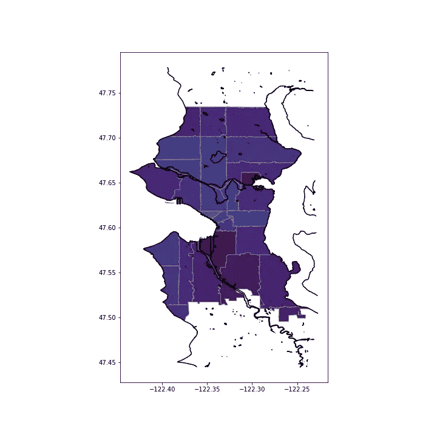
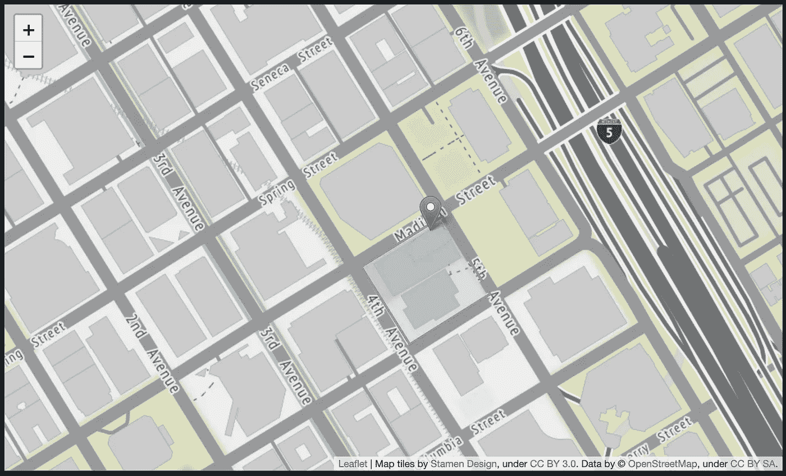
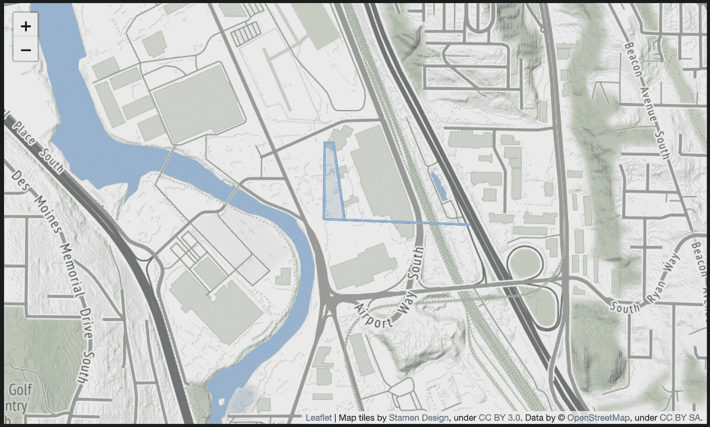
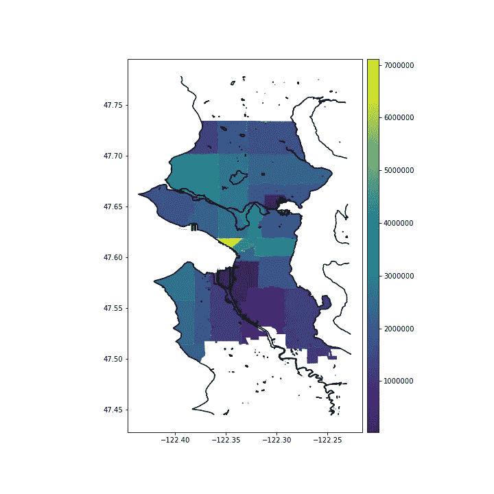

# 小狗和 Python:分析地理空间数据

> 原文：<https://towardsdatascience.com/puppies-python-analyzing-geospatial-data-93dd9dc3137?source=collection_archive---------17----------------------->

## 通过使用 Geopandas、Shapely、Pyplot 和 Folium 组合多个形状文件和数据源来可视化西雅图宠物密度

所以你对有地理空间成分的数据感兴趣？酷！我也是！

当我开始我的第一个植根于地理空间数据的项目时，我并没有意识到我所面临的挑战的程度——并没有超出我的能力范围，但对于我当时的情况来说，这绝对是一个难题。


photo credit: Chris Martin on [Flickr](https://www.flickr.com/photos/14798455@N06/7808358384)

我快速的谷歌搜索让我，或许还有你，直接找到了`[geopandas](http://geopandas.org/)`。



This plus another 600+ lines of package conflicts… including NumPy.

我最初与`geopandas`安装有很多包冲突，包括`numpy`和我项目环境中的几乎所有东西。然后我按照他们的指示在`conda-forge`频道的新环境中安装了`geopandas`。非常管用！

在您的新环境中，您还需要`conda install descartes`和`matplotlib`来获得全部功能。

在今天的例子中，我正在为我的下一步行动做一些研究:在西雅图哪里可以找到密度最高的宠物？当我在未来的社区里散步、蹦蹦跳跳、做瑜伽时，我想向所有的宠物抛媚眼。为此，我从西雅图市的公开数据中下载了关于[宠物执照](https://data.seattle.gov/Community/Seattle-Pet-Licenses/jguv-t9rb)的文件和关于[邮政编码](http://data-seattlecitygis.opendata.arcgis.com/datasets/83fc2e72903343aabff6de8cb445b81c_2)、市政[边界](http://data-seattlecitygis.opendata.arcgis.com/datasets/municipal-boundaries)和[海岸线](http://data-seattlecitygis.opendata.arcgis.com/datasets/city-of-seattle-shoreline)的形状数据(这样我们就可以看到我们所了解和喜爱的西雅图的轮廓)。


Photo Credit: Joshua T. Beck [CC BY-SA 4.0] on [wikimedia commons](https://commons.wikimedia.org/wiki/File:Photo_Feb_01,_9_31_50_AM.jpg)

## 要点 1:shape file 不仅仅是一个文件

当我下载并解压缩我的第一个 shapefile 时，我只将`.shp`文件移到我的目录中，心想，“也许这些其他文件可以在不同的程序中工作。”但是没有。

即使你用来读取形状文件的任何包可能只需要一个`.shp`文件路径，它们需要整个文件集在同一个目录下才能工作:

*   `.shp` —实际形状文件—这是你的形状的几何图形
*   `.shx` —形状索引 **x** 格式—帮助快速浏览形状
*   `.dbf` —这是关于形状的其他信息(同样，这是必需的，即使您不需要它。关于每个形状的参考信息(如名称)通常很有帮助。)

有时也有其他文件。查看这篇[文章](https://en.wikipedia.org/wiki/Shapefile)了解更多信息。现在，我不用太担心我想要或需要哪个，我只需要将它解压到我的目标目录中。然后你就知道你的数据源提供了什么好东西。

还要注意:所有文件必须有相同的文件名，唯一的区别是扩展名/后缀。所以如果你喜欢改文件名去掉空格，大写字母等(只是恢复完美主义的事情？)，确保您更改了软件包中所有文件的名称，并注意拼写错误。

> 当你考虑一个 shapefile 的时候，总是要加上那个尾随的 s——shape file**s**。

在搜索最大 pet 密度时，只需几行代码就可以让我开始使用地理数据框中的形状:

```
import geopandas as gpd# load zip code shape data
zip_codes_gdf = gpd.read_file('data/shapes/Zip_Codes.shp')# load seattle shape
cities = gpd.read_file('data/shapes/Municipal_Boundaries.shp')
seattle = cities.loc[cities['CITYNAME'] == 'Seattle']
seattle = seattle.reset_index()
seattle_shp = seattle.loc[0, 'geometry']# load seattle waterfront shape
waterfront = gpd.read_file('data/shapes/
                            City_of_Seattle_Shoreline.shp')
```



注意这里的`seattle_shp`是一个`shapely Polygon`，在 Jupyter 笔记本中调用它会显示该形状的图像。或者，`waterfront`是一个地理数据框架，因此您可以用`waterfront.plot()`来可视化它。跟踪对象类型将为您省去麻烦和时间！或者至少是当事情不像你期望的那样工作时的一个好的开始。

首先，我注意到西雅图开放数据上的邮政编码文件实际上有华盛顿几个县的邮政编码的形状文件。我需要把邮编范围缩小到西雅图。我很快意识到西雅图地区的邮政编码边界与城市边界不一致。

这里是`geopandas`对所有其他包的包装，包括`shapely`，派上用场的地方(即使它使安装变得很困难)。

## 拿走#2: Shapely 是你的朋友

为了组合来自不同来源的数据并准确获得您想要的数据，我发现 shapely 函数非常有用。方便的是，它们在`GeoDataFrames`上工作得很好，在每行上用一行代码进行计算(只需调用`geo_df.**shapely_function**()`)。一些`[shapely](https://shapely.readthedocs.io/en/stable/manual.html)`功能在`[geopandas](http://geopandas.org/)`文档中有描述，但是`geopandas`没有包括所有 shapely 功能的文档。当 shapely docs 中描述的额外功能，而不是`geopandas`中描述的功能工作良好时，我感到惊喜，尤其是`intersection`！

**在:**

`object.**within**(*other)*` —如果对象的边界和内部仅与另一个对象的内部相交(而不是其边界或外部)，则返回`True`。这适用于所有类型，与`[**contains()**](https://shapely.readthedocs.io/en/stable/manual.html#object.contains)`相反。 [*](#55a1)

所以我试了一下。这里，`zip_codes_gdf.within(seattle_shp)`返回一系列的`True`和`False`，每个记录对应于`GeoDataFrame`中的一条记录。这个系列与`.loc`一起使用，创建一个新的`GeoDataFrame`，只包含全部在西雅图的记录(邮政编码及其形状)。

```
seattle_zips_within = zip_codes_gdf.loc[zip_codes_gdf.within(seattle_shp)]
```

接下来，我绘制了我的结果，以及西雅图的轮廓和滨水区。

```
fig, ax = plt.subplots(figsize=(10,10))
seattle.plot(ax=ax, color='white', edgecolor='black', linewidth=2)
waterfront.plot(ax=ax, color='blue')
seattle_zips_within.plot(ax=ax, cmap='Paired', alpha=.8)
```



使用`within()`函数，进入西雅图以外其他城市的邮政编码被排除在这个选择过程之外。如果邮政编码与城市边界一致，这个功能会很棒。不幸的是，事实并非如此，所以我继续寻找更好的邮政编码选择功能。

**相交**

`object.**intersects**(*other*)` —如果对象的边界或内部以任何方式与其他对象相交，则返回`True`。换句话说，如果几何对象有共同的边界或内点，则它们相交。 [*](#55a1)

```
seattle_zips_intersects = zip_codes_gdf.loc[zip_codes_gdf.intersects(seattle_shp)]fig, ax = plt.subplots(figsize=(10,10))
waterfront.plot(ax=ax, color='blue')
seattle_zips_intersects.plot(ax=ax, cmap='Paired', alpha=.8)
seattle.plot(ax=ax, color='#00000000', edgecolor='black', 
linewidth=2)
```



现在我们走上了正轨，整个西雅图都被代表了。现在我想把城市范围之外所有区域都去掉。如果我使用西雅图市范围内注册的宠物数量和这些跨境邮政编码的整个(西雅图和非西雅图)土地面积来计算宠物密度，这将低估这些西雅图社区的宠物密度。


Photo Credit: George Hodan [[CC0 Public Domain](http://creativecommons.org/publicdomain/zero/1.0/)] from [PublicDomainPictures](https://www.publicdomainpictures.net/en/view-image.php?image=35428&picture=sad-dog)

所以我寻找另一个`shapely`函数。

**路口**

`object.**intersection**(*other*)` —返回该对象与其他几何对象的交集的表示。 [*](#55a1)

换句话说，它返回两个对象重叠区域的形状。

```
seattle_zips_intersection = zip_codes_gdf.intersection(seattle_shp)fig, ax = plt.subplots(figsize=(10,10))
waterfront.plot(ax=ax, color='black')
seattle_zips_intersection.plot(ax=ax, cmap='Paired', alpha=.8, 
                               edgecolor='gray')
seattle.plot(ax=ax, color='#00000000', edgecolor='black', 
             linewidth=2)
```



我还不确定地图上的粉红色是怎么回事，但这看起来越来越好了！随着邮政编码被修剪到西雅图内的区域，就地图绘制而言，我准备去掉标记胡德运河中心的西雅图轮廓，或者西雅图技术上结束的任何地方，取而代之的是水路和邮政编码轮廓。

准备好地图形状后，我就可以使用 pet 数据了！

## 第三点:Geopandas.plot()使用了 matplotlib.pyplot 中几乎所有你知道和喜欢的参数

首先，我将上一步中确定的新相交几何图形添加到我的`GeoDataFrame`中。注意:默认情况下，Geopandas 总是绘制“几何图形”列，以绘制您的形状或完成如上所用的基于形状的计算。您可以使用`geo_object.**set_geometry**(*‘column_name')*`切换哪个列`geopandas`将用作感兴趣的几何图形。在这种情况下，我决定用一个新的、成对的 down `GeoDataFrame`重新开始——只有西雅图的邮政编码及其交集几何和面积。

```
# add intersection geometry to my dataframe
zip_codes_gdf['intersection'] = seattle_zips_intersection# create dataframe with the seattle in-city geometries
seattle_zip_geom = zip_codes_gdf.loc[:, ['ZIP', 'intersection']]# name the geometry column 'geometry' for easy geopandas plotting
seattle_zip_geom.columns = ['ZIP', 'geometry']# calculate the in-seattle area for each zipcode and add as a column
seattle_zip_geom['area'] = seattle_zip_geom.area# drop zip codes that have no area in seattle
seattle_zip_geom = seattle_zip_geom.loc[seattle_zip_geom['area'] > 
                                        0]
```

为此，我添加了宠物数量和宠物密度，只使用相交面积来计算密度。

```
# create dataframe with Seattle zips and their respective pet counts
seattle_pets_zip = seattle_zip_geom.merge(pet_counts, on='ZIP')# add pet_density column
seattle_pets_zip['pet_density'] = (seattle_pets_zip['pets'] / 
                                   seattle_pets_zip['area'])
```

要根据列`'pet_density'`对地图进行着色，将该列设置为 plot 调用中的列名。这种基于数据值着色的地图被称为 choropleth (vocab，我希望我以前就知道……用更精确的关键字搜索帮助效果更好…)

```
fig, ax = plt.subplots(figsize=(10,10))
waterfront.plot(ax=ax, color='black')
seattle_pets_zip.plot(**column='pet_density'**, ax=ax, edgecolor='gray')
```



啊！所有的邮政编码看起来都一样！

然后，我注意到两个邮政编码(98146，98168)的宠物密度要大得多，尽管在我的地图比例下看不到它们。

为了更仔细地研究这些地点，我用`folium`将它们绘制在城市街道上:

```
import folium
import geopandas as gpddef create_geo_map(geo_df, index, location, zoom=17, 
                   tiles='Stamen Terrain'):
  """creates a folium map with the geometry highlighted

  Args:
    geo_df: a geopandas dataframe (must have a column 'geometry'
    index: the index of the row you want mapped
    location: [lat, long] list with the center location for the map
    zoom: start zoom level. Default: 17
    tiles: Folium tiles / design. Default: Stamen Terrain Returns:
    folium map with geometry highlighted
  """
  # create geodataframe for zip code
  zip_code = gpd.GeoDataFrame(geo_df.iloc[index]).T # get the geojson for the zipcode
  gjson = zip_code['geometry'].to_json() # create folium map
  m = folium.Map(location=location, tiles=tiles, zoom_start=zoom) # add geojson to the map
  folium.GeoJson(gjson, name='geojson').add_to(m)

  return m
```

看看这两个邮政编码:



第一个是西雅图市中心的一个街区，紧挨着图书馆，里面有一栋高层公寓。我不知道为什么这个街区有自己的邮政编码，但是好吧。我能相信这里登记了 35 只宠物。



第二个更神秘。更大的邮政编码中的这一小部分是波音机场附近的工业区。有一个[超级价值](https://en.wikipedia.org/wiki/SuperValu_(United_States))，但是在谷歌地图卫星视图上没有可见的房屋(是的，我试图跟踪这 35 只宠物——你可以自由地[亲自查看](https://www.google.com/maps/@47.5101408,-122.2903633,1106m/data=!3m1!1e3)。目前，我的工作假设是这些是超价值工作者的情感支持动物。)


Example emotional support animal. Photo Credit: [Kevin Honold](https://www.linkedin.com/in/kevinhonold/), used with permission

经过进一步调查，邮政编码 98168 在未合并的国王县有一些地区，这些地址可能标有“西雅图”，但从技术上来说不在西雅图市的范围内。我想知道，在这个未合并的地区，一些非西雅图居民的宠物主人是否在该市登记了他们的宠物，而没有意识到他们在技术上不是该市居民。你可能会认为这个城市不会接受非城市地址的注册……这仍然是个谜。

无论如何，我选择放弃这两个邮政编码，以便更大的邮政编码的宠物密度更容易区分。在`geopandas`文档的帮助下，我还添加了图例。

```
# adding a legend using code from [http://geopandas.org/mapping.html](http://geopandas.org/mapping.html)
**from mpl_toolkits.axes_grid1 import make_axes_locatable**fig, ax = plt.subplots(figsize=(10,10))
**divider = make_axes_locatable(ax)
cax = divider.append_axes("right", size="5%", pad=0.1)**
waterfront.plot(ax=ax, color='black')
seattle_pets_zip_dropped.plot(column='pet_density', ax=ax, 
                              **legend=True**, **cax=cax**);
```



所以现在我有了一个很好的主意，最适合和最不适合看宠物的社区！我确实有一些挥之不去的问题:如果我们把人口密度标准化呢？我们谈论的是什么类型的宠物——这张地图对于猫/狗/山羊/猪来说会有所不同吗(是的，山羊和猪在城市里注册了！)?但是，这些问题将不得不等待另一天…即将来到你附近的数据科学博客。


Are these your neighbors? Photo Credit: [Kevin Honold](https://www.linkedin.com/in/kevinhonold/), used with permission

**分模提示:**在显示图形之前，使用`plt.savefig('fig_name.png')`保存图像**，以避免保存空白画布。例如，所有功能都包含在一个 jupyter 笔记本电池中:**

```
fig, ax = plt.subplots(figsize=(10,10))
waterfront.plot(ax=ax, color='blue')
plt.savefig('images/seattle_zips_intersects.png');
```

您仍然可以显示图像**并保存**。

你可以在我的 GitHub repo [这里](https://github.com/allisonhonold/geospatial_data_blog)看到完整的代码。

*来自身材匀称的医生的描述。

**更新:**追加安装`descartes`和`matplotlib`。感谢您关注[沙希德·纳瓦兹·汗](https://medium.com/u/60c1c7acc358?source=post_page-----93dd9dc3137--------------------------------)！