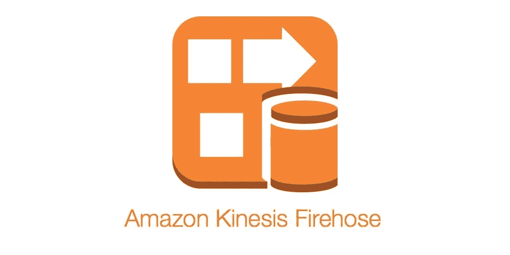

# 使用 Spring Boot 将数据放入亚马逊 Kinesis 消防水管交付流

> 原文：<https://towardsdatascience.com/put-data-to-amazon-kinesis-firehose-delivery-stream-using-spring-boot-6098f3e70d54?source=collection_archive---------14----------------------->

> 最初发表于[我的个人博客](https://blog.contactsunny.com/tech/put-data-to-amazon-kinesis-firehose-delivery-stream-using-spring-boot)。

如果你处理需要收集、转换和分析的大数据流，你肯定会听说过亚马逊 Kinesis Firehose。它是一种 AWS 服务，用于将数据流加载到数据湖或分析工具，以及压缩、转换或加密数据。

你可以使用 Firehose 将流数据加载到 S3 或红移中。从那里，您可以使用 SQL 查询引擎，如 [Amazon Athena](https://blog.contactsunny.com/tag/amazon-athena) 来查询这些数据。您甚至可以将这些数据连接到您的 BI 工具，并获得数据的实时分析。这在需要实时数据分析的应用中非常有用。



在这篇文章中，我们将看到如何在 Kinesis Firehose 中创建一个*交付流*，并编写一段简单的 Java 代码将记录(生成数据)放入这个交付流。我们将设置 Kinesis Firehose 将传入的数据保存到亚马逊 S3 的一个文件夹中，该文件夹可以添加到一个管道中，您可以使用 Athena 查询它。仔细想想，当事情失去控制时，你真的会使你的管道变得复杂，并在将来遭受损失。建议在项目的架构阶段后退一步，分析所有管道可能导致瓶颈的地方。的确，大多数 AWS 服务都是完全托管和自动扩展的。但是，控制您的架构并以这样一种方式设计它，使管道不会成为您项目中最薄弱的结构，这不会有什么坏处。不管怎样，我们继续吧。

# 在 Kinesis Firehose 中创建交付流

要开始向 Kinesis Firehose 交付流发送消息，我们首先需要创建一个。为此，让我们登录 AWS 控制台，并前往 Kinesis 服务。您应该会在 Kinesis 主页上看到一个创建新的消防软管交付流的按钮。希望你找到了那个按钮。创建交付流包括四个步骤。让我们一个接一个地看看它们:

**第一步:名称和来源**

这里，我们指定了流的名称，以及流如何获取数据，这是源部分。为该流选择一个名称。该页面应该类似于下面的截图:


接下来，我们必须指定这个流的数据源。有两种方法可以将数据放入流中:

*   使用 AWS 提供的 Put data APIs，它可以集成到您的应用程序中，直接向流发送数据。
*   从另一个数据流传输数据。

在这个例子中，我们将使用第一个选项，直接看跌期权或其他来源。选择此选项，然后单击页面底部的“下一步”进入第二步。

**第二步:流程记录**

Kinesis Firehose 的众多功能之一是，它可以在将传入数据发送到目的地之前对其进行转换。在第二步中，我们可以告诉 Kinesis 它与这个流的传入数据有什么关系。现在，我们将保持一切默认。这意味着没有任何形式的转换，也没有数据格式的转换。理想情况下，您会希望将数据转换为 Parquet 格式，这样既可以压缩数据，又可以提高处理效率。保持这两个配置处于禁用状态，然后单击页面底部的 Next 按钮。

**第三步:选择目的地**

既然我们已经配置了 Firehose 来获取数据，现在我们必须告诉它将数据发送到哪里。有四个选项:

1.  亚马逊 S3
2.  亚马逊红移
3.  亚马逊弹性搜索服务
4.  Splunk

每个目标都有自己配置。因为我们现在并不真正担心其他任何事情，只是想将数据发送到 Firehose，所以我们将数据保存到 S3，这也是默认选项。

向下滚动，您会发现提供一个 S3 存储桶来存储数据的选项。您可以选择现有的存储桶，也可以创建新的存储桶。

接下来，我们有前缀选项。所以 Firehose 写给 S3 的任何东西都会被默认分区，格式为“YYYY/MM/DD/HH”(UTC)。您当然可以覆盖它，但是您的前缀中必须至少有一个时间戳。如果你没有提供一个带有时间戳的前缀，Firehose 会自动添加一个，因为这是强制的。此外，您不能添加一部分传入数据作为前缀。所以不要打算这样设计。现在，让它为空或者给出一个随机的字符串。

类似地，你也可以给错误一个前缀。我会让它暂时为空，因为这只是一个概念验证。单击页面底部的“下一步”按钮。我们将进入流程的下一步。

**第四步:配置设置**

在这一步中，我们将为我们数据在 S3 中的存储方式指定一些重要的配置。我将对每一项进行解释，但我建议在此 POC 中保留它们的默认设置。

首先，我们有缓冲条件。这里有两个配置，缓冲区大小和缓冲区间隔。Kinesis Firehose 在将传入数据写入 S3 之前对其进行缓冲。将收到的每一条信息写给 S3 将会非常昂贵。因此数据被缓冲并批量写入 S3。您可以指定缓冲区大小，例如 5MB，以及缓冲区间隔，例如 300 秒。所以无论哪个先发生都会被考虑。例如，如果缓冲区在短短 10 秒内达到 5MB 的大小限制，数据将被写入 S3，缓冲区将被清除。此外，如果数据还不到 5MB，但自上次写入以来已经过了 300 秒，则缓冲区中的任何数据都将被写入 S3，缓冲区将被清除。

接下来，我们可以选择在 S3 压缩和加密数据。我们可以使用压缩算法，如 GZIP 和 SNAPPY 来压缩数据。当我们处理千兆字节的数据时，会考虑到这一点。对于此 POC，请将其禁用。我们现在也不需要任何加密。

如果有必要，我们可以启用错误日志。或许还可以添加一些标签。但是我不认为他们中的任何一个需要这个概念验证。所以让我们直接翻到这一页的底部。

这里，我们需要指定一个 IAM 角色，该角色有权向 S3 写入数据。Kinesis Firehose 将使用这个 IAM 角色将传入数据写入 S3。您可以选择现有的 IAM 角色，也可以创建新的 IAM 角色。选择此项后，单击页面底部的“下一步”按钮。

您现在应该已经创建了交付流。我们已经完成了流的创建。我们可以转到 Java 代码，我们将使用它向这个流发送数据。

# Java 代码

在我们进入代码之前，像往常一样，让我们看一下我们需要的依赖项。我为此创建了一个 Maven 项目。所以我有一个 *pom.xml* 文件用于依赖管理。我已经列出了我在这里使用的所有依赖项:

```
<dependencies> <dependency>
        <groupId>org.springframework.boot</groupId>
        <artifactId>spring-boot-starter</artifactId>
    </dependency>
    <dependency>
        <groupId>com.amazonaws</groupId>
        <artifactId>aws-java-sdk</artifactId>
        <version>1.11.627</version>
    </dependency>
    <dependency>
        <groupId>com.amazonaws</groupId>
        <artifactId>amazon-kinesis-client</artifactId>
        <version>1.11.2</version>
    </dependency>
    <dependency>
        <groupId>org.codehaus.jettison</groupId>
        <artifactId>jettison</artifactId>
        <version>1.2</version>
    </dependency></dependencies>
```

接下来，使用 AWS SDK，我们需要创建一个 *AmazonKinesisFirehose* 客户端，它将用于将数据或*记录*放入 Firehose 交付流。为此，我们首先需要创建 AWS 凭证对象。对于这个例子，我使用的是 *BasicAWSCredentials* 类。这意味着，我们必须提供访问密钥和访问秘密。我们将把这些数据保存在 *application.properties* 文件中，这样我们就可以将这些数据放入 Java 代码中，而无需硬编码。因为这是一个 Spring Boot 应用程序，所以我们可以为此使用 *@Value()* 注释:

```
@Value("${aws.auth.accessKey}")
private String awsAccessKey;@Value("${aws.auth.secretKey}")
private String awsSecretKey;
```

使用这两个变量，我们将创建凭证对象和 Firehose 客户端:

```
BasicAWSCredentials awsCredentials = new BasicAWSCredentials(awsAccessKey, awsSecretKey);AmazonKinesisFirehose firehoseClient = AmazonKinesisFirehoseClient.builder()
        .withRegion(Regions.US_WEST_2)
        .withCredentials(new AWSStaticCredentialsProvider(awsCredentials))
        .build();
```

请确保您更改了上面代码片段中的区域，以匹配您的 Kinesis 设置。一旦我们创建了这个 Firehose 客户端，我们就可以开始向 Firehose“放记录”了。但是让我们来看看我们将要输入的数据。

```
JSONObject messageJson = new JSONObject();
messageJson.put("key1", "We are testing Amazon Kinesis Firehose!");
messageJson.put("integerKey", 123);
messageJson.put("booleanKey", true);
messageJson.put("anotherString", "This should work!");logger.info("Message to Firehose: " + messageJson.toString());
```

如您所见，我创建了一个简单的 JSON 对象，它将被序列化，转换成字节，然后发送到 Firehose。在我们实际发送数据之前，我们必须创建一个 *PutRecordRequest* 对象，使用它我们将指定向哪个流发送数据。流名称不是硬编码的，但是我们从*application . propertiets*文件中获取它，类似于 AWS 凭证:

```
@Value("${aws.kinesis.firehose.deliveryStream.name}")
private String fireHoseDeliveryStreamName;
```

我们现在将创建 PutRecordRequest:

```
PutRecordRequest putRecordRequest = new PutRecordRequest();
putRecordRequest.setDeliveryStreamName(fireHoseDeliveryStreamName);
```

接下来，我们将创建一个*记录*对象，它将保存将要发送的实际数据。我们将这个记录设置为我们刚刚创建的 *putRecordRequest* 对象，并调用*。Firehose 客户端对象上的 putRecord()* 方法。

```
Record record = new Record().withData(ByteBuffer.wrap(messageJson.toString().getBytes()));
putRecordRequest.setRecord(record);PutRecordResult putRecordResult = firehoseClient.putRecord(putRecordRequest);
```

就是这样。如果您没有从 AWS 客户端得到任何错误，您可以确信您发送的数据将在您的 S3 桶中。去看看。

如果你对这个例子中完整的 Spring Boot 项目感兴趣，可以去[我的 Github 库](https://github.com/contactsunny/SpringBootAmazonKinesisFirehoseProducerPOC)看看，也许可以分支一下？

> 在 [Twitter](https://twitter.com/contactsunny) 上关注我，了解更多[数据科学](https://blog.contactsunny.com/tag/data-science)、[机器学习](https://blog.contactsunny.com/tag/machine-learning)，以及一般[技术更新](https://blog.contactsunny.com/category/tech)。此外，你可以[关注我的个人博客](https://blog.contactsunny.com/)，因为我在那里发布了很多我的教程、操作方法帖子和机器学习的优点。