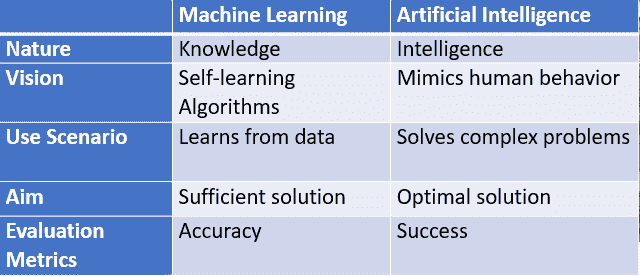
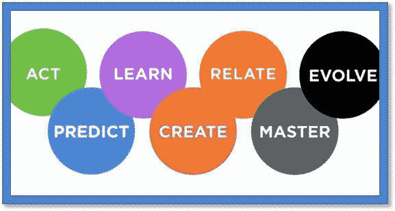
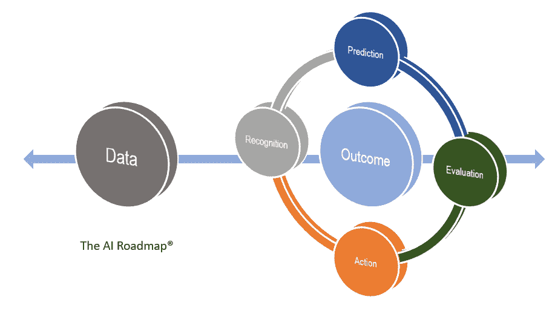

# 把 AI 放在第一位

> 原文：<https://towardsdatascience.com/putting-ai-first-2790e8dd0211?source=collection_archive---------14----------------------->

Image credit : cio.com

如何将人类和机器智能结合起来，为企业带来实实在在的好处？

上个月在达沃斯，人工智能被第四次工业革命和以人为中心的人工智能的持续喧嚣所掩盖，几乎每个与会的首席执行官都可以读到人工智能。[【1】](http:/#_ftn1)与技术介绍的多样性形成鲜明对比的是，人们似乎有一个共同的想法:人工智能对商业和工业来说都是一个巨大的机会。在这种兴奋的阴影下，两个基本问题的答案似乎在闲聊中消失了:组织将如何实施人工智能，以及如何将人类和机器智能结合起来，为企业带来切实的好处？在这篇文章中，我们将区分人工智能和机器学习，首先讨论人工智能的概念，并提出我们的人工智能路线图，以展示如何将数据科学带到桌面上来，使组织在今天和明天受益。

人工智能与组织在过去十年中利用的机器学习有什么不同？如果这两种愿景都建立在数据科学的进步之上，那么这两种方法在目标、方法和评估指标上有着根本的不同。就像 HTML 和 XML 在编写网页方面的差异一样，人工智能超越了数据中可见内容的前提，探索了人类交互背后的逻辑和伦理。传统的数据科学利用机器学习，通过检查数据、特征和实验来阐明人类知识，而人工智能的目标是揭示人类智能背后的认知推理。机器学习的目标是预测与测试数据集中的模式一致的新数据点，而人工智能的主旨是解决复杂的(非线性甚至混乱的)商业问题。机器学习的价值主张是提高一个组织预测未来的能力，而人工智能的愿景是阐明每个决策环境的最佳答案。

将人工智能作为商业战略放在第一位将要求管理层放弃以前利用 IT 硬件和软件的观念。AI First 不是承诺支持手机或云等技术平台，而是投资一个组织的能力来解决未来的业务挑战。对 IT 的投资不能再被归类为硬件、软件和专有数据，而是对人力资本的基础设施投资，与构建业务本身的投资没有区别。数据不再被视为一种资源，而是一种独特的资产，必须对其进行评估、丰富，并与组织开展业务的方式密切相关。AI 首先意味着放弃提高运营效率的正统观念，转而采用不断实验的思维模式，并接受创新者困境的悖论。人工智能首先作为一种商业战略，并不是一切照旧，而是一种有意识的选择，以改变组织及其生态系统之间的几个边界——这不仅需要改变思维模式，还需要改变交易条款和我们做生意的标准。

[机器智能连续体](https://medium.com/topbots/the-machine-intelligence-continuum-ab6aee686a2d)

虽然我们今天很方便地区分了有限、一般和超级人工智能，但我们很少将我们的人工智能愿景与我们商业战略的具体细节联系起来。姚为我们提供了一个人工智能的连续体，来理解为什么组织投资人工智能的不同观点的含义。[【3】](http:/#_ftn3)在竞技场的一端，人工智能的目标可以简单地是比人类更快、更便宜或更有效地执行简单的人类任务。在该领域的另一端，人工智能可以用来建立认知系统，以应对商业(或社会)生态系统的未来挑战。在这两者之间，可以张贴旗帜来鼓励预测、学习、创造和掌握人类行为的复杂性。经理和他们的数据科学团队可以在一定程度上玩人工智能游戏，因为他们知道他们的利益相关者在哪里调整了目标。

白的人工智能路线图

组织将如何利用人工智能将数据转化为集体行动？无论是经理还是客户都不会根据数据采取行动，而是根据他们对数据如何代表他们面前的挑战和机遇的看法采取行动。在我们的人工智能路线图中，我们展示了客户和经理如何做出运营决策，并指出了机器学习和人工智能可以发挥作用的地方。该路线图着眼于感知的四个基本要点:识别、预测、评估和行动，以及每个要点如何根据手头的数据来制约我们的执行、发明和创新能力。基于特定的业务环境和逻辑，在每个方向上探索匹配人类和机器智能的挑战和机遇。

我们将基于真实世界的例子，在 BAI 在大波士顿地区举办的春季课程“[人工智能管理](http://lp.baieurope.com/)”、在 BAI 在法国巴约纳举办的夏季课程“[数据科学实践](http://baisummer.com/)”以及在印度迈索尔举办的秋季课程“[数据科学伦理](http://baifall.com/)”中，详细探讨这些论点。商业分析实践是商业分析学院的核心和灵魂。通过关注数字经济、组织决策、机器学习和人工智能的管理挑战，白让分析为您和您的组织工作。

李·施伦克博士

[商业分析研究所](http://baieurope.com./)

2019 年 2 月 16 日

____

[【1】](http:/#_ftnref1)k . Roose(2019 年 1 月 25 日)，“[达沃斯精英们隐藏的自动化议程](https://www.nytimes.com/2019/01/25/technology/automation-davos-world-economic-forum.html) *，”*《纽约时报》

克莱顿·克里斯滕森(2015 年 12 月 15 日)。[《创新者的困境:当新技术导致大公司失败的时候》](https://books.google.com/books?id=lURBCgAAQBAJ&lpg=PA99&dq=Resource+dependence:+Customers+effectively+control+the+patterns+of+resource+allocation+in+well-run+companies+Small+markets+don%27t+solve+the+growth+needs+of+large+companies+The+ultimate+uses+or+applications+for+disruptive+technologies+are+unknowable+in+advance.+Failure+is+an+intrinsic+step+toward+success&source=bl&ots=GFlzo1Gy7q&sig=PWxd4iaSZ1wftnUwMspgNlr0O_8&hl=en&sa=X&output=reader&pg=GBS.PA98.w.1.3.38)。哈佛商业评论出版社

【姚，m .(2017 年 10 月 16 日)[机器智能连续体](http://the%20machine%20intelligence%20continuum/)，中