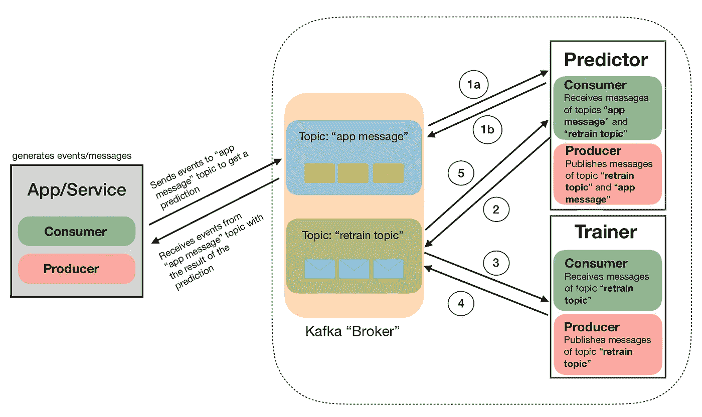
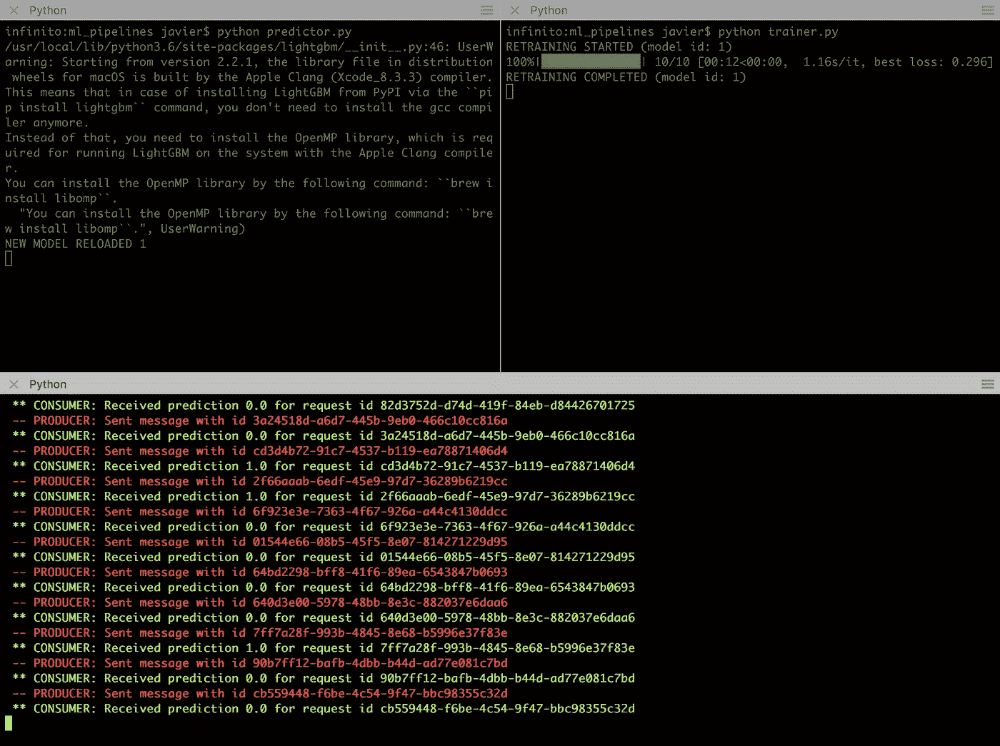

# 将 ML 投入生产 I:在 Python 中使用 Apache Kafka。

> 原文：<https://towardsdatascience.com/putting-ml-in-production-i-using-apache-kafka-in-python-ce06b3a395c8?source=collection_archive---------7----------------------->

这是两个帖子中的第一个，我们将展示如何使用一系列工具(主要是[卡夫卡](https://kafka.apache.org/)和 [MLFlow](https://mlflow.org/) )来帮助制作 ML。为此，我们将设置一个简单的场景，我们希望它类似于一些真实的用例，然后描述一个潜在的解决方案。所有代码的配套回购可以在[这里](https://github.com/jrzaurin/ml_pipelines)找到。

# **场景**

一家公司使用一系列服务来收集数据，当用户/客户与该公司的网站或应用程序交互时，这些服务会生成事件。当这些交互发生时，算法需要实时运行**，并且需要根据算法的输出(或预测)立即采取一些行动。最重要的是，在 *N 次*交互(或观察)之后，算法需要重新训练**而不停止**预测*服务* *，*因为用户将保持交互。**

**在这里的练习中，我们使用了[成人](https://archive.ics.uci.edu/ml/datasets/adult)数据集，目标是根据个人的年龄、祖国等来预测个人收入是否高于/低于 50k。为了使这个数据集适应前面描述的场景，可以假设年龄、国籍等是通过在线问卷/表格收集的，我们需要实时预测用户的收入是高还是低。如果收入高，我们会立即打电话/发电子邮件给他们，提供一些优惠。然后，在新的观察之后，我们重新训练算法，同时继续预测新用户。**

****解决方案****

**图 1 是一个潜在解决方案的示意图。为了实现这个解决方案，我们使用了 [Kafka-Python](https://github.com/dpkp/kafka-python) (一个不错的教程可以在这里找到[)，以及](https://github.com/dpkp/kafka-python) [LightGBM](https://lightgbm.readthedocs.io/en/latest/) 和[hyperpt](https://github.com/hyperopt/hyperopt)或 [HyperparameterHunter](https://github.com/HunterMcGushion/hyperparameter_hunter) 。**

****

**Figure 1\. **Real-time prediction ML pipeline**. A full description is provided below**

**在本练习中，我们将使用的唯一 Python“局外人”是 [Apache-Kafka](https://kafka.apache.org/) (我们将使用 python API Kafka-Python，但 Kafka 仍然需要安装在您的系统中)。如果你用的是苹果电脑，就用自制软件:**

```
brew install kafka
```

**这也将安装 zookeeper 依赖项。**

**如前所述，我们使用了成人数据集。这是因为我们的目的是说明一个潜在的 ML 管道，并提供有用的代码，同时保持它相对简单。但是请注意，这里描述的管道原则上是数据不可知的。当然，预处理将根据数据的性质而变化，但是管道组件即使不完全相同，也会保持相似。**

****初始化实验****

**这篇文章使用的代码(以及更多)可以在我们的[报告](https://github.com/jrzaurin/ml_pipelines)中找到。在那里，有一个名为`initialize.py`的剧本。该脚本将下载数据集，设置 dir 结构，预处理数据，在训练数据集上训练初始模型，并优化该模型的超参数。在现实世界中，这将对应于通常的实验阶段和离线训练初始算法的过程。**

**在这篇文章中，我们希望更多地关注管道和相应的组件，而不是 ML。尽管如此，让我们简单地提一下我们在这个练习中使用的 ML 工具。**

**给定我们正在使用的数据集，数据预处理相当简单。我们编写了一个名为`[FeatureTools](https://github.com/jrzaurin/ml_pipelines/blob/master/utils/feature_tools.py)`的定制类，可以在回购的`utils`模块中找到。这个类有`.fit`和`.transform`方法，它们将标准化/缩放数字特征，编码分类特征，并生成我们所说的“交叉列”，这是两个(或更多)分类特征之间的笛卡尔乘积的结果。**

**处理完数据后，我们使用 LightGBM 拟合模型，并使用 Hyperopt 或 HyperparameterHunter 进行超参数优化。与这个任务相关的代码可以在`train`模块中找到，在这里可以找到两个脚本`[train_hyperop](https://github.com/jrzaurin/ml_pipelines/blob/master/train/train_hyperopt.py).py`和`[train_hyperparameterhunter](https://github.com/jrzaurin/ml_pipelines/blob/master/train/train_hyperparameterhunter.py).py`。**

**我们可能会写一个单独的帖子来比较 python 中超参数优化包( [Skopt](https://scikit-optimize.github.io/) ，Hyperopt 和 HyperparameterHunder)，但是现在，要知道:如果你想要速度，那么使用 Hyperopt。如果你不关心速度，你想保持你的优化程序的详细跟踪，然后使用超参数猎人。用这个包的创造者[亨特](https://www.linkedin.com/in/huntermcgushion/)麦古西翁的话说:**

> **“长期以来，超参数优化一直是一个非常耗时的过程，只是为您指明了进一步优化的方向，然后您基本上不得不重新开始。”**

**HyperparameterHunter 就是为了解决这个问题，而且做得非常好。目前，该软件包是建立在 Skopt 之上的，这就是为什么它明显比 Hyperopt 慢的原因。然而，我知道有人在努力将 Hyperopt 作为 HyperparameterHunter 的另一个后端。当这种情况发生时，将不会有争论，超参数猎人应该是你的选择工具。**

**尽管如此，如果有人感兴趣，我在回购中包括了一个[笔记本](https://github.com/jrzaurin/ml_pipelines/blob/master/notebooks/skopt_vs_hyperopt.ipynb)，比较 Skopt 和 Hyperopt 的性能。**

**现在让我们转到管道流程本身。**

****应用程序消息制作者****

**这是生产管道的一个相对简单的例子。因此，我们直接使用成人数据集来生成消息(JSON 对象)。**

**在现实世界中，可能会有许多服务生成事件。从那里，一个人有几个选择。这些事件中的信息可能存储在数据库中，然后通过您的常规查询进行汇总。从那里，Kafka 服务将消息发布到管道中。或者，这些事件中的所有信息可以直接发布到不同的主题中，一个“聚合服务”可以将所有信息存储在一个消息中，然后该消息将被发布到管道中(当然，也可以是两者的组合)。**

**例如，用户可以通过脸书或谷歌注册，收集他们的姓名和电子邮件地址。然后，他们可能会被要求填写一份调查问卷，我们会随着事件的进展不断收集信息。在这个过程中的某个时刻，所有这些事件将被聚合在一条消息中，然后通过 Kafka 制作人发布。本文中的管道将从所有相关信息聚集的地方开始。我们这里的信息是成人数据集中的个人观察。下面是我们信息内容的一个例子:**

```
’{“age”:25,”workclass”:”Private”,”fnlwgt”:226802,”education”:”11th”,”marital_status”:”Never-married”,”occupation”:”Machine-op-inspct”,”relationship”:”Own-child”,”race”:”Black”,”gender”:”Male”,”capital_gain”:0,”capital_loss”:0,”hours_per_week”:40,”native_country”:”United-States”,”income_bracket”:”<=50K.”}’
```

**[应用/服务](https://github.com/jrzaurin/ml_pipelines/blob/master/sample_app.py)(图 1 中最左边的灰色方框)的核心是下面的代码片段:**

**请注意，我们使用测试数据集来生成消息。这是因为我们设计了一个尽可能接近真实世界的场景(在一定范围内)。考虑到这一点，我们已经使用训练数据集来构建初始的`model` 和`dataprocessor` 对象。然后，我们使用测试数据集来生成消息，目的是模拟随着时间的推移接收新信息的过程。**

**关于上面的片段，简单地说，生产者将消息发布到管道中(`start_producing()`)，并将使用最终预测(`start_consuming()`)来消费消息。同样，我们在这里描述的管道不包括流程的最开始(事件收集和聚合)，我们也跳过最结尾，即如何处理最终预测。尽管如此，我们还是简要讨论了一些用例，在这些用例中，这个管道在本文的末尾会很有用，这将说明最后的阶段。**

**实际上，除了忽略过程的开始和结束，我们认为这个管道与现实世界中使用的管道相当相似。因此，我们希望我们回购中包含的代码对您的一些项目有用。**

****预测器和训练器****

**该实现的主要目标是实时运行该算法，并且每隔 *N* 次观察**重新训练该算法，而不需要**停止预测服务。为此，我们实现了两个组件，预测器**(回购中的`[predictor](https://github.com/jrzaurin/ml_pipelines/blob/master/predictor.py).py`)和训练器**(`[trainer](https://github.com/jrzaurin/ml_pipelines/blob/master/trainer.py).py`)。******

******现在让我们使用代码片段作为指导方针，逐一描述图 1 中显示的数字。注意，下面的过程假设用户已经运行了`initialize.py`脚本，因此初始的`model.p`和`dataprocessor.p`文件存在于相应的目录中。此外，强调下面的代码包括预测器和训练器的核心。完整代码请参考[回购](https://github.com/jrzaurin/ml_pipelines)。******

********预测器********

****预测器的核心代码如下所示****

****`predictor.py`片段中的 **(1a)** 第 12 行。预测器将接收来自应用程序/服务的消息，它将进行数据处理，并在接收消息时实时运行模型。所有这些都是通过使用`predict`函数中现有的`dataprocessor`和`model`对象来实现的。****

******(1b)**`predictor.py`片段中的第 13 行。一旦我们运行了预测，预测器将发布最终将被应用/服务接收的结果(`publish_prediction()`)。****

******(2 )** 代码片段中的第 17–20 行。每收到一条`RETRAIN_EVERY` 消息，预测器将发布一条“*重新训练*”消息(`send_retrain_message()`)供训练员阅读。****

******培训师******

******(3)**`trainer.py`片段中的第 12 行。训练器将读取该消息，并用新的累积数据集触发再训练过程(`train()`)。这是，原始数据集加上`RETRAIN_EVERY`的新观测数据。训练功能将独立于 **1a** 和 **1b** 中描述的过程，运行*“初始化实验”* 部分中描述的整个过程。换句话说，当消息到达时，训练器将重新训练模型，而预测器继续提供预测。****

****在这个阶段，值得一提的是，我们在这里发现了我们的实现与现实世界中使用的实现之间的进一步差异。在我们的实现中，一旦已经处理了`RETRAIN_EVERY` 个观察值，就可以重新训练算法。这是因为我们使用成人测试数据集来生成消息，其中包括目标列(" *income_braket* ")。在现实世界中，基于算法的输出所采取的行动的真实结果通常不会在算法运行之后立即可获得，而是在一段时间之后。在这种情况下，另一个过程应该是收集真实结果，一旦收集的真实结果的数量等于`RETRAIN_EVERY`，算法将被重新训练。****

****比如说这个管道实现了一个电商的实时推荐系统。我们已经离线训练了一个推荐算法，目标列是我们的用户喜欢我们的推荐的程度的分类表示:0、1、2 和 3 分别表示不喜欢该项目或与该项目交互、喜欢该项目(例如，点击喜欢按钮)、将该项目添加到他们的购物篮和购买该项目的用户。当系统提供建议时，我们仍然不知道用户最终会做什么。****

****因此，除了在用户浏览网站(或应用程序)时收集和存储用户信息的过程之外，第二个过程应该收集我们推荐的最终结果。只有当两个过程都收集了`RETRAIN_EVERY`消息和结果时，算法才会被重新训练。****

******(4)**`trainer.py`片段中的第 13 行。一旦重新训练完成，将发布一条包含相应信息的消息(`published_training_completed()`)。****

******(5)**`predictor.py`片段中的第 5–8 行。预测者的消费者订阅了两个话题:`[‘app_messages’, ‘retrain_topic’]`。一旦它通过“retrain_topic”接收到再训练已完成的信息，它将加载新的模型并照常继续该过程，而不会在该过程中的任何时间停止。****

# ****如何运行管道****

****在配套回购中，我们包含了如何运行管道(本地)的说明。其实很简单。****

1.  ****开始 zookeper 和卡夫卡:****

```
**$ brew services start zookeeper
==> Successfully started `zookeeper` (label: homebrew.mxcl.zookeeper)
$ brew services start kafka
==> Successfully started `kafka` (label: homebrew.mxcl.kafka)**
```

****2.运行 initialize.py:****

```
**python initialize.py**
```

****3.在 1 号终端运行预测器(或训练器):****

```
**python predictor.py**
```

****4.在 2 号终端运行训练器(或预测器):****

```
**python trainer.py**
```

****5.在 3 号终端运行示例应用程序****

```
**python samplea_app.py**
```

****然后，一旦处理了 N 条消息，您应该会看到类似这样的内容:****

********

******右上角终端**:我们已经重新训练了模型，Hyperopt 已经运行了 10 次评估(在真实的练习中应该有几百次)。**左上终端**:一旦模型被重新训练和优化，我们将看到预测器是如何加载新模型的(在新的 LightGBM 版本发出恼人的警告消息之后)。**底部终端**:服务照常进行。****

# ******一些潜在的使用案例******

****这里有几个潜在的用例，以及其他一些。****

1.  ******实时调整在线旅程******

****我们来考虑一个卖一些物品的电商。当用户浏览网站时，我们收集他们的活动信息。我们之前已经训练了一个算法，我们知道，比如说，在 10 次互动之后，我们就可以很好地知道客户最终是否会购买我们的产品。此外，我们还知道他们可能购买的产品可能会很贵。因此，我们希望定制他们的“移动”旅程，以促进他们的购物体验。这里的定制可以是任何东西，从缩短旅程到改变页面布局。****

****2.**给你的客户发邮件/打电话******

****与之前的用例类似，现在让我们假设客户决定停止旅程(厌倦、缺少时间、可能太复杂，等等)。如果算法预测这个客户有很大的潜力，我们可以使用像这篇文章中描述的管道立即或在控制延迟的情况下发送电子邮件或打电话给他们。****

# ******接下来的步骤******

1.  ******日志记录和监控**:在即将发布的帖子中，我们将通过 MLFlow 在管道中插入日志记录和监控功能。与 HyperparameterHunter 一起，该解决方案将自动全面跟踪模型性能和超参数优化，同时提供可视化监控。****
2.  ******流管理**:这里描述的解决方案以及相应的代码，已经被设计成可以在本地的笔记本电脑上轻松运行。然而，人们可能会认为，在现实生活中，这必须大规模地运行云。这一具体部分将不会在两个帖子中涉及。然而，我可以向你保证，将这里描述的结构移植到 AWS(举例来说)并在你方便的时候自动运行它(使用 EC2s、S3 和任何适合你的特定情况的前端)并不特别复杂。****

****任何问题/建议，请发邮件至:jrzaurin@gmail.com****