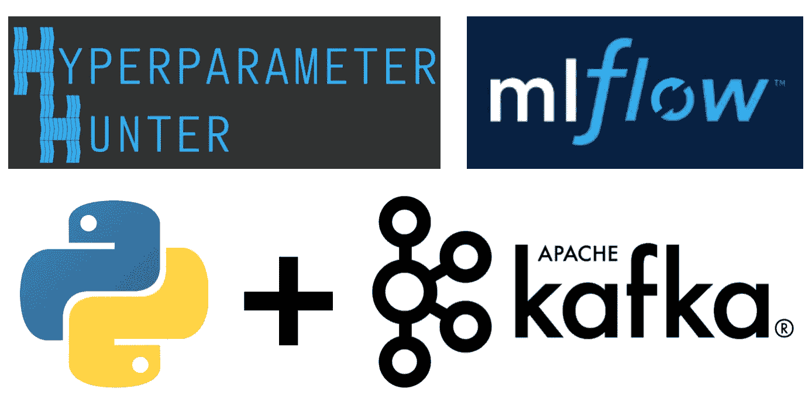
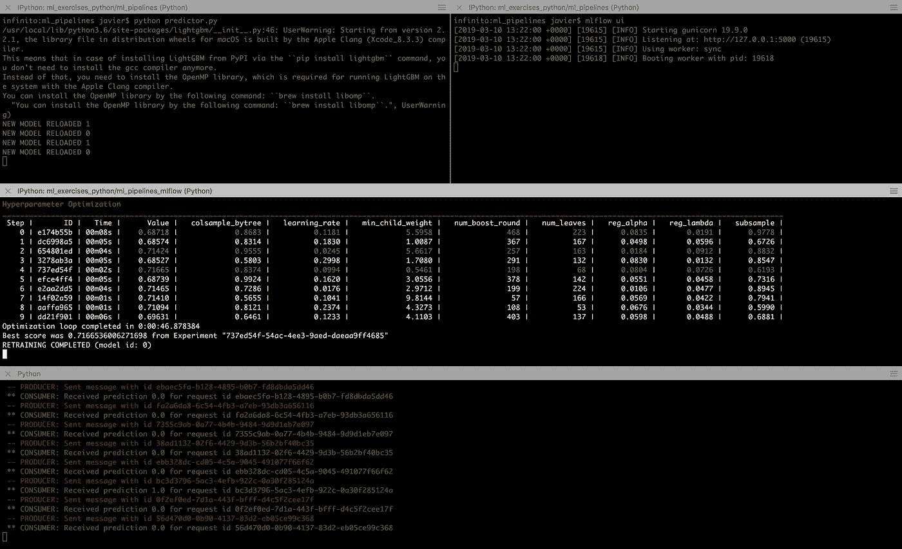
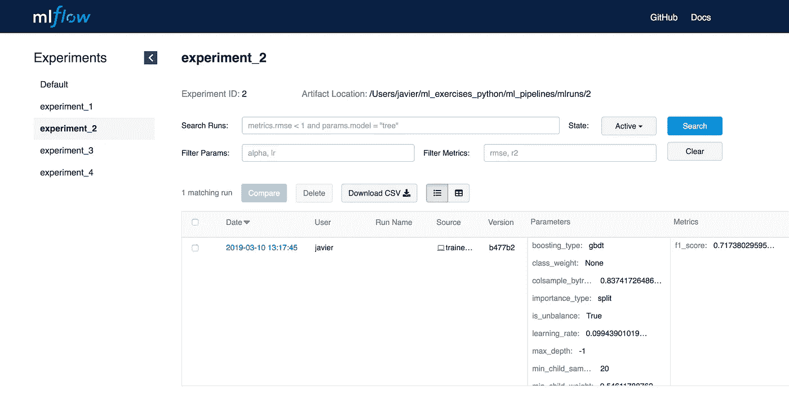

# 将 ML 投入生产 II:日志记录和监控

> 原文：<https://towardsdatascience.com/putting-ml-in-production-ii-logging-and-monitoring-algorithms-91f174044e4e?source=collection_archive---------9----------------------->



在我们之前的文章中，我们展示了如何使用 Apache Kafka 的 Python API ( [Kafka-Python](https://github.com/dpkp/kafka-python) )来实时生成算法。在这篇文章中，我们将更多地关注 ML 方面，更具体地说，关注如何在(重新)训练过程中记录信息，并监控实验的结果。为此，我们将使用 [MLflow](https://www.mlflow.org/docs/latest/index.html) 和[hyperpt](http://hyperopt.github.io/hyperopt/)或 [HyperparameterHunter](http://HyperparameterHunterAssets) 。

# 场景和解决方案

场景和解决方案的详细描述可以在前面提到的帖子中找到。

总之，我们希望实时运行算法**，**，并且需要根据算法的输出(或预测)立即采取一些行动。此外，在 *N 次*交互(或观察)后，算法需要重新训练**而不停止**预测 *服务。*

我们的解决方案主要依赖于 Kafka-Python 在流程的不同组件之间分发信息(更多细节请参见我们第一篇文章中的图 1):

1.  服务/应用程序生成一条消息(JSON ),其中包含算法所需的信息(即功能)。
2.  “*预测器*组件接收消息，处理信息并运行算法，将预测发送回服务/应用。
3.  在 *N* 个已处理的消息(或观察)之后，预测器向“*训练器*”组件发送消息，开始新的训练实验。这个新的实验将包括原始数据集加上所有新收集的观察数据。正如我们在第一篇文章中所描述的，在现实世界中，在重新训练算法之前，人们必须等到它接收到与观察一样多的真实结果(即真实标签或数字结果)。
4.  一旦算法被重新训练，训练器发送相应的消息，预测器将加载新的模型而不停止服务。

# ML 工具

为了简洁起见，我们更喜欢在这里关注过程而不是算法本身。但是，如果你想进一步探索，至少让我给你一些指导。

我们使用的核心算法是 [LightGBM](https://github.com/Microsoft/LightGBM) 。LightGBM 已经成为我几乎每个涉及分类或回归的项目的首选算法(它还可以进行排名)。网上有大量关于这个包的信息，人们可以在 github repo 的[示例区](https://github.com/Microsoft/LightGBM/tree/master/examples)学习如何在各种场景中使用它。但是，对于给定的算法，我总是推荐阅读相应的论文。在这种情况下，[柯等人 2017](https://papers.nips.cc/paper/6907-lightgbm-a-highly-efficient-gradient-boosting-decision-tree.pdf) 做得太棒了。这篇论文写得很好，总的来说，很容易理解。

使用的优化包将是 HyperparameterHunter(以下简称 HH)和 [Hyperopt](https://github.com/hyperopt/hyperopt) ，两者都采用贝叶斯优化方法。HH 使用 Skopt 作为后端，其`BayesianOptimization`方法基于高斯过程。另一方面，据我所知，Hyperopt 是唯一实现 TPE(Parzen estimators 树)算法的 Python 包。我发现了一些使用该算法的其他库，但都依赖于 Hyperopt(例如 [Optunity](https://optunity.readthedocs.io/en/latest/index.html) 或 Project Ray 的 [tune](https://ray.readthedocs.io/en/latest/tune.html) )。

如果你想学习贝叶斯优化方法，我建议你做以下事情。首先阅读 [Skopt](https://scikit-optimize.github.io/) 站点中的[贝叶斯优化](https://scikit-optimize.github.io/notebooks/bayesian-optimization.html)部分。在那里你可以找到问题陈述和贝叶斯过程(或循环)的描述，我认为这对于贝叶斯优化方法来说是相当常见的。然后去超视论文( [Bergstra 等人，2011](https://papers.nips.cc/paper/4443-algorithms-for-hyper-parameter-optimization.pdf) )。同样，如果你想熟悉贝叶斯方法，这是一篇“必读”的论文。特别是，在那里你将学习高斯过程(GP)和基于顺序模型的全局优化(SMBO)算法(第 2-4 节)背景下的 TPE。

剩下的 ML“成分”是 MLflow，这里将使用它来帮助跟踪和监控训练过程(尽管您会看到 HH 已经很好地保存了所有重要的数据)。

# 跟踪 ML 流程

按照我们第一篇文章中使用的类似方法，我们将使用代码作为评论最重要部分的指南。本节中的所有代码都可以在我们的 repo 的`train`模块中找到。我们将从远视开始，然后转移到 HH，在那里我们将说明是什么使后者独一无二。

**远视**

本节中的代码可以在`train`模块的脚本`[train_hyperopt_mlflow](https://github.com/jrzaurin/ml_pipelines/blob/master/train/train_hyperopt_mlflow.py).py`中找到。

记住，目标是最小化一个目标函数。我们的远视目标函数看起来像这样:

Snippet 1

其中`params`可能是，例如:

Snippet 2

让我们讨论函数中的代码。该功能必须仅依赖于`params`。在函数中，我们使用交叉验证，并输出最佳指标，在本例中为`binary_logloss` 。请注意，我们使用 LightGBM(作为`lgb`导入)方法(**第 14 行**，片段 1 中的`lgb.cv` )，而不是相应的`sklearn`总结。这是因为根据我的经验，LightGBM 自己的方法通常要快一些。还要注意的是，LightGBM 并没有实现像`f1_score`这样的指标。尽管如此，我们还是在`train_hyperopt.py`和`train_hyperopt_mlfow.py`脚本中包含了一个 LightGBM `f1` 定制的度量函数，以防万一。

在代码片段 1 中的第 22**行**处停下来一秒钟是值得的，这里我们记录了用于特定迭代的提升轮次的数量。这是因为当使用 Hyperopt(或 Skopt 或 HH)时，算法将根据参数的输入值进行优化，其中一个参数是`num_boost_round`。在目标函数中，我们通过提前停止进行交叉验证，以避免过度拟合。这意味着最终的提升轮数可能与输入值不同。该信息将在优化过程中“丢失”。为了克服这个限制，我们简单地将最后的`num_boost_round`保存到字典`early_stop_dict`中。然而，并不总是清楚这是最好的解决方案。关于这个和其他关于 GBMs 优化的问题的完整讨论，请在我的 github 中查看[这个笔记本](https://github.com/jrzaurin/RecoTour/blob/master/Ponpare/Chapter10_GBM_reg_Recommendations.ipynb)。

最后，记住我们需要最小化输出值。因此，如果输出是一个分数，`objective` 函数必须输出它的负值，而如果是一个错误(`rmse`)或损失(`binary_logloss`)，函数必须输出值本身。

运行优化过程的代码很简单:

Snippet 3

每一组被尝试的参数将被记录在`trials`对象中。一旦优化完成，我们可以编写自己的功能来记录结果。或者，我们可以使用 MLflow 等工具来帮助我们完成这项任务，并直观地监控不同的实验。你可以想象，一个人只能在 MLflow 上写一些帖子。在这里，我们将简单地说明我们如何使用它来记录最佳性能参数、模型和指标，并监控算法的性能。

**MLflow**

对于 Hyperopt 和 HH，跟踪每个实验结果的 MLflow 块几乎保持不变，如下面的代码片段所述。

Snippet 4

**第 1–8 行**:我们在最新的 MLflow 版本(`0.8.2`)中发现的一个"*恼人的*"行为是，当你第一次实例化类`MLflowClient()`或创建一个实验(`mlflow.create_experiment('test')`)时，它会创建两个目录，`mlruns/0`和`mlruns/1`。前者被称为`Default`，当你运行实验时，它将保持为空。这里我们在一个名为`test_mlflow`的空目录中展示了这种行为:

```
infinito:test_mlflow javier$ ls
infinito:test_mlflow javier$ ipython
Python 3.6.5 (default, Apr 15 2018, 21:22:22)
Type ‘copyright’, ‘credits’ or ‘license’ for more information
IPython 7.2.0 — An enhanced Interactive Python. Type ‘?’ for help.In [1]: import mlflowIn [2]: mlflow.__version__
Out[2]: ‘0.8.2’In [3]: mlflow.create_experiment(‘test’)
Out[3]: 1In [4]: ls mlruns/
0/ 1/
```

因此，当您打开 UI 时，第一个屏幕将是一个空屏幕，上面有一个名为`Default`的实验。如果你能接受这一点(我不能)，那么有更简单的方法来编写 MLflow 块中第 1–8 行的代码，例如:

Snippet 5

在当前设置中(片段 4)，我们的第一次流程初始化(`python initialize.py`)将被称为`Default`，并存储在目录`mlruns/0`中。

另一方面，定义每次运行的`experiment_id`的一种更优雅的方式是列出现有的实验并获得最后一个元素的 id:

```
experiments = client.list_experiments()
with mlflow.start_run(experiment_id=experiments[-1].experiment_id):
```

然而，我发现的另一个*【不方便】*行为是`client.list_experiments()`不维护秩序。这就是为什么我们使用“不太优雅”的解决方案`n_experiments`。

**提前第 9 行**:我们只是运行实验，并记录所有参数、指标和模型作为 MLflow 工件。

在此阶段，值得一提的是，我们完全意识到我们“未充分利用”MLflow。除了跟踪算法的结果，MLflow 还可以[打包和部署](https://www.mlflow.org/docs/latest/tutorial.html#)项目。换句话说，使用 MLflow 可以管理几乎整个机器学习周期。然而，我的印象是，要做这样一件事，需要在头脑中开始一个项目。此外，对我来说，如何在不增加不必要的复杂性的情况下使用 MLflow 打包本文和之前的文章中描述的整个项目并不简单。尽管如此，我在这个库中看到了很多潜力，我清楚地看到自己在未来的项目中使用它。

**超参数猎人(HH)**

看了代码片段 1-4 后，有人可能会想:*“如果我想记录每一次超优化运行并在排行榜中保持跟踪，该怎么办？”*。嗯，有两种可能性: *i)* 可以简单地将 MLflow 块移到目标函数的主体，并相应地修改代码，或者 *ii)* 简单地使用 HH。

在我写这篇文章的时候，我看到了使用 HH 的两个缺点。首先，你不需要编写自己的目标函数。虽然这在很大程度上是一个积极的方面，但也意味着它不太灵活。然而，我使用 HH 已经有一段时间了，除非你需要设计一个复杂的目标函数(例如，目标中一些不寻常的数据操作，或者参数的内部更新)，HH 会完成这项工作。如果你确实需要设计一个高度定制的目标函数，你可以使用`sklearn`的语法编写一个，作为`model_initializer`传递给 HH 的`optimizer` 对象。

第二个缺点，也许更重要，与 HH 没有直接关系，而是 Skopt。HH 是在 Skopt 的基础上构建的，Skopt 明显比 Hyperopt 慢。然而，我知道目前有人在努力添加 Hyperopt 作为一个替代后端(以及其他即将推出的功能，如功能工程，敬请关注)。

总之，如果你不需要设计一个特别复杂的目标函数，并且你能负担得起“目标速度”，HH 提供了许多使它独一无二的功能。首先，HH 为你记录和组织所有的实验。此外，当你运行额外的测试时，它会学习，因为过去的测试不会浪费。换句话说:

> “super parameter hunter 已经知道了你所做的一切，这就是 super parameter hunter 做一些了不起的事情的时候。它不像其他库那样从头开始优化。它从您已经运行过的所有实验和之前的优化回合开始*。”亨特·麦古森。*

让我们看看代码。以下 3 个片段是使用 HH 时需要的全部*(更多细节参见[文档](https://hyperparameter-hunter.readthedocs.io/en/latest/index.html))。本节的完整代码可以在`train`模块的脚本`train_hyperparameterhunter_mlflow.py`中找到。*

正如你将看到的，语法非常简洁。我们首先设置一个`Environment`，它只是一个简单的类，用来组织允许实验被公平比较的参数。

Snippet 6

然后我们进行实验

Snippet 7

其中`model_init_params`和`model_extra_params`为:

Snippet 8

当仔细观察代码片段 7 时，我们可以发现 HH 和 Hyperopt 之间的进一步差异，同样纯粹与 Skopt 后端有关。您将会看到，当使用 Hyperopt 时，可以使用分位数均匀分布(`hp.quniform(low, high, step)`)。在 Skopt 中没有这样的选项。这意味着对于像`num_boost_rounds`或`num_leaves`这样的参数，搜索效率较低。例如，先验地，人们不会期望 100 轮和 101 轮助推的两个实验产生不同的结果。例如，这就是为什么在使用 Hyperopt 时，我们将`num_boost_rounds`设置为`hp.quniform(50, 500, 10)`。

一种可能的方法是使用 Skopt 的分类变量:

```
num_leaves=Categorical(np.arange(31, 256, 4)),
```

然而，这并不是最佳解决方案，因为在现实中，`num_boost_rounds`或`num_leaves`并不是分类变量，而是将被如此对待。例如，默认情况下，Skopt 将为分类特征构建输入空间的一键编码表示。由于类别没有内在的顺序，如果`cat_a != cat_b`在那个空间中两点之间的距离是 1，否则是 0。在搜索像`num_leaves`这样的参数的过程中，这种行为不是我们想要的，因为 32 片叶子与 31 片叶子的距离可能是 255 片。Skopt 提供了不改造空间的可能性，虽然仍不理想，但更好:

```
num_leaves=Categorical(np.arange(31, 256, 4), transform=’identity’),
```

但是由于这样或那样的原因，每次我试图使用它时，它都会抛出一个错误。然而，我们将使用`Integer`,并在 HH 实现 Hyperopt 作为后端时使用它。

# 运行示例

在本节中，我们将运行一个最小的示例来说明我们如何使用 HH 和 MLflow 来跟踪培训过程的每个细节。这里我们将保持简单，但是可以使用 HH 中的`Callbacks`功能来无缝集成这两个包。

最小的例子包括处理 200 条消息，并且每处理 50 条消息就重新训练该算法。在每个再训练实验中，HH 将只运行 10 次迭代。在现实世界中，对传入的消息没有限制(即 Kafka 消费者总是在收听)，在处理了数千个新的观察结果之后，或者在某个时间步长(即每周)之后，可能会发生重新训练，并且 HH 应该运行数百次迭代。

此外，为了便于说明，这里使用我们自己的日志记录方法(主要是`pickle`)、HH 和 MLflow 对进程进行了“过量日志记录”。在生产中，我建议使用结合 MLflow 和 HH 的定制解决方案。

让我们看一看



Figure 1\. Screen shot after minimal example has run

图 1 显示了处理 200 条消息并重新训练模型 4 次(每 50 条消息一次)后的屏幕截图。在左上角的终端中，我们运行预测器(`predictor.py`)，中间的终端运行训练器(`trainer.py)`，在这里我们可以看到上次 HH 运行的输出，而下方的终端运行应用/服务(`sample_app.py`)，在这里我们可以看到收到的请求和输出预测。

读者可能会注意到左上角终端加载的新模型的变化(`NEW MODEL RELOADED 0`->-`NEW MODEL RELOADED 1`->-`NEW MODEL RELOADED 0`->-`NEW MODEL RELOADED 1`)。这是因为当使用我们自己的日志方法时，我们使用一个名为`EXTRA_MODELS_TO_KEEP`的参数来设置我们保留了多少过去的模型。它当前被设置为 1，当前的加载过程指向我们的输出目录。这可以很容易地在代码中改变，以保存过去的模型，或者指向 HH 或 MLflow 对应的输出目录，其中存储了过去所有性能最好的模型。

图 1 中右上方的终端启动 MLflow 跟踪服务器。图 2 显示了 MLflow UI 的一个屏幕截图。



Figure 2\. Screen shot of the MLflow monitoring tool

该图显示了 MLflow 为我们称之为*“实验 _ 2”*的特定情况保存的信息(即，用 100 个累积的新观察/消息重新训练模型)。为了与 HH 保持一致，我们将每个再训练过程保存为不同的实验。如果您希望将所有的再训练过程保存为一个实验，只需转到`train_hyperparameter_hunter.py`的`LGBOptimizer`类中的`optimize`方法，并将`reuse_experiment`参数更改为`True.`

根据当前的设置，在`mlruns`目录中，每个实验将有一个子目录。例如，`mlruns/1`目录的结构是:

Snippet 8\. Summary of the mlruns directory’s file structure

如你所见，所有你需要的信息都在那里，组织得非常好。让我坚持一下，我们 MLflow-code 的当前结构只保存了*性能最好的一组参数和模型*。如前所述，可以将代码片段 4 中的 MLflow 块移到目标函数中，并修改代码，以便 MLflow 记录每一次迭代。或者，也可以使用 HH。

HH 记录了所有的事情。让我们看看`HyperparameterHunterAssets`的目录结构。每个子目录中内容的详细解释可以在[这里](https://hyperparameter-hunter.readthedocs.io/en/latest/file_structure_overview.html)找到。可以看到，保存了关于每个迭代的大量信息，包括每个实验的训练数据集(包括原始/默认数据集的 5 个数据集，加上每个再训练周期包括 50 个额外观察的 4 个新数据集)和当前获胜迭代的排行榜。

Snippet 9\. Brief Summary of the HyperparameterHunterAssets directory’s file structure

希望在这个阶段，读者对如何结合 MLflow 和 HH 来跟踪和监控算法在生产中的性能有一个好的想法。

然而，尽管在生产 ML 时需要考虑这里描述的所有因素，但这里并没有讨论所有需要考虑的因素。让我至少在下一节提到缺失的部分。

# 缺失的部分

**单元测试**

我们在这篇和上一篇文章中(有意)忽略的一个方面是**单元测试**。这是因为单元测试通常依赖于算法的应用。例如，在您的公司，可能有一些管道部分在过去已经被广泛测试过，而一些新的代码可能需要彻底的单元测试。如果我有时间，我会在回购中包括一些与此任务相关的代码。

**概念漂移**

生产中经常被忽略的是 [**【概念漂移】**](https://www.win.tue.nl/~mpechen/publications/pubs/CD_applications15.pdf) 。概念漂移是指数据集的统计属性会随着时间的推移而发生变化，这会对预测的质量产生显著影响。例如，假设你的公司有一个应用程序，主要面向 30 岁以下的人。一周前，你开展了一场扩大用户年龄范围的广告活动。有可能你现有的模型在新观众面前表现不佳。

有许多选择来检测和解决概念漂移。人们可以编写一个定制的类，以确保训练和测试数据集中的特征分布在一定范围内保持稳定。或者，可以使用像 [MLBox](https://mlbox.readthedocs.io/en/latest/) 这样的库。MLBox 适合自动化 ML 库的新浪潮，并带有一系列不错的功能，包括一种优化方法，它依赖于，猜猜看，什么…Hyperopt。包中的另一个功能是`Drift_thresholder()`类。这个类会自动为你处理概念漂移。

MLBox 实现使用一个分类器(默认情况下是一个随机森林),并尝试预测一个观察值是属于训练数据集还是测试数据集。那么估计的漂移被测量为:

```
drift = (max(np.mean(S), 1-np.mean(S))-0.5)*2
```

其中 *S* 是包含与过程中使用的 *n* 折叠相对应的`roc_auc_score`的列表。如果没有概念漂移，算法应该不能区分来自两个数据集的观察值，每折叠的`roc_auc_score`应该接近随机猜测(0.5)，数据集之间的漂移应该接近零。或者，如果一个或多个特征随时间发生了变化，那么算法将很容易区分训练和测试数据集，每折叠的`roc_auc_score` 将接近 1，因此，漂移也将接近 1。请注意，如果数据集高度不平衡和/或非常稀疏，您可能希望使用更合适的度量和算法(已知随机森林[在非常稀疏的数据集](https://stats.stackexchange.com/questions/28828/is-there-a-random-forest-implementation-that-works-well-with-very-sparse-data)中表现不佳)。

总的来说，如果你想了解更多关于包和概念漂移的概念，你可以在这里找到更多信息。他们`DriftEstimator()`的源代码是[这里是](https://github.com/AxeldeRomblay/MLBox/blob/811dbcb04fc7f5501e82f3e78aa6c119f426ee78/python-package/mlbox/preprocessing/drift/drift_estimator.py)。同样，如果我有时间，我会在我们的回购协议中包含一些与概念漂移相关的代码。

最后，到目前为止，我们已经在本地使用了 Kafka，我们不需要扩展或维护它。然而，在现实世界中，人们必须根据流量进行调整，并维护算法的组件。我们最初的想法是让 [Sagemaker](https://aws.amazon.com/sagemaker/) 来完成这个任务，然后写第三篇文章。然而，在深入研究这个工具(你可以在[回购](https://github.com/jrzaurin/ml_pipelines)的分支`sagemaker`中找到)之后，我们发现使用 Sagemaker 带来了很多不必要的复杂性。换句话说，使用它比简单地将代码转移到云中，使用 AWS 工具(主要是 ec2 和 S3)并使用简单的定制脚本自动运行它要复杂得多。

# 总结和结论

让我们总结一下将 ML 投入生产时必须考虑的概念和组件。

1.  写得很好的代码和结构合理的项目(非常感谢 [Jordi](https://www.linkedin.com/in/jordimares/)
2.  随着时间的推移记录和监控算法的性能
3.  单元测试
4.  概念漂移
5.  算法/服务扩展和维护。

在这篇文章和我们之前的文章中，我们使用了 Kafka-Python，MLflow 和 HyperparameterHunter 或 Hyperopt 来说明第一点和第二点。第 3 点、第 4 点和第 5 点将不在此讨论。关于第 3 点和第 4 点，我认为在这篇或另一篇文章中写进一步的详细解释没有多大意义(尽管如果我有时间，我会在回购协议中添加一些代码)。关于第 5 点，正如我们之前提到的，我们认为简单地将这里描述的代码和结构迁移到云中，并使其适应那里可用的工具(例如 EC2s、S3……)就足够了。

一如既往，评论/建议:jrzaurin@gmail.com

# 参考资料:

[1]柯，，Thomas Finley，王泰峰，，，叶启伟，，LightGBM: [一种高效的梯度推进决策树](https://papers.nips.cc/paper/6907-lightgbm-a-highly-efficient-gradient-boosting-decision-tree.pdf)，神经信息处理系统进展，3149–3157，2017 .

[2]伯格斯特拉，詹姆斯；巴登内特，雷米；本吉奥，约书亚；Kegl，Balazs (2011)，[“超参数优化算法”](http://papers.nips.cc/paper/4443-algorithms-for-hyper-parameter-optimization.pdf)，*神经信息处理系统进展。*