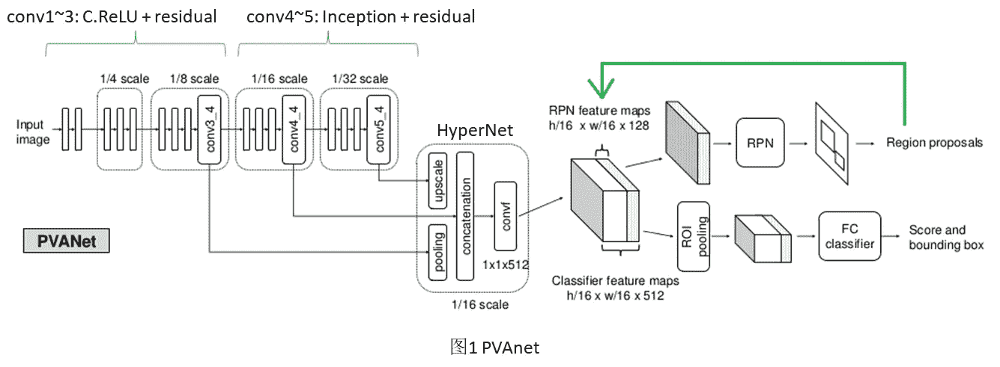
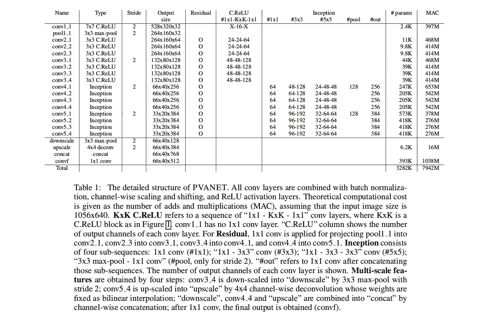
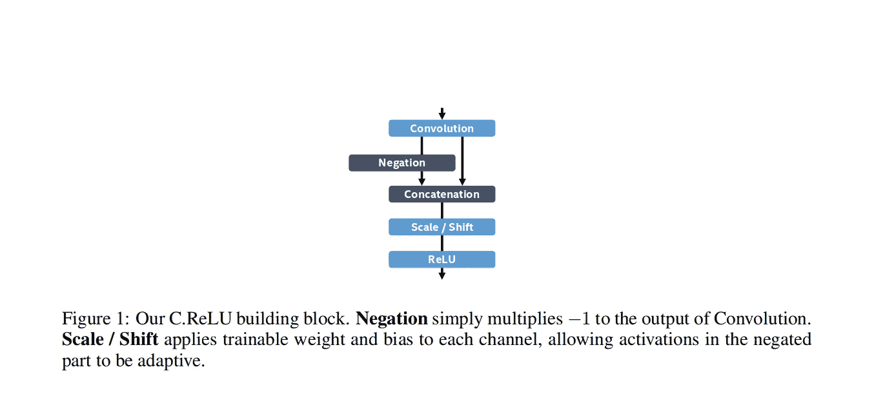
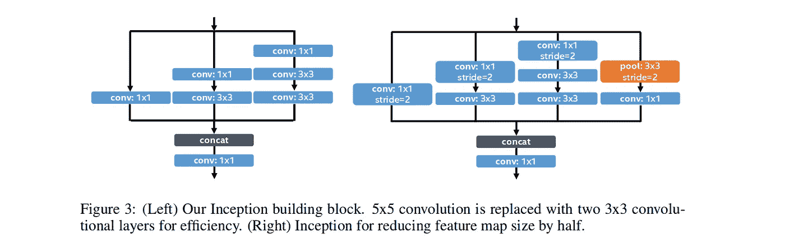
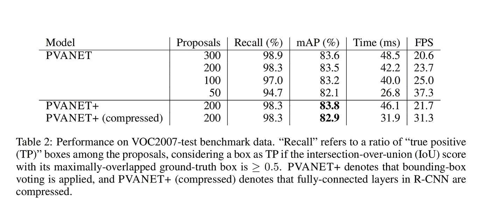
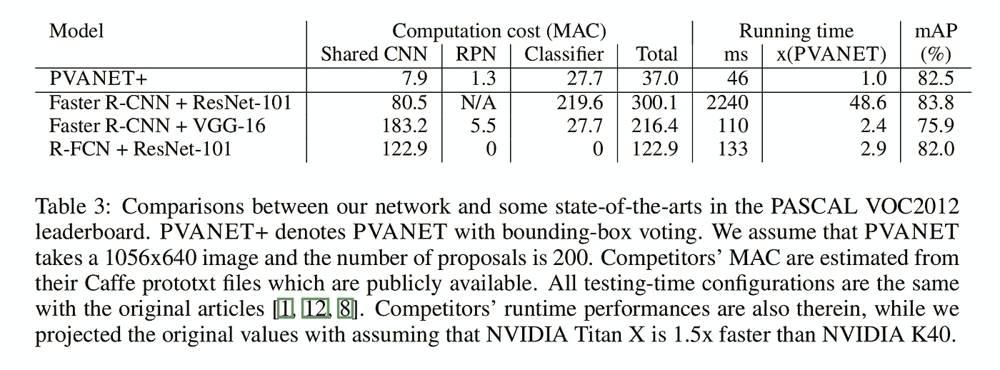

# PVANET:用于实时对象检测的深度但轻量级的神经网络

> 原文：<https://towardsdatascience.com/pvanet-deep-but-lightweight-neural-networks-for-real-time-object-detection-aa9de432512?source=collection_archive---------8----------------------->

## 论文摘要

[**Fig 2\. PVANET Entire Model Vizualization**](https://www.bbsmax.com/A/A2dmV1kgze/)

*一篇论文论文摘要* ***PVANET:深度但轻量级的神经网络用于实时物体检测*** *作者:、丛瑶、何文、、周树昌、何、梁家军
论文链接:* [*、*](https://arxiv.org/pdf/1608.08021.pdf)

# 概观

本文介绍了我们的轻量级特征提取网络结构，命名为 PVANET，它实现了实时目标检测性能而不损失准确性。

1.  ***计算成本***:1065 x640 输入的特征提取 7.9GMAC
2.  ***运行时性能*** :英特尔 i7 上 750 毫秒/图像(1.3FPS)，NVIDIA Titan X GPU 上 42 毫秒/图像(21.7FPS)
3.  ***精度***:VOC-2007 上 83.8% mAP；VOC-2012 的 82.5% mAP

**关键的设计原则是“少通道多层次”。**

此外，该网络还采用了其他一些构件:

1.  级联校正线性单元(C.ReLU)应用于我们的细胞神经网络的早期阶段，以在不损失精度的情况下将计算量减少一半。
2.  初始应用于我们特征生成子网络的剩余部分
3.  采用了多尺度表示的概念，它结合了几个中间输出，以便可以同时考虑多层次的细节和非线性。

# 方法

**Fig 2\. Model Architecture**

## 级联整流线性单元

**Fig 3\. Concatenated Rectified Linear Unit (C.ReLU)**

C.ReLU 的动机是观察到，在早期阶段，输出节点往往是成对的，这样一个节点的激活是另一个的相反侧。C.ReLU 将输出通道的数量减少了一半，通过简单地将相同的输出与否定连接起来，使其增加了一倍，从而使早期阶段的速度提高了 2 倍。

## 开始

**Fig4\. The Inception Module**

对于捕获大对象和小对象来说，Inception 可能是最具成本效益的构建块之一。他们用 2 个 3x3 取代了普通先启块中的 5x5 卷积。

## 超级网络

多尺度表示及其组合在许多深度学习任务中被证明是有效的。在特征提取层将细粒度的细节和高度抽象的信息结合起来，有助于后续的区域建议网络和分类网络检测不同尺度的目标。

它们组合了
1)最后一层
2)两个中间层，其规模分别是最后一层的 2x 和 4x。

## 深度网络培训

为了更好的训练，他们采用了剩余的结构。他们将剩余连接添加到初始层，以稳定深层网络的后期部分。

在所有 ReLU 激活层之前添加批处理规范化层。

他们使用的学习率策略是基于平台检测，他们根据损失的移动平均值检测平台，如果低于某个阈值，他们会以某个系数降低学习率。

## 使用 PVANET 实现更快的 R-CNN

conv3_4、conv4_4 和 conv5_4 的三个中间输出合并成 512 通道多电平输出特性，并馈入更快的 RCNN 模块

# 结果

1.  使用 ILSVRC2012 训练图像对 PVANET 进行预处理，用于 1000 类图像分类。
2.  所有图像的尺寸都调整为 256×256，192×192 的小块被随机裁剪并用作网络输入。
3.  学习率最初设置为 0.1，然后每当检测到平稳状态时，以 1/sqrt(10) ~ 0.3165 的因子减少。
4.  如果学习率下降到 1e-4 以下(这通常需要大约 2M 迭代)，则预训练终止
5.  然后用 MS-COCO trainval、VOC2007 trainval、VOC2012 trainval 的联合集对 PVANET 进行训练。之后还需要对 VOC2007 trainval 和 VOC2012 trainval 进行微调，因为 MS-COCO 和 VOC 的类定义略有不同。
6.  随机调整训练图像的大小，使图像的短边介于 416 和 864 之间。
7.  对于 PASCAL VOC 评估，调整每个输入图像的大小，使其短边为 640。
8.  除了在非最大抑制(NMS) (=12000)和 NMS 阈值(=0.4)之前的建议框的数量之外，与更快的 R-CNN 相关的所有参数都被设置为原始工作中的参数
9.  所有评估均在单核英特尔 i7 和 NVIDIA Titan X GPU 上完成。

**Fig 5\. Performance with VOC2007**

**Fig 6.Performance with VOC2012**

PVANET+在 PASCAL VOC 2012 挑战赛中获得第二名。第一个是比 PVANET 重得多的更快的 RCNN + ResNet101。

# 参考

1.  金敬姬、S. Hong、B. Roh、Y. Cheon 和 M. Park。PVANET:用于实时对象检测的深度但轻量级的神经网络。arXiv 预印本 arXiv:1608.08021，2016。
2.  *克里斯蒂安·塞格迪、贾、皮埃尔·塞尔马内、斯科特·里德、德拉戈米尔·安盖洛夫、杜米特鲁·埃汉、文森特·万霍克和安德鲁·拉宾诺维奇。用回旋越走越深。IEEE 计算机视觉和模式识别国际会议(CVPR)论文集，2015 年。*
3.  *何、、、任、。用于图像识别的深度残差学习。IEEE 计算机视觉与模式识别国际会议(CVPR)论文集，2016。*
4.  *孔涛，姚安邦，，孙富春。面向精确区域提议生成和联合目标检测的超网络。IEEE 计算机视觉和模式识别国际会议(CVPR)论文集，2016 年。*

> 感谢阅读！一定要看报纸。如果我发现更多有趣的见解，我会更新。