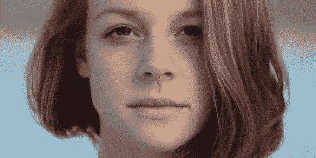
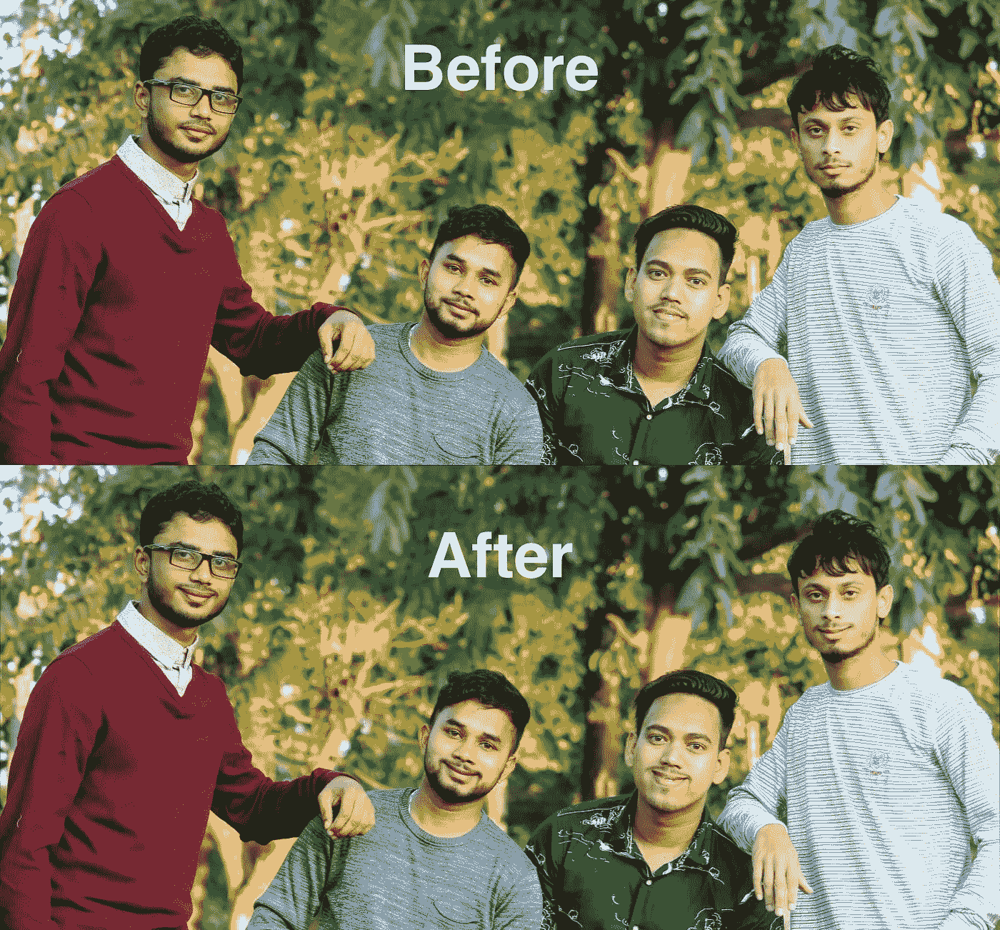

# py chubby——自动面部扭曲

> 原文：<https://towardsdatascience.com/pychubby-automated-face-warping-322765f5a1b2?source=collection_archive---------20----------------------->



# 介绍

我们都知道这个故事。你在街上随便找一个人给你和你的朋友拍照。过了一会儿，你高兴地感谢他们，继续你的生活。过了一段时间，你终于坐下来喝杯咖啡，检查你的照片。“我的上帝，为什么我们都没有笑？!"

首先，不要惊慌。今天是你的幸运日。如果你知道如何安装东西，也许会有希望。

```
pip install pychubby
```

安装完成后，只需编写如下代码:

Minimal code example



# 什么是 PyChubby

`pychubby`是一个自动化的面部扭曲工具。它的主要目标是作为深度学习人脸相关任务的专用增强界面。但也不妨作为一个傻乎乎的面部扭曲工具(见简介)。

你可能会想，当一个人可以用 Photoshop 和其他软件做类似的事情时，为什么还要费心呢？答案很简单— **自动化**。你不必定位任何标志，移动它们，然后在每张照片的每张脸上重复这个过程。

像`imgaug`这样流行的图像增强包是通用的(任何类型的图像),并且在涉及到几何变换时不提供许多选项。`pychubby`专门研究人脸，允许创建几何变换:

1.  **局部(在脸上)**
2.  **平滑(无伪影)**
3.  **(在一定程度上)现实**

换句话说，人们不是增强整个图像，而是仅仅增强面部。增强是现实的，没有文物。

# 积木

`pychubby`的逻辑可以概括为三块

1.  **地标检测:**给定一张照片，预训练的地标检测模型预测每张脸上的 68 个地标。
2.  **参考空间映射:**标志被映射到所谓的参考空间。该映射校正输入图像中可能的旋转、平移和缩放。
3.  **手动动作定义:**大多数`pychubby`动作都是在参考空间中定义的，因此应该在不同的面上产生一致的扭曲。去[画廊](https://pychubby.readthedocs.io/en/latest/source/gallery.html)看看预定义的或者随意定义新的。

# 想了解更多？

如果您有兴趣尝试一下`pychubby`，或者只是想了解更多，请查看以下几个有用的链接:

[**Github**](https://github.com/jankrepl/pychubby)

[**阅读文档**](https://pychubby.readthedocs.io/)

所有潜在的贡献者都非常欢迎，任何反馈都非常感谢。

*原载于 2019 年 9 月 16 日*[*https://jank repl . github . io*](https://jankrepl.github.io/pychubby/)*。*