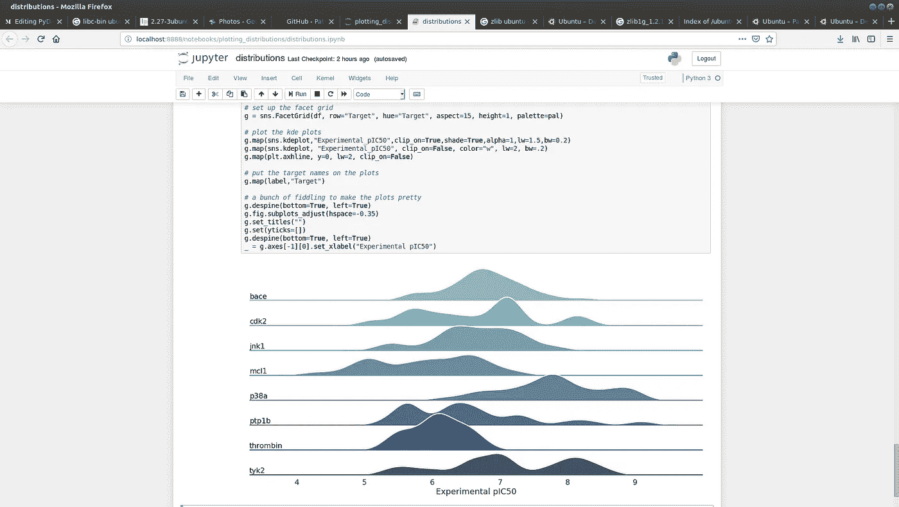

# 口袋里的 PyData 堆栈。字面上。

> 原文：<https://towardsdatascience.com/pydata-stack-in-your-pocket-literally-73662c20d18e?source=collection_archive---------16----------------------->


# 在手机上运行 Jupyter 笔记本

我最近将我的经典 iPhone SE 升级到了三星 Note 9，其中一个原因是惊人的摄像头和巨大的屏幕，“它可以运行 Ubuntu”。我知道，有点怪怪的原因。

但是没错，它确实可以通过一个叫做“Linux on Dex”的容器化层来运行 Ubuntu。这是一个允许你为 ARM64 架构运行纯 Ubuntu 16.04 桌面的应用程序。你需要的只是任何高质量的 USB-C HDMI 适配器、蓝牙键盘/鼠标套件(或者如果你使用 USB-C hub，就只有 USB 套件)和一个备用屏幕。要在 Dex 上试用 Linux，你只需要一根 USB-C 屏幕电缆，因为手机可以充当触摸板和键盘。


That is how it looks. I’ve used my wife's Apple USB-C adapter to connect screen and keyboard.

# 但是为什么呢？！

我的爱好之一是尝试在不同的奇怪设备上运行 Python，如 Raspberry Pi、VoCore 和 Lichee Pi Nano


Why not spend your weekend bringing upstream Linux on some cheap SBC or running Ubuntu with Anaconda on Android Tablet?

这些小而便宜的设备运行普通 Linux 和 Python 的能力让我吃惊，还记得启动我的 486DX2 66Mhz。

如果这些微小的东西可以运行常规的 Python，那么它绝对值得尝试 8 核 CPU/6GB RAM beast(是的，我有一个“廉价”版本，不是 8GB 的那个)。

根据我处理基于 ARM 的 Python 发行版的经验，这条路不会是直的，但这并不意味着它不值得一试。我已经为树莓派开发 ARM conda 包做出了贡献，所以大部分步骤我都知道。

## 获取 Linux on Dex 应用程序

要获得 Dex 应用上的 [Linux，你必须注册测试程序。你可以在这里做:](https://www.linuxondex.com/)

[](https://play.google.com/apps/testing/com.samsung.android.lxd) [## 登录- Google 帐户

### 编辑描述

play.google.com](https://play.google.com/apps/testing/com.samsung.android.lxd) 

有关支持的手机和功能的更多信息，请访问网站:

[https://www.linuxondex.com/](https://www.linuxondex.com/)

## 安装并运行容器


Download an image after app installation and unzip the file. Then create a container and launch it


Create a nice recognizable name for your container. It will help you later.

下载和解压图像需要一些时间，所以请耐心等待。

如果下载有问题，试试[直接链接](https://webview.linuxondex.com/016/xenial-gnome-with-IJ-GI016.zip)。

## 修复 apt 包管理器

不幸的是,“Linux on Dex”中的 Ubuntu 带有坏掉的 aptitude manager。但是幸运的是[社区找到了](https://www.youtube.com/watch?v=eSjliWAV6Bc)修复它的方法。

在终端中运行以下命令。在 apt-get 升级的过程中，可能会发生这样的情况，你必须通过多次按“Ctrl+C”来终止挂起过程。

```
sudo apt-get update
sudo apt-get upgrade
sudo purge-old-kernels
sudo apt auto remove
sudo apt autoclean
```

## 安装依赖项

Archiconda 最初是为了支持较新版本的 Ubuntu 而构建的，因此 Python 需要更新的 libc 库和其他依赖项。我们会从 Ubuntu 18.04 ARM64 发行版抓取。

```
[wget http://launchpadlibrarian.net/365857916/libc6_2.27-3ubuntu1_arm64.deb](http://launchpadlibrarian.net/365857916/libc6_2.27-3ubuntu1_arm64.deb) -O libc6_2.27.deb[wget http://launchpadlibrarian.net/365857921/libc-bin_2.27-3ubuntu1_arm64.deb](http://launchpadlibrarian.net/365857921/libc-bin_2.27-3ubuntu1_arm64.deb) -O libc-bin_2.27.debsudo dpkg -i libc6_2.27.deb
sudo dpkg -i libc-bin_2.27.debwget [http://launchpadlibrarian.net/365856924/locales_2.27-3ubuntu1_all.deb](http://launchpadlibrarian.net/365856924/locales_2.27-3ubuntu1_all.deb) -O locales_2.27.debsudo dpkg -i locales_2.27.debwget [https://mirror.yandex.ru/ubuntu-ports/pool/main/z/zlib/zlib1g-dbg_1.2.11.dfsg-1ubuntu2_arm64.deb](https://mirror.yandex.ru/ubuntu-ports/pool/main/z/zlib/zlib1g-dbg_1.2.11.dfsg-1ubuntu2_arm64.deb) -O zlib1g-dbg_1.2.11.deb
wget [https://mirror.yandex.ru/ubuntu-ports/pool/main/z/zlib/zlib1g-dev_1.2.11.dfsg-1ubuntu2_arm64.deb](https://mirror.yandex.ru/ubuntu-ports/pool/main/z/zlib/zlib1g-dev_1.2.11.dfsg-1ubuntu2_arm64.deb) -O zlib1g-dev_1.2.11.debsudo dpkg -i zlib1g-dbg_1.2.11.deb
sudo dpkg -i zlib1g-dev_1.2.11.deb
```

## 创建一个`conda`用户

由于默认`dextop`用户权限管理上的一些问题，conda 包管理器无法写入自己的文件夹。当然，这是可以修复的，但是创建专门的 conda 用户和管理使用它的环境更容易。通过`adduser condauser`创建一个用户，然后通过运行`sudousermod -aG sudo condauser`将该用户添加到 *sudoers* 中。Linux on Dex 的默认 root 密码是`secret`。字面上。

## 提供权限

需要更多的修复(测试版软件的常见情况)。如果你现在尝试 ping 任何远程主机，你会发现你没有网络权限。不知何故，在“Linux on Dex”下新创建用户没有被分配给“网络”组。

要解决这个问题，您需要编辑`\etc\group`文件，并通过添加`condauser`来修复组`inet`和`net_raw`，如下所示

```
inet:x:3003:root, condauser, dextop
net_raw:x:3004:root, dextop, condauser
```

现在，您可以通过运行`su — condauser`将当前用户更改为`condauser`

## 安装 Archiconda

下载并安装 [ArchiConda](https://github.com/Archiconda/build-tools/releases) 。我们使用的不是最新的版本，因为我们需要一些来自 [archiarm](https://anaconda.org/archiarm) 频道的包，这在 0.2.3 版本中是没有的。

```
wget [https://github.com/Archiconda/build-tools/releases/download/0.2.2/Archiconda3-0.2.2-Linux-aarch64.sh](https://github.com/Archiconda/build-tools/releases/download/0.2.2/Archiconda3-0.2.2-Linux-aarch64.sh)chmod +x Archiconda3-0.2.2-Linux-aarch64.sh./Archiconda3-0.2.2-Linux-aarch64.sh
```

现在让我们通过运行来添加更新 conda

`conda update -n base --all`

并添加我的频道，其中包含 Jupyter 笔记本等丢失的包

```
conda config — add channel gaiar
conda install -c gaiar jupyter
```

## 安装其他软件包

由于安装了 jupyter，并且 conda 可以访问包含`aarch64`软件包发行版的通道，我们可以按照您习惯的方式安装任何所需的软件包，例如

```
conda install seaborn -y
```

# 在手机上运行 Jupyter

现在，您已经为在手机上运行 Jupyter 做好了一切准备，让我们来运行 Jupyter 笔记本吧

```
jupyter notebook 
```

如果前面的步骤一切顺利，您将看到类似这样的内容


Jupyter notebook server running on Note 9

# 下载笔记本

为测试克隆回购与 Seaborn 的例子[https://github.com/PatWalters/plotting_distributions](https://github.com/PatWalters/plotting_distributions)

启动笔记本并运行所有单元。然后你会看到类似的东西



Seaborn with Jupyter Notebook running fine

# Pokedex(一些乐趣)

如果你觉得无聊，你甚至可以在手机上运行 jupyter 笔记本服务器，通过笔记本电脑连接。为此，您需要在“终端模式”下启动“Linux on Dex”。然后真正的乐趣开始了。尝试在电话键盘上输入前面提到的所有命令。


Luckily, Note 9 quite big

要在无头模式下运行笔记本，您需要更改几个命令。首先，确保您连接到 WiFi 网络，并获得您的本地 IP。运行`ip a`并搜索`wlan0`。记住并复制地址。

然后用命令运行 Jupyter notebook

```
jupyter notebook --ip YOU_IP --NotebookApp.token="token" --no-browser
```


1\. Get your IP address. 2\. Start Jupyter Notebook. 3\. See progress

如果你做的一切都正确，那么你就可以在同一网络的另一台电脑上运行浏览器，并通过类似`[http://YOUR_IP:8888](http://YOUR_IP:8888)`的网址访问你的“服务器”。输入您的代币，享受:)


Access notebook running our the phone

# 附言

当前文章的大部分是直接在手机上写的


Who does need laptops these days?