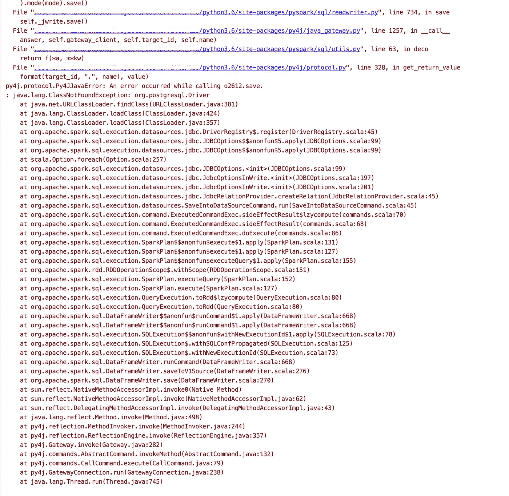
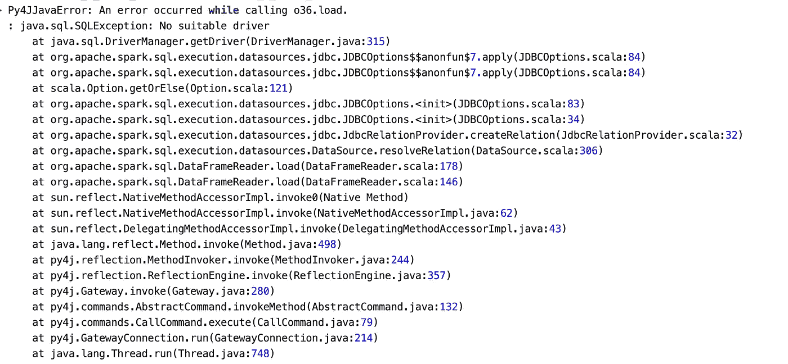
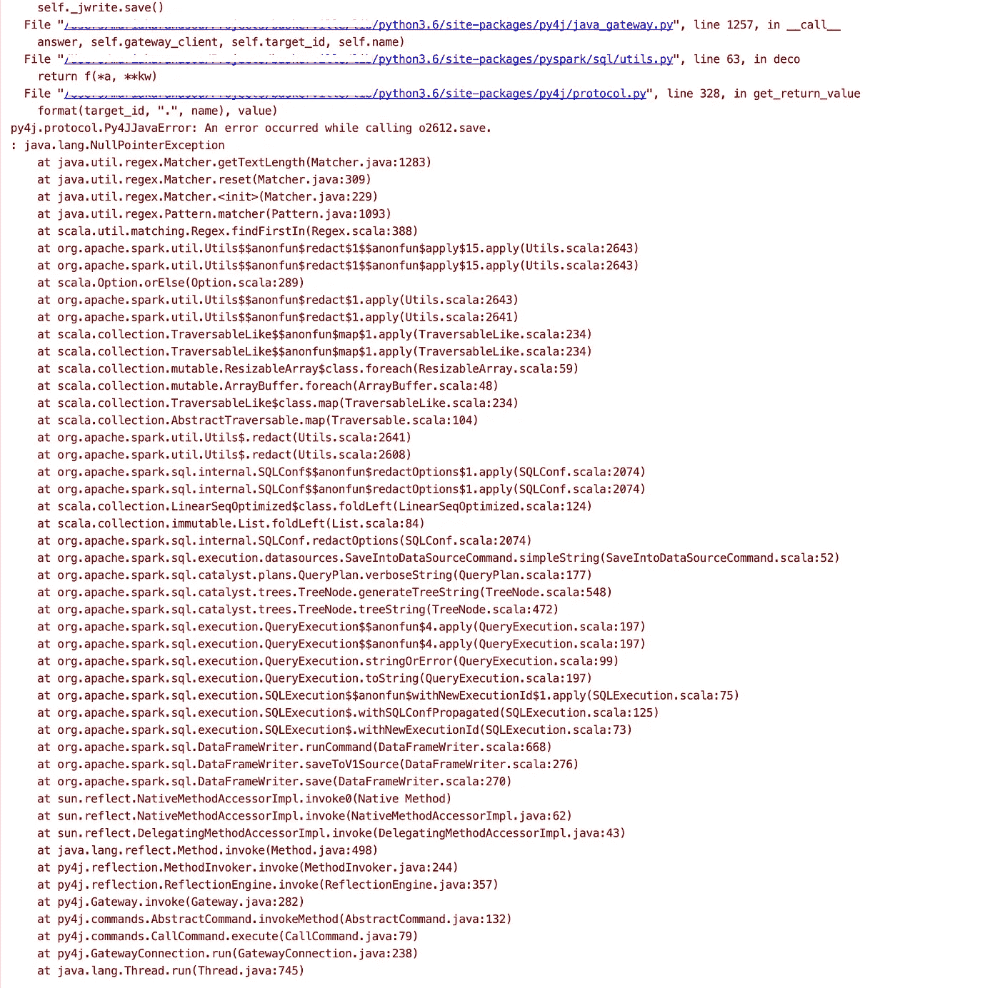
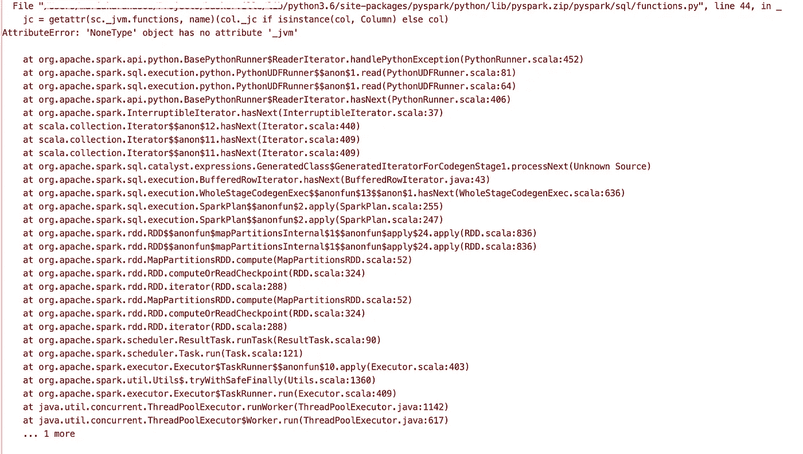

# PySpark 调试— 6 个常见问题

> 原文：<https://towardsdatascience.com/pyspark-debugging-6-common-issues-8ab6e7b1bde8?source=collection_archive---------8----------------------->


调试 spark 应用程序可以是有趣的，也可以是非常(我是说*非常*)令人沮丧的经历。

我已经开始收集我不时遇到的问题，列出最常见的问题及其解决方案。

这是这个列表的第一部分。我希望它对你有用，并能为你节省一些时间。大多数问题都很容易解决，但是它们的堆栈跟踪可能很神秘，没有什么帮助。


# 1.从 udf 返回的列为空

当您使用 udf 向数据帧添加一列，但结果为 **Null** 时:udf 返回的数据类型与定义的不同

例如，如果您定义一个 udf 函数，将两个数字`a`和`b`作为输入，并返回`a / b`，这个 udf 函数将返回一个 float(在 Python 3 中)。如果 udf 定义为:

```
udf_ratio_calculation = F.udf(calculate_a_b_ratio, T.BooleanType())
# or 
udf_ratio_calculation = F.udf(calculate_a_b_ratio, T.DoubleType())
```

而不是:

```
udf_ratio_calculation = F.udf(calculate_a_b_ratio, T.FloatType())
```

那么使用 udf 的结果将是这样的:

```
df = df.withColumn('a_b_ratio', udf_ratio_calculation('a', 'b'))
df.show() 
+---+---+---------+
|  a|  b|a_b_ratio|
+---+---+---------+
|  1|  0|     null|
| 10|  3|     null|
+---+---+---------+
```

完整示例:

Example of wrongly defined udf return datatype

# 2.ClassNotFoundException

当您试图将应用程序连接到外部系统(如数据库)时，通常会发生这种异常。下面的 stacktrace 来自于在 Postgres 中保存数据帧的尝试。



这意味着 spark 无法找到连接数据库所需的 jar 驱动程序。在实例化会话时，我们需要在 spark 配置中为应用程序提供正确的 jar

```
**from** pyspark **import** SparkConf
**from** pyspark.sql **import** SparkSession

conf = SparkConf()
conf.set('**spark.jars**', '**/full/path/to/postgres.jar,/full/path/to/other/jar**') spark_session = SparkSession.builder \
    .config(conf=conf) \
    .appName(**'**test**'**) \
    .getOrCreate()
```

或者作为命令行参数——取决于我们如何运行我们的应用程序。

```
spark-submit --jars /full/path/to/postgres.jar,/full/path/to/other/jar ...
```

**注 1**:jar 对于所有节点 都是 ***可访问的，而不是驱动程序本地的，这一点非常重要。***

**注 2** :该错误也可能意味着集群组件之间的 spark 版本不匹配。还有其他更常见的指示器，如`AttributeError`。更多关于这个[这里](https://radanalytics.io/howdoi/recognize-version-clash)。

**注 3** :确保罐子列表中的逗号之间没有**空格。**

## 3.低内存消耗——为什么 spark 没有用完我的所有资源？

火花驱动器存储器和火花执行器存储器默认设置为`1g`。一般来说，查看许多配置参数及其默认值是非常有用的，因为有许多因素会影响您的 spark 应用程序。

[](https://spark.apache.org/docs/latest/configuration.html) [## 火花配置

### 火花提供了三个位置来配置系统:火花属性控制大多数应用参数，可以…

spark.apache.org](https://spark.apache.org/docs/latest/configuration.html) 

当 spark 在本地运行时，您应该将`spark.driver.memory`调整为对您的系统合理的值，例如`8g`,当在集群上运行时，您可能还想调整`spark.executor.memory`,尽管这取决于您的集群类型及其配置。

# 4.文件不存在:Spark 在本地模式下运行正常，但在 YARN 中运行时找不到文件

和第二步一样，所有必要的文件/jar 应该放在集群中所有组件都可以访问的地方，例如 FTP 服务器或一个普通的挂载驱动器。

```
spark-submit --master yarn --deploy-mode cluster http://somewhere/accessible/to/master/and/workers/test.py
```

# 5.尝试连接到数据库:Java . SQL . SQL 异常:没有合适的驱动程序



或者，如果在试图保存到数据库时发生错误，您将得到一个`java.lang.NullPointerException`:



这通常意味着我们忘记了设置`**driver**`，例如 Postgres 的`**org.postgresql.Driver**` :

```
df = spark.read.format(**'jdbc'**).options(
    url= **'db_url'**,
    driver='**org.postgresql.Driver**',  # <-- here
    dbtable=**'table_name'**,
    user=**'user'**,
    password=**'password'**
).load()
```

另外，请确保检查#2，以便正确设置驱动程序 jar。

# 6.NoneType '对象没有属性'`_jvm'`

出于各种原因，您可能会得到以下可怕的堆栈跟踪。



最常见的两种是:

*   您在没有激活 spark 会话的情况下使用 pyspark 函数

```
**from** pyspark.sql **import** SparkSession, functions **as** Fclass A(object):
    def __init__(self):
        self.calculations = F.col('a') / F.col('b')...a = A() # instantiating A without an active spark session will give you this error 
```

*   或者在 udf 中使用 pyspark 函数:

```
**from** pyspark **import** SparkConf
**from** pyspark.sql **import** SparkSession, functions **as** F, types **as** T conf = SparkConf()
spark_session = SparkSession.builder \
    .config(conf=conf) \
    .appName(**'test'**) \
    .getOrCreate()

*# create a dataframe* data = [{**'a'**: 1, **'b'**: 0}, {**'a'**: 10, **'b'**: 3}]
df = spark_session.createDataFrame(data)
df.show()

*# +---+---+
# |  a|  b|
# +---+---+
# |  1|  0|
# | 10|  3|
# +---+---+

# define a simple function that returns a / b
# we *cannot* use pyspark functions inside a udf
# udfs operate on a row per row basis while pyspark functions on a column basis* **def** calculate_a_b_max(a, b):
    **return** F.max([a, b])

*# and a udf for this function - notice the return datatype* udf_max_calculation = F.udf(calculate_a_b_ratio, T.FloatType())
df = df.withColumn(**'a_b_max'**, udf_max_calculation(**'a'**, **'b'**))
df.show()
```

两者都会给你这个错误。

在最后一个例子中，`F.max`需要一个**列**作为输入，而不是一个列表，所以正确的用法应该是:

```
df = df.withColumn(**'a_max'**, F.max(**'a'**))
```

这将为我们提供列 `*a*` — **的最大值，而不是 udf 试图做的事情**。

设置 udf 来计算每行两列之间的最大值的正确方法是:

```
def calculate_a_b_max(a, b):
    return max([a, b]) 
```

假设`a`和`b`是数字。
(当然没有 udf 也有其他的方法。)

我希望这有所帮助。我计划继续这个列表，并及时处理更复杂的问题，比如调试 pyspark 应用程序中的内存泄漏。非常欢迎任何想法、问题、更正和建议:)

如果您想了解 Spark 的工作原理，请查看:

[](/explaining-technical-stuff-in-a-non-techincal-way-apache-spark-274d6c9f70e9) [## 用非技术性的方式解释技术性的东西——Apache Spark

### 什么是 Spark 和 PySpark，我可以用它做什么？

towardsdatascience.com](/explaining-technical-stuff-in-a-non-techincal-way-apache-spark-274d6c9f70e9)