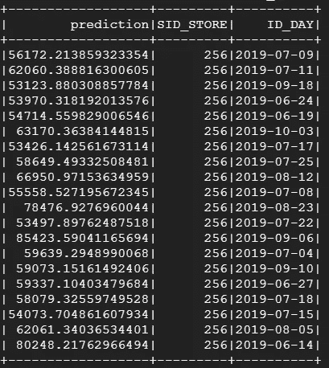

# py spark——需求预测数据科学项目

> 原文：<https://towardsdatascience.com/pyspark-demand-forecasting-data-science-project-dae14b5319cc?source=collection_archive---------10----------------------->

## 从预处理到建模的完整指南


[https://upload.wikimedia.org/wikipedia/commons/f/f3/Apache_Spark_logo.svg](https://upload.wikimedia.org/wikipedia/commons/f/f3/Apache_Spark_logo.svg)

在本文中，我们将使用 Pyspark 构建一个逐步需求预测项目。这里，任务列表:

1.  **导入数据**
2.  **过滤数据**
3.  **功能工程(功能创建)**
4.  **输入数据**
5.  **功能工程(功能转换)**
6.  **应用梯度增强树回归器**
7.  **用 Kfold 和 GridSearch 方法优化模型**
8.  **一次性**

# I)导入数据

首先，我们将使用预定义的模式导入数据。我在谷歌云平台的虚拟机上工作，数据来自云存储的一个桶。还是导入吧。

```
from pyspark.sql.types import *schema = StructType([
StructField("DATE", DateType()),
StructField("STORE", IntegerType()),
StructField("NUMBERS_OF_TICKETS", IntegerType()),
StructField("QTY", IntegerType()),
StructField("CA", DoubleType()),
StructField("FORMAT", StringType())])df = spark.read.csv("gs://my_bucket/my_table_in_csv_format", header = 'true', schema=schema)
```


# II)过滤数据

然后，我们将应用一些过滤器，我们将只在大型超市工作，并确保数据中没有负数量或缺少日期。

```
df = df.filter(
 (F.col("QTY") > 0) 
&(F.col("DATE").notNull())
& (F.col("DATE").between("2015-01-01", "2019-01-01")) 
& (~F.col("FORMAT").isin(["PRO", "SUP"])) 
)
```

# III)特征工程(特征创建)

然后，我们将定义一些对建模有用的变量，比如日期导数。

```
df = (df
 .withColumn('yearday', F.dayofyear(F.col("DATE")))
 .withColumn('Month', F.Month(F.col('DATE')))
 .withColumn('dayofweek', F.dayofweek(F.col('DATE')))
 .withColumn('YEAR', F.year(F.col('DATE')))
 .withColumn('QUARTER', F.q(F.col('DATE')))
 .withColumn('Month', F.Month(F.col('DATE')))
 .withColumn('WeekOfYear', F.weekofyear(F.col('DATE')))
 .withColumn('Week', F.date_trunc('week',F.col('DATE')))
 .withColumn('MonthQuarter', F.when((df[DATE] <= 8), 0)                                 .otherwise(F.when((df['DATE'] <= 16), 1)                                .otherwise(F.when((df['DATE'] <= 24), 2)                                 .otherwise(3))))
)
```

现在，我们将计算每个商店的参考数量，即 1 年前同一天的销售量。然而，这一天可能没有销售，所以我们将在这个参考日期前后平均 7 天。这个函数会更复杂，需要 numpy。确实有可能把 numpy 和 spark 说清楚，让我们看看怎么做。

首先，必须定义一个用户定义的函数，以矢量化和稀疏的方式从每个存储中提取时间序列。我们将定义一个函数来创建一个稀疏向量，该向量以一年中的天数和相关量的值为索引

好吧，让我们休息一下，他有一些事情要解释。

*   输入:我们要求一个日期索引和相关数量值的列表
*   输出:我们返回一个按日索引的稀疏向量，它允许我们找到与他的日索引相关的数量

整个过程通过一个 UDF，并期望成为一个`[VectorUDT](https://spark.apache.org/docs/2.1.2/api/java/org/apache/spark/mllib/linalg/VectorUDT.html)`简洁地说，这是一种可以被 UDF 操纵的向量。

然后，为了响应函数请求的输入，我们将每年创建一个聚合数据帧，存储并应用一个 collect_list 到日期和数量。正如您在下面看到的，我们恢复了商店当年的所有日数量值。这两个列表进入我们的 UDF 来创建想要的向量，现在我们可以在 numpy 中处理这个向量了！


现在我们可以定义一个作用于这个向量的函数，并再次把它放到 UDF 中。

并应用它:

```
df= (df
    .join(self_join
        , ([self_join.p_id_store == df.STORE, self_join.year_join ==  df.year]),
        how = "left"
        )
        .withColumn("qty_reference", getReference(F.col("yearday"), F.col("qties_vectorized")))
        )
```

让我们详细描述一下这个函数，首先它试图找到准确的参考日，我们已经将数据帧和它的前一年连在一起，所以我们希望当前日等于向量中的索引日并得到值。如果无法检索该值，我们将围绕该关键日期定义一个窗口，并对该窗口的值进行平均。

最后的结果是:


但是我们不会让它们像那样被硬编码，而是将所有东西都打包到一个 Spark 管道中。为此，我们将创建一个继承自 Spark Transformer 对象的类模板，如下所示，我们将为每个变量重复这个模板。我不打算在本文中写完整的功能管道，但是你可以在 github 的代码中找到它。我们将在本文的结尾看到如何将这个特性的管道放在一起，并将其插入到流程中。

关于这个类模板特性的更多细节，请参阅我的文章…:[***https://towardsdatascience . com/py spark-wrap-your-feature-engineering-in-a-a-pipeline-ee 63 BDB 913***](/pyspark-wrap-your-feature-engineering-in-a-pipeline-ee63bdb913)

# IV)输入数据

让我们检查是否有一些丢失的值。

```
df.select([F.count(F.when(F.isnan(c) | F.col(c).isNull(), c)).alias(c) for c in df.columns]).show()
```


可能不会有更多，但在插入新变量后可能会有一些，因此我们将定义一个将在变量创建管道后出现的估算器。

```
from pyspark.ml.feature import Imputer

imputer = Imputer(
    inputCols=df.columns, 
    outputCols=["{}_imputed".format(c) for c in df.columns]
)#imputer.fit(df).transform(df)
```

# v)特征工程(特征转换)

从下面的表格摘录中，我将向您展示在插入预测算法之前，我们将如何进行其余的数据转换。

> 我们将在最后一次性完成整个过程。

```
# needed importfrom pyspark.ml import Pipeline
from pyspark.ml.feature import PCA
from pyspark.ml.feature import StringIndexer, OneHotEncoder, VectorAssembler
```

## 索引

Spark `[String Indexer](https://spark.apache.org/docs/latest/ml-features#stringindexer)`将一列标签编码成一列标签索引。索引在[0，numLabels 中。映射首先由最高频率完成。

```
indexers = [ StringIndexer(inputCol=c, outputCol="{0}_indexedd".format(c), handleInvalid = 'error') for c in categorical_col]pip = Pipeline(stages = indexers)
fitted_df =pip.fit(df)
df = fitted_df.transform(df)
```


## OneHotEncoding

Spark 的`[OneHotEncoder](https://spark.apache.org/docs/latest/ml-features#onehotencoder)` [One-hot 编码](http://en.wikipedia.org/wiki/One-hot)将表示为标签索引的分类特征映射到一个二进制向量，该向量最多具有一个单值，指示所有特征值集合中特定特征值的存在。对于字符串类型的输入数据，通常首先使用 [StringIndexer](https://spark.apache.org/docs/latest/ml-features.html#stringindexer) 对分类特征进行编码。

```
indexers = [ StringIndexer(inputCol=c, outputCol="{0}_indexedd".format(c), handleInvalid = 'error') for c in categorical_col]encoders = [OneHotEncoder(dropLast=True,inputCol=indexer.getOutputCol(), 
    outputCol="{0}_encodedd".format(indexer.getOutputCol())) for indexer in indexers]pip = Pipeline(stages = indexers + encoders)
fitted_df =pip.fit(df)
df = fitted_df.transform(df)
```


## PCA 简化和向量

在执行我们的管道之前，让我们检查一下在我们的流程中是否有任何令人讨厌的丢失值。在运行降维算法之前，我们必须将所有变量传递到一个向量汇编器中，该汇编器将返回所有数据的稀疏表示。然后，PCA 算法将采用这个向量来“简化”它，并在 dataframe 列中返回另一个稀疏表示。


我们看到了如何索引、一键编码我们的数据、应用主成分分析并将所有内容放入准备建模的向量中。显然还有其他的可能性来标准化、规范化…等等。然而，全球原则保持不变。现在我们的特征已经有了很好的形状，可以通过 Pyspark 算法进行建模。

*   分割数据集

```
X_train = final_dataset.filter(F.col('DATE').between("2015-01-02", "2018-06-01"))X_test = final_dataset.filter(F.col('DATE') > "2018-06-01")X_train = X_train.withColumn(target, F.log1p(F.col(target)))X_test = X_test.withColumn(target, F.log1p(F.col(target)))
```

# VI)应用梯度增强树回归器

我们将训练一个梯度提升树模型，对商店每天销售的总数量进行回归。

```
target = 'QTY'gbt = GBTRegressor(featuresCol = 'Features', labelCol=target)fitted = gbt.fit(X_train)yhat = (fitted.transform(X_test)
    .withColumn("prediction", F.expm1(F.col("prediction")))
    .withColumn(target, F.expm1(F.col(target)))
    ).select(F.col("prediction"), F.col("STORE").alias('SID_STORE'), F.col("DATE").alias("ID_DAY")).show()
```



## 计算 KPI

我们将定义一个 python 对象，以此为基础在不同的指标上评估我们的模型。

```
eval_ = RegressionEvaluator(labelCol= target, predictionCol= "prediction", metricName="rmse")rmse = eval_.evaluate(yhat)
print('rmse is %.2f', %rmse)mae = eval_.evaluate(yhat, {eval_.metricName: "mae"})
print('mae is %.2f', %mae)r2 = eval_.evaluate(yhat, {eval_.metricName: "r2"})
print('R² is %.2f', %r2)
```

*   r 是 0.84
*   均方根误差为 20081.54
*   mae 是 13289.10

模型看起来不错，我们会努力改进它。

# VII)使用 Kfold 和 GridSearch 方法优化模型

我们将尝试使用不同的参数来优化我们的 GBDT，并制作一个 kfold 以确保其鲁棒性。

```
from pyspark.ml.tuning import CrossValidator, ParamGridBuilderparamGrid = (ParamGridBuilder()
             .addGrid(gbt.maxDepth, [5, 8, 10, 12])
             .addGrid(gbt.maxBins, [32, 64])
             .build())cv = CrossValidator(estimator=gbt,
                          estimatorParamMaps=paramGrid,
                          evaluator=eval_,
                          numFolds=3) cvModel = cv.fit(X_train)yhat = (cvModel.transform(X_test)
    .withColumn("prediction", F.expm1(F.col("prediction")))
    .withColumn(target, F.expm1(F.col(target)))
    )
```

我只多了 0.3 分，但这已经足够了！:)

附加:**特性**重要性:)

```
fi = fitted.featureImportances.toArray()import pandas as pdfeatures = [encoder.getOutputCol() for encoder in encoders] + \
 [x +'_imputed' for x in numeric_col] + ['day', 'month', 'weekday', 'weekend', 'monthend', 'monthbegin', 'monthquarter', 'yearquarter']feat_imp = (pd.DataFrame(dict(zip(features, fi)), range(1))
  .T.rename(columns={0:'Score'})
  .sort_values("Score", ascending =False)
  )
```


# VIII)一次性

名词（noun 的缩写）b:在 features_utils 包中有所有与特性管道相关的类。

# 最后

本文总结了我对一个数据科学项目的 Pyspark 各种砖块的简要介绍。我希望它们能帮助哪怕是一个人的工作。Pyspark 是一个非常强大的大容量工具。他不具备像 sklearn 那样的一系列算法，但他拥有主要的算法和许多资源。

如果您想让我为 Pyspark 做些什么，请随时告诉我，谢谢！

【Y】You 可以在这里找到代码*:*[*https://github.com/AlexWarembourg/Medium*](https://github.com/AlexWarembourg/Medium)