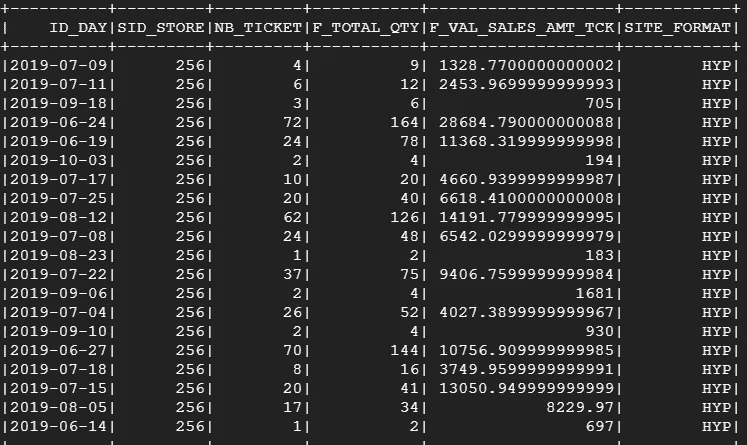
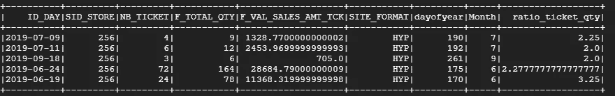
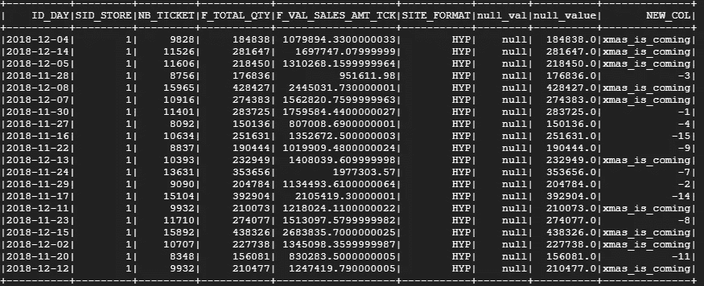
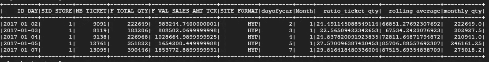
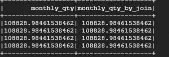
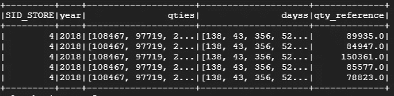

# py spark–特征工程(P1)

> 原文：<https://towardsdatascience.com/pyspark-feature-engineering-p1-f55cbd2b7565?source=collection_archive---------19----------------------->

## 计算、聚合、转换任何数据


[https://upload.wikimedia.org/wikipedia/commons/f/f3/Apache_Spark_logo.svg](https://upload.wikimedia.org/wikipedia/commons/f/f3/Apache_Spark_logo.svg)

在本文中，我们将看到如何通过连接、窗口函数、UDF 和向量操作来计算新变量。

提醒一下，下面是我们使用的表格:



## 。使用列和 sql 函数

要在 Spark 上创建新的列，只需传递函数。withColumn 并添加 sql 函数

```
df = (df
 .withColumn('dayofyear', F.dayofyear(F.col("ID_DAY")))
 .withColumn('Month', F.Month(F.col('ID_DAY')))
 .withColumn('ratio_ticket_qty', F.col('F_TOTAL_QTY')/F.col('NB_TICKET'))
 )
```



更多请看这里: [**SQL 函数**](https://spark.apache.org/docs/latest/api/python/pyspark.sql.html)

## 。条件为 f 的列

与 sql 一样，可以使用 when 框进行条件计算。

```
df = df.withColumn("day_to_xmas", F.when((F.col("ID_DAY").between("2018-12-01", "2018-12-31")) | (F.col('ID_DAY').between("2019-12-01", "2019-12-31")), 
    F.lit('xmas_is_coming')).otherwise(F.datediff(F.col("ID_DAY"), F.lit('2018-12-01').cast(DateType())))
)
```



## 。带列和窗口功能

窗口函数对于计算时间轴上的值或保存用户连接非常有用

```
grouped_windows = Window.partitionBy(F.col('SID_STORE'), F.col('Month'))rolling_windows = (Window.orderBy(F.col("dayofyear").cast(IntegerType())).rangeBetween(-7, 0))df = (df
 .withColumn('rolling_average', F.avg("F_TOTAL_QTY").over(rolling_windows))
 .withColumn('monthly_qty', F.avg('F_TOTAL_QTY').over(grouped_windows))
 )
```



## 只是一个连接

我们可以通过连接对 monthly_qty 进行与 windows 函数完全相同的计算。

```
month_qty = df.groupBy('SID_STORE', 'Month').agg(F.avg('F_TOTAL_QTY').alias('monthly_qty_by_join'))
df = df.join(month_qty, how = "left", on = ["SID_STORE", "Month"])
```



## 用户定义的函数(UDF)

我们可以像在 python 上一样在 pyspark 上定义函数，但它不会(直接)与我们的 spark 数据框架兼容。为此，我们需要定义一个 UDF(用户定义的函数),它将允许我们在 Spark 数据帧上应用我们的函数。缺点是 UDF 可能很长，因为它们是逐行应用的。要应用一个 UDF，只需将它作为函数的修饰者，用一种与其输出相关联的数据类型来添加即可。

```
**from** pyspark.sql.functions **import** udf@udf("long")
**def** squared_udf(s):
  **return** s * sdf = df.withColumn('squared_col', squared_udf(F.col('my_columns')))
```

仅此而已。

## 向量 UDT 和 numpy 处理复杂数组操作

现在，我们将计算每个商店的参考数量，即 1 年前同一天的销售量。然而，这一天可能没有销售，所以我们将在这个参考日期前后平均 7 天。这个功能会更复杂，需要 **numpy。T** t 确实有可能把 numpy 和 spark 说清楚，我们来看看怎么做。

首先，必须定义一个用户定义的函数，以矢量化和稀疏的方式从每个存储中提取时间序列。我们之前已经了解了什么是 UDF，我们将定义一个稀疏向量，它用一年中的天数和相关量的值来索引

好吧，让我们休息一下，他有一些事情要解释。

*   输入:我们要求一个日期索引和相关数量值的列表
*   输出:我们返回一个按日索引的稀疏向量，这允许我们找到与他的日索引相关的数量

整个过程通过一个 UDF，并期望成为一个`[VectorUDT](https://spark.apache.org/docs/2.1.2/api/java/org/apache/spark/mllib/linalg/VectorUDT.html)`简洁地说，这是一种可以被 UDF 操纵的向量。

然后，为了响应函数请求的输入，我们将每年创建一个聚合数据帧，存储并应用一个 collect_list 到日期和数量。正如您在下面看到的，我们恢复了商店当年的所有日数量值。这两个列表进入我们的 UDF 来创建想要的向量，现在我们可以在 numpy 中处理这个向量了！


现在我们可以定义一个作用于这个向量的函数，并再次把它放到 UDF 中。

并应用它:

```
df= (df
    .join(self_join
        , ([self_join.p_id_store == df.SID_STORE, self_join.year_join ==  df.year]),
        how = "left"
        )
        .withColumn("qty_reference", getReference(F.col("yearday"), F.col("qties_vectorized")))
        )
```

让我们详细描述一下这个函数，首先它试图找到准确的参考日，我们已经将数据帧和它的前一年连接在一起，所以我们希望当前日等于向量中的索引日并得到值。如果无法检索该值，我们将围绕该关键日期定义一个窗口，并对该窗口的值进行平均。

最后的结果是:



## 更快的..更强壮的..再进一步！将您的特征工程包装在管道中！

在这里，我写的另一篇文章介绍了如何创建一个定制管道来一次性集成所有这些特性:

*   [https://towards data science . com/py spark-wrap-your-feature-engineering-in-a-pipeline-ee 63 BDB 913](/pyspark-wrap-your-feature-engineering-in-a-pipeline-ee63bdb913)

# 最后

现在，您已经构建了令人惊叹的特征，您需要索引您的分类特征，或者对它们进行一次性编码，并且可能应用一些特征缩减，然后将所有内容打包到一个向量组装器中进行建模！不介意这是下一篇:)

【Y】You 可以在这里找到代码*:*[*https://github.com/AlexWarembourg/Medium*](https://github.com/AlexWarembourg/Medium)