# 面向数据科学工作流的 PySpark

> 原文：<https://towardsdatascience.com/pyspark-for-data-science-workflows-843350e4c90e?source=collection_archive---------6----------------------->


[Image Source](https://www.needpix.com/photo/961769/universe-light-space-cosmos-celestial-body-all-fantasy-composing-atmosphere)

## 生产中的数据科学第 6 章

在 PySpark 中展示的经验是雇主在建立数据科学团队时最需要的能力之一，因为它使这些团队能够拥有实时数据产品。虽然我之前已经写过关于[*【py spark】*](/a-brief-introduction-to-pyspark-ff4284701873)*[*并行化*](/3-methods-for-parallelization-in-spark-6a1a4333b473) *和*[*UDF*](/scalable-python-code-with-pandas-udfs-a-data-science-application-dd515a628896)*的博客，但我想作为本书第* *章提供一个关于这个主题的适当概述。我分享这完整的一章，因为我想鼓励数据科学家采用 PySpark 作为工具。这篇文章中的所有代码示例都可以在* [*这里*](https://github.com/bgweber/DS_Production/blob/master/ch6_pyspark.ipynb) *找到，所有先决条件都包含在示例章节* [*这里*](https://leanpub.com/ProductionDataScience) *中。你可能想在潜水前吃点零食！**

# *6 PySpark 用于批量管道*

*Spark 是一个通用计算框架，可以扩展到海量数据。它建立在 Hadoop 和 MapReduce 等先前的大数据工具之上，同时在其支持的语言的表达能力方面提供了显著的改进。Spark 的核心组件之一是弹性分布式数据集(RDD)，它使机器集群能够在一个协调、容错的过程中执行工作负载。在 Spark 的最新版本中，Dataframe API 在 rdd 之上提供了一个抽象，类似于 R 和 Pandas 中的相同数据结构。PySpark 是 Spark 的 Python 接口，它提供了在分布式计算环境中处理大规模数据集的 API。*

*PySpark 对于数据科学家来说是一个非常有价值的工具，因为它可以简化将原型模型转化为生产级模型工作流的过程。在 Zynga，我们的数据科学团队拥有许多生产级系统，为我们的游戏和营销团队提供有用的信号。通过使用 PySpark，我们已经能够减少工程团队从概念到生产扩大模型所需的支持量。*

*到目前为止，在本书中，我们构建和部署的所有模型都是针对单台机器的。虽然我们能够使用 Lambda、ECS 和 GKS 将模型服务扩展到多台机器，但是这些容器是孤立工作的，并且在这些环境中的节点之间没有协调。使用 PySpark，我们可以构建模型工作流，这些工作流设计为在集群环境中运行，用于模型训练和模型服务。结果是，数据科学家现在可以解决比以前使用 Python 工具可能解决的大得多的问题。PySpark 在一种富于表现力的编程语言和 API 之间提供了一个很好的折衷，Spark 与 MapReduce 等更传统的选项相比。总的趋势是，随着更多的数据科学和工程团队转向 Spark 生态系统，Hadoop 的使用正在下降。在第 7 章中，我们将探索另一个用于数据科学的分布式计算生态系统，称为云数据流，但目前 Spark 是该领域的开源领导者。PySpark 是我在数据科学工作流中从 R 转向 Python 的主要动机之一。*

*本章的目的是向 Python 程序员介绍 PySpark，展示如何为批量评分应用程序构建大规模模型管道，其中可能有数十亿条记录和数百万用户需要评分。虽然生产级系统通常会将结果推送到应用程序数据库，但在本章中，我们将重点关注从数据湖中提取数据并将结果推回到数据湖以供其他系统使用的批处理过程。我们将探索为 AWS 和 GCP 执行模型应用程序的管道。虽然本章中使用的数据集依赖于 AWS 和 GCP 进行存储，但 Spark 环境不必运行在这些平台上，而是可以运行在 Azure、其他云或 on-pem Spark 集群上。*

*我们将在本章中讨论各种不同的主题，展示 PySpark 在可伸缩模型管道中的不同用例。在展示了如何在 S3 上为 Spark 提供数据之后，我们将重点介绍 PySpark 的一些基础知识，重点是数据帧操作。接下来，我们将构建一个预测模型管道，从 S3 读入数据，执行批量模型预测，然后将结果写入 S3。接下来，我们将展示一个名为 Pandas UDFs 的新功能如何与 PySpark 一起使用，以执行分布式深度学习和功能工程。最后，我们将使用 GCP 构建另一个批处理模型管道，然后讨论如何在 Spark 生态系统中实现工作流的产品化。*

# *6.1 火花环境*

*配置 Spark 集群和向集群提交命令以供执行的方法有很多种。当作为一名数据科学家开始使用 PySpark 时，我的建议是使用一个免费的笔记本环境，以便尽快使用 Spark。虽然对于大规模工作流，PySpark 的性能可能不如 Java 或 Scala，但在交互式编程环境中开发的便利性是值得权衡的。*

*根据您的组织，您可能会从零开始使用 Spark，或者使用现有的解决方案。以下是我在实践中见过的 Spark 部署类型:*

*   ***自托管:**一个工程团队管理一组集群，并提供控制台和笔记本访问。*
*   ***云解决方案:** AWS 提供了一个名为 EMR 的托管 Spark 选项，GCP 有 Cloud DataProc。*
*   ***供应商解决方案:** Databricks、Cloudera 和其他供应商提供完全托管的 Spark 环境。*

*在选择 Spark 生态系统时，有许多不同的因素需要考虑，包括成本、可扩展性和功能集。当您使用 Spark 扩展团队规模时，还需要考虑生态系统是否支持多租户，即多个作业可以在同一个集群上并发运行，以及隔离，即一个作业失败不会影响其他作业。自托管解决方案需要大量的工程工作来支持这些额外的考虑，因此许多组织为 Spark 使用云或供应商解决方案。在本书中，我们将使用 Databricks 社区版，它提供了在协作笔记本环境中学习 Spark 所需的所有基本功能。*

*Spark 是一个快速发展的生态系统，随着平台的发展，很难写出关于这个主题的书籍不会很快过时。另一个问题是，对于大多数编码示例，许多书籍都将 Scala 作为目标，而不是 Python。我给想要更深入挖掘 Spark 生态系统的读者的建议是，探索基于更广泛的 Spark 生态系统的书籍，如(Karau et al. [2015](#ref-holden) )。您可能需要通读 Scala 或 Java 代码示例，但是所涵盖的大部分内容都与 PySpark 相关。*

# *火花簇*

*Spark 环境是一个机器集群，有一个驱动节点和一个或多个工作节点。驱动程序机器是集群中的主节点，负责协调要执行的工作负载。通常，在 Spark 数据帧上执行操作时，工作负载将分布在工作节点上。但是，当使用本机 Python 对象(如列表或字典)时，对象将在驱动程序节点上实例化。*

*理想情况下，您希望所有的工作负载都在 worker 节点上运行，以便要执行的步骤分布在整个集群中，而不会受到驱动程序节点的限制。然而，在 PySpark 中有一些类型的操作，驱动程序必须执行所有的工作。最常见的情况是在工作负载中使用 Pandas 数据帧。当您使用`toPandas`或其他命令将数据集转换为 Pandas 对象时，所有数据都被加载到驱动程序节点的内存中，这可能会在处理大型数据集时使驱动程序节点崩溃。*

*在 PySpark 中，大多数命令都是延迟执行的，这意味着直到明确需要输出时才执行操作。例如，两个 Spark 数据帧之间的`join`操作不会立即导致执行 join 操作，这就是 Pandas 的工作方式。相反，一旦将输出添加到要执行的操作链中，就执行连接，例如显示结果数据帧的样本。Pandas 操作之间的一个关键区别是，PySpark 操作是延迟执行的，直到需要时才被拉入内存。这种方法的一个好处是，要执行的操作图可以在发送到集群执行之前进行优化。*

*一般来说，Spark 集群中的节点应该被认为是短暂的，因为集群可以在执行过程中调整大小。此外，一些供应商在安排作业运行时可能会启动新的集群。这意味着 Python 中的常见操作，比如将文件保存到磁盘，不会直接映射到 PySpark。相反，使用分布式计算环境意味着您在保存数据时需要使用持久性文件存储，如 S3。这对于日志记录很重要，因为工作节点可能会崩溃，并且可能无法`ssh`进入该节点进行调试。大多数 Spark 部署都有一个日志系统来帮助解决这个问题，但是将工作流状态记录到持久存储中是一个很好的做法。*

# *6.1.2 Databricks 社区版*

*启动并运行 PySpark 的最快方法之一是使用托管笔记本环境。Databricks 是最大的 Spark 供应商，并提供了一个名为 Community Edition [ [13](https://community.cloud.databricks.com/) 的免费入门版本。我们将使用这个环境开始使用 Spark，并构建 AWS 和 GCP 模型管道。*

*第一步是在 Databricks 网站上为 community edition 创建一个登录名。接下来，在登录后执行以下步骤来启动测试集群:*

1.  *单击左侧导航栏上的“Clusters”*
2.  *单击“创建集群”*
3.  *分配一个名称“DSP”*
4.  *选择最新的运行时(非测试版)*
5.  *单击“创建集群”*

*几分钟后，我们将建立一个集群，我们可以使用它来提交 Spark 命令。在将笔记本连接到集群之前，我们将首先设置将在本章中使用的库。我们不使用`pip`来安装库，而是使用 Databricks UI，它确保集群中的每个节点都安装了相同的库集。我们将使用 Maven 和 PyPI 在集群上安装库。要安装 BigQuery 连接器，请执行以下步骤:*

1.  *单击左侧导航栏上的“Clusters”*
2.  *选择“DSP”集群*
3.  *单击“库”选项卡*
4.  *选择“安装新的”*
5.  *点击“Maven”选项卡。*
6.  *将坐标设置为`com.spotify:spark-bigquery_2.11:0.2.2`*
7.  *单击安装*

*然后，UI 会将状态显示为“正在解决”,然后是“正在安装”,然后是“已安装”。我们还需要附加一些 Python 库，这些库没有预安装在新的 Databricks 集群上。安装了 Pandas 等标准库，但您可能需要升级到更新的版本，因为 Databricks 预安装的库可能会明显滞后。*

*要在 Databricks 上安装 Python 库，请执行与前面步骤 5 相同的步骤。接下来，不选择“Maven ”,而是选择“PyPI”。在`Package`下，指定要安装的软件包，然后点击“安装”。要遵循本章中的所有章节，您需要安装以下 Python 包:*

*   ***考拉** —用于数据帧转换*
*   ***特征工具**——用于特征生成*
*   ***tensorflow** —用于深度学习后端*
*   ***keras** —深度学习模型*

*现在，您将拥有一个能够执行分布式特征工程和深度学习的集群设置。我们将从基本的 Spark 命令开始，展示新的功能，如`Koalas`库，然后深入探讨这些更高级的主题。设置完成后，集群库的设置应该如图 [6.1](/6-1-spark-environments.html#fig:6-libs) 所示。为了确保一切设置成功，请重新启动集群并检查已安装库的状态。*

*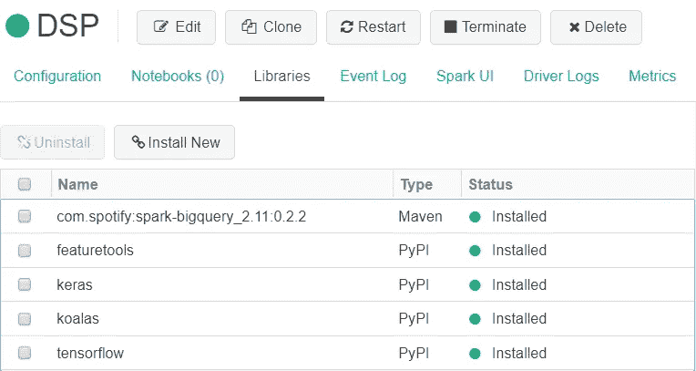*

*FIGURE 6.1: Libraries attached to a Databricks cluster.*

*现在我们已经配置了一个集群并设置了所需的库，我们可以创建一个笔记本来开始向集群提交命令。要创建新笔记本，请执行以下步骤:*

1.  *点击左侧导航栏上的“数据块”*
2.  *在“常见任务”下，选择“新建笔记本”*
3.  *指定一个名称“CH6”*
4.  *选择“Python”作为语言*
5.  *选择“DSP”作为集群*
6.  *点击“创建”*

*结果将是一个笔记本环境，您可以开始运行 Python 和 PySpark 命令，比如`print("Hello World!")`。运行该命令的笔记本示例如图 [6.2](/6-1-spark-environments.html#fig:6-intro) 所示。我们现在有了一个 PySpark 环境，可以用来构建分布式模型管道。*

*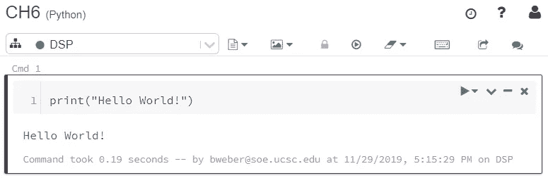*

*FIGURE 6.2: Running a Python command in Databricks.*

# *6.2 暂存数据*

*数据对于 PySpark 工作流至关重要。Spark 支持各种读入数据集的方法，包括连接到数据湖和数据仓库，以及从库中加载样本数据集，比如波士顿住房数据集。由于本书的主题是构建可伸缩的管道，我们将重点关注使用与分布式工作流一起工作的数据层。为了开始使用 PySpark，我们将为 S3 上的建模管道准备输入数据，然后将数据集作为 Spark 数据帧读入。*

*本节将展示如何将数据转移到 S3，如何设置从 Spark 访问数据的凭证，以及如何将数据从 S3 提取到 Spark 数据帧中。第一步是在 S3 上设置一个存储桶，用于存储我们想要加载的数据集。要执行此步骤，请在命令行上运行以下操作。*

```
*aws s3api create-bucket --bucket dsp-ch6 --region us-east-1
aws s3 ls*
```

*在运行命令创建一个新的 bucket 之后，我们使用`ls`命令来验证 bucket 是否已经成功创建。接下来，我们将游戏数据集下载到 EC2 实例，然后使用`cp`命令将文件移动到 S3，如下面的代码片段所示。*

```
*wget https:**//**github.com/bgweber/Twitch/raw/master/
                            Recommendations/games-expand.csv
aws s3 cp games-expand.csv s3:**//**dsp-ch6/csv/games-expand.csv*
```

*除了将游戏数据集转移到 S3，我们还将从 Kaggle NHL 数据集复制 CSV 文件的子集，这是我们在第 1.5.2 节中设置的。运行以下命令，将来自 NHL 数据集的 plays 和 stats CSV 文件转移到 S3。*

```
*aws s3 cp game_plays.csv s3:**//**dsp-ch6/csv/game_plays.csv
aws s3 cp game_skater_stats.csv 
                  s3:**//**dsp-ch6/csv/game_skater_stats.csv
aws s3 ls  s3:**//**dsp-ch6/csv/*
```

*我们现在有了本章中代码示例所需的所有数据集。为了从 Spark 读入这些数据集，我们需要设置 S3 凭证，以便与 Spark 集群中的 S3 进行交互。*

# *S3 全权证书*

*对于生产环境，最好使用 IAM 角色来管理访问，而不是使用访问键。然而，Databricks 的社区版限制了允许多少配置，所以我们将使用访问键来启动和运行本章中的示例。我们已经设置了一个从 EC2 实例访问 S3 的用户。要创建一组以编程方式访问 S3 的凭据，请从 AWS 控制台执行以下步骤:*

1.  *搜索并选择“IAM”*
2.  *点击“用户”*
3.  *选择在第 3.3.2 节“S3 _ 拉姆达”中创建的用户*
4.  *单击“安全凭证”*
5.  *单击“创建访问密钥”*

*结果将是允许访问 S3 的访问密钥和秘密密钥。请将这些值保存在安全的位置，因为我们将在笔记本中使用它们来连接到 S3 上的数据集。完成本章后，建议您撤销这些凭据。*

*现在我们已经为访问设置了凭证，我们可以返回到 Databricks 笔记本来读取数据集。要启用对 S3 的访问，我们需要在集群的 Hadoop 配置中设置访问密钥和秘密密钥。要设置这些键，运行下面代码片段中显示的 PySpark 命令。您需要用我们刚刚为`S3_Lambda`角色创建的凭证替换访问和秘密密钥。*

```
*AWS_ACCESS_KEY = "AK..."
AWS_SECRET_KEY = "dC..."**sc._jsc.hadoopConfiguration**()**.set**(
                      "fs.s3n.awsAccessKeyId", AWS_ACCESS_KEY)
**sc._jsc.hadoopConfiguration**()**.set**(
                      "fs.s3n.awsSecretAccessKey", AWS_SECRET_KEY)*
```

*我们现在可以使用`read`命令将数据集读入 Spark 数据帧，如下所示。该命令使用`spark`上下文发布一个读取命令，并使用 CSV 输入读取器读取数据集。我们还指定 CSV 文件包含一个标题行，并希望 Spark 推断列的数据类型。当读入 CSV 文件时，Spark 急切地将数据集提取到内存中，这可能会导致较大数据集的问题。在处理大型 CSV 文件时，最佳做法是将大型数据集分割成多个文件，然后在输入路径中使用通配符读入文件。当使用其他文件格式时，比如 Parquet 或 AVRO，Spark 会缓慢地获取数据集。*

```
*games_df = **spark.read.csv**("s3://dsp-ch6/csv/games-expand.csv",
                              header=True, inferSchema = True)
**display**(games_df)*
```

*上面代码片段中的`display`命令是 Databricks 提供的一个实用函数，它对输入数据帧进行采样，并显示该帧的表格表示，如图 [6.3](/6-2-staging-data.html#fig:6-games) 所示。它类似于 Pandas 中的`head`功能，但是提供了额外的功能，例如将采样数据帧转换为绘图。我们将在 6.3.3 节探索绘图功能。*

*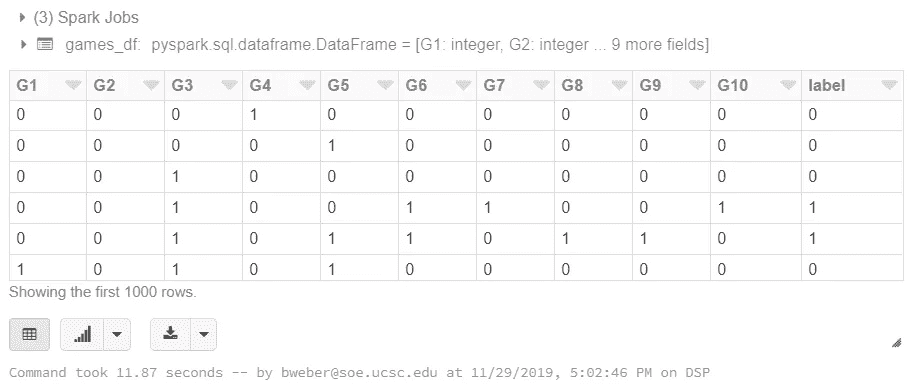*

*FIGURE 6.3: Displaying the Dataframe in Databricks.*

*既然我们已经将数据加载到 Spark 数据框架中，我们就可以开始探索 PySpark 语言了，它使数据科学家能够构建生产级的模型管道。*

# *6.3 py spark 底漆*

*PySpark 是一种用于探索性分析和构建机器学习管道的强大语言。PySpark 中的核心数据类型是 Spark 数据帧，它类似于 Pandas 数据帧，但被设计为在分布式环境中执行。虽然 Spark Dataframe API 确实为 Python 程序员提供了一个熟悉的接口，但是在向这些对象发出的命令的执行方式上有很大的不同。一个关键的区别是 Spark 命令是延迟执行的，这意味着像`iloc`这样的命令在这些对象上是不可用的。虽然使用 Spark 数据框架可能看起来有局限性，但好处是 PySpark 可以扩展到比 Pandas 大得多的数据集。*

*本节将介绍 Spark 数据帧的常见操作，包括持久化数据、在不同数据帧类型之间转换、转换数据帧以及使用用户定义的函数。我们将使用 NHL stats 数据集，它提供了每场比赛的玩家表现的用户级摘要。要将该数据集作为 Spark 数据帧加载，请运行下面代码片段中的命令。*

```
*stats_df = **spark.read.csv**("s3://dsp-ch6/csv/game_skater_stats.csv", 
                                   header=True, inferSchema = True)
**display**(stats_df)*
```

# *持久化数据帧*

*PySpark 中的一个常见操作是将数据帧保存到持久存储中，或者从存储层读入数据集。虽然 PySpark 可以处理 Redshift 等数据库，但在使用 S3 或 GCS 等分布式文件存储时，它的性能要好得多。在本章中，我们将使用这些类型的存储层作为模型管道的输出，但是将数据转移到 S3 作为工作流中的中间步骤也很有用。例如，在 Zynga 的 AutoModel [ [14](https://www.gamasutra.com/blogs/BenWeber/20190426/340293/) ]系统中，我们在使用 MLlib 训练和应用模型预测之前，将特征生成步骤的输出暂存到 S3。*

*要使用的数据存储层取决于您的云平台。对于 AWS，S3 与 Spark 在分布式数据读写方面配合得很好。当使用 S3 或其他数据湖时，Spark 支持各种不同的文件格式来保存数据。在使用 Spark 时，Parquet 是典型的行业标准，但是除了 CSV 之外，我们还将探讨 Avro 和 ORC。Avro 是流数据管道的更好格式，ORC 在处理传统数据管道时很有用。*

*为了展示 Spark 支持的数据格式范围，我们将把 stats 数据集写入 AVRO，然后是 Parquet，然后是 ORC，最后是 CSV。在执行了数据 IO 的往返之后，我们将最终得到我们的初始 Spark 数据帧。首先，我们将使用下面的代码片段以 Avro 格式保存 stats 数据帧。这段代码使用 Databricks Avro writer 将数据帧以 Avro 格式写入 S3，然后使用同一个库读入结果。执行这些步骤的结果是，我们现在有一个指向 S3 上的 Avro 文件的 Spark 数据帧。由于 PySpark 延迟评估操作，Avro 文件不会被拉至 Spark 集群，直到需要从该数据集创建输出。*

```
**# AVRO write*
avro_path = "s3://dsp-ch6/avro/game_skater_stats/"
**stats_df.write.mode**('overwrite')**.format**(
                       "com.databricks.spark.avro")**.save**(avro_path)*# AVRO read* 
avro_df = **sqlContext.read.format**(
                       "com.databricks.spark.avro")**.load**(avro_path)*
```

*Avro 是基于记录的分布式文件格式，而 Parquet 和 OR 格式是基于列的。它对我们将在第 9 章探讨的流工作流很有用，因为它压缩了分布式数据处理的记录。将 stats 数据帧保存为 Avro 格式的输出如下面的代码片段所示，其中显示了将数据帧作为 Avro 保存到 S3 时生成的状态文件和数据文件的子集。像大多数可扩展的数据格式一样，Avro 将根据指定的分区将记录写入几个文件，以便实现高效的读写操作。*

```
*aws s3 ls s3:**//**dsp-ch6/avro/game_skater_stats/
2019-11-27 23:02:43       1455 _committed_1588617578250853157
2019-11-27 22:36:31       1455 _committed_1600779730937880795
2019-11-27 23:02:40          0 _started_1588617578250853157
2019-11-27 23:31:42          0 _started_6942074136190838586
2019-11-27 23:31:47    1486327 part-00000-tid-6942074136190838586-
               c6806d0e-9e3d-40fc-b212-61c3d45c1bc3-15-1-c000.avro
2019-11-27 23:31:43      44514 part-00007-tid-6942074136190838586-
               c6806d0e-9e3d-40fc-b212-61c3d45c1bc3-22-1-c000.avro*
```

*S3 上的 Parquet 目前是在 AWS 上构建数据湖的标准方法，Delta Lake 等工具正在利用这种格式来提供高度可伸缩的数据平台。Parquet 是一种面向列的文件格式，当一个操作只访问列的一个子集时，例如使用 Spark SQL 时，这种文件格式可以提高读取效率。Parquet 是 Spark 的原生格式，这意味着 PySpark 具有用于读写这种格式的文件的内置函数。*

*下面的代码片段展示了一个将 stats 数据帧写成 Parquet 文件，并将结果读入一个新的数据帧的例子。在本例中，我们没有设置分区键，但是与 Avro 一样，数据帧将被分割成多个文件，以便支持高性能的读写操作。当处理大规模数据集时，使用`repartition`函数为文件导出设置分区键是很有用的。在本节之后，我们将使用 Parquet 作为使用 Spark 时的主要文件格式。*

```
**# parquet out*
parquet_path = "s3a://dsp-ch6/games-parquet/"
**avro_df.write.mode**('overwrite')**.parquet**(parquet_path)*# parquet in*
parquet_df = **sqlContext.read.parquet**(parquet_path)*
```

*ORC 是另一种与 Spark 配合良好的列格式。与 Parquet 相比，它的主要优势是可以支持更高的压缩率，但代价是增加了计算成本。我将它包含在本章中，因为一些遗留系统仍然使用这种格式。将 stats 数据帧写入 ORC 并将结果读回 Spark 数据帧的示例如下面的代码片段所示。与 Avro 格式一样，ORC write 命令会根据大小将数据帧分配给多个文件。*

```
**# orc out*
orc_path = "s3a://dsp-ch6/games-orc/"
**parquet_df.write.mode**('overwrite')**.orc**(orc_path)*# orc in*
orc_df = **sqlContext.read.orc**(orc_path)*
```

*为了完成文件格式的往返，我们将以 CSV 格式将结果写回 S3。为了确保我们编写的是单个文件而不是一批文件，我们将使用 coalesce 命令将数据收集到单个节点，然后再导出。这是一个在处理大型数据集时会失败的命令，通常在使用 Spark 时最好避免使用 CSV 格式。然而，CSV 文件仍然是共享数据的常用格式，因此了解如何导出到这种格式是很有用的。*

```
**# CSV out*
csv_path = "s3a://dsp-ch6/games-csv-out/"
**orc_df.coalesce**(1)**.write.mode**('overwrite')**.format**(
 "com.databricks.spark.csv")**.option**("header","true")**.save**(csv_path)

*# and CSV to finish the round trip* 
csv_df = **spark.read.csv**(csv_path, header=True, inferSchema = True)*
```

*产生的数据帧与我们第一次从 S3 读入的数据帧相同，但是如果数据类型不是很容易推断，那么 CSV 格式可能会导致问题。使用 PySpark 持久化数据时，最好使用描述持久化数据模式的文件格式。*

# *转换数据帧*

*虽然在创作 PySpark 工作负载时最好使用 Spark 数据帧，但通常有必要根据您的用例在不同格式之间进行转换。例如，您可能需要执行 Pandas 操作，比如从 dataframe 中选择特定的元素。需要时，您可以使用`toPandas`功能将火花数据帧拉入驱动节点的存储器中。下面的代码片段显示了如何执行这个任务，显示结果，然后将 Pandas 数据帧转换回 Spark 数据帧。一般来说，在编写 PySpark 工作流时，最好避免使用 Pandas，因为它会阻止分发和扩展，但这通常是表达要执行的命令的最佳方式。*

```
*stats_pd = **stats_df.toPandas**()stats_df = **sqlContext.createDataFrame**(stats_pd)*
```

*为了弥合 Pandas 和 Spark 数据帧之间的差距，Databricks 引入了一个名为 Koalas 的新库，它类似于 Pandas 用于 Spark 支持的数据帧的 API。结果是，您可以编写与 Pandas 命令一起使用的 Python 代码，这些命令可以扩展到 Spark 级别的数据集。下面的代码片段展示了一个将 Spark 数据帧转换成考拉数据帧再转换回 Spark 数据帧的示例。将 stats 数据帧转换为考拉数据帧后，该代码片段显示了如何计算在冰上的平均时间以及考拉数据帧的索引。考拉的目的是为 Spark 数据帧提供一个 Pandas 接口，随着考拉库的成熟，更多的 Python 模块可能会利用 Spark。代码片段的输出显示，每场比赛在冰上的平均时间是 993 秒。*

```
*import databricks.koalas as ksstats_ks = **stats_df.to_koalas**()
stats_df = **stats_ks.to_spark**()**print**(stats_ks['timeOnIce']**.mean**())
**print**(stats_ks.iloc[:1, 1:2])*
```

*在本书的开发过程中，考拉仍然是初步的，只是部分实现，但它看起来为 Python 编码人员提供了一个熟悉的接口。熊猫和 Spark 数据帧都可以与考拉一起工作，下面的片段显示了如何从 Spark 到考拉再到熊猫再到 Spark，以及 Spark 到熊猫再到考拉再到 Spark。*

```
**# spark -> koalas -> pandas -> spark*
df = **sqlContext.createDataFrame**(**stats_df.to_koalas**()**.toPandas**())*# spark -> pandas -> koalas -> spark*
df = **ks.from_pandas**(**stats_df.toPandas**())**.to_spark**()*
```

*一般来说，在 PySpark 环境中编写代码时，您将使用 Spark 数据帧。但是，能够根据需要使用不同的对象类型来构建模型工作流是非常有用的。考拉和熊猫 UDF 为将工作负载移植到大规模数据生态系统提供了强大的工具。*

# *转换数据*

*PySpark Dataframe API 为聚合、过滤、透视和汇总数据提供了各种有用的函数。虽然其中一些功能可以很好地映射到 Pandas 操作，但是我建议在 PySpark 中快速启动和运行 munging 数据的方法是使用名为 Spark SQL 的 SQL 接口来处理 Spark 中的数据帧。如果您已经在使用`pandasql`或`framequery`库，那么 Spark SQL 应该会提供一个熟悉的接口。如果您不熟悉这些库，那么 SQL 接口仍然提供了一种使用 Spark 生态系统的简单方法。我们将在本节稍后讨论 Dataframe API，但是首先从 SQL 接口开始启动和运行。*

*探索性数据分析(EDA)是数据科学工作流中理解数据集形状的关键步骤之一。为了在 PySpark 中完成这个过程，我们将把 stats 数据集加载到 dataframe 中，将其作为视图公开，然后计算汇总统计数据。下面的代码片段展示了如何加载 NHL stats 数据集，将其作为 Spark 的视图公开，然后对 dataframe 运行查询。然后使用 Databricks 中的`display`命令可视化聚合的数据帧。*

```
*stats_df = **spark.read.csv**("s3://dsp-ch6/csv/game_skater_stats.csv",
                                   header=True, inferSchema = True)
**stats_df.createOrReplaceTempView**("stats")new_df = **spark.sql**("""
  select player_id, sum(1) as games, sum(goals) as goals
  from stats
  group by 1
  order by 3 desc
  limit 5
""")**display**(new_df)*
```

*该代码块的输出如图 [6.4](/6-3-a-pyspark-primer.html#fig:6-agg) 所示。它通过根据进球总数对结果进行排名，显示了 NHL 数据集中得分最高的球员。Spark 的一个强大特性是，在需要结果集之前，SQL 查询不会对数据帧进行操作。这意味着笔记本中的命令可以为 Spark 数据帧设置多个数据转换步骤，直到后面的步骤需要执行代码块中定义的操作图时才执行这些步骤。*

*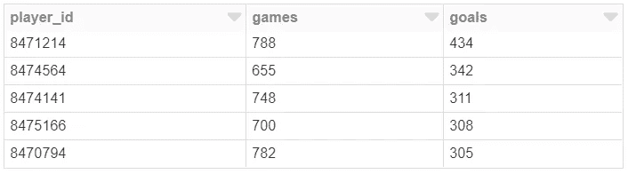*

*FIGURE 6.4: Summarizing player activity.*

*Spark SQL 表达能力强、速度快，是我在 Spark 环境中处理大数据集的首选方法。虽然以前的 Spark 版本在使用 Dataframe API 时比 Spark SQL 表现得更好，但性能上的差异现在已经微不足道了，您应该使用能够为处理大型数据集提供最佳迭代速度的转换工具。使用 Spark SQL，您可以连接数据帧、运行嵌套查询、设置临时表，以及混合使用 Spark 操作和 SQL 操作。例如，如果您想要查看 NHL stats 数据中的进球与射门的分布，您可以在 dataframe 上运行以下命令。*

```
***display**(**spark.sql**("""
  select cast(goals/shots * 50 as int)/50.0 as Goals_per_shot
      ,sum(1) as Players 
  from (
    select player_id, sum(shots) as shots, sum(goals) as goals
    from stats
    group by 1
    having goals >= 5
  )  
  group by 1
  order by 1
"""))*
```

*该查询将进球数与射门数的比率限制为超过 5 个进球的球员，以防止出现异常值，如守门员在强攻中得分。我们将使用`display`命令将结果集输出为表格，然后使用 Databricks 将输出显示为图形。许多 Spark 生态系统都有可视化结果的方法，Databricks 环境通过`display`命令提供了这种能力，它可以很好地处理表格和透视表数据。运行上述命令后，您可以点击图表图标并选择显示进球与射门分布的尺寸和度量，如图 [6.5](/6-3-a-pyspark-primer.html#fig:6-plot) 所示。*

*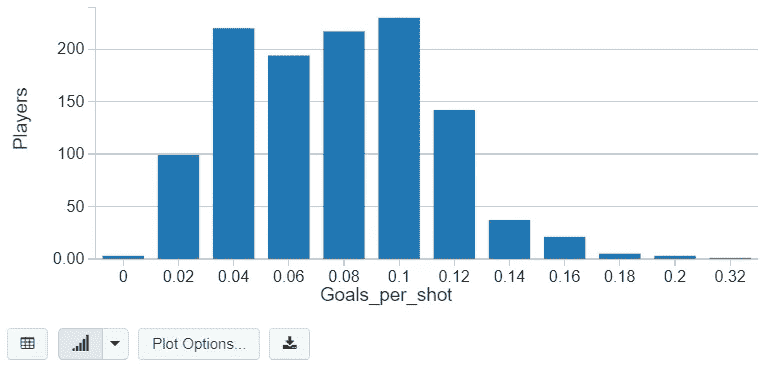*

*FIGURE 6.5: Distribution of goals per shot.*

*虽然我提倡使用 SQL 来转换数据，因为它可以扩展到不同的编程环境，但是熟悉 PySpark 中的一些基本数据帧操作是很有用的。下面的代码片段显示了如何执行常见操作，包括删除列、选择列的子集以及向 Spark 数据帧添加新列。像前面的命令一样，所有这些操作都是延迟执行的。与 Pandas 有一些语法差异，但是用于转换数据集的一般命令应该是熟悉的。*

```
*from pyspark.sql.functions import lit*# dropping columns*
copy_df = **stats_df.drop**('game_id', 'player_id')*# selection columns* 
copy_df = **copy_df.select**('assists', 'goals', 'shots')*# adding columns*
copy_df = **copy_df.withColumn**("league", **lit**('NHL'))
**display**(copy_df)*
```

*在数据帧之间执行的一个常见操作是连接。这很容易在 Spark SQL 查询中表达，但有时最好用 Dataframe API 以编程方式来实现。下面的代码片段显示了当在`game_id`和`player_id`字段上连接时，如何将两个数据帧连接在一起。作为文字的`league`列将与 stats 数据帧的其余部分连接在一起。这是一个简单的例子，我们在一个小数据帧上添加了一个新列，但是 Dataframe API 的连接操作可以扩展到大规模数据集。*

```
*copy_df = **stats_df.select**('game_id', 'player_id').
                          **withColumn**("league", **lit**('NHL'))
df = **copy_df.join**(stats_df, ['game_id', 'player_id'])
**display**(df)*
```

*上述连接操作的结果集如图 [6.6](/6-3-a-pyspark-primer.html#fig:6-join) 所示。Spark 支持各种不同的连接类型，在本例中，我们使用了一个内部连接将 league 列附加到 stats 数据帧中。*

*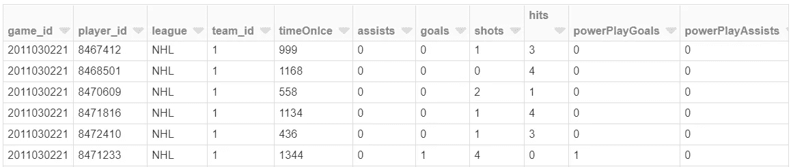*

*FIGURE 6.6: The dataframe resulting from the join.*

*还可以在数据帧上执行聚合操作，例如计算列的总和和平均值。下面的代码片段显示了一个在统计数据集中计算球员平均上场时间和总进球数的例子。`groupBy`命令使用`player_id`作为折叠数据集的列，而`agg`命令指定要执行的聚合。*

```
*summary_df = **stats_df.groupBy**("player_id")**.agg**(
                             {'timeOnIce':'avg', 'goals':'sum'})
**display**(summary_df)*
```

*该代码片段创建了一个包含`player_id`、`timeOnIce`和`goals`列的 dataframe。我们将再次使用 Databricks 中的绘图功能来可视化结果，但这次选择散点图选项。图 [6.7](/6-3-a-pyspark-primer.html#fig:6-scat) 显示了冰上目标与时间的关系。*

*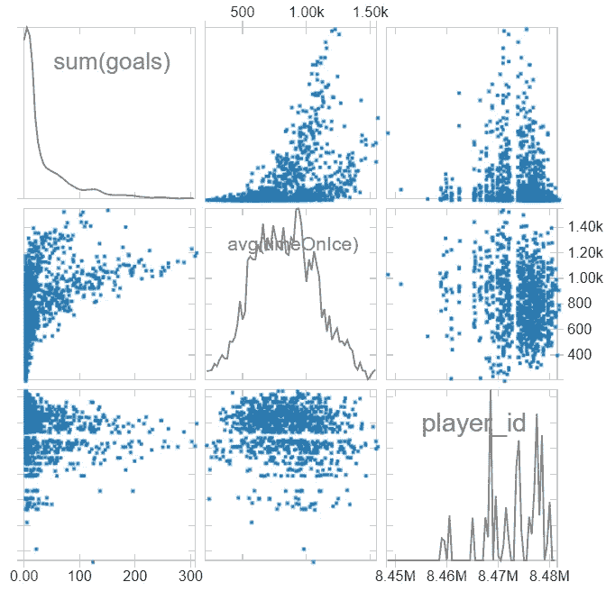*

*FIGURE 6.7: Time on ice and goal scoring plots.*

*我们已经通过介绍性示例在 PySpark 中启动和运行数据框架，重点关注在训练机器学习模型之前对数据进行管理的有用操作。这些类型的操作与读取和写入数据帧相结合，为在海量数据集上执行探索性分析提供了一组有用的技能。*

# *6.3.4 熊猫 UDF*

*虽然 PySpark 提供了大量处理数据帧的功能，但它通常缺少 Python 库中提供的核心功能，例如 SciPy 中的曲线拟合功能。虽然可以使用`toPandas`函数将数据帧转换成 Python 库的 Pandas 格式，但这种方法在使用大型数据集时会失效。Pandas UDFs 是 PySpark 中的一个新特性，通过将 Pandas 转换分布在 Spark 集群中的工作节点上，帮助数据科学家解决这个问题。使用 Pandas UDF，您可以通过操作定义一个 group by，将数据集划分为足够小的数据帧，以适合工作节点的内存，然后创建一个函数，将 Pandas 数据帧作为输入参数，并返回转换后的 Pandas 数据帧作为结果。在幕后，PySpark 使用 PyArrow 库高效地将数据帧从 Spark 翻译到 Pandas，并从 Pandas 翻译回 Spark。这种方法使 Python 库(如 Keras)能够扩展到大型机器集群。*

*本节将通过一个示例问题，我们需要使用现有的 Python 库，并展示如何使用 Pandas UDFs 将工作流转换为可伸缩的解决方案。我们希望回答的问题是理解统计数据集中的`shots`和`hits`属性之间是正相关还是负相关。为了计算这个关系，我们可以使用 SciPy 中的`leastsq`函数，如下面的代码片段所示。该示例为单个 player_id 创建了一个 Pandas 数据帧，然后在这些属性之间拟合了一个简单的线性回归。输出是用于拟合最小二乘运算的系数，在这种情况下，击球次数与击球次数没有很强的相关性。*

```
*sample_pd = **spark.sql**("""
  select * from stats
  where player_id = 8471214
""")**.toPandas**()*# Import python libraries* 
from scipy.optimize import leastsq
import numpy as np*# Define a function to fit*
def **fit**(params, x, y):
    **return** (y - (params[0] + x * params[1] ))

*# Fit the curve and show the results* 
result = **leastsq**(fit, [1,0], args=(sample_pd.shots,sample_pd.hits))
**print**(result)*
```

*现在我们想对 stats 数据集中的每个球员执行这个操作。为了扩展到这个卷，我们将首先通过`player_id`进行分区，如下面代码片段中的`groupBy`操作所示。接下来，我们将使用 apply 命令为每个分区数据集运行`analyze_player`函数。用作该操作输入的`stats_df`数据帧和返回的`players_df`数据帧是火花数据帧，而由分析播放器功能返回的`sampled_pd`数据帧和数据帧是熊猫。Pandas UDF 注释为 PySpark 提供了一个关于如何分配工作负载的提示，这样它就可以跨工作节点集群扩展操作，而不是急切地将所有数据拉至驱动节点。像大多数 Spark 操作一样，Pandas UDFs 是延迟求值的，直到需要输出值时才会执行。*

*我们最初的例子现在翻译成使用熊猫 UDF 如下所示。在定义了要包含的附加模块之后，我们指定将从操作中返回的数据帧的模式。`schema`对象定义了应用分析播放器函数返回的 Spark 数据帧的结构。代码块中的下一步列出了一个注释，该注释将此函数定义为分组映射操作，这意味着它作用于数据帧而不是标量值。和以前一样，我们将使用`leastsq`函数来拟合镜头和点击属性。在计算了曲线拟合的系数之后，我们用玩家 id 和回归系数创建了一个新的熊猫数据帧。该代码块末尾的`display`命令将强制熊猫 UDF 执行，这将为数据集中的每个玩家创建一个分区，应用最小二乘运算，并将结果合并回一个大的 Spark 数据帧中。*

```
**# Load necessary libraries*
from pyspark.sql.functions import pandas_udf, PandasUDFType
from pyspark.sql.types import *
import pandas as pd*# Create the schema for the resulting data frame*
schema = **StructType**([**StructField**('ID', **LongType**(), True),
                     **StructField**('p0', **DoubleType**(), True),
                     **StructField**('p1', **DoubleType**(), True)])*# Define the UDF, input and outputs are Pandas DFs*
@**pandas_udf**(schema, PandasUDFType.GROUPED_MAP)
def **analize_player**(sample_pd):

    *# return empty params in not enough data*
    **if** (**len**(sample_pd.shots) <= 1):
        return **pd.DataFrame**({'ID': [sample_pd.player_id[0]], 
                                   'p0': [ 0 ], 'p1': [ 0 ]})

    *# Perform curve fitting* 
    result = **leastsq**(fit, [1, 0], args=(sample_pd.shots, 
                                  sample_pd.hits))

    *# Return the parameters as a Pandas DF* 
    return **pd.DataFrame**({'ID': [sample_pd.player_id[0]], 
                       'p0': [result[0][0]], 'p1': [result[0][1]]})

*# perform the UDF and show the results* 
player_df = **stats_df.groupby**('player_id')**.apply**(analyze_player)
**display**(player_df)*
```

*Pandas UDFs 提供的关键功能是，只要您有好的数据分区方法，它们就能使 Python 库在分布式环境中使用。这意味着像 Featuretools 这样最初并不是为在分布式环境中工作而设计的库，可以扩展到大型集群。图 [6.8](/6-3-a-pyspark-primer.html#fig:6-fits) 显示了在统计数据集上应用上述熊猫 UDF 的结果。这个特性支持不同数据帧格式之间的无缝转换。*

*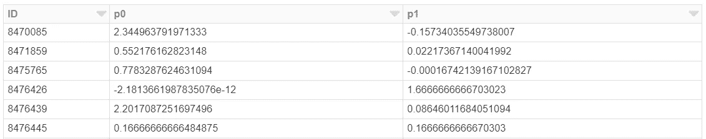*

*FIGURE 6.8: The output dataFrame from the Pandas UDF.*

*为了进一步展示熊猫 UDF 的价值，我们将把它们应用于分布特征生成管道和深度学习管道。然而，在工作流中使用 Pandas UDFs 时存在一些问题，因为它们会使调试变得更加困难，有时会由于 Spark 和 Pandas 之间的数据类型不匹配而失败。*

# *最佳实践*

*虽然 PySpark 为 Python 程序员提供了一个熟悉的环境，但是最好遵循一些最佳实践来确保您高效地使用 Spark。以下是我根据自己将一些投影从 Python 移植到 PySpark 的经验编写的一组建议:*

*   ***避免使用字典:**使用字典这样的 Python 数据类型意味着代码可能无法在分布式模式下执行。不要使用键来索引字典中的值，可以考虑向 dataframe 中添加另一列来用作过滤器。该建议适用于其他 Python 类型，包括不可在 PySpark 中分发的列表。*
*   ***限制熊猫使用:**调用`toPandas`将导致所有数据被加载到驱动程序节点的内存中，并阻止操作以分布式模式执行。当数据已经聚合并且您想要使用熟悉的 Python 绘图工具时，使用此函数是很好的，但是它不应该用于大型数据帧。*
*   ***避免循环:**除了使用 for 循环，通常还可以使用 group by 和 apply 等函数方法来达到相同的结果。使用这种模式意味着代码可以被支持的执行环境并行化。我注意到，专注于在 Python 中使用这种模式也导致了更容易翻译成 PySpark 的代码的清理。*
*   ***最小化急切操作:**为了让您的管道尽可能地可伸缩，最好避免将完整数据帧拉入内存的急切操作。例如，在 CSV 中读取是一个急切的操作，我的工作是将数据帧存放到 S3 作为拼花，然后在后面的管道步骤中使用它。*
*   ***使用 SQL:**Python 和 PySpark 中都有针对数据帧提供 SQL 操作的库。如果你正在用别人的 Python 代码工作，破译熊猫的一些操作正在实现什么可能是棘手的。如果您计划将代码从 Python 移植到 PySpark，那么使用 Pandas 的 SQL 库可以使这种转换更容易。*

*通过在编写 PySpark 代码时遵循这些最佳实践，我已经能够改进我的 Python 和 PySpark 数据科学工作流。*

# *6.4 MLlib 批处理管道*

*既然我们已经介绍了使用 PySpark 加载和转换数据，现在我们可以使用 PySpark 中的机器学习库来构建预测模型。PySpark 中构建预测模型的核心库称为 MLlib。这个库提供了一套监督和非监督算法。虽然该库没有完全涵盖 sklearn 中的所有算法，但它为数据科学工作流所需的大多数类型的操作提供了功能。在本章中，我们将展示如何将 MLlib 应用于分类问题，并将模型应用程序的输出保存到数据湖中。*

```
*games_df = **spark.read.csv**("s3://dsp-ch6/csv/games-expand.csv", 
                                header=True, inferSchema = True)
**games_df.createOrReplaceTempView**("games_df")games_df = **spark.sql**("""
  select *, row_number() over (order by rand()) as user_id
    ,case when rand() > 0.7 then 1 else 0 end as test
  from games_df
""")*
```

*管道中的第一步是加载我们想要用于模型训练的数据集。上面的代码片段展示了如何加载游戏数据集，并使用 Spark SQL 将两个附加属性添加到加载的数据帧中。运行该查询的结果是，大约 30%的用户将被分配一个测试标签，我们将使用该标签进行模型应用，并且每个记录都被分配一个唯一的用户 ID，我们将在保存模型预测时使用该 ID。*

*下一步是将数据集分成训练和测试数据帧。对于这个管道，我们将使用测试数据帧作为模型应用的数据集，在这里我们预测用户行为。下面的代码片段显示了一个使用测试列拆分数据帧的示例。这应该会产生大约 16.1k 的培训用户和 6.8k 的测试用户。*

```
*trainDF = **games_df.filter**("test == 0")
testDF = **games_df.filter**("test == 1")
**print**("Train " + **str**(**trainDF.count**()))
**print**("Test " + **str**(**testDF.count**()))*
```

# *向量列*

*MLlib 要求使用 Spark 中的矢量数据类型格式化输入数据。要将 dataframe 转换成这种格式，我们可以使用`VectorAssembler`类将一系列列组合成一个向量列。下面的代码片段展示了如何使用这个类将 dataframe 中的前 10 列合并到一个名为`features`的新向量列中。使用`transform`函数将该命令应用于训练数据帧后，我们使用选择函数仅从数据帧中检索模型训练和应用所需的值。对于训练数据帧，我们只需要标签和特征，对于测试数据帧，我们还需要选择用户 ID。*

```
*from pyspark.ml.feature import VectorAssembler*# create a vector representation*
assembler = **VectorAssembler**(
        inputCols= trainDF.schema.names[0:10],
        outputCol="features" )trainVec = **assembler.transform**(trainDF)**.select**('label', 'features')
testVec = **assembler.transform**(testDF)**.select**(
                                    'label', 'features', 'user_id')
**display**(testVec)*
```

*display 命令显示了将我们的测试数据集转换成 MLlib 可用的向量类型的结果。输出数据帧如图 [6.9](/6-4-mllib-batch-pipeline.html#fig:6-vect) 所示。*

*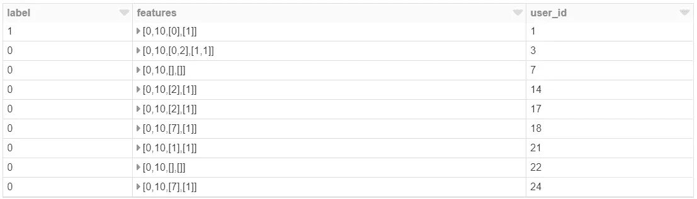*

*FIGURE 6.9: The features in the sparse vector format.*

# *模型应用*

*现在我们已经准备好了训练和测试数据集，我们可以使用 MLlib 提供的逻辑回归算法来拟合训练数据帧。我们首先创建一个逻辑回归对象，并定义用作标签和特征的列。接下来，我们使用`fit`函数在训练数据集上训练模型。在下面代码片段的最后一步，我们使用`transform`函数将模型应用到我们的测试数据集。*

```
*from pyspark.ml.classification import LogisticRegression*# specify the columns for the model*
lr = **LogisticRegression**(featuresCol='features', labelCol='label')*# fit on training data*
model = **lr.fit**(trainVec)*# predict on test data* 
predDF = **model.transform**(testVec)*
```

*产生的 dataframe 现在有一个`probability`列，如图 [6.10](/6-4-mllib-batch-pipeline.html#fig:6-prop) 所示。该列是一个 2 元素数组，包含类 0 和 1 的概率。为了在测试数据集上测试逻辑回归模型的准确性，我们可以使用 Mlib 中的二元分类评估器来计算 ROC 指标，如下面的代码片段所示。对于我运行的模型，ROC 指标的值是 0.761。*

```
*from pyspark.ml.evaluation import BinaryClassificationEvaluatorroc = **BinaryClassificationEvaluator**()**.evaluate**(predDF)
**print**(roc)*
```

*在生产管道中，没有需要预测的用户标签，这意味着您需要执行交叉验证来选择最佳模型进行预测。第 6.7 节介绍了这种方法的一个例子。在这种情况下，我们使用单个数据集来保持代码示例的简短，但是在生产工作流中可以使用类似的管道。*

*既然我们有了测试用户的模型预测，我们需要检索预测的标签，以便创建一个数据帧来持久化数据湖。由于 MLlib 创建的概率列是一个数组，我们需要定义一个 UDF 来检索第二个元素作为我们的倾向列，如下面的代码片段所示。*

```
*from pyspark.sql.functions import udf
from pyspark.sql.types import FloatType*# split out the array into a column* 
secondElement = **udf**(lambda v:**float**(v[1]),**FloatType**())
predDF = **predDF.select**("*", 
                **secondElement**("probability")**.alias**("propensity"))
**display**(predDF)* 
```

*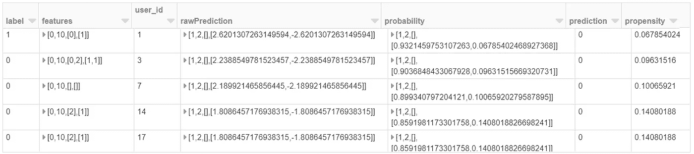*

*FIGURE 6.10: The dataframe with propensity scores.*

*运行该代码块后，dataframe 将有一个名为`propensity`的附加列，如图 [6.10](/6-4-mllib-batch-pipeline.html#fig:6-prop) 所示。这个批量预测管道的最后一步是将结果保存到 S3。我们将使用`select`函数从预测数据帧中检索相关的列，然后在数据帧上使用`write`函数将结果持久化为 S3 上的拼花。*

```
**# save results to S3*
results_df = **predDF.select**("user_id", "propensity")
results_path = "s3a://dsp-ch6/game-predictions/"
**results_df.write.mode**('overwrite')**.parquet**(results_path)*
```

*我们现在已经拥有了创建 PySpark 管道所需的所有构件，该管道可以从存储层获取数据，训练预测模型，并将结果写入持久存储。我们将在第 6.8 节讨论如何安排这种类型的管道。*

*开发模型时，检查输出以查看模型预测的分布是否与预期匹配是很有用的。我们可以使用 Spark SQL 对模型输出执行聚合，然后使用 display 命令直接在 Databricks 中执行这个过程，如下面的代码片段所示。对模型预测执行这些步骤的结果如图 [6.11](/6-4-mllib-batch-pipeline.html#fig:6-area) 所示。*

```
**# plot the predictions* 
predDF **.createOrReplaceTempView**("predDF ")plotDF = **spark.sql**("""
  select cast(propensity*100 as int)/100 as propensity, 
         label, sum(1) as users
  from predDF 
  group by 1, 2
  order by 1, 2  
""")*# table output*
**display**(plotDF)* 
```

*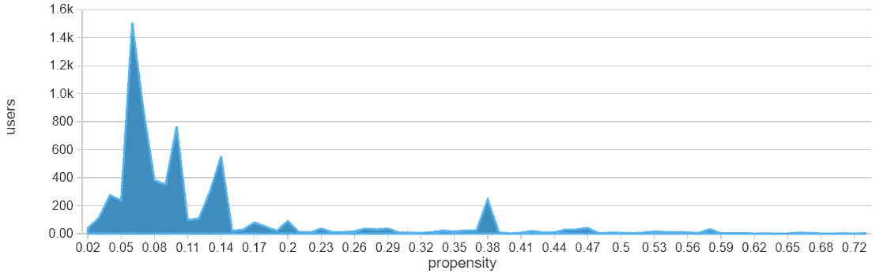*

*FIGURE 6.11: The distribution of propensity scores.*

*MLlib 可以使用大量算法应用于各种各样的问题。虽然我们在本节中探讨了逻辑回归，但是库提供了许多不同的分类方法，并且还支持其他类型的操作，包括回归和聚类。*

# *6.5 分布式深度学习*

*虽然 MLlib 为经典的机器学习算法提供了可扩展的实现，但它本身并不支持深度学习库，如 Tensorflow 和 PyTorch。有一些库可以在 Spark 上并行化深度学习模型的训练，但数据集需要能够适应每个工作节点上的内存，这些方法最适合用于中等规模数据集的分布式超参数调优。*

*对于模型应用阶段，我们已经有了一个经过训练的深度学习模型，但需要将结果模型应用到一个大型用户群，我们可以使用 Pandas UDFs。使用 Pandas UDFs，我们可以划分和分布我们的数据集，根据 Keras 模型运行结果数据帧，然后将结果编译回一个大 Spark 数据帧。本节将展示如何使用我们在 1.6.3 节中构建的 Keras 模型，并使用 PySpark 和 Pandas UDFs 将其扩展到更大的数据集。但是，我们仍然要求用于训练模型的数据能够适合驱动程序节点上的内存。*

*我们将使用上一节中的相同数据集，其中我们将游戏数据集分为用户的训练集和测试集。这是一个相对较小的数据集，因此我们可以使用`toPandas`操作将 dataframe 加载到驱动程序节点上，如下面的代码片段所示。结果是一个数据框架和列表，我们可以将其作为输入来训练 Keras 深度学习模型。*

```
**# build model on the driver node* 
train_pd = **trainDF.toPandas**()
x_train = train_pd.iloc[:,0:10]
y_train = train_pd['label']*
```

*当使用 PyPI 在 Spark 集群上安装 TensorFlow 时，安装的库版本应该是 2.0 或更高版本。这不同于我们在前面章节中使用的 TensorFlow 的版本 1。就代码片段而言，主要影响是 Tensorflow 2 现在具有内置的 AUC 功能，不再需要我们以前应用的工作流。*

# *模型培训*

*我们将使用与之前相同的方法来训练一个 Keras 模型。下面的代码片段显示了如何建立一个具有输入层、后丢弃层、单个隐藏层和输出层的网络，并使用`rmsprop`和交叉熵损失进行优化。在模型应用阶段，我们将在 Pandas UDFs 中重用`model`对象来分配工作负载。*

```
*import tensorflow as tf
import keras
from keras import models, layersmodel = **models.Sequential**()
**model.add**(**layers.Dense**(64, activation='relu', input_shape=(10,)))
**model.add**(**layers.Dropout**(0.1))
**model.add**(**layers.Dense**(64, activation='relu'))
**model.add**(**layers.Dense**(1, activation='sigmoid'))**model.compile**(optimizer='rmsprop', loss='binary_crossentropy')
history = **model.fit**(x_train, y_train, epochs=100, batch_size=100, 
                 validation_split = .2, verbose=0)*
```

*为了测试过度拟合，我们可以绘制训练和验证数据集的结果，如图 [6.12](/6-5-distributed-deep-learning.html#fig:6-loss) 所示。下面的代码片段展示了如何使用 matplotlib 来显示这些数据集随时间的损失。虽然训练损失在额外的时期内继续减少，但验证损失在 20 个时期后停止改善，但随着时间的推移没有显著增加。*

```
*import matplotlib.pyplot as pltloss = history.history['loss']
val_loss = history.history['val_loss']
epochs = **range**(1, **len**(loss) + 1)fig = **plt.figure**(figsize=(10,6) )
**plt.plot**(epochs, loss, 'bo', label='Training Loss')
**plt.plot**(epochs, val_loss, 'b', label='Validation Loss')
**plt.legend**()
**plt.show**()
**display**(fig)*
```

*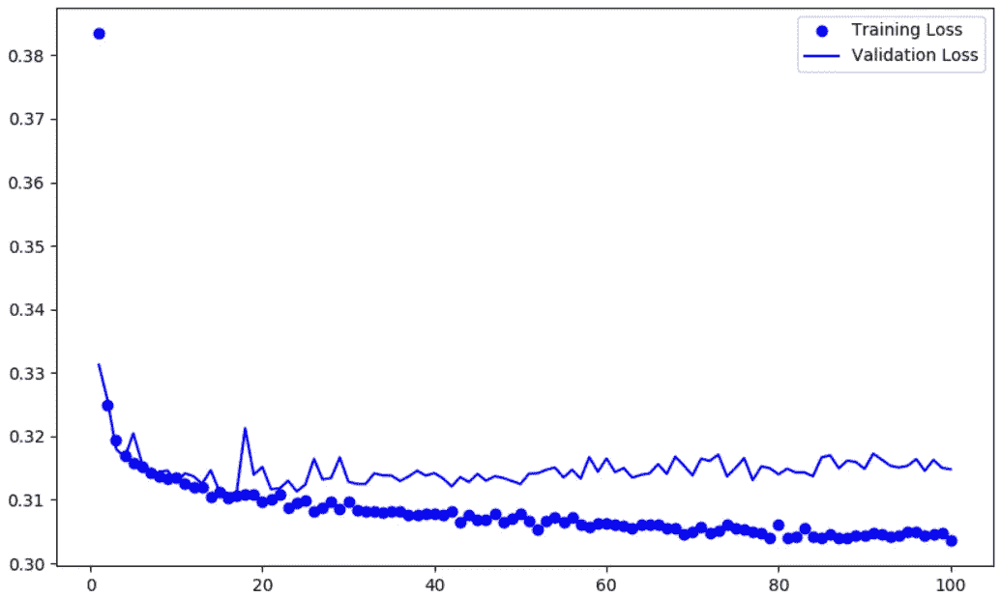*

*FIGURE 6.12: Training a Keras model on a subset of data.*

# *模型应用*

*现在我们有了一个经过训练的深度学习模型，我们可以使用 PySpark 将其应用到可扩展的管道中。第一步是确定如何划分需要评分的用户集合。对于这个数据集，我们可以将用户群分配到 100 个不同的桶中，如下面的代码片段所示。这将每个用户随机分配到 100 个桶中的 1 个，这意味着在逐步应用组后，每个转换为 Pandas 的数据帧的大小大约是原始数据帧的 1%。如果您有一个大型数据集，您可能需要使用数千个存储桶来分发数据集，甚至更多。*

```
**# set up partitioning for the train data frame*
**testDF.createOrReplaceTempView**("testDF ")partitionedDF = **spark.sql**("""
  select *, cast(rand()*100 as int) as partition_id
  from testDF 
""")*
```

*下一步是定义将应用 Keras 模型的熊猫 UDF。我们将定义一个用户 ID 和倾向得分的输出模式，如下所示。UDF 在我们之前训练的模型对象上使用`predict`函数，在传入的数据帧上创建一个`prediction`列。return 命令选择我们为 schema 对象定义的两个相关列。group by 命令使用我们的分桶方法对数据集进行分区，apply 命令跨工作节点集群执行 Keras 模型应用程序。结果是显示命令可视化的火花数据帧，如图 [6.13](/6-5-distributed-deep-learning.html#fig:6-out) 所示。*

```
*from pyspark.sql.functions import pandas_udf, PandasUDFType
from pyspark.sql.types import *schema = **StructType**([**StructField**('user_id', **LongType**(), True),
                     **StructField**('propensity', **DoubleType**(),True)])@**pandas_udf**(schema, PandasUDFType.GROUPED_MAP)
def **apply_keras**(pd):
    pd['propensity'] = **model.predict**(pd.iloc[:,0:10])
    return pd[['user_id', 'propensity']]results_df=**partitionedDF.groupby**('partition_id')**.apply**(apply_keras)
**display**(results_df)*
```

*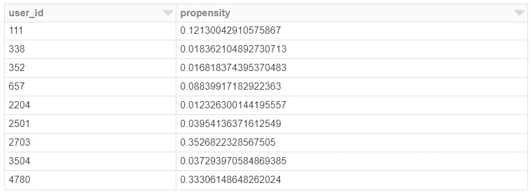*

*FIGURE 6.13: The resulting dataframe for distributed Keras.*

*需要注意的一点是，在 Pandas UDFs 中可以引用的对象类型是有限制的。在这个例子中，我们引用了`model`对象，它是在训练模型时在驱动程序节点上创建的。当 PySpark 中的变量从 driver 节点转移到 workers 节点以进行分布式操作时，会制作一个变量的副本，因为在集群中同步变量是低效的。这意味着对熊猫 UDF 中的变量所做的任何更改都不会应用到原始对象。这也是为什么在使用 UDF 时应该避免使用 Python 列表和字典这样的数据类型。函数以类似的方式工作，在 6.3.4 节中，我们在 Pandas UDF 中使用了`fit`函数，该函数最初是在驱动程序节点上定义的。Spark 还提供了用于在集群中共享变量的广播变量，但是理想的分布式代码段应该尽可能避免通过变量共享状态。*

# *6.6 分布式特征工程*

*要素工程是数据科学工作流中的关键步骤，有时有必要使用 Python 库来实现此功能。例如，Zynga 的 AutoModel 系统使用 Featuretools 库从原始跟踪事件中生成数百个特征，然后用作分类模型的输入。为了扩大我们在 1.7 节中首次探索的自动化特征工程方法，我们可以使用 Pandas UDFs 来分发特征应用过程。与前一节一样，在确定要执行的转换时，我们需要对数据进行采样，但是在应用转换时，我们可以扩展到大规模数据集。*

*在本节中，我们将使用 NHL Kaggle 示例中的游戏比赛数据集，其中包括每场比赛中发生的事件的详细描述。我们的目标是将深而窄的数据帧转换成浅而宽的数据帧，该数据帧将每场比赛总结为具有数百列的单个记录。在 PySpark 中加载这些数据并选择相关列的示例如下面的代码片段所示。在调用`toPandas`之前，我们使用 filter 函数对 0.3%的记录进行采样，然后将结果投射到一个熊猫框架中，该框架的形状为 10717 行 16 列。*

```
*plays_df = **spark.read.csv**("s3://dsp-ch6/csv/game_plays.csv", 
            header=True, inferSchema = True)**.drop**(
            'secondaryType', 'periodType', 'dateTime', 'rink_side')
plays_pd = **plays_df.filter**("rand() < 0.003")**.toPandas**()
plays_pd.shape*
```

# *特征生成*

*我们将使用 1.7 节中介绍的相同的两步过程，首先对数据帧中的分类特征进行一次性编码，然后对数据集应用深度特征合成。下面的代码片段显示了如何使用 Featuretools 库执行编码过程。输出是初始数据帧的转换，现在有 20 个虚拟变量，而不是事件和描述变量。*

```
*import featuretools as ft
from featuretools import Featurees = **ft.EntitySet**(id="plays")
es = **es.entity_from_dataframe**(entity_id="plays",dataframe=plays_pd,
                    index="play_id", variable_types = {
                    "event": ft.variable_types.Categorical,
                    "description": ft.variable_types.Categorical })f1 = **Feature**(es["plays"]["event"])
f2 = **Feature**(es["plays"]["description"])encoded, defs = **ft.encode_features**(plays_pd, [f1, f2], top_n=10)
**encoded.reset_index**(inplace=True)*
```

*下一步是使用`dfs`函数对我们的编码数据帧进行深度特征合成。输入数据帧将有每场比赛的记录，而输出数据帧在使用各种不同的聚合将详细事件折叠成宽列表示后，将有每场比赛的单个记录。*

```
*es = **ft.EntitySet**(id="plays")
es = **es.entity_from_dataframe**(entity_id="plays", 
                                dataframe=encoded, index="play_id")es = **es.normalize_entity**(base_entity_id="plays", 
                            new_entity_id="games", index="game_id")
features, transform=**ft.dfs**(entityset=es, 
                                 target_entity="games",max_depth=2)
**features.reset_index**(inplace=True)*
```

*与之前的方法相比，我们需要执行的一个新步骤是，我们需要确定所生成要素的方案，因为这需要作为熊猫 UDF 注记的输入。为了弄清楚为生成的数据帧生成的模式是什么，我们可以创建一个 Spark 数据帧，然后从 Spark 数据帧中检索模式。在转换 Pandas 数据帧之前，我们需要修改生成的数据帧中的列名，以删除特殊字符，如下面的代码片段所示。特性应用步骤的 Spark 模式如图 [6.14](/6-6-distributed-feature-engineering.html#fig:6-col) 所示。*

```
*features.columns = **features.columns.str.replace**("[(). =]", "")
schema = **sqlContext.createDataFrame**(features).schema
features.columns*
```

*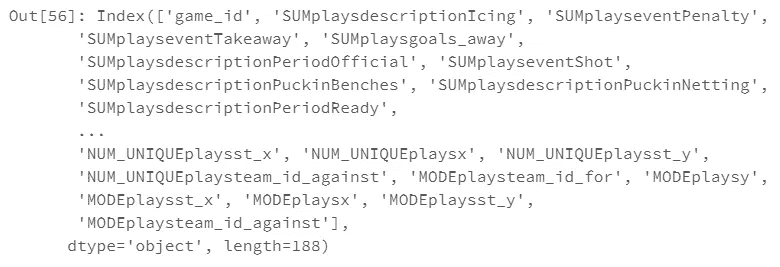*

*FIGURE 6.14: The schema for the generated features.*

*我们现在有了定义熊猫 UDF 所需的模式。与我们过去定义的 UDF 不同，模式可能会根据 Featuretools 选择的特征转换聚合在不同运行之间发生变化。在这些步骤中，我们还创建了一个定义用于编码的特性转换的`defs`对象和一个定义执行深度特性合成的转换的`transform`对象。与上一节中的模型对象一样，这些对象的副本将被传递给在 worker 节点上执行的熊猫 UDF。*

# *特征应用*

*为了使我们的方法能够跨工作节点集群扩展，我们需要定义一个用于分区的列。像前面的部分一样，我们可以将事件分成不同的数据集，以确保 UDF 过程可以伸缩。与以前的一个不同之处是，我们需要将一个特定游戏中的所有游戏分组到同一个分区中。为了达到这个结果，我们可以通过`game_id`而不是`player_id`进行分区。下面的代码片段显示了这种方法的一个例子。此外，我们可以使用游戏 ID 上的散列函数来随机化该值，从而产生更平衡的桶。*

```
**# bucket IDs* 
**plays_df.createOrReplaceTempView**("plays_df")
plays_df = **spark.sql**("""
  select *, abs(hash(game_id))%1000 as partition_id 
  from plays_df 
""")*
```

*现在，我们可以使用下面定义的熊猫 UDF 将特征变换应用于整个数据集。在被传递到生成特征函数之前，播放数据帧由桶进行分区。该函数使用先前生成的特征变换来确保相同的变换应用于所有工作节点。输入的熊猫数据帧是游戏数据的窄而深的表示，而返回的数据帧是游戏概要的浅而宽的表示。*

```
*from pyspark.sql.functions import pandas_udf, PandasUDFType@**pandas_udf**(schema, PandasUDFType.GROUPED_MAP)
def **gen_features**(plays_pd): es = **ft.EntitySet**(id="plays")
    es = **es.entity_from_dataframe**(entity_id="plays",
            dataframe=plays_pd, index="play_id", variable_types = {
                    "event": ft.variable_types.Categorical,
                    "description": ft.variable_types.Categorical })
    encoded_features = **ft.calculate_feature_matrix**(defs, es)    
    **encoded_features.reset_index**(inplace=True)

    es = **ft.EntitySet**(id="plays")
    es = **es.entity_from_dataframe**(entity_id="plays", 
                                dataframe=encoded, index="play_id")
    es = **es.normalize_entity**(base_entity_id="plays",
                            new_entity_id="games", index="game_id")
    generated = **ft.calculate_feature_matrix**(transform,es)**.fillna**(0)

    **generated.reset_index**(inplace=True)
    generated.columns = **generated.columns.str.replace**("[(). =]","")
    return generated 

features_df = **plays_df.groupby**('partition_id')**.apply**(gen_features)
**display**(features_df)*
```

*显示命令的输出如图 [6.15](/6-6-distributed-feature-engineering.html#fig:6-gen) 所示。我们现在已经完成了可扩展模型管道中的特征生成和深度学习。现在我们有了一个转换后的数据集，我们可以将结果与额外的特征结合起来，例如我们希望预测的标签，并开发一个完整的模型管道。*

*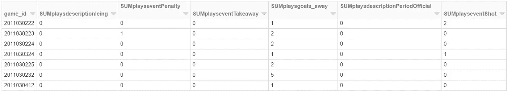*

*FIGURE 6.15: Generated features in the Spark dataframe.*

# *6.7 GCP 模型管道*

*批处理模型管道的常见工作流是从湖中读取输入数据，应用机器学习模型，然后将结果写入应用数据库。在 GCP，BigQuery 充当数据湖，云 Bigtable 可以充当应用数据库。我们将在下一章使用这些组件构建端到端的管道，但是现在我们将直接在 Spark 中使用 GCP 组件的子集。*

*虽然 BigQuery 有一个 Spark 连接器[ [15](https://github.com/spotify/spark-bigquery/) ]，可以直接使用 BigQuery 构建大规模的 PySpark 管道，但是这个库有一些问题，使得为我们的 Databricks 环境进行设置非常复杂。例如，我们需要重新构建一些 JAR 文件并隐藏依赖关系。一种替代方法是使用我们在 5.1 节中探索的 Python BigQuey 连接器，但是这种方法不是分布式的，并且会急切地将查询结果作为 Pandas 数据帧拉至驱动程序节点。在本章中，我们将探索一个工作流，在这个工作流中，我们将查询结果卸载到云存储中，然后从 GCS 中读入数据集，作为管道中的第一步。类似地，对于模型输出，我们将结果保存到 GCS，在 GCS 中，输出可用于推送到 Bigtable。为了将这种类型的工作流程产品化，可以使用气流将这些不同的动作链接在一起。*

# *大查询导出*

*我们要执行的第一步是将 BigQuery 查询的结果导出到 GCS，这可以使用 BigQuery UI 手动执行。这可以直接在 Spark 中执行，但是正如我提到的，使用当前版本的连接器库进行配置是非常复杂的。我们将为这个管道使用`natality`数据集，它列出了关于分娩的属性，比如出生体重。*

```
*create table dsp_demo.natality **as** (
  select *
  from `bigquery-public-data.samples.natality`
  order by **rand**()
  limit 10000 
)*
```

*为了创建数据集，我们将从 BigQuery 中的 natality 公共数据集中抽取 10k 条记录。要将这个结果集导出到 GCS，我们需要在 BigQuery 上创建一个包含要导出的数据的表。创建这个数据样本的 SQL 如上面的代码片段所示。要将此数据导出到 GCS，请执行以下步骤:*

1.  *浏览到 GCP 控制台*
2.  *搜索“大查询”*
3.  *将上面代码片段中的查询粘贴到查询编辑器中*
4.  *单击运行*
5.  *在左侧导航窗格中，选择新表“dsp_demo.natality”*
6.  *单击“导出”，然后单击“导出到 GCS”*
7.  *设置位置，“/dsp_model_store/natality/avro”*
8.  *使用“Avro”作为导出格式*
9.  *点击“导出”*

*执行这些步骤后，抽样出生率数据将以 Avro 格式保存到 GCS。导出数据集的确认对话框如图 [6.16](/6-7-gcp-model-pipeline.html#fig:6-gcs) 所示。现在，我们已经将数据保存到 GCS 中，格式与 Spark 兼容。*

*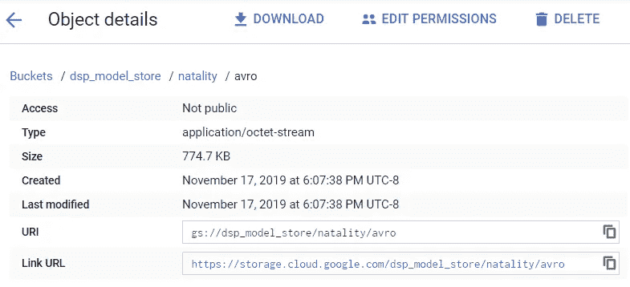*

*FIGURE 6.16: Confirming the Avro export on GCS.*

# *GCP 全权证书*

*我们现在有了一个数据集，可以用作 PySpark 管道的输入，但是我们还不能从我们的 Spark 环境访问 GCS 上的 bucket。借助 AWS，我们能够使用访问密钥和秘密密钥设置对 S3 的编程访问。对于 GCP，这个过程稍微复杂一些，因为我们需要将 json 凭证文件移动到集群的驱动程序节点，以便在 GCS 上读写文件。使用 Spark 的一个挑战是，您可能无法通过 SSH 访问驱动程序节点，这意味着我们需要使用持久存储将文件移动到驱动程序机器上。不建议在生产环境中使用，而是作为概念验证展示。在生产环境中管理凭证的最佳实践是使用 IAM 角色。*

```
*aws s3 cp dsdemo.json s3:**//**dsp-ch6/secrets/dsdemo.json
aws s3 ls  s3:**//**dsp-ch6/secrets/*
```

*要将 json 文件移动到驱动程序节点，我们可以首先将凭证文件复制到 S3，如上面的代码片段所示。现在我们可以切换回 Databricks 并创建模型管道。要将文件复制到驱动节点，我们可以使用`sc` Spark 上下文逐行读取文件。这不同于我们之前的所有操作，在这些操作中，我们将数据集作为数据帧读入。读取文件后，我们使用 Python `open`和`write`函数在驱动节点上创建一个文件。同样，这是在 Spark 中执行的一个不寻常的操作，因为您通常希望写入持久存储，而不是本地存储。执行这些步骤的结果是，凭据文件现在将在集群中的驱动程序节点上本地可用。*

```
*creds_file = '/databricks/creds.json'
creds = **sc.textFile**('s3://dsp-ch6/secrets/dsdemo.json')with **open**(creds_file, 'w') as file:
    **for** line **in** **creds.take**(100):
        **file.write**(line + "\n")*
```

*现在我们已经将 json 凭证文件移动到了驱动程序本地存储，我们可以设置访问 GCS 上的数据所需的 Hadoop 配置。下面的代码片段显示了如何配置项目 ID、文件系统实现和凭证文件位置。运行这些命令后，我们现在可以在 GCS 上读写文件了。*

```
***sc._jsc.hadoopConfiguration**()**.set**("fs.gs.impl", 
           "com.google.cloud.hadoop.fs.gcs.GoogleHadoopFileSystem")
**sc._jsc.hadoopConfiguration**()**.set**("fs.gs.project.id", 
                                                 "your_project_id")
**sc._jsc.hadoopConfiguration**()**.set**(
         "mapred.bq.auth.service.account.json.keyfile", creds_file)
**sc._jsc.hadoopConfiguration**()**.set**(
             "fs.gs.auth.service.account.json.keyfile", creds_file)*
```

# *模型管道*

*为了读入出生数据集，我们可以使用带有 Avro 设置的 read 函数来获取数据集。由于我们使用的是 Avro 格式，dataframe 将被延迟加载，并且直到使用 display 命令对数据集进行采样时才会检索数据，如下面的代码片段所示。*

```
*natality_path = "gs://dsp_model_store/natality/avro"
natality_df = **spark.read.format**("avro")**.load**(natality_path)
**display**(natality_df)*
```

*在使用 MLlib 构建回归模型之前，我们需要对数据集执行一些转换，以选择一个功能子集，转换数据类型，并将记录分成训练组和测试组。我们还将使用如下所示的`fillna`函数，将数据帧中的任何空值替换为零。在这个建模练习中，我们将构建一个回归模型，使用一些不同的特征(包括母亲的婚姻状况和父母的年龄)来预测婴儿的出生体重。准备好的数据帧如图 [6.17](/6-7-gcp-model-pipeline.html#fig:6-nat) 所示。*

```
***natality_df.createOrReplaceTempView**("natality_df")natality_df = **spark.sql**("""
SELECT year, plurality, apgar_5min, 
       mother_age, father_age,    
       gestation_weeks, ever_born
       ,case when mother_married = true 
             then 1 else 0 end as mother_married
       ,weight_pounds as weight
       ,case when rand() < 0.5 then 1 else 0 end as test
from natality_df       
""")**.fillna**(0)trainDF = **natality_df.filter**("test == 0")
testDF = **natality_df.filter**("test == 1")
**display**(natality_df)*
```

*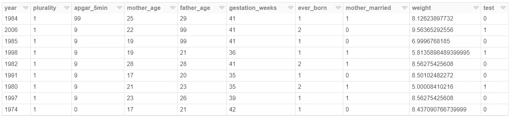*

*FIGURE 6.17: The prepared Natality dataframe.*

*接下来，我们将把数据帧转换成 MLlib 需要输入的向量数据类型。转换出生率数据集的过程如下面的代码片段所示。在执行了`transform`函数之后，我们现在有了可以用作回归模型输入的训练和测试数据集。我们正在构建一个模型来预测的标签是`weight`列。*

```
*from pyspark.ml.feature import VectorAssembler*# create a vector representation*
assembler = **VectorAssembler**(inputCols= trainDF.schema.names[0:8],
                            outputCol="features" )trainVec = **assembler.transform**(trainDF)**.select**('weight','features')
testVec = **assembler.transform**(testDF)**.select**('weight', 'features')*
```

*MLlib 提供了一组用于在模型工作流中执行交叉验证和超参数调整的实用程序。下面的代码片段显示了如何对随机森林回归模型执行此过程。我们没有直接在模型对象上调用`fit`，而是用一个交叉验证器对象来包装模型对象，该验证器对象探索不同的参数设置，比如树的深度和数量。这个工作流程类似于 sklearn 中的网格搜索功能。在搜索整个参数空间并使用基于折叠数的交叉验证之后，在应用于对测试数据集进行预测之前，在完整的训练数据集上重新训练随机森林模型。结果是一个实际体重和预测出生体重的数据框架。*

```
*from pyspark.ml.tuning import ParamGridBuilder 
from pyspark.ml.regression import RandomForestRegressor
from pyspark.ml.tuning import CrossValidator
from pyspark.ml.evaluation import RegressionEvaluatorfolds = 3
rf_trees = [ 50, 100  ]
rf_depth = [ 4, 5 ] rf= **RandomForestRegressor**(featuresCol='features',labelCol='weight')paramGrid = **ParamGridBuilder**()**.addGrid**(rf.numTrees, rf_trees).
                              **ddGrid**(rf.maxDepth, rf_depth)**.build**()
crossval = **CrossValidator**(estimator=rf, estimatorParamMaps =
                         paramGrid,  evaluator=**RegressionEvaluator**(
                              labelCol='weight'), numFolds = folds) 
rfModel = **crossval.fit**(trainVec)

predsDF = **rfModel.transform**(testVec)**.select**("weight", "prediction")* 
```

*在 GCP 模型管道的最后一步，我们将把结果保存到 GCS，以便工作流中的其他应用程序或流程可以利用这些预测。下面的代码片段显示了如何以 Avro 格式将数据帧写入 GCS。为了确保管道的不同运行不会覆盖过去的预测，我们在导出路径上附加了一个时间戳。*

```
*import timeout_path = "gs://dsp_model_store/natality/preds-{time}/".
                             **format**(time = **int**(**time.time**()*1000))
**predsDF.write.mode**('overwrite')**.format**("avro")**.save**(out_path)
**print**(out_path)*
```

*将 GCP 组件与 PySpark 一起使用需要花费一些精力来配置，但是在本例中，我们在不同的云提供商中运行 Spark，而不是在我们读取和写入数据的地方。在生产环境中，您最有可能在与处理数据集相同的云中运行 Spark，这意味着您可以利用 IAM 角色来正确管理对不同服务的访问。*

# *6.8 生产 PySpark*

*一旦您在笔记本环境中测试了批处理模型管道，就有几种不同的方法来安排管道定期运行。例如，您可能希望移动游戏的客户流失预测模型每天早上运行，并将分数发布到应用程序数据库。类似于我们在第 5 章中介绍的工作流工具，PySpark 管道应该对任何可能发生的故障进行监控。调度 PySpark 作业有几种不同的方法:*

*   ***工作流工具:** Airflow、Azkaban 和 Luigi 都支持在工作流中运行 spark 作业。*
*   ***云工具:**AWS 上的 EMR 和 GCP 上的 Dataproc 支持预定的 Spark 作业。*
*   ***供应商工具:** Databricks 支持通过 web 用户界面设置带有监控的作业计划。*
*   ***Spark Submit:** 如果已经配置了集群，可以使用 crontab 等工具发出`spark-submit`命令。*

*供应商和云工具通常更容易启动和运行，因为它们在工作流中提供了配置集群的选项。例如，使用 Databricks，您可以定义要启动的集群类型，以便按计划运行笔记本电脑。使用工作流工具(如 Airflow)时，您需要向工作流添加额外的步骤，以便启动和终止集群。大多数工作流工具都提供了到 EMR 的连接器，用于将集群作为工作流的一部分进行管理。Spark 提交选项在第一次开始调度 Spark 作业时很有用，但是它不支持将集群作为工作流的一部分来管理。*

*Spark 作业可以在短暂或持久的集群上运行。临时集群是一个 Spark 集群，它被提供来执行一组任务，然后被终止，比如运行一个 churn 模型管道。持久集群是长期运行的集群，可能支持交互式笔记本，例如我们在本章开始时设置的 Databricks 集群。持久集群对于开发很有用，但是如果为集群而启动的硬件没有得到充分利用，那么它的成本会很高。一些供应商支持集群的自动伸缩，以降低长期运行的持久集群的成本。临时集群是有用的，因为旋转一个新的集群来执行一个任务能够隔离跨任务的失败，并且这意味着不同的模型管道可以使用不同的库版本。*

*除了为调度作业和作业失败警报设置工具之外，为 Spark 模型管道设置额外的数据和模型质量检查也很有用。例如，我已经设置了执行审计任务的 Spark 作业，比如确保应用程序数据库有当天的预测，如果预测数据过时就触发警报。作为 Spark 管道的一部分，记录度量标准也是一个很好的实践，比如交叉验证模型的 ROC。我们将在第 11 章更详细地讨论这一点。*

# *6.9 结论*

*PySpark 是数据科学家构建可扩展分析和建模管道的强大工具。这是公司非常需要的技能，因为它使数据科学团队能够拥有更多构建和拥有数据产品的过程。为 PySpark 设置环境的方法有很多种，在这一章中，我们探索了一个流行的 Spark 供应商提供的免费笔记本环境。*

*本章主要关注批处理模型管道，其目标是定期为大量用户创建一组预测。我们探索了 AWS 和 GCP 部署的管道，其中数据源和数据输出是数据湖。这些类型的管道的一个问题是，在使用预测时，预测可能已经过时。在第 9 章中，我们将探索 PySpark 的流管道，其中模型预测的延迟被最小化。*

*PySpark 是一种用于创作模型管道的高度表达性语言，因为它支持所有 Python 功能，但需要一些变通方法来让代码在一个 workers 节点集群上执行。在下一章中，我们将探索 Dataflow，它是 Apache Beam 库的一个运行时，也支持大规模分布式 Python 管道，但是在可以执行的操作类型方面受到更多限制。*

# *参考*

*卡劳、霍尔登、安迪·孔温斯基、帕特里克·温德尔和马泰·扎哈里亚。2015.*学习火花:快如闪电的大数据分析*。第一版。奥莱利媒体。*

*13.[https://community.cloud.databricks.com/](https://community.cloud.databricks.com/)↩︎14。[https://www.gamasutra.com/blogs/BenWeber/20190426/340293/](https://www.gamasutra.com/blogs/BenWeber/20190426/340293/)↩︎t11】15。[https://github.com/spotify/spark-bigquery/](https://github.com/spotify/spark-bigquery/)t14】↩︎*

*本·韦伯是 Zynga 的一名杰出的数据科学家。我们正在[招聘](https://www.zynga.com/job-listing-category/data-analytics-user-research/)！*