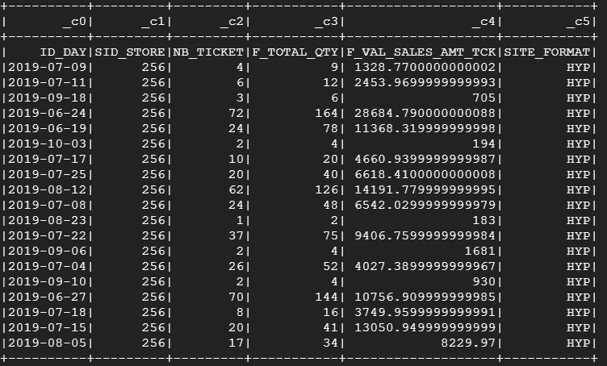
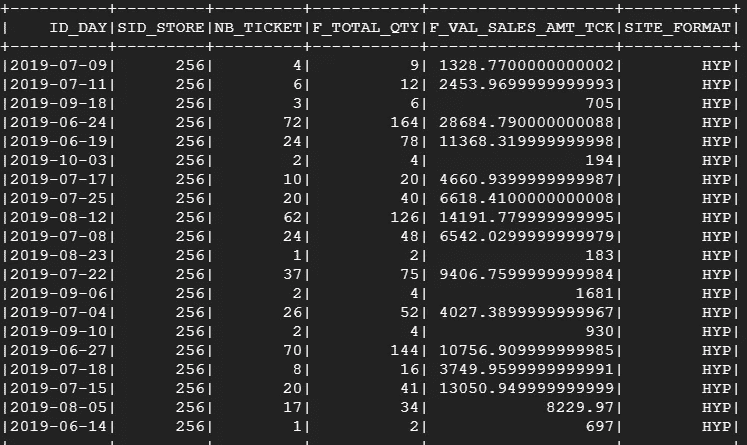
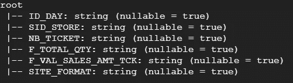
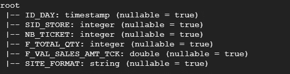

# py spark–导入任何数据

> 原文：<https://towardsdatascience.com/pyspark-import-any-data-f2856cda45fd?source=collection_archive---------8----------------------->

## 使用 Spark 导入数据的简要指南


[https://upload.wikimedia.org/wikipedia/commons/f/f3/Apache_Spark_logo.svg](https://upload.wikimedia.org/wikipedia/commons/f/f3/Apache_Spark_logo.svg)

通过这篇文章，我将开始一系列关于 Pyspark 的简短教程，从数据预处理到建模。第一个将处理任何类型的数据的导入和导出，CSV，文本文件，Avro，Json…等等。我在谷歌云平台上的一台虚拟机上工作，数据来自云存储上的一个桶。让我们导入它们。

## 导入 CSV

Spark 具有读取 csv 的集成功能，非常简单:

```
csv_2_df = spark.read.csv("gs://my_buckets/poland_ks")#print it
csv_2_df.show()
```



数据以正确的列数加载，数据中似乎没有任何问题，但是标题不固定。我们需要设置 header = True 参数。

```
csv_2_df = spark.read.csv("gs://my_buckets/poland_ks", header = "true")
```



还有其他可能的语法。

```
csv_2_df= spark.read.load("gs://my_buckets/poland_ks", format="csv", header="true")
```

以及 sep 这样的参数来指定分隔符或者 inferSchema 来推断数据的类型，我们顺便来看看 Schema。

```
csv_2_df.printSchema()
```



我们的 dataframe 在 string 中有所有类型的数据集，让我们尝试推断模式。

```
csv_2_df = spark.read.csv("gs://my_buckets/poland_ks", header =True, inferSchema=True)csv_2_df.printSchema()
```



我们可以手动指定我们的模式

```
from pyspark.sql.types import *schema = StructType([
    StructField("ID_DAY", DateType()),
    StructField("SID_STORE", IntegerType()),
    StructField("NB_TICKET", IntegerType()),
    StructField("F_TOTAL_QTY", IntegerType()),
    StructField("F_VAL_SALES_AMT_TCK", DoubleType()),
    StructField("SITE_FORMAT", StringType())])csv_2_df = spark.read.csv("gs://alex_precopro/poland_ks", header = 'true', schema=schema)
```

## 导入 JSON

```
json_to_df = spark.read.json("gs://my_bucket/poland_ks_json")
```

## 进口拼花地板

```
parquet_to_df = spark.read.parquet("gs://my_bucket/poland_ks_parquet")
```

## 导入 AVRO

在 Avro 的情况下，我们需要调用外部数据块包来读取它们。

```
df = spark.read.format("com.databricks.spark.avro").load("gs://alex_precopro/poland_ks_avro", header = 'true')
```

## 导入文本文件

同样，spark 也有一个内置功能

```
textFile = spark.read.text('path/file.txt')
```

您也可以将文本文件读取为 rdd

```
# read input text file to RDD
lines = sc.textFile('path/file.txt')
# collect the RDD to a list
list = lines.collect()
```

## 出口任何东西

要导出数据，你必须适应你想要的输出，如果你写在 parquet，avro 或任何分区文件没有问题。如果我们想以 CSV 格式编写，我们必须将分散在不同工作器上的分区分组，以编写我们的 CSV 文件

```
#partitioned file
output.write.parquet(“gs://my_bucket/my_output")#csv partitioned_output.coalesce(1).write.mode("overwrite")\
.format("com.databricks.spark.csv")\
.option("header", "true")\
.option("sep", "|")\
.save('gs://my_bucket/my_output_csv')
```

通过使用 coalesce(1)或 repartition(1 ),数据帧的所有分区被组合到一个块中。

## 最后

我们看到了如何导入我们的文件并编写它。让我们来看我的下一篇文章，学习如何过滤我们的数据框架。**感谢**。【Y】You 可以在这里找到代码*:*[*https://github.com/AlexWarembourg/Medium*](https://github.com/AlexWarembourg/Medium)