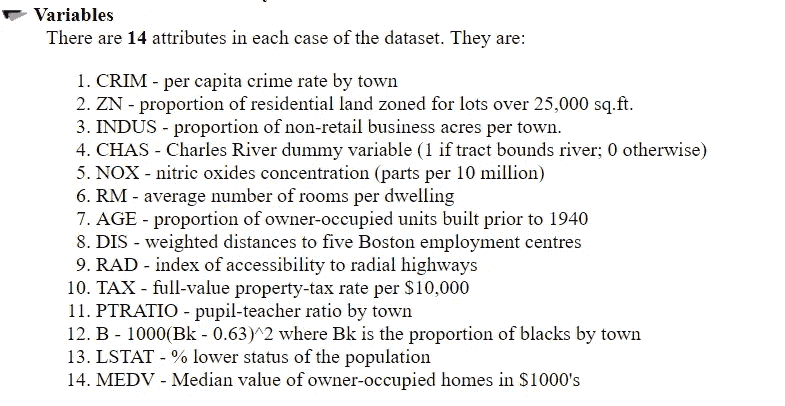
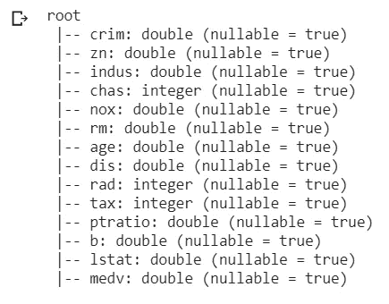
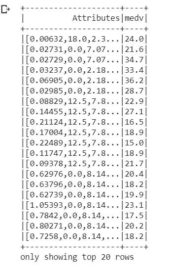
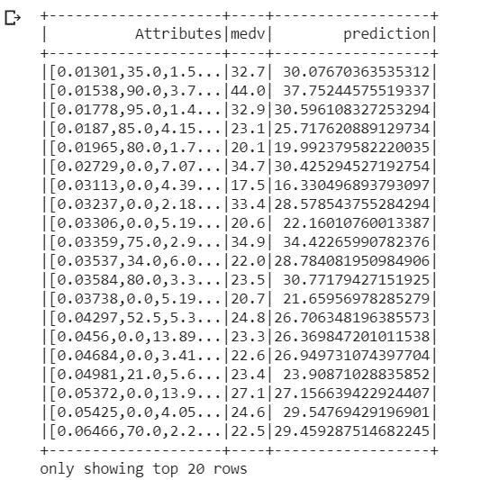
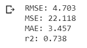

# 谷歌可乐中的 PySpark

> 原文：<https://towardsdatascience.com/pyspark-in-google-colab-6821c2faf41c?source=collection_archive---------2----------------------->

## 在 Colab 中使用 PySpark 创建简单的线性回归模型


Photo by [Ashim D’Silva](https://unsplash.com/photos/Kw_zQBAChws?utm_source=unsplash&utm_medium=referral&utm_content=creditCopyText) on [Unsplash](https://unsplash.com/search/photos/ai?utm_source=unsplash&utm_medium=referral&utm_content=creditCopyText)

随着数据池来源的拓宽，大数据主题在过去几年中受到了越来越多的关注。除了处理各种类型和形状的巨大数据之外，大数据的分析部分的目标周转时间也大大减少了。这种速度和效率不仅有助于大数据的即时分析，也有助于识别新机会。这反过来又导致采取更明智的商业行动，更高效的运营，更高的利润和更满意的客户。

Apache Spark 旨在以更快的速度分析大数据。Apache Spark 提供的一个重要特性是能够在内存中运行计算。对于在磁盘上运行的复杂应用程序，它也被认为比 MapReduce 更高效。

Spark 被设计成高度可访问的，提供了 Python、Java、Scala 和 SQL 的简单 API，以及丰富的内置库。它还与其他大数据工具紧密集成。特别是 Spark 可以在 Hadoop 集群中运行，可以访问任何 Hadoop 数据源，包括 Cassandra。

PySpark 是使用 Python 编程语言访问 Spark 的接口。PySpark 是用 python 开发的 API，用于 Spark 编程和用 Python 风格编写 spark 应用程序，尽管底层执行模型对于所有 API 语言都是相同的。

在本教程中，我们将主要处理 PySpark 机器学习库 Mllib，该库可用于导入线性回归模型或其他机器学习模型。

## 是的，但是为什么是 Google Colab 呢？

Google 的 Colab 基于 Jupyter Notebook，这是一个非常强大的工具，利用了 google docs 的功能。由于它运行在谷歌服务器上，我们不需要在我们的系统中本地安装任何东西，无论是 Spark 还是深度学习模型。Colab 最吸引人的特性是免费的 GPU 和 TPU 支持！由于 GPU 支持运行在谷歌自己的服务器上，事实上，它比一些商用 GPU(如 Nvidia 1050Ti)更快。分配给用户的一条常规系统信息如下所示:

```
Gen RAM Free: 11.6 GB  | Proc size: 666.0 MB
GPU RAM Free: 11439MB | Used: 0MB | Util  0% | Total 11439MB
```

如果你有兴趣了解更多关于 Colab 的信息，Anna Bonner[的这篇](https://towardsdatascience.com/@annebonner)[文章](/getting-started-with-google-colab-f2fff97f594c)指出了使用 Colab 的一些显著好处。

闲聊到此为止。让我们用 Google Colab 中的 PySpark 创建一个简单的线性回归模型。

要打开 Colab Jupyter 笔记本，请点击此[链接](http://colab.research.google.com)。

## 在 Colab 运行 Pyspark

要在 Colab 中运行 spark，首先我们需要在 Colab 环境中安装所有依赖项，如 Apache Spark 2.3.2 with hadoop 2.7、Java 8 和 Findspark，以便在系统中定位 Spark。工具安装可以在 Colab 的 Jupyter 笔记本内进行。

按照以下步骤安装依赖项:

```
!apt-get install openjdk-8-jdk-headless -qq > /dev/null
!wget -q [https://www-us.apache.org/dist/spark/spark-2.4.1/spark-2.4.1-bin-hadoop2.7.tgz](https://www-us.apache.org/dist/spark/spark-2.4.1/spark-2.4.1-bin-hadoop2.7.tgz)
!tar xf spark-2.4.1-bin-hadoop2.7.tgz
!pip install -q findspark
```

既然我们已经在 Colab 中安装了 Spark 和 Java，现在是时候设置环境路径，使我们能够在我们的 Colab 环境中运行 PySpark。通过运行以下代码设置 Java 和 Spark 的位置:

```
import os
os.environ["JAVA_HOME"] = "/usr/lib/jvm/java-8-openjdk-amd64"
os.environ["SPARK_HOME"] = "/content/spark-2.3.2-bin-hadoop2.7"
```

我们可以运行一个本地 spark 会话来测试我们的安装:

```
import findspark
findspark.init()
from pyspark.sql import SparkSession
spark = SparkSession.builder.master("local[*]").getOrCreate()
```

我们的实验室可以运行 PySpark 了。让我们建立一个简单的线性回归模型。

## 线性回归模型

线性回归模型是一种最古老和广泛使用的机器学习方法，它假设因变量和自变量之间存在关系。例如，建模者可能希望根据湿度比来预测降雨。线性回归由穿过图上分散点的最佳拟合线组成，最佳拟合线称为回归线。关于线性回归的详细内容可以在这里找到[。](http://onlinestatbook.com/2/regression/intro.html)

为了从 Colab 中的 Pyspark 开始并保持简单，我们将使用著名的波士顿住房数据集。这个数据集的完整描述可以在这个[链接](https://www.cs.toronto.edu/~delve/data/boston/bostonDetail.html)中找到。



本练习的目标是根据给定的特征预测房价。让我们通过将 MEDV 作为目标变量，将所有其他变量作为输入要素来预测 Boston Housing 数据集的价格。

我们可以从这个[链接](https://github.com/asifahmed90/pyspark-ML-in-Colab/blob/master/BostonHousing.csv)下载数据集，并将它保存在本地驱动器中的某个可访问的地方。可以在同一驱动器上使用以下命令将数据集加载到 Colab 目录中。

```
from google.colab import files
files.upload()
```

我们现在可以检查 Colab 的目录内容

```
!ls
```

我们应该看到一个名为 BostonHousing.csv 的文件被保存。现在我们已经成功上传了数据集，我们可以开始分析了。

对于我们的线性回归模型，我们需要从 PySpark API 导入[向量汇编器](https://spark.apache.org/docs/2.2.0/ml-features.html)和[线性回归](https://spark.apache.org/docs/2.1.1/ml-classification-regression.html)模块。Vector Assembler 是一个转换工具，它将包含 type [double](https://en.wikipedia.org/wiki/Double-precision_floating-point_format) 的多个列中的所有特征组合成一个向量。我们*应该使用* ( **必须使用** ) [StringIndexer](https://spark.rstudio.com/reference/ft_string_indexer/) 如果我们的任何列包含字符串值，就将其转换为数值。幸运的是，BostonHousing 数据集只包含 double 类型，所以我们现在可以跳过 [StringIndexer](https://spark.rstudio.com/reference/ft_string_indexer/) 。

```
from pyspark.ml.feature import VectorAssembler
from pyspark.ml.regression import LinearRegressiondataset = spark.read.csv('BostonHousing.csv',inferSchema=True, header =True)
```

注意，我们在 read.csv()中使用了 InferSchema。InferSchema 自动为每一列推断不同的数据类型。

让我们查看数据集，看看每一列的数据类型:

```
dataset.printSchema()
```

它应该打印如下数据类型:



在下一步中，我们将把不同列中的所有特征转换成一个单独的列，我们可以在 outputCol 中将这个新的向量列称为“属性”。

```
#Input all the features in one vector column
assembler = VectorAssembler(inputCols=['crim', 'zn', 'indus', 'chas', 'nox', 'rm', 'age', 'dis', 'rad', 'tax', 'ptratio', 'b', 'lstat'], outputCol = 'Attributes')output = assembler.transform(dataset)#Input vs Output
finalized_data = output.select("Attributes","medv")finalized_data.show()
```



这里，“属性”是所有列的输入特征，“medv”是目标列。

接下来，我们应该根据我们的数据集拆分训练和测试数据(在本例中为 0.8 和 0.2)。

```
#Split training and testing data
train_data,test_data = finalized_data.randomSplit([0.8,0.2])regressor = LinearRegression(featuresCol = 'Attributes', labelCol = 'medv')#Learn to fit the model from training set
regressor = regressor.fit(train_data)#To predict the prices on testing set
pred = regressor.evaluate(test_data)#Predict the model
pred.predictions.show()
```

预测列中的预测得分作为输出:



我们还可以使用以下命令打印回归模型的系数和截距:

```
#coefficient of the regression model
coeff = regressor.coefficients#X and Y intercept
intr = regressor.interceptprint ("The coefficient of the model is : %a" %coeff)
print ("The Intercept of the model is : %f" %intr)
```

完成基本的线性回归操作后，我们可以进一步从 Pyspark 导入 [RegressionEvaluator](https://jaceklaskowski.gitbooks.io/mastering-apache-spark/spark-mllib/spark-mllib-RegressionEvaluator.html) 模块，对我们的模型进行统计分析。

```
from pyspark.ml.evaluation import RegressionEvaluator
eval = RegressionEvaluator(labelCol="medv", predictionCol="prediction", metricName="rmse")# Root Mean Square Error
rmse = eval.evaluate(pred.predictions)
print("RMSE: %.3f" % rmse)# Mean Square Error
mse = eval.evaluate(pred.predictions, {eval.metricName: "mse"})
print("MSE: %.3f" % mse)# Mean Absolute Error
mae = eval.evaluate(pred.predictions, {eval.metricName: "mae"})
print("MAE: %.3f" % mae)# r2 - coefficient of determination
r2 = eval.evaluate(pred.predictions, {eval.metricName: "r2"})
print("r2: %.3f" %r2)
```



就是这样。你已经在 Google Colab 中使用 Pyspark 创建了你的第一个机器学习模型。

你可以从 github 的[这里](https://github.com/asifahmed90/pyspark-ML-in-Colab/blob/master/PySpark_Regression_Analysis.ipynb)获得完整的代码。

请让我知道，如果你遇到任何其他的新手问题，我也许可以帮助你。如果可以的话，我很乐意帮助你！