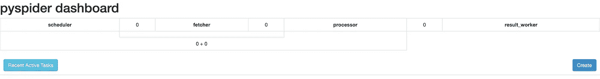
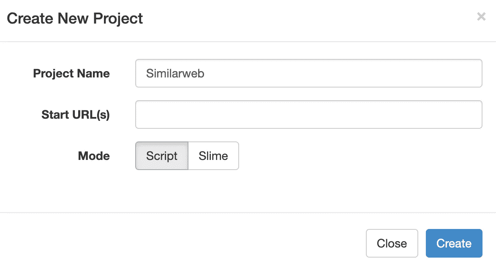
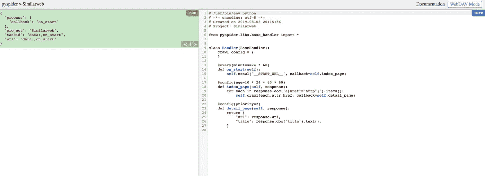
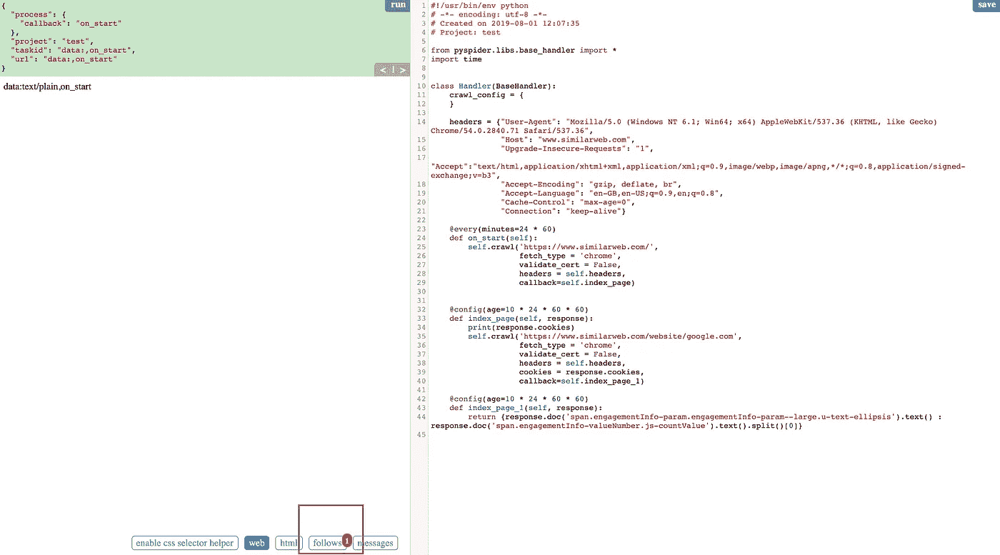
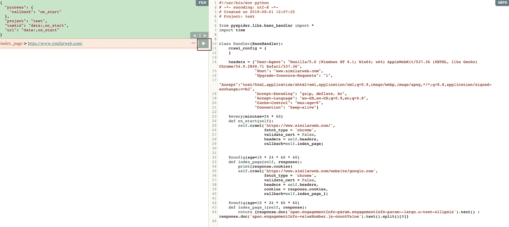
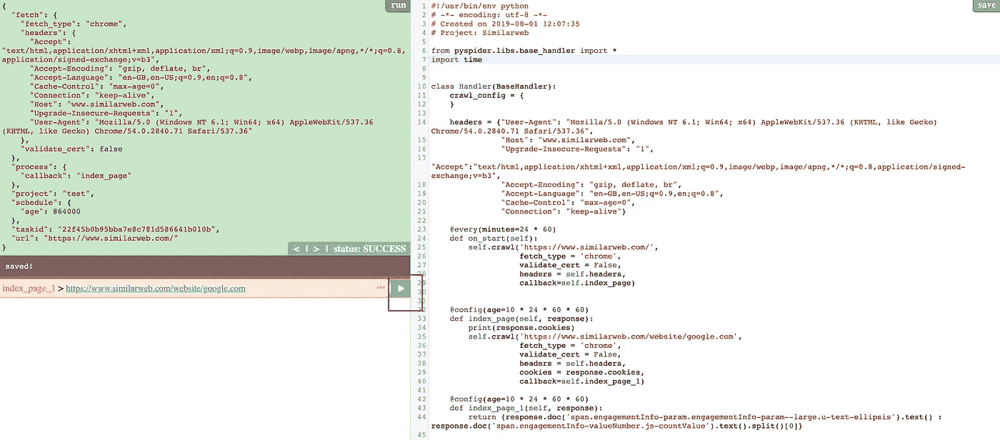
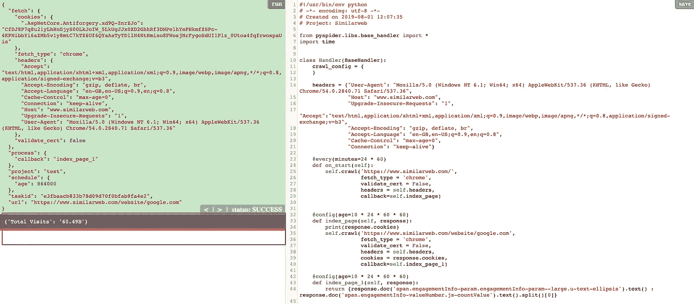
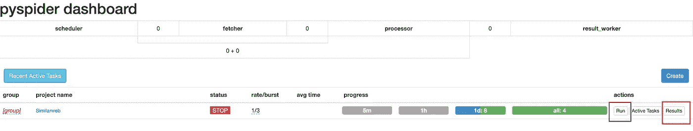
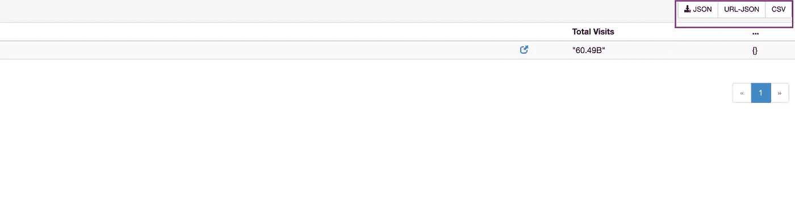

# 为什么 Pyspider 可能是初学者最好的刮擦仪表板之一

> 原文：<https://towardsdatascience.com/pyspider-a-practical-usage-on-competitor-monitoring-metrics-c934d55f9c9a?source=collection_archive---------12----------------------->

## py spider——竞争对手监控指标的实际应用


> 知己知彼，百战不殆——孙子

最近，我为公司构建了多个爬虫，我开始发现很难关注爬虫的性能。因此，我在网上搜索，看看是否存在一个 python 包，它不仅可以更简单地构建一个爬虫，还可以内置一个仪表板来跟踪爬虫的执行。

然后，我发现了这个 python 包——**py spider**，它真的很有用，尤其是在下面这几点:

1.  **更容易调试**——它有一个用户界面让你知道哪个部分出错了。
2.  **内置仪表盘** —用于监控目的。
3.  **兼容 javascript** —不像 Scrapy 需要安装 scrapy-splash 来渲染 Javascript 网站，但是 Pyspider 提供了 [Puppeteer](https://github.com/GoogleChrome/puppeteer) ，这是 Google 用 Javascript 开发的一个非常著名和强大的库，用于网页抓取。
4.  **数据库支持** — MySQL、MongoDB 和 PostgreSQL。
5.  **可扩展性** —分布式架构。

## 监控竞争对手指标

现在，我将向您展示一个关于 [Pyspider](http://docs.pyspider.org/en/latest/) 的用例，并告诉您 Pyspider 的酷功能，但如果您希望我介绍 Pyspider，请在下面留下评论，我将写一篇帖子向您介绍该框架及其关键概念。

我将更多地关注 Pyspider，而不是进入网络抓取部分的每个细节。如果你对学习网页抓取更感兴趣，请访问我的系列文章 [**使用 Python**](https://towardsdatascience.com/tagged/getridboringstuff) 来一步一步的解释。

我们开始吧！

**Similarweb** —一个在线竞争情报工具，为任何网站提供流量和营销见解。我将向你展示如何利用[木偶师](https://github.com/GoogleChrome/puppeteer)的力量来清理这个网站。


Snapshot of the Similar website

## 安装 pyspider

```
pip install pyspider
```

## 启动 pyspider

因为我们将抓取 javascript 渲染的网页，所以我们将使用`pyspider all`而不是`pyspider`。在命令提示符下运行它。

```
pyspider all
```


如果您看到上面的消息，这意味着 pyspider 在您的本地主机端口 5000 上成功启动。

## 浏览 pyspider

打开你的浏览器，浏览到地址 localhost:5000(即在你的地址栏输入 [http://localhost:5000/](http://localhost:8888/) )，你会看到类似下图的东西。



然后我们将点击*创建按钮*(在左下角)来创建我们的刮刀。



然后，将项目名称填写为 Similarweb，并再次点击*创建*按钮。



之后你就可以看到上面的截图了，让我们开始吧。

## 脚本

这是我创建的一个简单的脚本。为了解释这是如何工作的，我将把它分成 3 个部分。

## 脚本—第 1 部分

如上面要点的第 8–15 行所示，初始化请求的标题。

```
[@every](http://twitter.com/every)(minutes=24 * 60) 
def on_start(self):
    self.crawl('[https://www.similarweb.com/'](https://www.similarweb.com/'), 
                fetch_type = 'chrome',
                validate_cert = False,
                headers = self.headers,
                callback=self.index_page)
```

默认情况下，该功能将执行 ***on_start*** *功能。*有五个变量要填入*抓取函数。*您会注意到 ***每*** 装饰*，这意味着该功能*将每 24*60 分钟执行一次，即 1 天。

1.  https://www.similarweb.com/[:你想要抓取的网址，所以在这个例子中，我们将首先抓取主页。](https://www.similarweb.com/')
2.  fetch_type:参数设置为 chrome，表示使用[木偶师](https://github.com/GoogleChrome/puppeteer)渲染 javascript 网站。
3.  validate_cert:参数为 False，因此 Pyspider 将跳过服务器证书的验证。
4.  标题:请求网页时使用我们之前定义的标题。
5.  回调:调用`index_page`函数作为下一个要解析的函数。

## 脚本—第 2 部分

```
[@config](http://twitter.com/config)(age=10 * 24 * 60 * 60)
def index_page(self, response):
    print(response.cookies)
    self.crawl('[https://www.similarweb.com/website/google.com'](https://www.similarweb.com/website/google.com'), 
                fetch_type = 'chrome',
                validate_cert = False,
                headers = self.headers,
                cookies = response.cookies,
                callback=self.index_page_1)
```

在我们的情况下，我们感兴趣的竞争对手是 google.com。这就是为什么网址是[https://www.similarweb.com/website/google.com](https://www.similarweb.com/website/google.com')的原因。

你会注意到还有另一个装饰器叫做 ***config*** ，这个装饰器是用来表示这个函数是否每 **10** 天只运行一次。 ***抓取*** 功能的参数与上一个类似，只有一点不同:

1.  cookie:在请求数据时，我们从上一个会话获取 cookie 作为这个会话的输入。

## 脚本—第 3 部分

```
[@config](http://twitter.com/config)(age=10 * 24 * 60 * 60)
def index_page_1(self, response):
    return {
       response.doc('span.engagementInfo-param.engagementInfo-param--large.u-text-ellipsis').text(): response.doc('span.engagementInfo-valueNumber.js-countValue').text().split()[0]
    }
```

这个函数只是返回**总访问量**作为字典。Pyspider 使用 **Pyquery css** 作为主路径选择器。

## 结果


所以复制要点代码并粘贴到右边的面板，如图所示。然后单击右上角的 save 按钮(在带有紫色边缘的框中高亮显示)保存脚本。之后，单击 run 按钮(在带有蓝色边缘的框中突出显示)运行代码。



单击“跟随”按钮，跟随刮擦过程的流程。



然后点击箭头按钮(紫色边框内高亮显示)继续下一个刮程。



再次单击箭头按钮。



看紫色的方框区域，这是刮削的输出。总共有 604.9 亿人次访问 google.com。

## 仪表盘



这是铲运机的总览仪表板。您可以单击紫色框(运行按钮)来执行 crawler。除此之外，您还可以通过单击红框(结果按钮)将结果保存到 CSV 或 JSON 文件中。



看右上角的紫色框，你会发现我之前说过的要下载的文件选项。点击按钮，你会得到你需要的格式(即 JSON/CSV)的结果。


# 最终想法

Pyspider 是一个非常有用的工具，它可以刮得非常快，但是如果你正在处理实现反爬行机制的网站，我会建议你使用 [**Scrapy**](https://scrapy.org/) 来代替。

谢谢你读到帖子的最后部分，真的很感激。

我将每周发布内容，所以请随时在下面留下您可能感兴趣的话题的评论，我将努力为您创建内容。

# 关于作者

[Low 魏宏](https://www.linkedin.com/in/lowweihong/?source=post_page---------------------------)是 Shopee 的数据科学家。他的经验更多地涉及抓取网站，创建数据管道，以及实施机器学习模型来解决业务问题。

他提供爬行服务，能够为你提供你所需要的准确和干净的数据。你可以访问 [**这个网站**](https://www.thedataknight.com/) 查看他的作品集，也可以联系他获取**抓取服务**。

你可以在 [LinkedIn](https://www.linkedin.com/in/lowweihong/?source=post_page---------------------------) 和 [Medium](https://medium.com/@lowweihong?source=post_page---------------------------) 上和他联系。

[](https://medium.com/@lowweihong?source=post_page---------------------------) [## ●伟鸿-中等

### 在媒体上阅读低纬鸿的作品。Shopee 的数据科学家。每天，低伟鸿和其他成千上万的…

medium.com](https://medium.com/@lowweihong?source=post_page---------------------------)