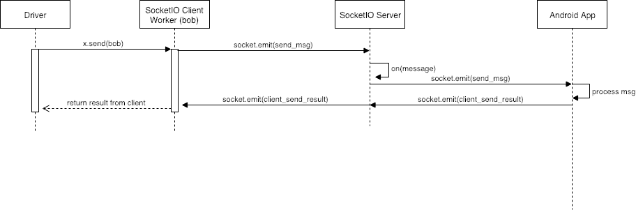
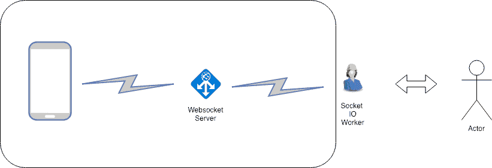
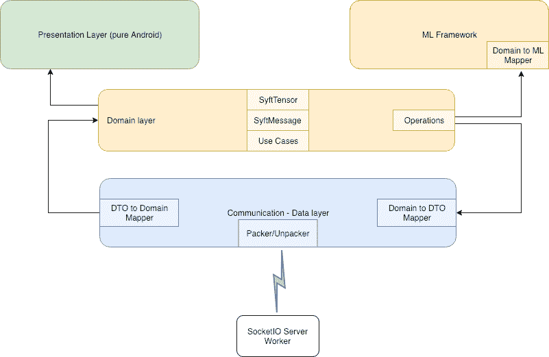

# 安卓版 PySyft

> 原文：<https://towardsdatascience.com/pysyft-android-b28da47a767e?source=collection_archive---------23----------------------->

## 扩展 OpenMined 为移动设备带来隐私

# 什么是 PySyft

“PySyft 是一个用于安全、私人深度学习的 Python 库。PySyft 使用 PyTorch 中的[多方计算(MPC)](https://en.wikipedia.org/wiki/Secure_multi-party_computation) 将私有数据从模型训练中分离出来

PySyft 是[露天](http://www.openmined.org)家族中的主要部分。

# 什么是 Android 版的 PySyft

PySyft for Android 是让不同平台在 PySyft 环境下协同工作的第一步

PySyft 依靠工人来完成这项工作。目前，这些工作器是用 Python 实现的，并与 PyTorch 上的 PySyft 包装器挂钩

PySyft for Android 扩展了这个系统，允许边缘的移动设备使用不同的框架进行操作。在这个概念验证的例子中，Android 应用程序使用 **Nd4J** 和 **DL4J** 来计算来自 PySyft (PyTorch)工作器的操作

# 应用程序

在联合学习设置中，Android 应用程序位于边缘，保存其数据以进行本地训练

对于 MPC，我们可以让参与者使用不同的操作系统和平台来进行操作

# 高层架构

该设置有三个主要组件:

*   一个 PySyft worker 实现 *WebsocketIOClientWorker* 作为门面
*   一个在两个参与者之间转发请求和响应的*WebsocketIOServerWorker*
*   执行从外观发送的操作的 Android 应用程序

下图显示了在此设置中如何处理驱动程序或执行元发送的命令

这些对象构成了一个组件，通过 *SocketIOClientWorker* 提供与 PySyft 中任何其他工作器相同的 API。从参与者的角度来看，整个组件只是另一个工人

# 应用程序的架构

应用程序的架构可以在下图中看到。这是一个基于关注点分离的架构，由遵循干净架构的层来定义。这将允许我们在其他 Java/Kotlin 平台中重用大量工作

# 通信详细信息

通信是使用 SocketIO 完成的，但是服务器端的工作人员和 Android 应用程序都可以使用其他套接字库

主要的限制是由 PySyft 工作线程的同步特性造成的

*   *_recv_msg* 是同步的，一旦操作被发送到 Android，它不能等待后者的回复，因为它正在通过服务器。这就是信号量在 SocketIO 类中所做的事情

# 使用中性张量表示

考虑到 Android 不能使用 PyTorch 对象，必须选择一个中性的表示来使数据在双方都可用。幸运的是 PyTorch 和 DL4J 都提供了使用 *npy* 格式的可能性。虽然这种转换会影响性能，但它向我们保证了双向传输的数据不会被破坏

与 TFLite 团队关于实现 *npy* 的对话也令人鼓舞，应该不会太难。这项工作也可以用于其他平台(例如，基于 KMath 的平台)

# 验证性测试（Proof of Concept 的缩写）

这个 PoC 实现了以下 PySyft 操作:发送、删除、获取和添加

使用了以下库:

*   **DL4J:** 这是将处理操作的机器学习框架，尽管对于这个 PoC 来说只有 **Nd4J** 是必要的。该系统对其他框架是开放的
*   **msgpack:** PySyft 使用它在工人之间移动数据和操作。这也必须在 Android 上实现，尽管如果必要的话可以使用不同的格式
*   **SocketIO** :使用这个库有很强的依赖性，因为它也被代理/服务器使用。

# 怎么跑？

您必须安装 PySyft。遵循存储库中的说明

 [## 露天开采/PySyft

### 一个加密的、保护隐私的深度学习库

github.com](https://github.com/OpenMined/PySyft) 

从以下存储库中获取应用程序的代码

 [## 露天采矿/机器人工人

### 通过在 GitHub 上创建一个帐户，为 OpenMined/AndroidWorker 开发做出贡献。

github.com](https://github.com/OpenMined/AndroidWorker) 

运行此安装程序需要以下步骤:

1.  启动 Android 应用程序
2.  启动服务器(*socket io _ server _ demo . py*展示了如何以一种简单的方式完成这项工作)
3.  启动 socketio 客户端
4.  驱动程序可以在笔记本上运行。“插座鲍勃”可以作为一个例子
5.  连接 socketio 客户端(Bob)
6.  连接 Android 应用程序
7.  开始用吧！

# 即将推出

*   Kotlin 多平台模块，允许为 JVM 实现的核心在其他环境中使用
*   Tensorflow Lite 实施
*   KMath 实现
*   非阻塞套接字通信
*   压缩
*   有模型的计划

# 参考

*   [https://www.openmined.org/](https://www.openmined.org/)
*   [https://github.com/OpenMined/PySyft](https://github.com/OpenMined/PySyft)
*   [https://github.com/OpenMined/AndroidWorker](https://github.com/OpenMined/AndroidWorker)
*   [https://docs . scipy . org/doc/numpy-1 . 14 . 0/neps/npy-format . html](https://docs.scipy.org/doc/numpy-1.14.0/neps/npy-format.html)
*   [https://github.com/msgpack](https://github.com/msgpack)