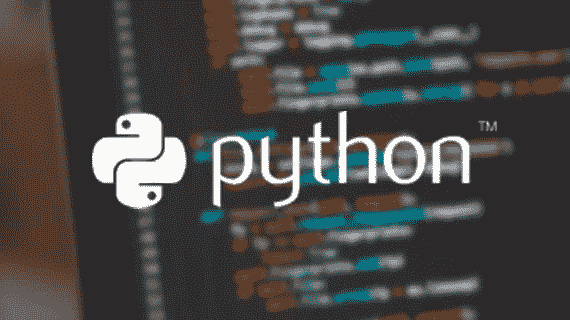
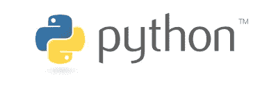
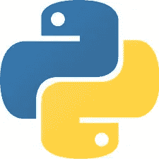

# Python:初学者指南

> 原文：<https://towardsdatascience.com/python-a-beginners-guide-a6cac1c9f9bc?source=collection_archive---------33----------------------->

## 对编码语言 Python 的介绍



[Source](https://www.bitdegree.org/course/introduction-to-python).

Python 是当今最流行的编程语言之一。它最初由吉多·范·罗苏姆创作，并于 1991 年首次发行。Python 可以用于许多不同的目的，包括创建 web 应用程序、读取和修改文件、连接到数据库系统，以及处理大数据和一般的数据科学。就像许多编程语言一样，Python 也是一个奇特的计算器；它可以轻松地进行数学运算。

```
>>> 12 + 15 # Addition
27>>> 35 – 17 # Subtraction
18>>> 5 * 5 # Multiplication
25>>> 25 / 5 # Division
5.0>>> 5 ** 2 # Exponentiation (does NOT use ^ like some calculators)
25>>> 10 % 3 # Modular division (or “mod” for short — returns a remainder)
1>>> 10 // 3 # Floor division (or “round down” division)
3
```

让我们看看 Python 中的一些基本功能，希望在这篇博客结束时，你能更好地理解 Python 是什么，它能做什么，以及它对各地的数据科学家和程序员有多有用。

## 变量

在我们继续之前，让我们理解并定义什么是**变量**。一个**变量**允许我们保存数据，这样我们就可以回调或引用它，而不必重写整个数据。下面是我们保存到`s1`、`s2`和`s3`的三个不同的变量(稍后我们将在博客中讨论为什么这是不好的命名实践，但请耐心等待)。

```
s1 = 123
s2 = 678.0
s3 = “This is my first string”
s4 = ‘and this is my second string’
```

如上所述，像我这样命名变量是不好的命名实践，所以让我来帮你理解为什么。在 Python 中，有一些必须遵循的“规则”，以及一些只是好的 Python 实践的“规则”(关于 Python 代码风格指南的更多信息，请参见[这里的](https://www.python.org/dev/peps/pep-0008/))。

“强制规则”是:变量名只能由字母、数字、下划线组成(不能有特殊字符)；变量名不能以数字开头；最后，你不能用一个内置的 Python 关键字来命名一个变量(例如`if`或`else`)。

一些“好的 python 式实践”规则是:变量名应该**总是**是描述性的(我在上面打破的一个规则；不要说出`x`或`df`)；没有大写字母(这些是留给上课用的)；变量不应该以下划线开头(这意味着一些特殊的东西，我们不会在这篇博文中涉及)；多词变量应该用`snake_case`(全部小写用下划线分隔)而不是`camelCase`(以大写开头的新词)；最后，虽然您可以在内置 Python 函数后命名变量(如`print`)，但这样做是一个非常糟糕的主意。

除了执行上面的基本数学方程，我们还可以使用保存的变量来执行它们。比如加`s1+ s2`会得到 801.0。我们**不能**将`s3`加到`s1`或`s2`上，因为它们不是两个数字。试图这样做将导致 Python 抛出一个错误，并简要解释为什么这是不可能的。也就是说，你**可以**把`s3`加到`s4`上，因为它们都是我们所说的**字符串**！



Python Logo. [Source](https://www.python.org/community/logos/).

## Python 数据类型

现在我们对变量有了更好的理解，让我们看看 Python 中的基本数据类型。在我们看这些之前，我们需要理解“数据”实际上意味着什么。大多数人认为数据是信息的电子表格——这并不太离谱。数据其实只是**的信息**。Python 中运行和存储的一切都被认为是数据。

当再次学习变量时，让我们参考上面使用的例子(并提醒自己下面是什么)。在这些例子中，我们看到了 Python 中最常见的三种**数据类型**。

```
s1 = 123
s2 = 678.0
s3 = “This is my first string”
s4 = ‘and this is my second string’
```

在上面的第一个变量`s1`中，我们看到了所谓的**整数**——在 Python 中通常被称为`int`类型。一个`int`是一个没有小数部分的数字——比如我们在上面的数学例子中使用的所有数字。

在第二个变量`s2`中，我们看到了所谓的**float**——在 Python 中称为`float`类型。`float`是一个有小数部分的数字——即使这个小数部分是一个 0，就像我们上面的例子一样。

最后，我们的第三和第四个变量`s3`和`s4`被称为**字符串**——在 Python 中被称为`str`类型。一个**字符串**是我们在 Python 中存储文本数据的方式。*字符串*就是一组单引号(')或双引号(" ")之间的*字符串*。Python 最终不在乎我们用什么来创建字符串，只要我们在创建字符串时保持一致。

## 容器/集合类型

在许多情况下，我们希望将许多值存储到一个变量中，称为容器或集合。这些容器可以容纳任意数量的其他对象。Python 中有许多常见的容器，所以让我们开始吧。

第一个，也可能是最常见的，叫做**列表**。列表是有序的、可变的、异构的对象集合。澄清一下:有序意味着对象的集合遵循特定的顺序，可变意味着列表可以变化——或者改变，异构意味着您可以在一个列表中混合和匹配任何类型的对象或数据类型(`int`、`float`或`string`)。列表包含在一组方括号`[]`中。实例化一个新列表可以通过几种不同的方式来完成，如下所示。

```
>>> new_list = [] # instantiates an empty list
[]>>> new_list = list() # also instantiates an empty list
[]>>> new_list = ['obj1', 'obj2', 'obj3'] # instantiates a list of strings
['obj1', 'obj2', 'obj3']
```

比列表更不常见的是所谓的**元组**。元组是相似的，因为它们是有序的和异构的，然而它们是不同的，因为它们是不可变的——这意味着一旦创建它们就不能变异或改变。元组包含在一组括号内`()`。元组比列表稍微快一点，也小一点，所以尽管它们的存在部分是因为它们更有用的时候遗留下来的，但它们仍然有它们的用途。实例化一个新的元组也可以用几种不同的方式来完成。

```
>>> new_tuple = () # instantiates an empty tuple
()>>> new_tuple = tuple() # also instantiates an empty tuple
()>>> new_tuple = ('obj1', 'obj2', 'obj3') # instantiates a tuple of strings
('obj1', 'obj2', 'obj3')>>> new_tuple = ('obj1',) # tuples containing a single object need a trailing comma so Python knows it is a tuple rather than a grouping operation
('obj1',)
```

我们还有一套**的**。集合是无序的、可变的、唯一的对象集合(类似于数学中的传统集合)。可以通过调用`set()`函数来创建集合，这将创建一个空集，通过一组花括号`{}`传递我们的信息，或者通过传递 iterable 的单个参数，在这种情况下，Python 将返回一个新的集合，其中包含 iterable 中每个唯一元素的单个元素。

```
>>> new_set = set() # instantiates an empty set 
set()>>> new_set = {'A', 'A', 'B', 'C', 'C', 'D'}
{'A', 'B', 'C', 'D'}>>> new_set = set(['A', 'A', 'B', 'C', 'C', 'D'])
{'A', 'B', 'C', 'D'}
```

最后，我们要讨论的最后一个容器是一个**字典**。字典是您在 Pythonic 之旅中遇到的最常见的容器类型之一。字典是无序的、可变的键值对。可以认为它们很像一个实际的字典，其中的键是“单词”，值是特定单词的“定义”。字典与其他容器类型非常相似，可以用多种不同的方式进行实例化。

```
>>> new_dict = {} # instantiates an empty dictionary
{}>>> new_dict = dict() # also instantiates an empty dictionary
{}>>> new_dict = {'a': 1, 'b': 2, 'c': 3}
{'a': 1, 'b': 2, 'c': 3}>>> new_dict = dict(a = 1, b = 2, c = 3)
{'a': 1, 'b': 2, 'c': 3}
```

如果你不确定你刚刚创建了什么类型的对象，你可以通过调用变量上的`type()`函数来检查它，Python 会让你知道你已经创建了什么。

```
>>> type(new_list)
list>>> type(new_tuple)
tuple>>> type(new_set)
set>>> type(new_dict)
dictAnd thinking back to our variables we created earlier...>>> type(s1)
int>>> type(s2)
float>>> type(s3)
str>>> type(s4)
str
```



Another Python logo. [Source](https://commons.wikimedia.org/wiki/File:Python-logo-notext.svg).

至此，我们已经了解了 Python 的一个(非常)简单的定义，什么是变量以及如何实例化变量，Python 中的一些基本数据类型和一些基本容器/集合类型。虽然这并不意味着是一个包罗万象的速成课程，但希望它教会了您足够多的知识，让您能够进入 Python 的世界，学习更多知识，并将其应用到您的世界中。我个人将 Python 用于数据科学，但是正如我上面提到的:Python 的用途几乎是无止境的。如果你有兴趣学习更多关于 Python 如何与数据科学世界相关的知识，可以看看我在 Python 内的 pandas library 上的博客[,看看这能有什么帮助。希望你喜欢这本书，下次再见！](https://medium.com/@brunosantos90/an-introduction-to-pandas-in-python-b06d2dd51aba)