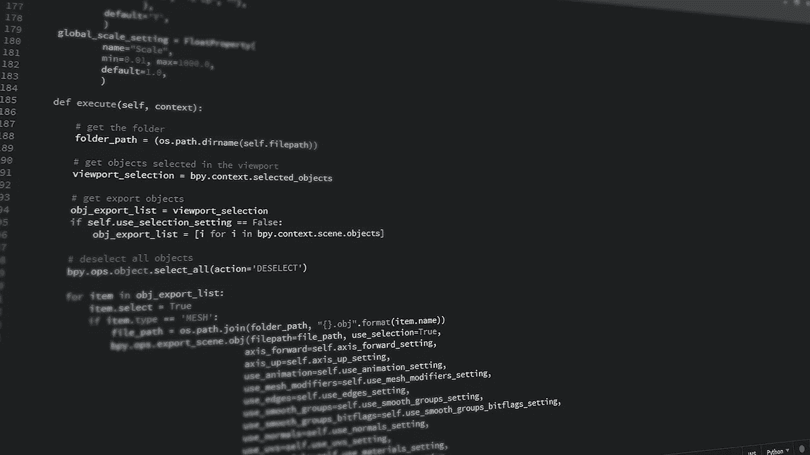

# python——开发面向未来应用的完美语言

> 原文：<https://towardsdatascience.com/python-a-perfect-language-for-developing-future-proof-application-a24a262b68ef?source=collection_archive---------27----------------------->

Image by [Gerd Altmann](https://pixabay.com/users/geralt-9301/?utm_source=link-attribution&utm_medium=referral&utm_campaign=image&utm_content=1513945) from [Pixabay](https://pixabay.com/?utm_source=link-attribution&utm_medium=referral&utm_campaign=image&utm_content=1513945)

**来说说未来证明吧！**

如今，技术正日益提高到一个先进的水平。因此，对于用户以及开发者/制造者来说，处理长时间的创建应用程序以保持最新版本的更新变得相当麻烦。

完整的设计范例正在以一种你的应用基于问题的方式来构建计划世界观。包含、排除或更新它们以与时俱进可能是一种简单的、测试性的或几乎难以置信的体验。你有机会选择。

总而言之，构建应用程序的理想方法是什么？这些应用程序很难随着创新的进步而更新，但另一方面，它们可以满足未来可预测的需求。

Python 编程语言统治着其他编程方言，例如 C、C++或 Java。Python 是一种面向对象的高级多世界观编程语言，具有动态亮点。

Photo by [Hitesh Choudhary](https://unsplash.com/@hiteshchoudhary?utm_source=unsplash&utm_medium=referral&utm_content=creditCopyText) on [Unsplash](https://unsplash.com/s/photos/python-programming?utm_source=unsplash&utm_medium=referral&utm_content=creditCopyText)

*   它是由 Guido Van Rossum 设计的，他是一名荷兰软件工程师。它是全世界最受支持的编程方言之一。
*   Python 的恶名比近年来任何时候都要多。Python 给出了巨大的亮点，吸引了每个软件工程师的注意。

Python 非常容易阅读和编写；随后，它减少了软件工程师之间的混乱。令人震惊的是，作为最重要的技术组织之一，谷歌将 Python 用于其各种应用程序，并且有一个完全专用的 Python 入口。

**为什么 Python 是面向未来的应用？**

通常，当我们谈论使用 Python 作为面向未来的应用程序时，它被分为不同的模式。

image source: [fingent](https://www.fingent.com/)

**使用设计模式**

*   设计模式用于构建复杂的项目(通常是一个组合)。
*   它将一篇不可预测的文章的发展与其描述隔离开来。
*   这是最常用的创造性配置设计之一。
*   它敦促工程师们制定明确的区域语言。
*   此外，它能让设计师更快地学习商务用语。

在[设计模式](https://camrojud.com/5-ux-ui-design-trends-that-we-will-see-now/)的帮助下，开发人员让你的代码更容易测试、维护和获取。

我们可以利用制造商的例子来保证代码串的安全。为了说明，万一我们通过保证所有属性都被公正地使用并且必须通过构造函数来设置，从而使绑定类永久化，那么我们可以利用生成器配置示例来保证绑定条目的条件不能被改变。

*   然后，我们将能够在应用程序中共享 bond 问题，而不会因为 bond 对象而面临任何竞争条件。
*   它给你一个体面的利用熟悉的 API，可以让你更好地理解该领域。

**使用模板设计模式**

image source: [refactoring](https://refactoring.guru/)

模板设计模式是编程应用中最常用的例子之一。

我们可以考虑的最佳例子如下:

*   一个典型的行为规划改进设计。
*   它保证您的程序遵循推荐的行为。
*   如果我们需要实现包含各种进展/指南的计算，那么我们可以利用格式编程配置设计。

计算是指导方针或步骤，应在明确要求下执行，以实现想要的结果。

我们可以利用模板软件设计模式来执行计算。

格式配置示例用于支持清晰的计划和代码重用。它保证了方法被适当地组织执行。外来客人回避的手段。

布局示例保证代码是完美的追求坚实的标准，因为每个类有一个单独的职责，可以有效地尝试。

**使用策略设计模式**

战略设计模式是获得它的最简单的结构例子之一。它是最流行的社交编程配置设计之一。

客户代码可以在不改变大部分代码的情况下交易程序。使代码易于测试、理解并遵循可靠的标准。

**使用装饰设计模式**

装饰器设计模式用于在运行时或静态地激活或扩展项目的义务，而不改变其结构。

*   装饰设计模式示例是开闭原则的一个重要工具。
*   装饰设计模式可以用来增加文章的有用性，而不改变文章本身或不同的条目。
*   您可以利用 decorator design 来扩展一个项目，而不需要创建无数的子类。

装饰设计模式是一个选项，与实现遗留的树结构相反。

*   装饰设计模式使我们在每次需要在框架中加入新的有用性时，不必创建大量的类。
*   我们可以看到，使用装饰设计，我们在不制作新的产品或改变现有产品的情况下，为一个产品添加了额外的行为。
*   我们制造了一个混合系统，但没有制造任何新的类。

装饰设计模式是一个选项，与实现遗留的树结构相反。此外，装饰设计模式可以防止代码随着新需求的增加而呈指数级增长。

Image by [Johnson Martin](https://pixabay.com/users/JohnsonMartin-724525/?utm_source=link-attribution&utm_medium=referral&utm_campaign=image&utm_content=1084923) from [Pixabay](https://pixabay.com/?utm_source=link-attribution&utm_medium=referral&utm_campaign=image&utm_content=1084923)

**总结**

从上面的讨论中，我们已经看到了 Python 作为未来验证应用的完整场景。除此之外，我们还讨论了一个完整的流程，展示了软件工程师生活中的一个关键思想——利用适当的结构设计。具体来说，Python 编程语言被认为是负责构建经得起未来考验的应用程序的语言，因为它简单明了而且流行。

**作者简介**

Nathan McKinley 是位于美国芝加哥的 Cerdonis Technologies LLC - [移动应用开发公司的业务开发经理](https://www.cerdonis.tech/mobile-app-development-company-in-usa/)，他正在利用最新的技术更新和事实来开发经得起未来考验的移动应用，以便在市场上表现出色。作为一名移动技术领域的业务开发人员，我已经掌握了撰写有价值的技术见解的技能，以及在移动应用程序开发过程中利用这些见解的好处。