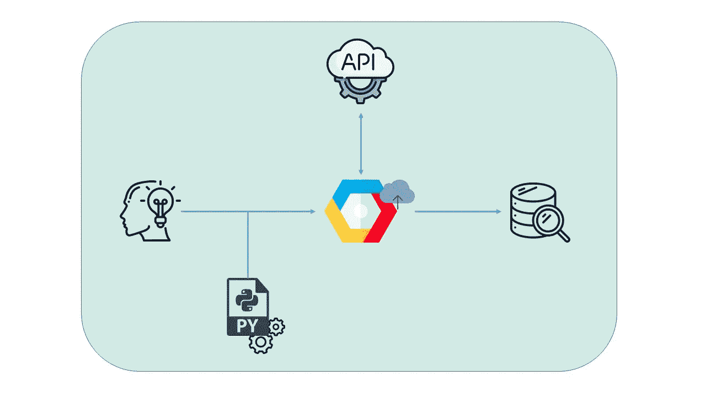
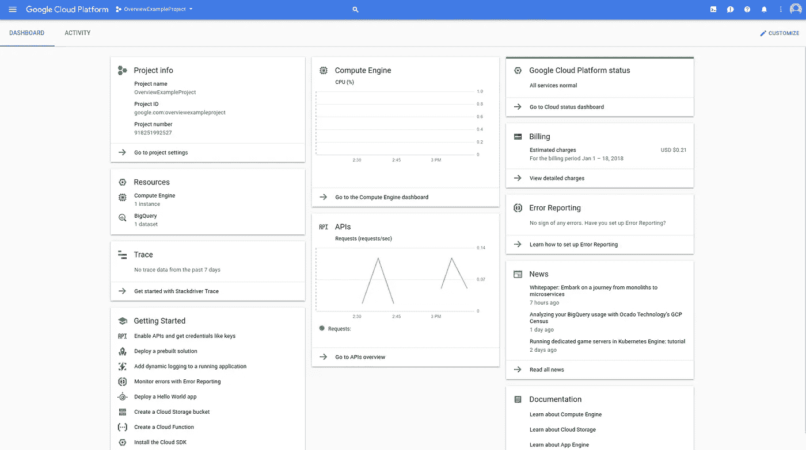
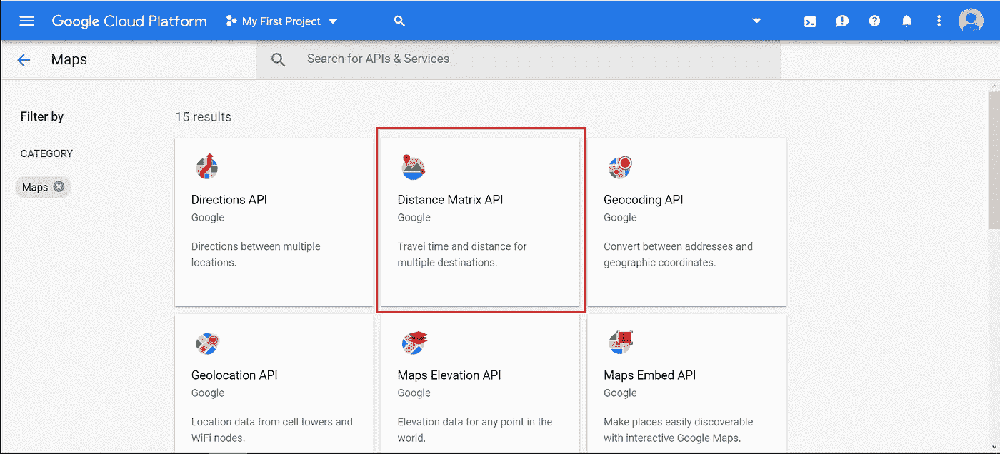
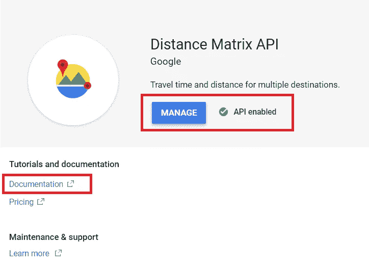

# Python 和 Google APIs

> 原文：<https://towardsdatascience.com/python-and-google-apis-bd9b5a861edd?source=collection_archive---------16----------------------->

## 或者如何让网上的数据变得有用。



Simple structure

在这个简单的指南中，你将学会使用[谷歌云平台](https://cloud.google.com)及其 API 从网络上收集一些数据。要使用 python，你可以在[这个网页](https://repl.it/languages/python3)上运行本文的代码，在线免费，不需要安装任何东西。无论如何，如果你想更深入，成为 python 专家，我们推荐你安装 [Anaconda](https://www.anaconda.com/distribution/) 。

但首先，一些基本的概念，所以我们都在同一点上。你需要知道什么是 API，什么是 JSON。

让我们从更简单的开始:JSON 就是一种在文本中组织信息的方式，这样许多编程语言，特别是 JavaScript 和其他许多语言，都可以阅读和理解这些信息。典型的 JSON 使用 **" *key": "value"*** 格式。下面是一个 JSON 对象的例子:

```
{
'image': 'King.jpg',
'firstname': 'John',
'lastname': 'Snow',
'company': 'Dragons Inc.'
}
...
```

现在我们知道了，什么是 API？嗯，API 代表应用编程接口。我理解这些词的意思的方式是，当一些(软件)开发者制作了一个非常酷的程序/应用程序时，他们有时会认为其他开发者可能也想使用它，或者至少是它的一些部分，所以他们创建了 API——程序的一部分，你可以与之交互。简言之，API 或多或少等同于程序，但是你可以在脚本中使用它。有许多免费使用的 API，但也有许多其他的不是。

现在要开始使用谷歌 API，你必须去[谷歌云平台](https://cloud.google.com)并创建一个免费账户。这些步骤非常简单，所以我将跳过它们，但是在您完成这些步骤后，当您点击您的 Google 控制台时，您应该会看到类似以下内容:



现在，如果您点击左侧的**三栏**图标、**API 和服务**以及**库**，您将会看到 Google 提供的所有 API。为简单起见，我们将重点关注与谷歌地图相关的内容，但我们鼓励您探索和尝试任何其他引起您注意的内容。



一旦我们点击**地图**部分右侧的**查看全部**，我们就可以看到与[谷歌地图](https://www.google.com/maps)相关的所有 API，所以让我们使用**距离矩阵 API。**



确保您启用了 API。如果没有，只需点击启用，你就可以走了。之后，点击**文档**，因为这里有你学习这个 API 如何工作所需要的所有信息。

一旦进入**文档**，点击左侧打开**开发者指南**。请注意，这些步骤对于所有的 API 都是相同的。

现在我们需要两样东西:我们必须构建的 **API 键**和 **url** 。你会在左边的**三栏**图标上找到你的 **API 密匙**、API&服务、**凭证**。现在让我们开始构建 **url** ，这有点复杂。所有的 API 的工作方式大致相同，你构建一个 **url** 并用你的 **API 键**发送它来请求一些信息，然后你捕获这些信息。需要构建 url 的方式在 API 的开发人员文档中指定。在我们的例子中，我们的 url 将如下所示:

```
https://maps.googleapis.com/maps/api/distancematrix/**outputFormat**?**parameters**
```

其中 *outputFormat* 需要更改为其中一个选项，要么是 *json* (推荐的)，要么是 *xml* ，API 接受的参数在下面指定，在我们的例子中是我们想要获得距离的*起点*和*目的地*点，表示为`latitude,longitude`，最后是指向 Maps API 实例的*键*参数。通常你必须构建一个 **url** 的字符串，用一个 *&* 将*参数*分开，但幸运的是 *python* 用一个`requests`包覆盖了我们的背部，这个包会自动将参数添加到 url 中。所以如果你去 to [Repl](https://repl.it/languages/python3) 粘贴下面的代码，你会得到这些点之间的距离。确保使用上一步中获得的 API 密钥来更改 **API 密钥。**

```
import json
import requestsparams = {
'key': 'XXXXXXXXXXXXXXXXXXXXXXXXXXXXXXXXXX',
'origins': '40.398585,-3.683520',
'destinations': '40.419643,-3.688804'
}url ='https://maps.googleapis.com/maps/api/distancematrix/json?'response = requests.get(url,params)
print(response.status_code == 200)print(response.text)
result = json.loads(response.text)
```

请注意，我们改变了*输出格式*，在我们的例子中，我们使用了坐标，但是正如文档所指出的，还有其他的可能性。尝试将`origins`和`destinations`坐标更改到不同的位置，并查看输出。运行代码后，您应该会看到类似下面的内容:

```
{
   "destination_addresses" : [ "Calle de Alfonso XII, 0, 28001 Madrid, Spain" ],
   "origin_addresses" : [ "Calle de Alpedrete, 51, 28045 Madrid, Spain" ],
   "rows" : [
      {
         "elements" : [
            {
               "distance" : {
                  "text" : "3.0 km",
                  "value" : 3027
               },
               "duration" : {
                  "text" : "8 mins",
                  "value" : 495
               },
               "status" : "OK"
            }
         ]
      }
   ],
   "status" : "OK"
}
```

现在让我们添加一些代码解释:第一部分导入用于获取 API 信息的 python 包，接下来我们定义 url 的参数和 url 本身，之后我们在`requests`包中使用`get`函数，给它 url 和参数来检索信息。我们还添加了一个检查来验证一切正常(如果代码是 200，它就是)。最后，我们打印得到的信息，并将其转换为 python 字典，这是一个与 JSON 非常相似的 python 对象，但区别在于 python 可以更容易地访问它的键。现在请注意`[ ]`和`{ }`在输出中的不同用法。这里我们使用方括号为一个**键**创建一个**值**列表，并用花括号嵌套那些**键**。

您可以尝试访问字典中的一个键。只要在控制台`result['destination_addresses']`上键入，你就会得到存储在那个键里的信息(值)。

在本指南中，我们使用了 Distance Matrix API，因为它易于使用和理解，但您也可以使用其他工具来获取方向、海拔、地点信息，还有其他与谷歌分析、谷歌云架构甚至机器学习相关的工具！

我希望这篇指南能帮助你理解 API 是多么的简单易用和强大，并给你一些在未来的项目中如何组合它们的想法。如果你有任何想分享的问题或想法，请在评论中告诉我。