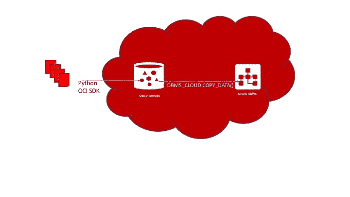
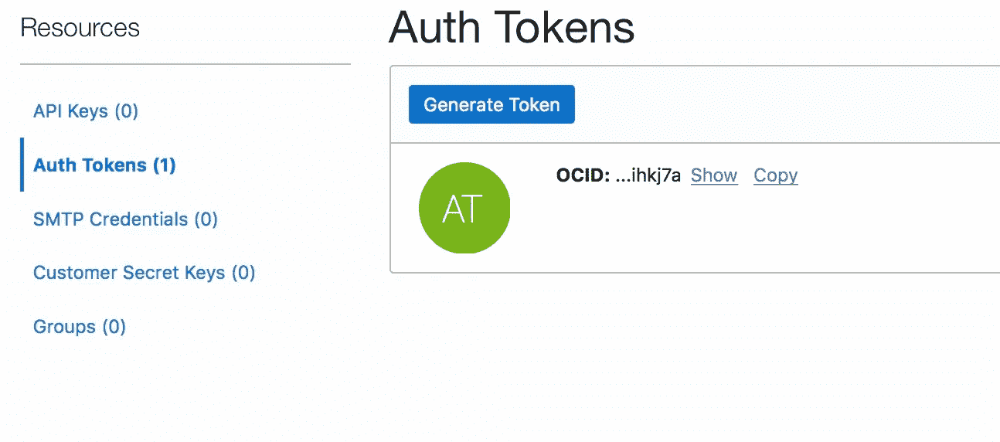

# Python 和 Oracle 云:加载数据

> 原文：<https://towardsdatascience.com/python-and-oracle-cloud-loading-data-42ec5fc1bbc6?source=collection_archive---------7----------------------->

使用 OCI Python SDK 和自治 DWH API，您可以轻松地为您的数据科学和 ML 工作加载数据



# 介绍

在 [**之前的文章**](/python-oracle-adwc-and-machine-learning-27ace24abe22) **，**中，我探讨了我们如何使用 Python 和流行的开源框架，如 Pandas 和 scikit-learn，来分析用 **Oracle 自治数据仓库(ADWC)** 存储的数据。在这个简短的故事中，我想向您展示如何使用 **OCI Python SDK** 轻松**加载大数据文件**。

# **自动化“上了类固醇”**

云的一大特点是自动化。在云世界中，更容易动态地提供资源(如 VM，甚至数据库)并使用 API 管理它们。

**Oracle 云基础设施(OCI)** 有许多工具，您可以在其中选择自己喜欢的工具，以自动化一大组任务(我想说:我需要的一切):

*   REST API
*   OCI CLI
*   软件开发工具包(Software Development Kit)

OCI 命令行界面(CLI)真的很好。但是，如果你想开发你的高度定制的工具，完美地适合你的肩膀，我推荐使用 **SDK** 。

正如您在[文档](https://docs.cloud.oracle.com/iaas/Content/API/Concepts/sdks.htm)中看到的，我们有:

*   Python SDK
*   Java SDK
*   Ruby SDK
*   Go SDK

既然我们在谈论数据科学和 ML 工程，我毫无疑问会选择 **Python** 。

有了 OCI Python SDK，你就有了一套完整且易于使用的类，它们都有很好的文档记录，使你能够构建 Python 脚本来自动化你日常数据工作的大部分流程。此外，您甚至可以在 Jupyter 笔记本(或 Jupyter Lab)中使用它。

因此，几天前，我从晚上的任务开始，为我的一个客户构建一些示例，展示如何从平面文件开始在 Oracle ADWC 中加载数据。然后，作为一个不错的副作用，我决定更深入地研究这个主题，并创建了一个脚本来启动/停止 VM，甚至启动/停止我的 ADWC 实例。

你可以在我的 G [**ithub repo**](https://github.com/luigisaetta/ocipy) 里面找到这组例子

在这个故事中，我想更详细地解释如何从平面文件开始加载数据。

# 安装？轻松点。

显然，有[文档](https://oracle-cloud-infrastructure-python-sdk.readthedocs.io/en/latest/)，但是，如果您使用 PyPi，安装只有一行代码:

```
pip install oci
```

它也适用于蟒蛇。

如果你想成为第一批尝试新特性的人，只需查看 OCI Python [Github 库](https://github.com/oracle/oci-python-sdk)。

# 配置

然后，您需要执行一些配置任务，以确保您的工作环境和 OCI 云之间的安全通信。我会花一些时间在这里澄清，因为我不想让你在这部分浪费宝贵的时间。

首先，您需要创建一个 PEM 格式的 **API 签名密钥对**。您必须在您的环境(运行 Python 程序的计算机)中保持私有密钥的安全，并将公共密钥存储在您的云配置文件中。当你存储它时，你可以从云用户界面读取指纹。

更多详情可在此处找到:

 [## 必需的密钥和 OCIDs

### 了解使用 Oracle 客户机或您自己构建的客户机时所需的键和 OCIDs。

docs.cloud.oracle.com](https://docs.cloud.oracle.com/iaas/Content/API/Concepts/apisigningkey.htm) 

然后，对于每种类型的客户端(对象存储客户端、计算客户端等)。)您需要提供一组(键，值)对，打包成一个字典，以便指定:

*   您的 OCI 用户名
*   用于保护通信的密钥(API 签名密钥)
*   这把钥匙的指纹
*   您的云租户标识符
*   OCI 地区

以下是您需要准备的内容示例(匿名):

```
config = {“user”: “ocid1.user.oc1..XXXXX”,“key_file”: “/Users/lsaetta/Progetti/xxxx/oci_api_key.pem”,“fingerprint”: “YYYYY”,“tenancy”: “ocid1.tenancy.oc1..ZZZZZZ”,“region”: “eu-frankfurt-1”}
```

对于用户和您的云租户，您需要使用的不是名称，而是标识符 OCID，您可以从 OCI 云控制台复制它。

# 在云中加载文件

此时，您已经准备好将一组文件作为对象加载到 ObjectStore 中。

这是加载单个文件的代码，我很快会添加注释:

如您所见，您需要:

*   创建客户机，在本例中是 ObjectStorageClient，并将配置字典传递给构造函数
*   以 bucket_name，file_name，file_path 为参数调用方法 **put_object**

仅此而已。

在 Github 资源库中，您会发现一个处理一组文件的增强版本。

# 将凭证存储在数据库中

现在，是时候将数据从 ObjectStore 复制到 ADWC 表中了。

首先:我们需要创建一组凭证并将它们存储在 DB 中，以便使 PL/SQL 代码能够访问 ObjectStorage Bucket。

转到 OCI 用户界面，在您的配置文件(右上方的图标和用户设置)中创建一个 AuthToken:



Authentication Token

从 UI 复制身份验证令牌。请记住在创建后立即这样做，否则，您将无法重新阅读它。

其次，使用下面的代码将云凭证存储在 DB 中；该步骤只需执行一次:

```
import cx_Oracleconnection = cx_Oracle.connect(USER, PWD, 'adwc5_medium')# need to create a cursor
cur = connection.cursor()statement = """
BEGIN
  DBMS_CLOUD.CREATE_CREDENTIAL(
    credential_name => 'DEF_CRED_NAME',
    username => 'adwc_user@oracle.com',
    password => '<AUTH Token>'
  );
END;
"""
cur.execute(statement)
```

注意:如果您的用户是联邦用户，那么这个名称就是完全限定的名称。它有一个前缀，如:

```
oracleidentitycloudservice/
```

并且您必须在 CREATE_CREDENTIAL 调用中指定完全限定的名称。

# 在 Oracle ADWC 中加载数据

因为我们现在在 ObjectStore 中有了平面文件，所以我们可以使用 PL/SQL 包 **DBMS_CLOUD** 来加载 ADWC 表中的数据。

好吧，这是 PL/SQL 代码，但不是很复杂，你可以很容易地剪切&粘贴。我们将把这段代码包装在 Python 代码中。

我们设想一个更简单的场景:一个用于平面文件的 Oracle 表，文件的格式与表相同(文件和表字段之间一一对应)

我们必须在数据库中创建表。例如:

```
CREATE TABLE CHANNELS
   (channel_id char(1),
    channel_desc varchar2(20),
    channel_class varchar2(20)
   );
/
```

然后，我们可以用下面的代码加载该表中一个文件中包含的数据:

```
import cx_Oracleconnection = cx_Oracle.connect(USER, PWD, 'adwc5_medium')# need to create a cursor
cur = connection.cursor()statement = """
BEGIN
 DBMS_CLOUD.COPY_DATA(
    table_name =>'CHANNELS1',
    credential_name =>'DEF_CRED_NAME',
    file_uri_list =>'[https://swiftobjectstorage.eu-frankfurt-1.oraclecloud.com/v1/tenant-name/BUCKET_NAME/channels1.txt'](https://swiftobjectstorage.eu-frankfurt-1.oraclecloud.com/v1/rgsbidatalake5/ADWC5/channels1.txt'),
    format => json_object('delimiter' value ',')
 );
END;
"""cur.execute(statement)
```

一个细节:要引用对象，您需要使用 **SWIFT-type** URL。在上面的例子中你需要改变的是:

*   地区名称(这里是 eu-frankurt-1)
*   你的房客的名字
*   对象存储中存储桶的名称
*   对象的名称(此处:channels1.txt)

正如我们所看到的，DBMS_CLOUD 包拥有所有必需的 API 来:

*   将凭证存储在数据库中
*   从对象存储复制到数据库

它还提供了其他一些不错的特性。例如，您可以使用 Apache **Parquet** 格式的文件，而不是 CSV。

# 想检查一下吗？

如果您想检查数据是否真的已经加载，您可以使用下面的代码片段:

```
import pandas as pd
import cx_Oracleconnection = cx_Oracle.connect(USER, PWD, 'adwc5_medium')channel1 = pd.read_sql("select * from CHANNELS1", 
                   con=connection)# if it is a Notebook
channel1.head()
```

# 外部表

数据加载的另一个选项是在数据库中创建一个**外部表**，引用文件。一旦外部表开始工作，就可以使用 DML 指令将数据加载到数据库中。例如，您可以使用 CTAS:创建表作为选择。

创建外部表的过程是:

```
DBMS_CLOUD.CREATE_EXTERNAL_TABLE
```

更多详情 [**此处**](https://docs.oracle.com/en/cloud/paas/autonomous-data-warehouse-cloud/user/query-external.html#GUID-72DC8BB6-5245-4262-A100-C35A2E553F70) 。

# 结论

作为一名数据科学家，你需要与数据打交道。有时你需要自己装载。有时，您会有一个 DBA 来为您加载。

在本文中，我展示了如何使用 OCI Python SDK 来:

*   将文件加载到对象存储中
*   将数据从对象存储复制到 ADWC 表

此外，我还近距离观察了 OCI Python SDK 的强大功能。有了它，您可以创建高度定制的工具集来自动化您的日常工作。您甚至可以创建自己的 ADWC 实例，或者对其进行扩展(添加内核和存储空间)。

在以后的文章中，我将回到机器学习。差不多到了探索 **OML4Py** 的时候了。

# **还有一件事**

如果你想找到更多使用 OCI Python SDK 的例子，你可以看一下这里的