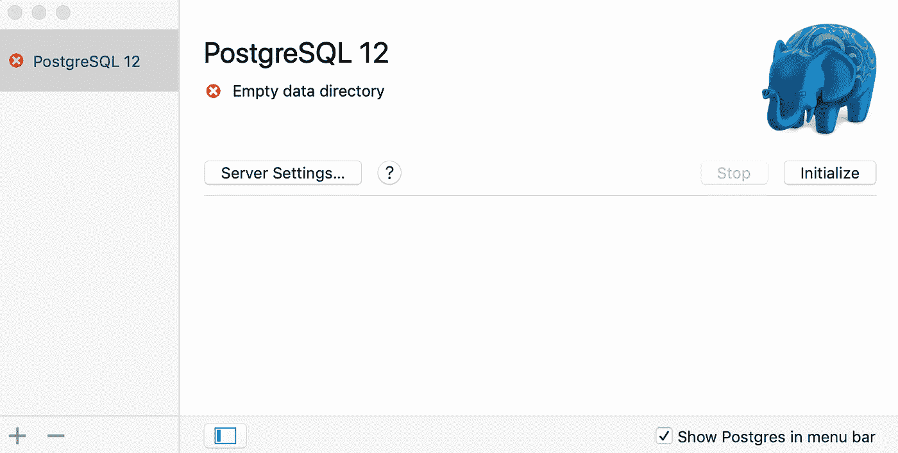
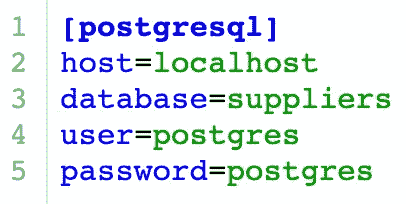

# Python 和 PostgreSQL:如何像数据科学家一样访问 PostgreSQL 数据库

> 原文：<https://towardsdatascience.com/python-and-postgresql-how-to-access-a-postgresql-database-like-a-data-scientist-b5a9c5a0ea43?source=collection_archive---------2----------------------->

“The PostgreSQL Pachyderm Whose Trunk Becomes the Python Python” — Image Source: “[Python and PostgreSQL without ORM](https://medium.com/@gitaumoses4/python-and-postgresql-without-orm-6e9d7fc9a38e),” Moses Gitau (Jun 5, 2018)

有几个 Python 包可以与 SQL 数据库接口。在过去的几周里，我使用 psycopg2 模块与 PostgreSQL 数据库管理系统进行交互。您可以对从 SQL 查询中获得的数据使用 Python 库。例如，Pandas 库具有本地方法，允许我们直接从 SQL 数据库显示和操作查询结果。在本文中，我将详细介绍设置 psycopg2 和使用这些工具构建查询功能的过程。

# **第 1 部分:如何设置 Psycopg2**

**先决条件**:在你尝试安装 Python 适配器之前，你必须安装 [Postgres](https://www.postgresql.org/) ，我在之前的[帖子](https://medium.com/@amitrani/getting-started-with-postgresql-5990b54f7169)中详细介绍过。

[Psycopg](http://initd.org/psycopg/) 是 Python 编程语言的 PostgreSQL 适配器。这个工具允许我们连接 Python 语言和库的功能，以获取、操作、输入和更新存储在 PostgreSQL 数据库中的数据。在撰写本文时，当前版本是 psycopg2。当我最初搜索这个包时，我被定向到该项目的 PyPI 站点。我很自然地决定使用默认的 pip 包管理系统进行安装，但是没有包括 Psycopg 的众多依赖项。根据[文档](http://initd.org/psycopg/docs/install.html)，“Psycopg 是围绕 [libpq](https://www.postgresql.org/docs/current/static/libpq.html) PostgreSQL 客户端库的 C 包装器。”在这个标题下，包含了依赖关系。我最初试图安装这些依赖项，遇到了 StackOverflow 和该项目的 GitHub 上的用户抱怨的同样的困难。

谢天谢地，我偶然发现了一个[答案](https://stackoverflow.com/a/33866865)，它暗示了[自制软件](https://brew.sh/)的安装过程。虽然我已经安装了 Postgres 应用程序，但是缺少一个包含一个或多个 psycopg2 依赖项的目录。在终端中，我运行命令`brew install postgresql`来安装 PostgreSQL 的自制实现，然后运行命令`pip install psycopg2`来重新安装 Python 适配器。在这两个步骤完成后，我能够成功地使用 Psycopg。

# **第 2 部分:连接到 PostgreSQL 数据库**

有几种方法可以连接到 PostgreSQL 数据库，三种方法是通过 PostgresApp/terminal/命令行直接连接，在一个 Python 脚本或文件(即 Jupyter 记事本)中连接，以及通过从初始化或配置文件导入必要的参数来连接。第三个选项最适合您希望用一个`.gitignore`文件隐藏您的登录凭证的时候。

你需要一些[参数](https://www.postgresql.org/docs/8.3/app-postgres.html)来连接任何数据库。一些常见的参数是主机、端口、用户名和密码。PostgreSQL 数据库既可以存储在您的计算机上(使用 **localhost** 作为 **host** 参数的值进行访问)，也可以远程存储(使用服务器的**IP 地址**作为 **host** 参数的值进行访问)。您还需要一个[端口号](https://networkengineering.stackexchange.com/a/17523)，它定义了客户端计算机的请求应该发送到的服务器上运行的进程。PostgreSQL 默认的**端口**是 **5432** ，虽然这是可以更改的。如果有安全权限，您可能还需要用户名和密码；这在工作场所很常见，因此用户不会访问或更新他们无权访问的信息。

The attendance scene from “Ferris Bueller’s Day Off” (1986). Ferris Bueller remotely updates his attendance record which is stored in a database on his school’s server. Either Bueller stole the login information of a user who has the necessary permissions to update his record or the server allowed access to any client computer.

## **(1)直接连接 PostgresApp/Terminal/命令行**

PostgreSQL when opened for the first time. Note the plus (**+**) symbol on the bottom left corner of the image.

PostgresApp 允许您通过使用位于窗口左下角的加号( **+** )进入*创建新服务器*菜单，直接连接到本地或远程存储的数据库。您还可以单击可用的数据库，在新的终端窗口中启动 PostgreSQL shell，但必须已经使用了 initialize 或 start 按钮。

您也可以通过命令行或终端访问服务器。如果您打开一个新的终端窗口(如果应用程序正在运行，则在 PostgreSQL shell 之外)，您可以键入命令来启动 PostgreSQL，后跟数据库的参数。要启动 PostgreSQL，如果设置了快捷方式，请键入`/Applications/Postgres.app/Contents/Versions/12/bin/psql`或`psql`。在同一行中，您可以键入额外的参数，如主机`-h localhost`(其中 localhost 可以替换为服务器 IP 地址)、端口`-p 5432`、用户名`-U username`、数据库名称`-d database_name`以及密码(如果需要的话)`-W password`(您可以省略它，或者键入小写版本`-w`以表示没有密码)。终端中完整的连接请求如下所示:

`psql -h localhost -p 5432 -U username -W password -d database_name`

成功的连接命令将打开 PostgreSQL shell，并指示数据库已被访问。

## **(2)在一个文件中直接连接**

当安全性不成问题时，您可以在一个 Python 脚本或 Jupyter 笔记本中练习连接到本地数据库。首先导入 **psycopg2** 库，然后使用**。connect()** 方法来传递相关参数。最后，创建一个 cursor 对象来对数据库运行 PostgreSQL 命令。这个过程的代码片段如下:

A sample connection to a PostgreSQL database within one file.

上面的代码片段连接到一个名为“suppliers”的本地数据库，并查询“vendors”表的所有内容。用户名和密码是“postgres”，任何有权访问该脚本的人都可以清楚地看到。如果使用默认的 PostgreSQL 端口 5432，则 port 参数不是必需的，我包含它是为了显示常规格式。在我查询了“vendors”表中的所有数据后，我关闭了光标和连接来释放服务器的[带宽资源。](https://stackoverflow.com/a/24828308)

## **(3)连接配置和初始化文件**

在专业环境中，服务器有许多保护措施，包括每个员工的个人用户名和密码。每个用户帐户都将拥有自定义权限，这些权限将决定他们可以访问和更新哪些信息。如果您出于协作目的在 GitHub 上托管这些信息，您会希望通过将它们存储在一个单独的文件中来对您的登录凭证保密。这就是`.ini`文件发挥作用的地方。我将跟随 PostgreSQLTutorial.com 的教程学习这种方法。

总体思路是 Python 脚本/Jupyter 笔记本文件将导入初始化文件的凭证。只有保护作者登录凭证的 Python 脚本才会被共享。将有第三个文件以 psycopg2 可以解释的方式解析存储在初始化文件中的参数。`database.ini`初始化文件的内容有:

The contents of the file **database.ini**

初始化文件的参数可以在一个单独的文件中解析，也可以在我们打算用来操作数据的主文件中解析。单独的文件是更好的选择，因为我们不希望每次进行 PostgreSQL 查询时都复制和粘贴大量代码。文件`config.py`接收来自初始化文件的数据，并返回一个参数字典，其中键是参数名(上面的蓝色文本)，值是实际的参数值(上面的绿色文本):

`{‘host’: ‘localhost’, ‘database’: ‘suppliers’, ‘user’: ‘postgres’, ‘password’: ‘postgres’}`

`config.py`文件改编自[PostgreSQLTutorial.com](http://www.postgresqltutorial.com/postgresql-python/connect/)站点，并利用了 Python 的 [ConfigParser()](https://docs.python.org/3/library/configparser.html) 类:

The config.py file that will be imported in the main Python script or Jupyter Notebook. The function takes in the contents of the initialization file and returns a dictionary of parameters.

导入和利用这两个文件的主要 Python 脚本包含在下面的要点中。`database.ini`文件将包含在`.gitignore`文件中，以保护作者的密码。

# **第 3 部分:使用 Python 操作 PostgreSQL 数据**

一旦连接到 PostgreSQL 数据库，就可以查询分析所需的数据。查询结果可以显示在 Pandas 数据框中，然后可以像 Pandas 中存储的所有数据一样对其进行操作。Pandas 有一些方法，比如`[.read_sql_query()](https://pandas.pydata.org/pandas-docs/stable/reference/api/pandas.read_sql_query.html)`，允许我们通过 psycopg2 连接提取 PostgreSQL 存储的数据。以下 Python 脚本使用`database.ini`和`config.py`文件连接到“供应商”数据库，查询“供应商”表的内容，并使用函数 *create_pandas_table:* 在 Pandas 数据框中显示结果

A Python script that connects to a PostgreSQL database with an initialization and configuration file, and utilizes Pandas to query data and create a data frame.

The Pandas data frame with the contents of the “vendors” table.

# 结论

一旦将数据从 PostgreSQL 数据库导入 Python 脚本或 Jupyter 笔记本，您就能够应用强大的数据科学工具来进行分析并构建机器学习模型。您可以使用单独的初始化、配置和`.gitignore`文件来保护您的登录凭证。Pandas 库包含一些方法，允许我们直接从数据库中查询结果。本文中描述的整个过程可以被容器化和共享。