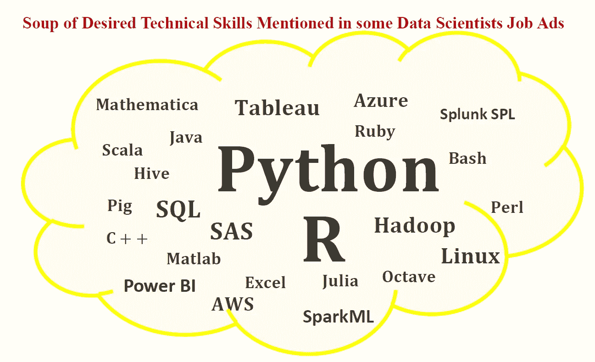

# Python 和 R——数据科学的明确拥护者

> 原文：<https://towardsdatascience.com/python-and-r-unequivocal-champions-of-data-science-31ab4d1fa45e?source=collection_archive---------31----------------------->

## Python 和 R 仍然是数据科学中最顶尖的两种编程语言

数据科学是一个非常广阔的领域，包括几个细分领域，如数据工程、数据准备和转换、数据可视化、机器学习和深度学习。

虽然做数据科学需要几项技能( [**数据科学最低要求:开始做数据科学需要知道的 10 项基本技能**](/data-science-minimum-10-essential-skills-you-need-to-know-to-start-doing-data-science-e5a5a9be5991) )，但数据科学需要的两项最基本的要求是:

A)扎实的数学背景

b)编程技能

本文将讨论从事数据科学所需的基本编程语言。需要的必备数学技能，请看下面: [**机器学习必备数学技能**](https://medium.com/towards-artificial-intelligence/4-math-skills-for-machine-learning-12bfbc959c92) 。

## **数据科学中使用的编程语言**

如果你从诸如**indeed.com**或 **LinkedIn、**等平台上的数据科学家招聘广告中取样，你会对数据科学招聘广告中提到的技术技能有所了解。数据科学家招聘广告中提到的一些技术技能(编程语言)包括:

1.  **Python**
2.  **R**
3.  **Matlab**
4.  **Hadoop**
5.  **SAS**
6.  **SQL**
7.  **画面**
8.  **Excel**
9.  **电源毕**
10.  **AWS**
11.  **蔚蓝色**
12.  **Java**
13.  **朱丽亚**
14.  **Scala**

数据科学家招聘广告中提到了各种各样的技能，每个对学习数据科学基础感兴趣的初学者都会很自然地问自己:

## **应该重点学习什么编程语言？**

如果你有兴趣学习数据科学的基础知识，你需要从某个地方开始。不要被数据科学家招聘广告中提到的一系列荒谬的编程语言所淹没。虽然学习尽可能多的数据科学工具很重要，但建议从一两种编程语言开始。一旦你在数据科学方面建立了坚实的背景，你就可以挑战自己，学习不同的编程语言或不同的平台和生产力工具，以增强你的技能。

## **作为数据科学初学者，你应该关注的编程语言**

根据这篇文章( [**数据科学家最需要的技术技能**](/the-most-in-demand-tech-skills-for-data-scientists-d716d10c191d) )，当谈到编程语言时，Python 和 R 仍然是数据科学的明确冠军。

作为初学者，可以从一种编程语言开始，比如 Python，然后再学习 R，或者可以同时学习两种语言。

好的一面是，你可以从数据科学培训课程中学到 Python 和 R 的技能。大多数数据科学培训项目通常从编程基础开始。因此，如果要使用 R 来教授数据科学专业，他们通常会从 R 基础或 Python 基础等课程开始，如果该专业是使用 Python 来教授的话。

因此，如果你有一些基本的编程背景，你实际上可以通过在线课程自学数据科学。开始数据科学之旅并不需要 Python 或 R 编程方面的高深知识。您将在整个培训过程中学习和掌握这些语言，完成家庭作业，阅读书籍，以及利用大量在线资源提供 R 和 Python 编程帮助。

如果您对可以让您开始学习 R 或 Python 基本编程课程的数据科学专业感兴趣，这里有两个我最喜欢的数据科学专业，它们将教您如何使用 Python 和 R 学习数据科学(对于那些以前接触过基本编程的人):

(一)**数据科学专业证书(HarvardX，通过 edX):**[https://www.edx.org/professional...](https://www.edx.org/professional-certificate/harvardx-data-science)

包括以下课程，全部使用 **R** 教授(您可以免费旁听课程或购买认证证书):

1.  数据科学:R 基础；
2.  数据科学:可视化；
3.  数据科学:概率；
4.  数据科学:推理和建模；
5.  数据科学:生产力工具；
6.  数据科学:扯皮；
7.  数据科学:线性回归；
8.  数据科学:机器学习；
9.  数据科学:顶点

(ii) **应用数据科学与 Python 专业化(密歇根大学，通过 Coursera)**:[https://www.coursera.org/special...](https://www.coursera.org/specializations/data-science-python)

包括以下课程，全部使用 **Python** 教授(您可以免费旁听大多数课程，有些课程需要购买认证证书):

1.  Python 中的数据科学导论；
2.  应用 Python 绘图、制图和数据表示；
3.  Python 中的应用机器学习；
4.  Python 中文本挖掘的应用:
5.  Python 中的应用社会网络分析。

总之， **Python** 和 **R** 仍然是数据科学中最顶尖的两种编程语言。以我个人的经验，我使用 Python 进行机器学习应用，而我发现 R 对于统计分析非常有用。基本上，用 Python 可以做的一切也可以用 R 实现。学习如何用 Python 和 R 来做数据科学是值得的，因为这将有助于增加你获得数据科学家工作的机会，因为这些语言是大多数数据科学招聘广告中提到的前两种语言。