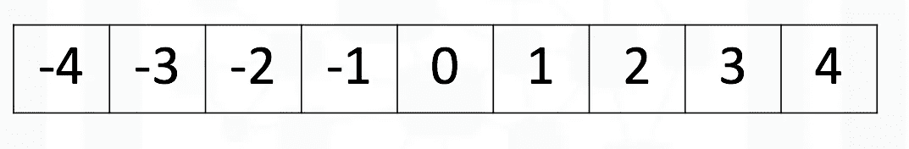
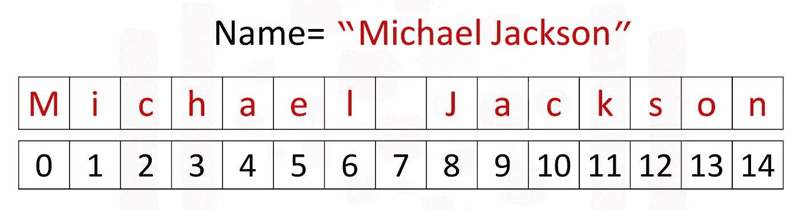
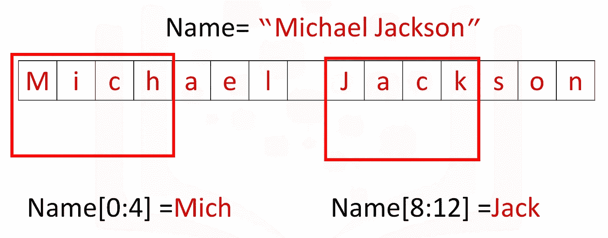
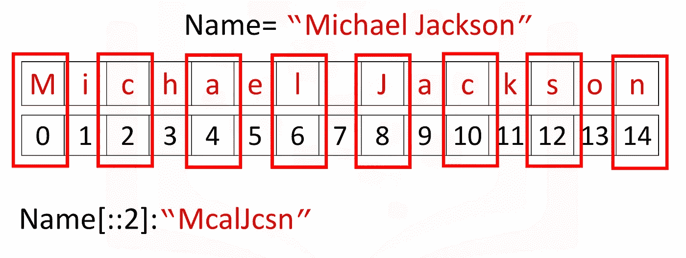
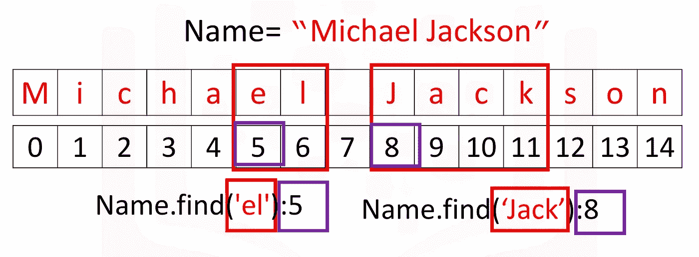

# Python 基础

> 原文：<https://towardsdatascience.com/python-basics-2892d8598278?source=collection_archive---------30----------------------->

## Python 编程基础


# 此处涵盖的主题—

1.  变量
2.  数据类型
3.  铅字铸造
4.  公式
5.  字符串操作

# 用 Python 向世界问好:

```
print('Hello, World!')*Output:* Hello, World!
```

# 我们用的是什么版本的 Python？

```
import sys
print(sys.version)*Output:* 3.7.3 (default, Aug 20 2019, 17:04:43) 
[GCC 8.3.0]
```

# 变量:

我们可以在变量中存储任何值(数字、单词),以便以后使用。例如:

```
x = 5
print(x)*Output:* 5
```

这里我们用赋值操作符“=”给变量“x”赋值 5。

所以 x 的值是 5。

```
x += x
print(x)*Output:* 10
```

使用`x+=x`命令，我们正在执行`x+x.`

这里，`5+5 = 10`。

所以，

*   `x+=x`代表`x+x`
*   `x-=x`代表`x-x`
*   `x*=x`代表`x*x`
*   `x/=x`代表`x/x`

```
y = 2 + 3
print(y)*Output:* 5
```

在这里，我们使用“y”变量在 2 和 3 之间分配了一个求和运算。

```
x += y
print(x)*Output:* 15
```

这里我们添加了两个不同的变量‘x’和‘y’。

```
z = x+y
print(z)*Output:* 20
```

这里，我们将两个不同变量(' x '，' y ')相加的值存储在一个不同的变量(' z ')中。

```
z *= z
print(z)*Output:* 400
```

# Python 中的数据类型:

Python 中主要有 3 种数据类型

1.  字，即众所周知的“字符串”
2.  布尔型(真或假)
3.  数字

数字也有两种类型

1.  整数
2.  浮动

所以，总的来说有三种数据类型-

1.  线
2.  布尔代数学体系的
3.  整数
4.  浮动

## 整数:-

这里有一些整数的例子。整数可以是负数或正数:



```
integer_data = 12
type(integer_data)*Output:* int
```

这告诉我们 12 是一个整型对象。使用`type`命令，我们可以看到任何给定输入或输出的数据类型。

## 浮动:-

浮点数代表实数；它们是整数的超集，但也包括“带小数的数”。当涉及到表示实数的机器时有一些限制，但是浮点数在大多数情况下是一种很好的表示。

```
float_data = 2.14
type(float_data)*Output:* float
```

这告诉我们 2.14 是一个浮点类型的对象。

## 字符串:-

Python 中的字符串可以用单引号、双引号甚至三引号来创建。

```
string = 'python'
type(string)*Output:* str
```

这告诉我们‘python’是一个字符串类型的对象。

```
string_integer = '10'
type(string_integer)*Output:* str
```

这告诉我们' 10 '是一个字符串类型的对象。

```
string_float = '10.01'
type(string_integer)*Output:* str
```

这告诉我们‘10.01’是一个字符串类型的对象。

## 布尔:-

布尔方法用于使用标准的真值测试过程返回或转换一个值为布尔值，即真或假。

```
boolean_true = True
type(boolean_true)*Output:* bool
```

这告诉我们 True 是一个布尔类型的对象。

```
boolean_false = False
type(boolean_false)*Output:* bool
```

这告诉我们 False 是一个布尔类型的对象。

# 类型转换:

从一种对象类型转换为另一种对象类型的过程。

## 将整数转换为浮点数:-

```
print("Integer data before typecasting: ", integer_data)
print("Datatype before typecasting: ", type(integer_data))
integer_data = float(integer_data)
print("Datatype after typecasting: ", type(integer_data))
print("Integer data after typecasting: ",integer_data)*Output:* Integer data before typecasting:  12
Datatype before typecasting:  <class 'int'>
Datatype after typecasting:  <class 'float'>
Integer data after typecasting:  12.0
```

之前，我们已经看到 12 是一个整数类型的对象。现在，如果我们写`float(12)`,这意味着我们给出了将 12 的数据类型从整数转换为浮点的命令。

所以 12 的数据类型现在是 float。

所以这里最初`integer_data`变量的数据类型是`int`并且值是 12 &在执行类型转换之后`integer_data`的数据类型变成了`float`并且值变成了 12.0。

## 将浮点数转换为整数:

```
print("Float data before typecasting: ",float_data)
print("Datatype before typecasting: ", type(float_data))
float_data = int(float_data)
print("Datatype after typecasting: ", type(float_data))
print("Float data after typecasting: ",float_data)*Output:* Float data before typecasting:  2.14
Datatype before typecasting:  <class 'float'>
Datatype after typecasting:  <class 'int'>
Float data after typecasting:  2
```

在这里我们可以看到，在应用了从浮点到整数的类型转换之后，`float_data`变量的值从 2.14 变成了 2。所以我们丢失了一些数据。

因此，在执行从浮点数到整数的类型转换时，我们可能会丢失一些数据。

## 将字符串转换为数字:

```
print("String data before typecasting: ", string_integer)
print("Datatype before typecasting: ", type(string_integer))
string_integer = int(string_integer)
print("Datatype after typecasting: ", type(string_integer))
print("String data after typecasting: ",string_integer)*Output:* Float data before typecasting:  10
Datatype before typecasting:  <class 'str'>
Datatype after typecasting:  <class 'int'>
Float data after typecasting:  10
```

## 将布尔值转换为整数:

```
print("String data before typecasting: " + str(boolean_true))
print("Datatype before typecasting: ", type(boolean_true))
boolean_true = int(boolean_true)
print("Datatype after typecasting: ", type(boolean_true))
print("String data after typecasting: ",boolean_true)*Output:* String data before typecasting: True
Datatype before typecasting:  <class 'bool'>
Datatype after typecasting:  <class 'int'>
String data after typecasting:  1
```

在这种情况下，如果布尔值为真，那么它的整数形式将是 1，如果布尔值为假，那么它的整数形式将是 0。

# 表情:

Python 中的表达式可以包括兼容类型(例如整数和浮点)之间的运算。例如，像将多个数字相加这样的基本算术运算:

## 执行加法:-

```
add = 43 + 60 + 16 + 41
print(add)*Output:* 160
```

## 执行减法:-

```
subtract = 50-60
print(subtract)*Output:* -10
```

## 执行乘法:-

```
multiply = 5*5
print(multiply)*Output:* 25
```

## 表演部分:-

```
division_float = 25/5
print(division_float)
type(division_float)*Output:* 5.0
float
```

这里`division`变量的数据类型是 float。

对于 Python 3 中的除法，除法的结果总是以浮点数据类型的形式出现。

```
division_int = 25//5
print(division_int)
type(division_int)*Output:* 5
int
```

为了将除法的结果从浮点数转换为整数，我们可以在除法运算时使用`//`而不是`/`。

## 执行电源操作:-

```
power = 5**2
print(power)*Output:* 25
```

# 字符串操作:

## 什么是字符串？

以下示例显示了包含在两个引号内的字符串:

```
'Michael Jackson'
'1 2 3 4 5 6 '
'@#2_#]&*^%$'
```

字符串可以由单词、数字和特殊字符组成。

## 索引:

现在假设我们将一个名为“Michael Jackson”的字符串赋给一个名为“name”的变量。

```
Name = "Michael Jackson"
```

索引有助于将字符串视为有序序列。可以使用由数字数组表示的索引来访问序列中的每个元素:



```
print(Name[0])
print(Name[14])*Output:* M
n
```

这里我们打印字符串的第一个和最后一个元素。

```
len("Michael Jackson")*Output:* 15
```

这里我们使用`len`来查找字符串中的字符数。

## 切片:

我们可以使用切片从一个字符串中获得多个字符，我们可以获得第 0 到第 4 和第 8 到第 12 个元素:



```
print(Name[0:4])
print(Name[8:12])*Output:* Mich
Jack
```

## 步幅:

我们也可以如下输入一个步幅值,“2”表示我们每隔一秒选择一个变量:



```
print(Name[::2])*Output:* McalJcsn
```

## 连接字符串:

我们可以使用加法符号连接或组合字符串，结果是两者组合成一个新字符串:

```
Statement = Name + "is the best"
print(Statement)*Output:* Michael Jacksonis the best
```

要复制一个字符串的值，我们只需将该字符串乘以我们想要复制它的次数。在这种情况下，数量是三。结果是一个新字符串，这个新字符串由原始字符串的三个副本组成:

```
3 * 'Michael Jackson'*Output:* 'Michael JacksonMichael JacksonMichael Jackson'
```

## 转义序列:

反斜杠代表转义序列的开始。转义序列表示可能难以输入的字符串。例如，反斜杠“n”代表一个新行。遇到反斜杠“n”后，输出由新行给出:

```
print(" Michael Jackson \n is the best" )*Output:* Michael Jackson 
is the best
```

类似地，反斜杠“t”代表制表符:

```
print(" Michael Jackson \t is the best" )*Output:* Michael Jackson 	 is the best
```

我们可以在字符串前放置一个“r”来显示反斜杠:

```
print(r"Michael Jackson \ is the best" )*Output:* Michael Jackson \ is the best
```

## 操作:

Python 中有许多字符串操作方法可用于操作数据。我们将对数据使用一些基本的字符串操作。

我们用方法`upper`试试吧；此方法将小写字符转换为大写字符:

```
A = "Thriller is the sixth studio album"
print("Before upper:", A)
B = A.upper()
print("After upper:", B)*Output:* Before upper: Thriller is the sixth studio album
After upper: THRILLER IS THE SIXTH STUDIO ALBUM
```

方法`replace`用新的字符串替换字符串的一部分，即子字符串。我们输入想要改变的字符串部分。第二个参数是我们希望用来交换该段的内容，结果是一个段已更改的新字符串:

```
A = "Michael Jackson is the best"
B = A.replace('Michael', 'Janet')
print(B)*Output:* Janet Jackson is the best
```

方法`find`找到一个子字符串。参数是要查找的子字符串，输出是序列的第一个索引。我们可以找到副弦`jack`或者`el.`



```
Name = "Michael Jackson"
Name.find('el')*Output:
5*
```